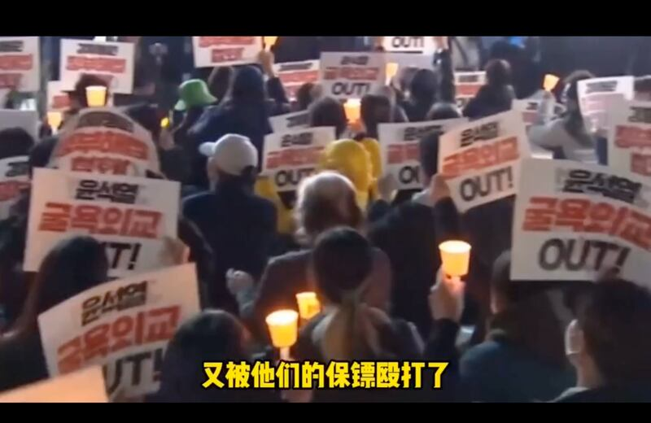
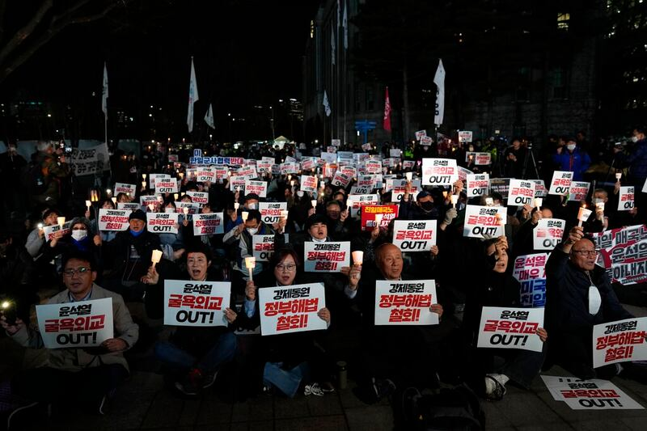
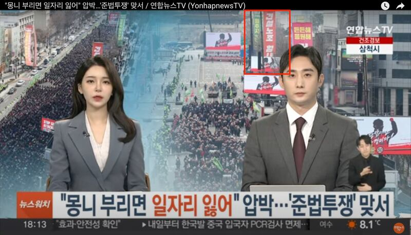
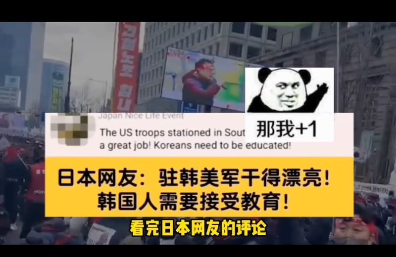
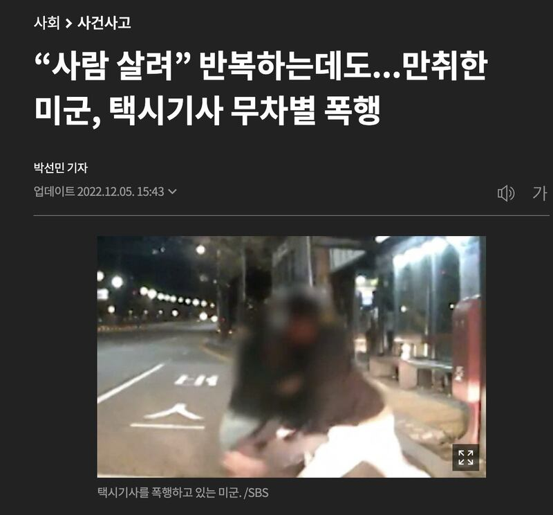

# 事實查覈 | 韓國人被駐韓美軍毆打引發大型示威抗議？

作者：董喆

2023.03.21 12:30 EDT

## 標籤：錯誤

## 一分鐘完讀：

近期中國版抖音博主“開芯喵”上傳一支“韓國人被駐韓美軍毆打，被油管各國網友羣嘲！ ”的短視頻，迄今獲得超過2.7萬點贊、900多次評論及分享。

亞洲事實查覈實驗室查證後發現，短視頻中剪輯了兩個抗議片段，但它們都與“駐韓美軍毆打韓國民衆”無關，屬於移花接木的錯誤資訊。

## 深度分析：

## 

中國版抖音博主"開芯喵"在3月13日上傳了 [這支影片](https://www.douyin.com/video/7209968494652165414),稱最近有韓國人被駐韓美軍毆打,遭到油管(YouTube)上的網友們羣起嘲諷。

影片以字幕“最近在外網上又刷到一個視頻，宇宙第一強國的老百姓，又被他們的保鑣毆打了”開場，搭配兩段韓國民衆靜坐與遊行的影片，但並未出現駐韓美軍毆人的相關畫面或是新聞畫面。這部影片上傳迄今，收穫了兩萬七千次點贊，超過九百次轉發。

## 抗議二戰賠償問題的影片遭挪用

這則短視頻搭配了兩段民衆示威抗議影片，亞洲事實查覈實驗室發現兩則影片都和“美軍打韓國人”毫無關係。

首先，影片00：01-00：05的畫面，畫面中的字卡寫著“尹錫悅 恥辱外交 OUT！”，以關鍵字搭配Google以圖搜圖，可以查出是韓國時間3月6日在首爾的靜坐抗議。

韓國總統尹錫悅在3月6日宣佈，將由政府創建公共基金，向二戰期間遭日本強迫勞動的韓國受害者提供賠償，並不再要求日本企業提供賠償金，目的是要改善日韓兩國關係。

韓國民衆當日聚集在首爾市中心,手拿"撤回方案"、"尹錫悅 恥辱外交"字卡,舉著白色燭燈。將影片畫面截圖比對美聯社當天晚上的外電照片,內容一致,《 [紐約時報](https://cn.nytimes.com/asia-pacific/20230307/south-korea-japan-forced-labor/zh-hant/)》、《 [朝日新聞](https://www.asahi.com/ajw/articles/14855598)》也皆有針對當晚遊行進行報道。

因此影片00：01-00：05的畫面確定與駐韓美軍打人事件無關。

美聯社資料圖片

## 移花接木韓國建設工會遊行影片

同樣以Google以圖搜圖查證影片00：06-00：12的畫面，並逐一比對“建設工會（건설노조） 加油（힘내라）！”的大型紅色布條位置，確定畫面是2月28日在首爾舉行的建設工會抗議。

經比對,此畫面與韓國聯合通訊社旗下的"聯合新聞TV(연합뉴스TV)"於3月2日上傳的 [影片](https://www.youtube.com/watch?v=mohSjuJyYg4&ab_channel=%EB%AF%BC%EC%A3%BC%EB%85%B8%EC%B4%9D)內容一致。韓國SBS [新聞直播](https://www.youtube.com/watch?v=zZRlum4gbQE&t=1606s&ab_channel=SBS%EB%89%B4%EC%8A%A4)也有全程錄下該活動。

根據朝鮮日報報道，韓國總統尹錫悅表示將在任期內根除工地的勒索、暴力行爲，引發建設工會不滿，2月28日號召成員在首爾世宗大路附近舉行集會。因此此段影片也與駐韓美軍施暴無關。

原報道中建設工會的抗議畫面與段視頻中的畫面對比

## 最近一起駐韓美軍醜聞發生在去年

在移花接木兩段與駐韓美軍毫不相關的影片後，緊接著是一張又一張從YouTube留言區擷取的網友留言，併疊壓在建設工會抗議的影片上，難以判斷是否屬於上述影音的留言截圖，更無法追蹤留言來源。

短視頻截取的網友評論

至於近期是否有駐韓美軍對韓國人施暴的相關新聞?亞洲事實查覈實驗室以駐韓美軍(주한미군)爲關鍵字,查詢韓國主流媒體新聞網站相關報道,發現最近一起相關案件發生在2022年11月,朝鮮日報 [報道](https://www.chosun.com/national/incident/2022/12/05/EXO3EQU3FRCYZHE3FLYKZPCAMU/),一名駐韓美軍向一名計程車司機施暴。

最近一起駐韓美軍醜聞截圖

不過開心喵“最近在外網上發現”的模糊時態製作影片，並且佐以毫不相關的其他國內抗議畫面，難以斷定是否就是指向這起事件。

## 開心喵的影片手法

細究中國抖音號“開心喵”，其主打製作“油管五常”的諷刺影音。油管五常取自聯合國五個常務理事國：美國、英國、法國、中國、俄羅斯，諷刺在YouTube上也有五個經常引發論戰的“常務理事國”，分別是印度、韓國、越南、土耳其、波蘭。

“開心喵”便經常以此五國爲主題製作嘲諷影片，其影片結構皆爲一段5到10秒不等的片段，接著拼貼大量不知來源的YouTube留言，難以判斷真僞，以及是否與前段短視頻相關。但這個抖音號的內容受到許多網友歡迎，有一定影響力。

## 結論：

在中國版抖音上流傳且受到熱議的“韓國人被駐美軍毆打引發網友羣嘲”實爲移花接木的拼貼影片，爲錯誤訊息。

*亞洲事實查覈實驗室（Asia Fact Check Lab）是針對當今複雜媒體環境以及新興傳播生態而成立的新單位，我們本於新聞專業，提供正確的查覈報告及深度報道，期待讀者對公共議題獲得多元而全面的認識。讀者若對任何媒體及社交軟件傳播的信息有疑問，歡迎以電郵 [afcl@rfa.org](http://afcl@rfa.org)寄給亞洲事實查覈實驗室，由我們爲您查證覈實。*

[Original Source](https://www.rfa.org/mandarin/shishi-hecha/hc-03212023110025.html)