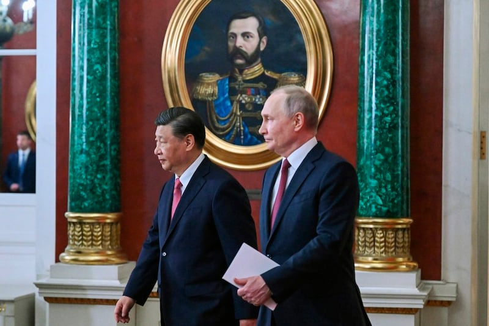

# 事實查覈 | 一見習近平，普京跪了？

作者：董喆

2023.03.22 12:34 EDT

## 標籤：錯誤

習近平3月20日抵達莫斯科與俄羅斯總統普京會面,亞洲事實查覈實驗室在推特上發現一個有著5萬多追蹤者的推特帳號,張貼出普京向習近平下跪,並緊牽著習的手的"照片"流出。接著《基輔郵報》特約記者Jason Jay Smart也在自己的推特 [貼出此張照片](https://twitter.com/officejjsmart/status/1637836851619807232?cxt=HHwWgIC-zYv84botAAAA),並寫下"Putin attempting to persuade Xi.(普京嘗試說服習近平)"同一張影像當日在推特上大量流傳。

亞洲事實查覈實驗室通過照片中的六處細節，確定此張“照片”屬於僞造。

## 一、會面地點不同

習近平與普京3月20日的會面地點在莫斯科的克林姆林宮，將會面照片對照推特上流傳的下跪照，從桌椅、地毯至牆面，全都不一致。

## 二、牆壁歪曲

細看普京身後的牆面，出現不自然的歪曲，顯示照片有遭人爲變造的可能。

## 三、鞋子款式不同

仔細觀察照片中三人穿的鞋子，皆呈現黑色霧面且沒有鞋帶的樣貌。但對照會面當天由美聯社所拍攝的照片，習近平穿著的黑色皮鞋楦頭較寬且鞋底較厚，普京皮鞋的楦頭則較尖，且明顯配有鞋帶。

另外可以發現，普京在真實會面照片中也作出了踮腳尖的動作，下跪照中右腳踮腳的角度與皮鞋凹折時呈現的形狀怪異，並不自然。

兩人會面時所穿皮鞋款式與網傳下跪照中的大不相同（圖片來源：美聯社）

## 四、頭髮與頭部曲線

接著檢視兩人的頭部形狀，先是髮絲過於平滑，不像是真實照片所呈現出的樣態。且下跪照中習近平的髮際分線顯然與真實照片有差異。兩人的頭型也似乎都被過度放大，側臉的輪廓線也有遭抹平的跡象，另外普京的手變得過於圓潤光滑，手背清晰的血管亦沒有在下跪照中呈現出來。

我們找到2022年央視網上習近平向中國國家英雄獻花籃的活動照片，畫面中習近平也做出了向前彎腰的動作，對照下跪照片，後頸部的線條有顯著差異。

普京的手背脂肪含量較低，“青筋”明顯（圖片來源：美聯社）

央視網發佈的習近平視頻截圖

## 五、普京消失的手錶

另外也可從會面當天的照片發現，普京的右手手腕上配戴有手錶，但下跪照中的右手僅露出白色襯衫袖口，並未看見手錶。

3月20日，習近平和普京握手 。（圖片來源：美聯社）

## 六、主流媒體未跟進報道

國家元首下跪俯首的行爲在外交慣例上實屬罕見，若普京真的在會面時向習近平下跪，全球主流媒體應會跟進報道，且會有從不同角度捕捉的各種照片，但目前僅有此張照片流出，且沒有國際媒體報道。

*亞洲事實查覈實驗室(Asia Fact Check Lab* *)是針對當今複雜媒體環境以及新興傳播生態而成立的新單位,我們本於新聞專業,提供正確的查覈報告及深度報道,期待讀者對公共議題獲得多元而全面的認識。讀者若對任何媒體及社交軟件傳播的信息有疑問,歡迎以電郵 [afcl@rfa.org](http://afcl@rfa.org)*  *寄給亞洲事實查覈實驗室,由我們爲您查證覈實。*

[Original Source](https://www.rfa.org/mandarin/shishi-hecha/hc-03222023121303.html)