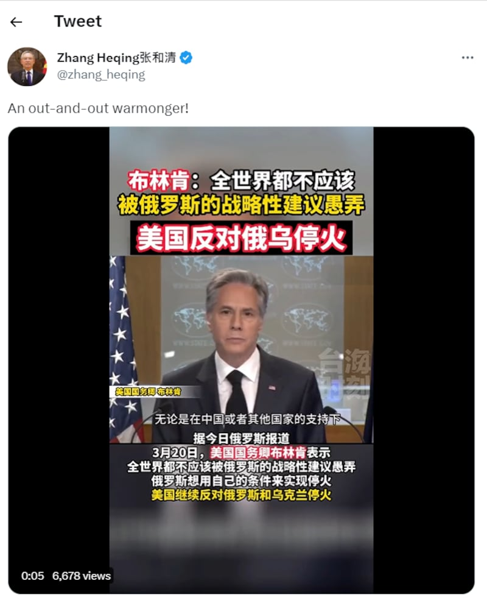
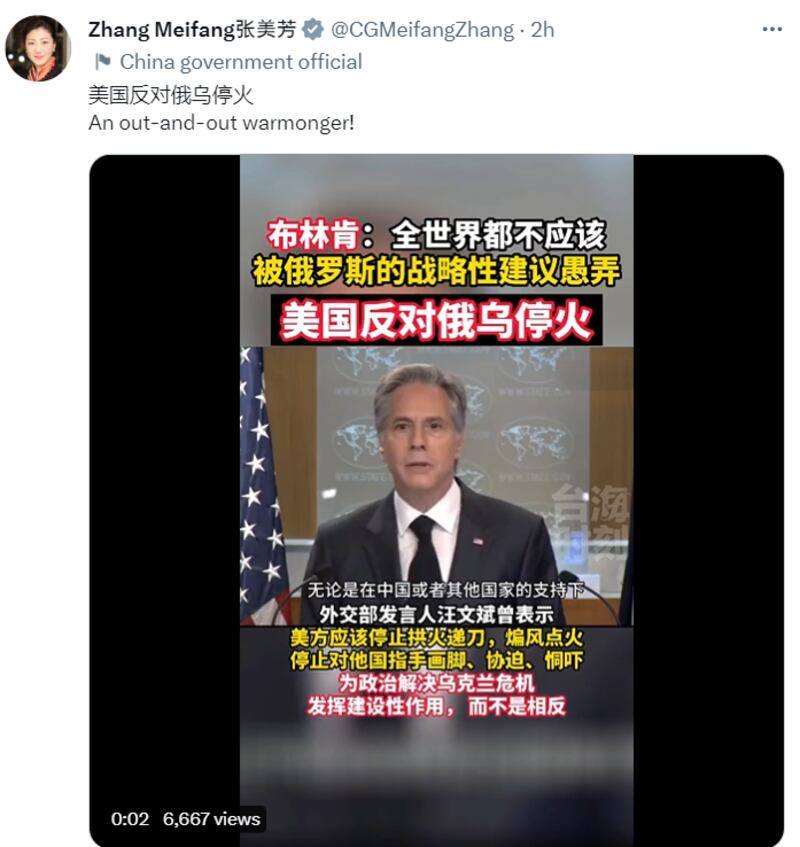
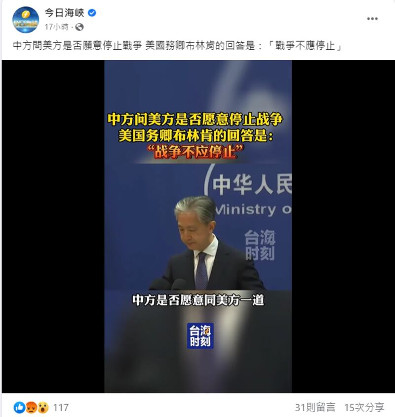
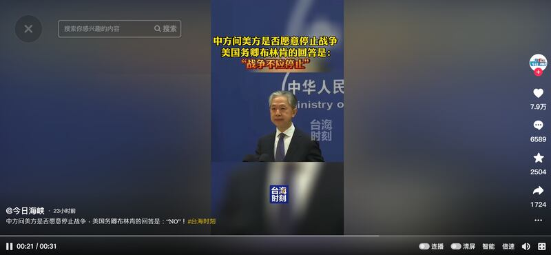

# 事實查覈 | 中國促俄烏和談，美國主張"戰爭不應停止"？

作者：莊敬

2023.03.23 13:38 EDT

## 標籤：錯誤

## 一分鐘完讀：

中國國家主席習近平出訪莫斯科，會晤俄羅斯總統普京（Vladimir Putin），聲明促俄烏兩國和談。亞洲事實查覈實驗室注意到，近日有中國外交官在社羣媒體發佈美國反對俄烏停火、美國是“戰爭販子（warmonger）”等言論；中媒“海峽衛視”的節目“今日海峽”在社媒發佈短影音，字幕打上“美國務卿布林肯的回答是：戰爭不應停止”等錯誤資訊。

經查覈發現，美國聲明反對的是“按照中俄開出的條件止戰”，並非反對俄烏停止戰爭，部分中國外交官、媒體明顯扭曲事實、誤導受衆。

## 深度解析：

中華人民共和國主席習近平於3月20日至22日對俄羅斯進行國事訪問,宣傳爲"和平之旅"。外界預期習近平將提出中方的烏克蘭和平方案,基於 ["關於政治解決烏克蘭危機的中國立場"](https://www.fmprc.gov.cn/zyxw/202302/t20230224_11030707.shtml)12點聲明,中國支持俄烏儘快恢復直接對話,逐步推動局勢降級緩和,最終達成全面停火;但中方聲明並未提及俄羅斯應從烏克蘭撤軍。

"普習會"之際,烏克蘭國家安全與國防事務委員會祕書長丹尼洛夫(Oleksiy Danilov)於20日發 [推文](https://twitter.com/OleksiyDanilov/status/1637766292827455491)表示,中國的"和平計劃"若要成功落實,最重要的一點是俄羅斯佔領部隊須根據國際法與聯合國憲章投降或撤離烏克蘭領土。

美國官方支持烏克蘭所提出的和平方案，也就是以俄羅斯從烏克蘭撤軍爲前提。

[美國國務卿布林肯(Antony Blinken)20日就2022年度各國人權報告發表講話時表示](https://china.usembassy-china.org.cn/zh/secretary-antony-j-blinken-on-the-2022-country-reports-on-human-rights-practices/):如果停火呼籲的內容不包括把俄羅斯軍隊趕出烏克蘭領土,實際上是在支持、認可俄羅斯的征服行徑。它將承認俄羅斯以武力奪取主權鄰國的領土的企圖。這將使俄羅斯能夠進一步鞏固其在烏克蘭的地位。若沒有持久的解決方案而現在就停火,普京總統可以趁機休整並重整他的軍隊,然後在對俄羅斯更有利的時候重新發動戰爭。

“世界不應當被俄羅斯－－在中國或任何其他國家的協助下－－採取按照它自己條件凍結戰事的任何戰術手段所愚弄。”布林肯說。

福建廣電 ["臺海時刻"](https://www.youtube.com/channel/UCd0_dU-6jRpISze13FZfkyg)新媒體官方YouTube頻道將布林肯上述這段話剪成短影音,包括中國駐巴基斯坦外交官張和清、駐貝爾法斯特總領事張美芳都在推特上轉傳, [影片](https://twitter.com/zhang_heqing/status/1638360257327165440)字幕寫著"美國反對俄烏停火",張和清推文還加上自己的評論。但逐句查覈布林肯當天的發言,他並未說出"美國反對俄烏停火"這句話。

中國駐巴基斯坦外交官張和清的推文截圖

中國駐貝爾法斯特總領事張美芳推文截圖

"今日海峽"臉書、抖音帳號也使用"臺海時刻"影片,在這則31秒的 [短影音](https://www.facebook.com/straitsplus/videos/2389975931155445)中,前22秒的畫面是中國外交部 [21日例行記者會](https://www.fmprc.gov.cn/fyrbt_673021/202303/t20230321_11045971.shtml)上,發言人汪文斌回應"中方是否願意與美方共同推動俄烏和談?"的問題。汪文斌說:"中方願同國際社會一道,繼續爲烏克蘭危機的政治解決發揮建設性作用。建議你也問一問美方,是否願意推動和談。"

接下來9秒的畫面是布林肯說：“世界不應當被俄羅斯－－在中國或任何其他國家的協助下－－採取按照它自己條件凍結戰事的任何戰術手段所愚弄。”

這則短影音的標題卻打上“中方問美方是否願意停止戰爭，美國布林肯的回答是‘戰爭不應停止’”。亞洲事實查覈實驗室認爲，這個標題就有兩個錯誤：其一是布林肯並沒說這句話，其二是布林肯發言並非針對中方問題“回答”。

“今日海峽”報道截圖

海峽衛視是福建省廣播影視集團旗下的衛星電視國際頻道，“今日海峽”爲海峽衛視新聞通欄節目。“今日海峽”臉書粉絲專頁現有逾365萬人追蹤，抖音有2126多萬粉絲。

## 結論：

美國並未反對俄烏停止戰爭，且多次呼籲普京從烏克蘭撤軍，以結束這場戰爭。美方也建議中國在這個基礎上與烏克蘭總統澤連斯基（Volodymyr Zelenskyy）接觸，並利用其影響力迫使莫斯科撤回其軍隊。對於中國提出的“停火呼籲”，美國官方完整的立場表述爲：無法接受中方所謂的和平提議。因爲若停火呼籲不包括俄羅斯軍隊離開烏克蘭領土，實際上是支持認可俄羅斯的征服行徑。

中國官員、官方媒體散播所謂美國反對俄烏停火、布林肯稱俄烏戰爭不應停止等言論，皆爲不實訊息。

*亞洲事實查覈實驗室(Asia Fact Check Lab* *)是針對當今複雜媒體環境以及新興傳播生態而成立的新單位,我們本於新聞專業,提供正確的查覈報告及深度報道,期待讀者對公共議題獲得多元而全面的認識。讀者若對任何媒體及社交軟件傳播的信息有疑問,歡迎以電郵afcl@rfa.org* *寄給亞洲事實查覈實驗室,由我們爲您查證覈實。*

[Original Source](https://www.rfa.org/mandarin/shishi-hecha/hc-03232023132923.html)