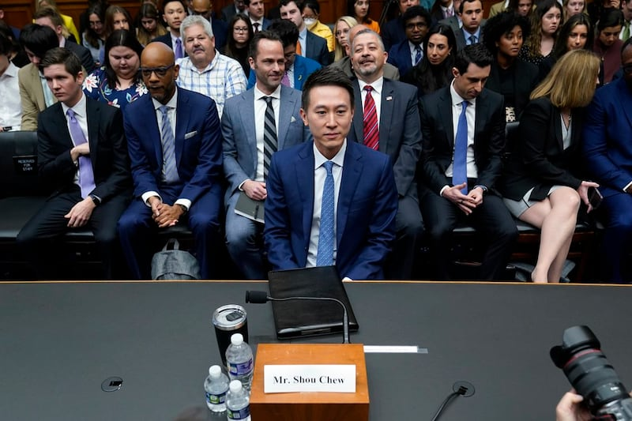
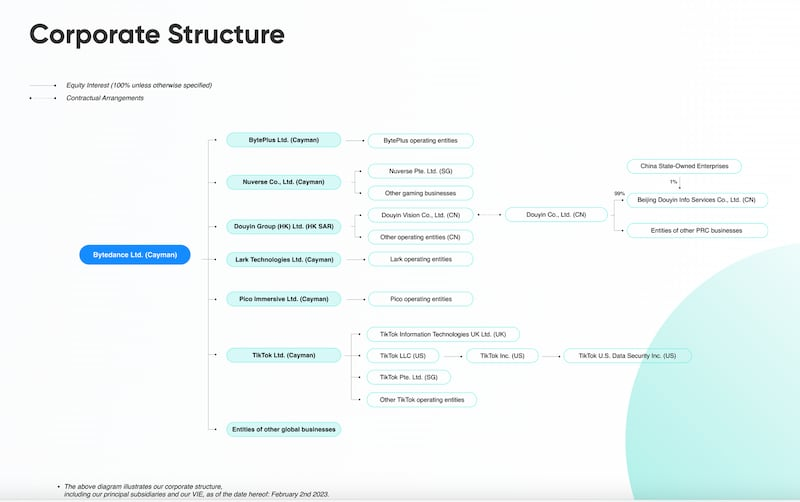
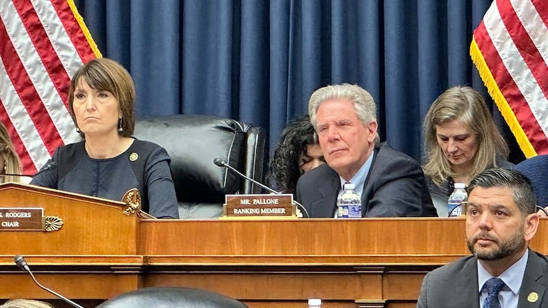
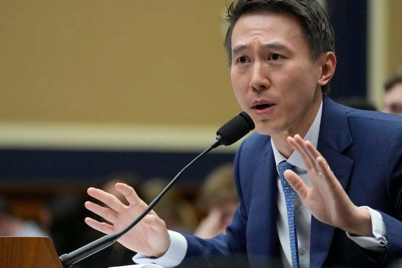

# 事實查覈 | 事實快答：關於字節跳動與TikTok的五個問題

作者：鄭崇生、沈軻

2023.03.25 10:28 EDT

2023年3月23日,美國 [衆議院能源與商務委員會](https://energycommerce.house.gov/events/full-committee-hearing-tik-tok-how-congress-can-safeguard-american-data-privacy-and-protect-children-from-online-harms)舉行鍼對TikTok的聽證會,TikTok公司首席執行官周受資經歷兩黨國會議員的質詢超過四小時。

TikTok身爲美國註冊的企業，在美創造每月活躍用戶達1.5億的成功故事，卻因爲母公司字節跳動（ByteDance）的中國血統，飽受兩黨議員質疑。

這場聽證的焦點是，TikTok是否影響美國國家安全及個人隱私與數據安全，其中就TikTok與其母公司的關係、股權結構和與中國政府的問題被反覆提及。對此，亞洲事實查覈實驗室引述公開信息，爲這幾個問題提供客觀答案。

TikTok公司首席執行官周受資經歷兩黨國會議員的質詢 (美聯照片)

## 1.TikTok是中國公司嗎？

[擁有TikTok帳號的民主黨籍聯邦衆議員卡德納斯](https://www.tiktok.com/@congressmancardenas?lang=en)(Tony Cardenas)在聽證會上質問,TikTok是否爲中國公司?

周受資明白指出，TikTok不是中國公司，TikTok在美國註冊成立，在美國洛杉磯、以及周受資的家鄉新加坡都設有企業總部。周受資特別強調，TikTok在中國也遭禁用，而TikTok的業務是由美國和新加坡的執行團隊所主導。

根據美國專研資本市場與企業資訊的機構Pitchbook的 [公開數據](https://pitchbook.com/profiles/company/279877-42#overview),TikTok是屬於創投初期(Early Stage VC)的私募企業,在美登記地址位於加州。

而字節跳動的英文官網官方介紹，TikTok是公司創辦的全球短視頻產品，在2017年與同類產品Musical.ly合併成爲今天的TikTok平臺，在中國以外地區運作。

在字節跳動的企業介紹中,TikTok也與今日頭條等產品一起,被稱爲字節跳動旗下主要產品。在其 [官網展示的企業結構圖中](https://www.bytedance.com/en/?anchor=history),TikTok在全球各處的子公司均在字節跳動旗下。

字節跳動（ByteDance）英文官網截圖

**因此,TikTok確實在美國、英國、新加坡等地註冊,但其母公司爲字節跳動**。

## 2.字節跳動是不是中國公司？

卡德納斯持續追問周受資，TikTok的母公司字節跳動是不是中國公司？

周受資的答案並不直接了當。他先回答，字節跳動在中國經營許多業務，然後不斷強調，字節跳動是一家全球化的私人企業。並列舉，公司有6成投資者來自全球機構，2成股份由創辦人張一鳴持有，另外2成由所有員工共持。他還指出，字節跳動5名董事會成員中有3名是美國人。

根據字節跳動 [官網](https://www.bytedance.com/en/?anchor=history),字節跳動成立於2012年,北京字節跳動科技有限公司是當年張一鳴在一間四房公寓裏打造出的中國互聯網技術公司。字節跳動中文官網上的右下角也有該公司在北京公安部門備案信息。

字節跳動（ByteDance）中文官網截圖

值得注意的是,根據 [天眼查](https://webcache.googleusercontent.com/search?q=cache:sEA9gQl-1r4J:https://www.tianyancha.com/company/2352987806&cd=1&hl=en&ct=clnk&gl=us)資訊,字節跳動有限公司的登記名稱已經改爲抖音有限公司,法定代表人爲張利東,註冊資本達人民幣1億元。亞洲事實查覈實驗室再以"抖音有限公司"的名稱查詢中國 [國家企業信用信息公示系統](https://www.gsxt.gov.cn/%7B09C8DC9061E97D4292DE1B934335FF0E421C7CAC247A0C4C58D0216D33A895D91C42347460E888B79968577919DCBC34438FFC20370181754330E410261EE179E145E145E17FDB0BBEB59B90BE0BBF7E675A8A5C57F36BDE6A2AFCC16E657CD8D3201DB264742EE47F84954533F98C49B8680D950DA206274778563668A272178F2B8F2B8F2B-1679683956620%7D)發現,北京抖音信息服務有限公司的營業執照覈准日期是2022年8月8日,是向北京市海淀區市場監督管理局取得登記,註冊資本爲人民幣2億元。

## 綜上，公開信息顯示，字節跳動確實是創始於中國，目前總部位於北京。

## 3.中國共產黨是否持有或掌控字節跳動或TikTok？

["TikTok是中國共產黨可以用來監視我們所有人、操控我們整個美國的工具。"](https://www.youtube.com/watch?v=e-DZTFwyzfY)這是美國衆議院能源與商務委員會主席、共和黨籍的羅傑斯(Cathy McMorris Rodgers)的基本觀點。聽證中,其他幾位議員也再三詰問周受資:TikTok是否受中國共產黨控制?

周受資回答稱，“沒有”。

衆院能源與商務委員會主席、共和黨籍的羅傑斯（左）與民主黨首席議員帕龍（右）

公開資訊則顯示,與很多中國科技公司一樣,字節跳動公司也組建了中國共產黨黨委,字節跳動黨委書記、副總裁張輔評帶領公司成員黨建學習, [公司創始人兼時任CEO張一鳴和高管團隊也曾專門學習習近平的重要講話精神](http://finance.sina.com.cn/roll/2018-04-29/doc-ifzvpatq9979238.shtml)。

在股權方面，雖然字節跳動是非上市公司，不披露股權結構，然而根據其歷年來的融資聲明，媒體梳理了一些股東名稱中包括海納國際集團（Susquehanna International Group）、紅杉資本這樣的美國投資公司，也有建銀國際、春華資本這樣的中國公司。

此外,與很多科技公司一樣,字節公司確實也接受了有中國官方背景實體的少量持股。此前,路透社曾報道, [中國政府通過網投中文(北京)科技有限公司入股字節跳動](https://www.reuters.com/article/china-government-bytedance-weibo-0817-tu-idCNKBS2FI0CB),而該公司背後的三家實體都有政府背景。一位接近字節跳動內部的人士告訴亞洲事實查覈實驗室, 抖音信息服務公司確實有1%的股權來自於政府實體,但這位人士也表示,控股實體是爲了保障字節跳動的國內產品獲得相關執照,與字節跳動的國際業務無關。

## 因此，據公開信息，字節跳動大部分股權由私人公司和員工持有，中國政府背景的實體持有少量約1%的股份。

## 4.中國籍工程師與中國政府接觸不到用戶資料嗎？

聽證中受關注另一個核心問題是，美國的用戶資料是否能夠被中國國內獲取。

周受資的說法是，TikTok將建立一道防火牆，待TikTok的“德克薩斯項目”（Project Texas）完成後，將能保護美國用戶數據免受“未經授權”的外國訪問，Tiktok仍將是一個自由表達的平臺，不受任何政府的操縱。但有議員質問“那現在中國政府與工程師能接觸到用戶資料嗎？”周受資連續兩次強調的是：未來不可以。

TikTok公司首席執行官周受資經歷兩黨國會議員的質詢 (美聯照片)

這個回答意味深長，因爲此前，TikTok確實有中國員工獲取數據的事件發生。

2022年,美國《福布斯》(Forbes)雜誌的 [獨家報道](https://www.forbes.com/sites/emilybaker-white/2022/12/22/tiktok-tracks-forbes-journalists-bytedance/?sh=16d6b3dd7da5)就披露,TikTok母公司字節跳動的中國團隊在未經同意的情況下,以TikTok內部的應用程式監控一些特定美國公民的個人資訊,其中包括了《福布斯》的科技記者貝克懷特(Emily Baker-White)。貝克懷特長期追蹤TikTok用戶數據外泄的問題,根據她當時的報導,TikTok內部有一個被員工稱爲"綠色通道"的數據請求系統,她取得這些文件和記錄顯示,位於中國的工程師能通過這一綠色通道接觸到美國用戶的數據。

亞洲事實查覈實驗室 [此前報道](2023-03-24_事實查覈 ｜ TikTok能與中國政府共享美國用戶數據嗎？.md),Tiktok的隱私政策也寫到,該公司的集團內的其他實體可能會有訪問權限。

## 因此，就目前信息分析，字節跳動、TikTok在中國的工程師是有可能接觸到美國的用戶數據的。

## 5.中國政府可以操縱TikTok嗎？

在聽證會上，多位衆議員提到中國2018年通過的《國家情報法》，質問中國政府對TikTok的母公司的控制權。

在是否受控於中國政府的問題上，周受資的回應，TikTok是一個表達自由的平臺，不會被任何政府操縱。

然而,TikTok的母公司字節跳動作爲中國公司,受到中國許多法律的限制。根據《國家情報法》,在中國境內的公司,有配合國家情報工作的義務。 [該法第七條規定](http://www.npc.gov.cn/npc/c30834/201806/483221713dac4f31bda7f9d951108912.shtml),任何組織和公民都應當依法支持、協助和配合國家情報工作,保守所知悉的國家情報工作祕密。

此外,中國 [《數據安全法》](http://www.npc.gov.cn/npc/c30834/202106/7c9af12f51334a73b56d7938f99a788a.shtml)規定,在中國境外開展數據處理活動,損害國家安全、公共利益或者公民、組織合法權益的,依法追究法律責任。 [《網絡安全法》](http://www.gov.cn/xinwen/2016-11/07/content_5129723.htm)則規定,國家會採取措施,監測、防禦、處置來源於中華人民共和國境內外的網絡安全風險和威脅。這些模糊而寬泛的法條,很有可能會用於監管技術公司。

就在這場聽證會召開前夕,美國政府曾施壓要求字節跳動出售TikTok,中國政府多個部門也進行了強硬表態。中國商務部發言人束珏婷在北京的 [例行記者會上](http://www.mofcom.gov.cn/xwfbh/20230323.shtml)表示,"出售或者剝離TikTok涉及技術出口問題,必須按照中國的法律法規履行行政許可程序,中國政府將依法作出決定。"

## 因此，根據中國的多條法律和有關部門對其境內的商業公司的行政管制，位於中國的科技公司確實有被國家操縱的可能。[完]

*亞洲事實查覈實驗室（Asia Fact Check Lab）是針對當今複雜媒體環境以及新興傳播生態而成立的新單位，我們本於新聞專業，提供正確的查覈報告及深度報道，期待讀者對公共議題獲得多元而全面的認識。讀者若對任何媒體及社交軟件傳播的信息有疑問，歡迎以電郵afcl@rfa.org寄給亞洲事實查覈實驗室，由我們爲您查證覈實。*

[Original Source](https://www.rfa.org/mandarin/shishi-hecha/hc-03252023100008.html)