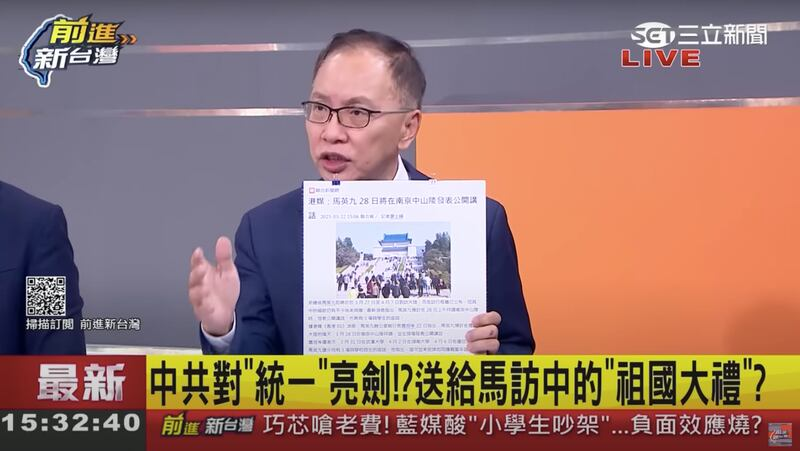

# 事實查覈 | 馬英九帶着學生去大陸談統一？

作者：李潼

2023.03.27 15:55 EDT

## 標籤：斷章取義

## 一分鐘完讀：

臺灣前任總統馬英九週一(27日)啓程訪問中國大陸，行前有臺灣電視評論員稱：馬英九辦公室主任蕭旭岑受訪時公開表示“這次去就是要談統一的。”“(中華民國)憲法中本來就有統一的主張。”

亞洲事實查覈實驗室通過採訪當事人及查證現場錄音，確認當時蕭旭岑是被記者問道：“如果行程中碰到大陸年輕人提出統一議題，該怎麼接招？”時，纔回答：“‘統一’不必是禁忌話題。”這樣的表述和“馬英九此行就是去談統一”語義相差極大，明顯爲斷章取義。

## 深度分析：

馬英九辦公室在3月19日晚間發出新聞，證實馬英九即將訪問中國大陸。此行除了祭袓，也帶着馬英九基金會“大九學堂”的青年學生與大陸學生交流。過去一個星期以來，馬英九的訪陸計劃成了報道焦點及熱議話題。

3月24日,在臺灣三立電視臺製播的政論節目" [前進新臺灣](https://www.youtube.com/watch?v=UTXvc0Z9KvY&t=2042s)"中,包括臺灣智庫諮詢委員董立文在內的多位評論員,先後根據媒體報道,批評馬英九辦公室主任蕭旭岑接受香港媒體訪問時公開說:"這次去就是要談統一的。""馬英九此行要踏出(統一)'關鍵的第一步'。"

董立文痛批馬英九現在"不裝了"（三立新聞YouTube帳號截圖）

董立文及多位評論人接連痛批：情況非常嚴重，馬辦現在也“不裝了”，現在就是要帶學生去談統一。 “前進新臺灣”在網絡上有19萬名訂閱者，本則視頻也有近3萬人觀看。

亞洲事實查覈實驗室發現，上述評論員所提到的媒體訪問，並不是蕭旭岑接受個別媒體的專訪，而是3月22日馬英九辦公室針對駐臺外籍媒體召開的一場背景說明會。會後，包括網媒香港01、新加坡聯合早報都刊出報道。

蕭旭岑對亞洲事實查覈實驗室表示，“統一”並不是他主動提起的“訪中目的”，之所以說起“統一”話題，其實是在回答記者的提問。當時有記者問道，如果這次交流中大陸學生拋出“統一”的話題，訪問團會不會迴避？

蕭旭岑告訴亞洲事實查覈實驗室，他當時回答的是，交流就是百無禁忌，如果對方要提“統一”話題，我們的學生當然敢回應。畢竟中華民國憲法增修條文的前言也有“統一”字眼，況且臺灣是有言論自由的地方，沒有什麼議題是禁忌的。

蕭旭岑強調上述電視評論員扭曲了他的說法。原本他是回應媒體的假設性問題，不能被扭曲理解爲“馬英九方面主動想和大陸方面談統一”。

亞洲事實查覈實驗室也分別向兩位當時在說明會現場的人士查詢，兩個獨立信源都表示蕭旭岑的談話確實是回答問題，被動提及“統一”話題。實驗室也取得了當天現場錄音，驗證了蕭旭岑的解釋：

錄音中，一個女聲問道：大陸現在言論多元，而這幾年兩岸敵對、仇視之下，“小粉紅武統的聲音很高了”，如果有人提到統一方面的問題，馬英九一行該怎麼應對。

蕭旭岑在回答時提到，“統一”事實上也寫在《中華民國憲法增修條文》的前言之中。他說：“所以我覺得這個就是一個必須可以去辯論或是討論的問題，如果今天大陸說我們要統一，那我們也可以跟學生們來討論一下。好，你如果要統一，（我們）要如何同意，有什麼條件（讓我們）同意……我覺得這個東西不是禁忌，就是屬於可以討論、辯論的議題。”蕭旭岑強調，“最重要的還是跨出那一步，一直在臺灣抗中或者叫囂，永遠不會有解決問題的一天。”

*亞洲事實查覈實驗室（Asia Fact Check Lab）是針對當今複雜媒體環境以及新興傳播生態而成立的新單位，我們本於新聞專業，提供正確的查覈報告及深度報道，期待讀者對公共議題獲得多元而全面的認識。讀者若對任何媒體及社交軟件傳播的信息有疑問，歡迎以電郵afcl@rfa.org寄給亞洲事實查覈實驗室，由我們爲您查證覈實。*

[Original Source](https://www.rfa.org/mandarin/shishi-hecha/hc-03272023155130.html)