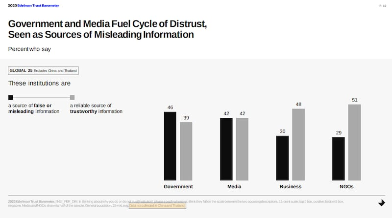

# 事實查覈 | 中國政府是世界上最受信任的政府嗎？

作者：沈軻 / 編譯：伊芙蔡

2023.03.28 12:46 EDT

## 標籤：誤導

## 一分鐘完讀：

中國官方近年經常引用西方世界特定調查機構發佈的調查報告，證明自己受“人民信任程度”在世界各國間名列前茅。其中一份經常引用的是美國公共關係公司愛德曼（Edelman）的年度報告。該報告在近五年將中國政府列爲“最受人民信任”的政府之一。在2022、23年，中國政府受民衆信任的程度高達91%和89%，排名世界第一。

然而亞洲事實查覈實驗室檢視上述結果後，發現愛德曼報告關於中國公衆輿論的民意調查方法受到專家質疑。專業人士也認爲，中國對言論的審查和控制，極可能會導致一些中國受訪者即使持反對、批評意見，也會猶豫、噤聲。

## 深入分析：

愛德曼公司發佈的《全球信任度調查報告》(Edelman Trust Barometer)，是針對28個國家的國民進行問卷調查，評估他們對本國政府、企業、非政府組織和媒體信任度的高低。在最近5年，就受訪國家公民對國家信任度的比例而言，中國在所有接受調查的國家中，不是第一就是第二。

中國官員和媒體經常將愛德曼的信任度報告，拿來當作中國人民對政府信心的“證據”。官媒《中國日報》香港版最近發表的一篇評論文章，就引用了愛德曼的2023年報告，聲稱“中國持續在人民信任度上引領全球”。

中國外交部發言人華春瑩,也以推文引述2022年報告,宣傳中國 [排名頂尖的信任指數](https://twitter.com/SpokespersonCHN/status/1484122662368514050),中國官員還強調,這些調查是由 ["西方的機構"](https://www.fmprc.gov.cn/mfa_eng/xwfw_665399/s2510_665401/202209/t20220907_10763396.html)進行的。

## 該報告是否依循正常的研究方法做出？

《全球信任度調查報告》的調查、研究方法確實引發質疑，尤其是牽涉到中國的部分。

多個版本的調查報告都顯示這項調查並沒有針對中國受訪者詢問下列這些問題：政府本身是否存在爭議性？國家機構是否無法應對一些既存的挑戰？國家是否比以前更處於分裂狀態？政府和官媒有沒有釋出值得信任的資訊？以及，政府是否被認爲有解決社會問題的能力？

皮尤研究中心高級研究員勞拉·西爾弗（Laura Silver）對亞洲事實覈查實驗室表示，刪除一些不適合在當地提出的問題，有時可能纔是最合適的選擇，因爲若提問讓受訪者感到不舒服，甚至退出、不願意繼續，可能會影響調查的代表性，從而產生偏頗。

西爾弗並補充說明，雖然在做比較研究時，漏掉某些問題並不理想，但只要過程透明，受調國家彼此仍是可以進行比較的。

然而，研究公司 SurveyUSA 的總裁阿爾珀（Ken Alper）則警告，調查中提出的每個問題，都有可能影響所有後續問題的回答。

愛德曼另一個調查方法更加爭議，它在對中國進行的調查中，刪除了某些答案的選項 ---2023 年對泰國的調查中也有相同做法。調查報告在關於樣本量和配額的附錄頁面底部，以灰色小字體註明了這一點，但沒有具體說明涉及哪些問題，或是刪除了哪些答案選項。

西爾弗聲稱，答案選項被刪除，肯定會影響跨國比較研究的進行。

此外，許多投影片底部的灰色小字也指出，有些問題只對一半的受訪者提出。 2023年的報告沒有解釋爲什麼有這樣的區別。 2022年的報告則說，在某些情況下，對具備更高教育程度的受訪者，提問會更嚴格。

愛德曼報告中表示，有些敏感問題沒有在中國採集數據。（圖/愛德曼報告截圖）

報告抽樣方式也含糊不清。阿爾珀受訪時認爲，所謂的民意調查，應該披露具體的抽樣方法、受訪者的配額或類別等資訊，但愛德曼並沒有這樣做。在個別國家、 1150名受訪者中，該報告都沒有對他們的年齡、性別或居住地區進行詳細分類。

愛德曼2022年的全球信任度調查報告還顯示，在網路普及率較低的國家/地區，較具代表性的網路樣本，往往都來自更富有、教育程度更高、更都市化的人羣，勝於一般的民衆。中國70%的網路普及率，是受調國家裏最低的，在2023年的28個國家中僅排行第25，但有趣的是，收入低的中國民衆，對國家政府、非政府組織、公司和媒體的信任度 (71%) ，卻比收入高的中國民衆（90%）還要低。中國基於收入的信任不平等程度，僅次於泰國、美國和沙烏地阿拉伯，位居第4。

不過，愛德曼沒有回應亞洲事實查覈實驗室關於報告或研究方法的多次詢問。

## 在中國能進行有意義的政治民調嗎？

在中國進行民調十分困難，因爲中國的法律要求任何外國人或公司進行研究，都必須先獲得政府審批許可，即使商業性的市場研究、學術研究和社會民意調查也不例外。法律規定，中國統計局應與國務院合作，監督、審查任何威脅中國國家統一、造成社會混亂或違反憲法基本原則的研究。

中國並不是唯一試圖通過控制民意調查來影響公衆輿論的國家。西爾弗認爲，有些政府會根據自身利益、出於不同原因而控制民調，其中一個理由，可能是擔心民調會揭露民怨，倘若一個政府的合法性取決於人民有無被滿足，卻被闡明事實並非如此，則可能會對其穩定性造成不利影響。

阿爾珀指出，言論自由通常是獲得可靠民意數據的重要先決條件，如果擔心說實話會讓自己有被定罪和判刑的危險，受訪者就不太可能據實以告，在這種環境工作的民調專家，就應該承認他們的調查結果有其侷限性。

研究也顯示，當人們害怕發表批評言論，會招來失業甚至更嚴重的後果時，試圖透過匿名網路調查或私人訪談來規避這些障礙，可能是不夠的，西爾弗認爲：“如果懲罰導致人們害怕參與，就可能產生偏頗”。

就中國而言,過去由知名的西方和中國團體進行的民意調查,也反映出民衆對中國政府的高度信任。哈佛大學阿什中心(Ash Center)一項涉及32000名受訪者的 [長期民意調查項目](https://ash.harvard.edu/files/ash/files/final_policy_brief_7.6.2020.pdf)發現,2016年,也就是該調查的最後一年,95.5% 的受訪者對中央政府"比較滿意"或"非常滿意"。

間的差距，後者在傳統上傾向於讚美中央政府，卻把問題都歸咎於地方政府。他還指出，“全國都傳播着非常積極的消息”。

中國政府確保其在愛德曼2023年報告獲得人民高度信任，儘管2022年習近平政府的新冠清零政策、遏止病毒傳播之嚴厲措施，引起廣泛民怨，甚至出現罕見的羣衆抗議活動。

中國的受訪者還高度信任民調中提到的所有機構、組織和國家媒體，在其他信任度類別也都是名列前茅。

## 愛德曼是公正中立的調查機構嗎？

身爲一間與企業組織合作的公關暨營銷諮詢公司，愛德曼聲稱自己成功的方法之一是“建立信任”。但該公司是不是真的值得信任，卻一直有爭議。例如，儘管愛德曼將氣候變化稱爲“我們社會面臨的最大危機”，卻被一家環境非政府組織揭發曾在加拿大組織僞草根運動，祕密支持一條輸送油砂、被視爲碳含量最高、有毒燃料含量也最高的管道。

此外,它的母公司Daniel J. Edelman Holdings曾宣稱,"尊重人權"是公司經營的基礎,但據報導,愛德曼曾與人權記錄不佳的國家合作,例如,據媒體報道,愛德曼曾爲沙特政府服務,在 [殘殺記者卡舒吉(Jamal Khashoggi)一案](https://www.theguardian.com/world/2022/dec/22/edelman-saudi-arabia-pr-image)後,爲其洗白形象。

與其他跨國公司一樣，愛德曼有時會針對“特定市場”做出調整，而且似乎在面對專制國家時尤爲謹慎。愛德曼首席執行長一篇關於2022年5月世界經濟論壇，提到民主與專制裂痕的文章，就只刊登在該公司的英文主網上，卻沒有出現在該公司的中東網站上。公司英文官網上刊登的首席執行官對俄烏戰爭等敏感話題的看法，但這些同樣也沒有出現在愛德曼的中國網站上。

## 結論：

儘管愛德曼全球信任度調查報告聲稱，中國人對他們的政府信任度最高，但調查方法的潛在弱點，以及北京對訊息的控制，應該都會讓人們懷疑，大多數的中國人是否真的同意，他們的政府是世界上“最受信任的政府”。

*亞洲事實查覈實驗室（Asia Fact Check Lab）是針對當今複雜媒體環境以及新興傳播生態而成立的新單位，我們本於新聞專業，提供正確的查覈報告及深度報道，期待讀者對公共議題獲得多元而全面的認識。讀者若對任何媒體及社交軟件傳播的信息有疑問，歡迎以電郵 [afcl@rfa.org](http://afcl@rfa.org)寄給亞洲事實查覈實驗室，由我們爲您查證覈實。*

[Original Source](https://www.rfa.org/mandarin/shishi-hecha/hc-03282023124250.html)