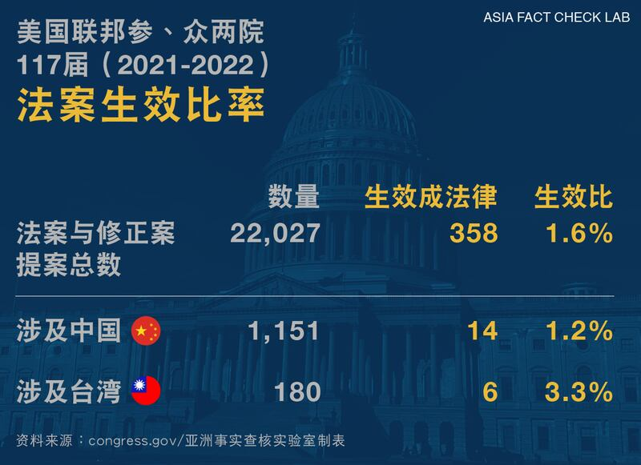

# 事實查覈 | 美國通過系列“排華”措施，禁止買房、沒收資產？

作者：鄭崇生

2023.03.29 10:52 EDT

標籤：誤導

## 一分鐘完讀：

美國要 ["沒收中國人資產了、不管你是不是中國籍"](https://weibo.com/2963774131/MvqI9DCPi)——3月初,"美國通過系列'排華'措施"的話題在新浪微博、各平臺自媒體號熱議。其由頭是美國多個地方議會和聯邦國會接連出臺針對中國人與中國實體在內的法律草案。例如,知名新浪微博主"孤煙暮蟬"就 [發文](https://weibo.com/2150758415/Mt7avox4w)指出,美國加大"反華排華"力度,是"反賊、港獨臺獨勢力慫恿鼓動。"

近幾個月，儘管美國國會和一些州確實有一些議員提出針對華人的一些法律草案（bill），但這些文件離成爲法律（Act 或Law）非常遙遠，且通過生效的幾率很低。這些法律草案的出現，也許確實代表了美國一些政治人物對華態度的緊張，然而，中國網絡世界流傳的說法稱這些草案“已經通過”是錯誤的，與歷史上早已廢除的《排華法》類比也有失偏頗，坊間對一些草案的細節的解讀也屬斷章取義，誤導讀者。

## 深度解析：

這一波被熱議的“排華”話題的第一項，就是“一旦臺海開展衝突，華人資產不保”。

2月28日,美國聯邦衆議院金融服務委員會以40比0的票數通過 [《2023年臺灣衝突阻遏法(草案)》(Bill of Taiwan Conflict Deterrence Act of 2023, H.R. 554)](https://www.congress.gov/bill/118th-congress/house-bill/554/text),之後幾天,包括" [明搶中國的財富,補美帝經濟危機"](https://weibo.com/2963774131/MvqI9DCPi)的論調,再到是" [美國彌補國債危機、一旦事發,全部沒收在美華系的資產"](https://weibo.com/3945734871/MxhgN8jyN),這些說詞至今還再流傳外,也被成爲是"排華"和"反華"的舉動,另有微博熱點話題#漂亮國通過《臺灣衝突遏制法》#中的討論,也存在明顯錯誤。

首先，《臺灣衝突遏制法》還處在法律草案（bill，又譯爲議案）階段，美國聯邦衆院單一委員會通過的草案，要成爲全美國適用的法律（law），還很遙遠。按照美國立法規則，衆院金融服務委員會過關後，接下來還得要送交衆院全院表決、再到聯邦參院相關委員會通過、交參院全院表決過關，這纔算完成參、衆兩院的立法程序，國會最後還得將這部法（Act，又譯爲法令、或法案）送交白宮、由美國總統簽署，纔會成爲生效法律（Law）。

## 美國立法：從法律草案（Bill）到法律（Act或Law）有多遠？

美國聯邦層面,一年有多少法律草案(bill)最終能生效成法律(law)呢?亞洲事實查覈實驗室根據美國 [國會數據庫](https://www.congress.gov/)統計,2021年-2022年、也就是美國國會第117屆會期,參、衆兩院共提出2萬2027項法案與修正案(Amendment),最終生效成爲法律的僅有358個,生效成法的比率爲1.6%。進一步細查,同一會期涉及中國的法律草案則有1151個,最終只有14項生效成爲法律,成法率僅約1.2%;涉及臺灣的草案共有180件,最終生效成法的僅爲6個,成法率約爲3.3%。

其次,即使 [《臺灣衝突阻遏法(草案)》](https://www.congress.gov/bill/118th-congress/house-bill/554/text)未來能通過,華人的資產會沒收嗎?該法律草案相關條款主要是針對中國大陸的高階官員,第二、三條寫道,適用對象是中共中央政治局常委、政治局委員或是任何直接或間接執行涉及臺灣事務的中國官員;而一旦美國總統依現行《臺灣關係法》、就中國威脅美國利益的行動通報國會後,國會將指示財政部長提交報告,報告內容須列明提供上述中國政府高官服務的金融機構名單,並將報告翻譯成中文、對外公開,同時,財政部長將獲授權、禁止這些金融機構對相關中國官員及他們的家屬提供服務。

也就是說，就算該草案最終真通過了百裏挑一的立法程序、由總統簽署生效成法律，一旦中國武力犯臺，可能遭凍結在美資產的人會是少數的中國黨政高官，而不是所有華人企業或華人。

## 州級法律草案歧視華人？立法路漫長 公民反抗力量大

亦有不少網帖提及，得克薩斯州等地議員提議禁止華人購買房地產、甚至是禁止中國人就讀州立大學。這些動向確實在一定程度上反映了美國政界對華態度的緊張。和上述聯邦立法程序一樣，這些法律草案真要生效成法律都還有漫長的一段路要走。同時，美國的公民社會反抗力量，和最高法院的釋憲權都會成爲這些法律草案的制約。

在德克薩斯州, [SB147法律草案](https://capitol.texas.gov/tlodocs/88R/billtext/html/SB00147I.htm)於2022年底提出,草案原本尋求禁止中國、伊朗、朝鮮、俄羅斯等四國公民、企業及政府機構在當地購買房地產,原本並未引發太多關注,直到今年初州長阿博特(Greg Abbott)在立法程序尚未完成前、就通過 [推特](https://twitter.com/GregAbbott_TX/status/1614686215676084226?lang=en)公開表態支持,引發當地亞裔社區'擴大到全美華人社區的關切與反彈,掀起多次的抗議遊行,也使得草案的州參議員爾克霍斯特(Lois Kolkhorst)在當地立法聽證會前提出 [修正版本](https://senate.texas.gov/members/d18/press/en/p20230302a.pdf),排除已有美國永久居留權或公民資格的上述四國民衆受到草案限制。

此後,德州相繼還有關於禁止上述四國公民、企業及政府實體購買當地農地的 [SB 552](https://capitol.texas.gov/tlodocs/88R/billtext/html/SB00552I.htm)草案,以及禁止上述四國公民就讀享有州政府預算支持的州立大學 [HB 4736](https://capitol.texas.gov/tlodocs/88R/billtext/pdf/HB04736I.pdf#navpanes=0)草案,這些同樣被稱爲"排華法案"的系列草案,受到全美 [媒體](https://www.cnn.com/2023/02/18/politics/chinese-land-law-texas-virginia-what-matters/index.html)的關切以及民意反彈。德州當地媒體《聖安東尼奧快報》(San Antonio Express News)的 [最新分析](https://www.msn.com/en-us/news/politics/bill-would-ban-students-in-u-s-illegally-those-from-china-other-nations-from-texas-universities/ar-AA18tT0N?ocid=weather-verthp-feeds)認爲,一些草案過關機率非常小。

德州當地的非營利組織“亞太裔崛起”（RiseAAPI）執行主任曼瑟（Nabila Mansoor）告訴亞洲事實查覈實驗室，他們仍對 SB 147 和 HB 4736這兩項州立法機構審議中的草案感到擔憂。

但曼瑟對通過公民運動改變立法抱持希望。她說，德州的泛亞裔美國人藉由遊行、動員、參與立法聽證等方式團結起來，已經對社會變革產生持久的影響力。藉由持續努力與行動，她樂觀地認爲，許多具有歧視性的草案最終不會成爲法律。

## 結論：

美國確實曾於1882年通過《排華法》（Chinese Exclusion Act），生效的黑暗歷史。1943年該法廢除之後，美國國會曾三次以正式國會決議案形式，對這段歷史表達遺憾並道歉。

美國政壇一直不缺乏各種搏眼球的立法草案，但法律草案並不等於法律，最終生效需要經過漫長的立法過程，也需要經受公民力量的檢視和制衡。

最近中國社交媒體上關於所謂新一輪“排華法”的討論，將法律草案（bill）與法律（law）混淆，是錯誤的，對於草案細節的一些討論，也存在斷章取義，誤導讀者的問題。

*亞洲事實查覈實驗室（Asia Fact Check Lab）是針對當今複雜媒體環境以及新興傳播生態而成立的新單位，我們本於新聞專業，提供正確的查覈報告及深度報道，期待讀者對公共議題獲得多元而全面的認識。讀者若對任何媒體及社交軟件傳播的信息有疑問，歡迎以電郵 [afcl@rfa.org](http://afcl@rfa.org)寄給亞洲事實查覈實驗室，由我們爲您查證覈實。*

[Original Source](https://www.rfa.org/mandarin/shishi-hecha/hc-03292023104925.html)