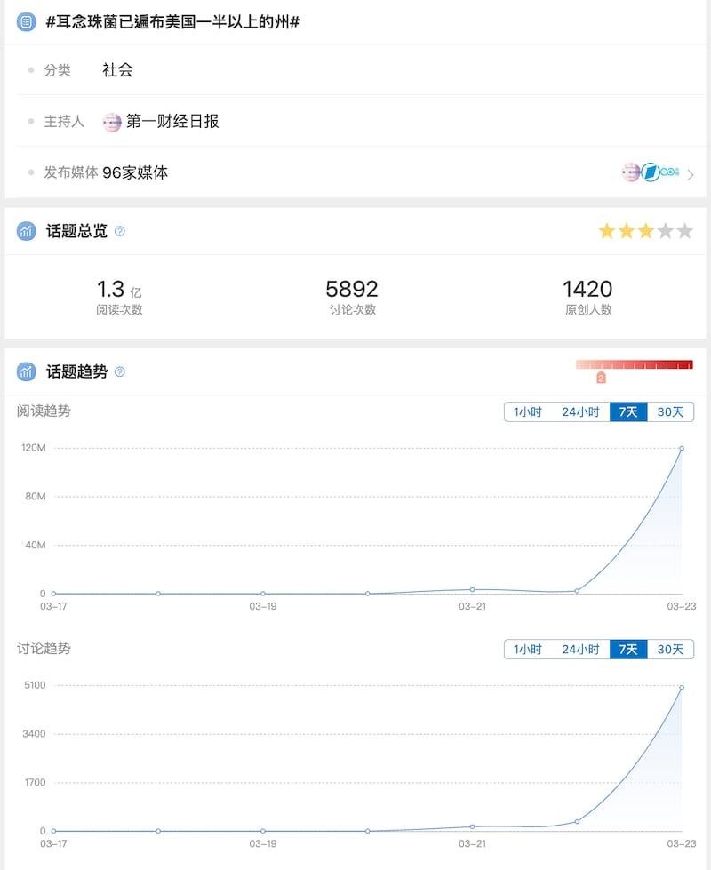
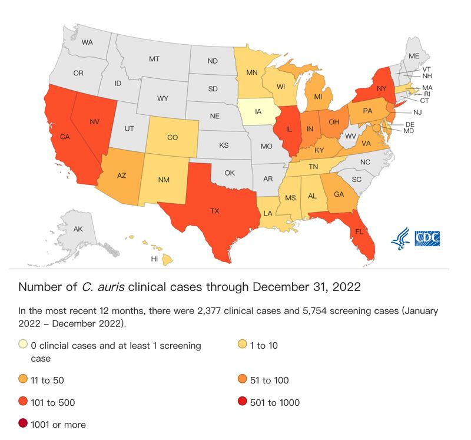
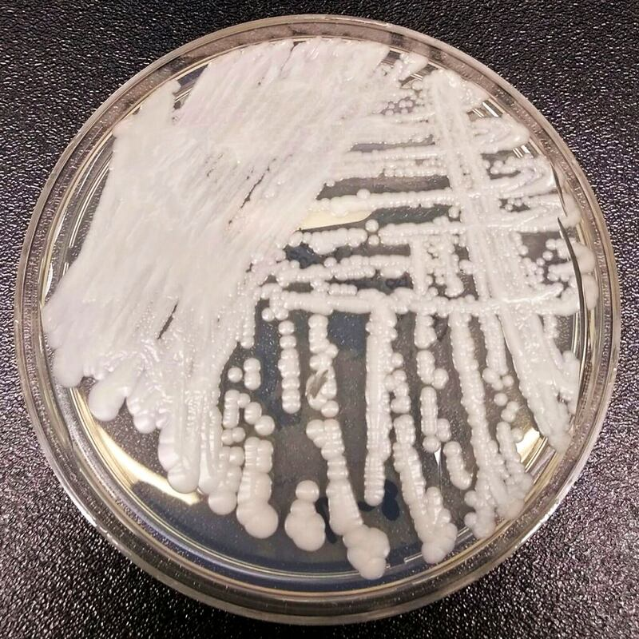

# 事實查覈｜耳念珠菌肆虐美國，近半感染者90天內死亡？

作者：董喆

2023.03.30 12:30 EDT

標籤：誤導

## 一分鐘完讀：

3月21日,新浪微博上出現話題標籤"#耳念珠菌已遍佈美國一半以上的州#",一條由《第一財經》製作的 [短視頻](https://weibo.com/tv/show/1034:4882461772152899?from=old_pc_videoshow) 指出:"據CDC,近一半感染了耳念珠菌的患者會在90天內死亡"且"受感染的住院病人中,估計有30%至70%最終會死亡"。

對此,亞洲事實查覈實驗查閱了美國疾病管制中心(下稱CDC) [新聞稿](https://www.google.com/url?q=https://www.cdc.gov/media/releases/2023/p0320-cauris.html&sa=D&source=docs&ust=1680165494338302&usg=AOvVaw1BzkSTwnRTHdy-Yt-DXHaM) 及論文,並採訪了紐約醫學中心感染防控中心主任。根據他們的解釋,目前美國的耳念珠菌感染主要發生在安養中心及醫療機構,快速死亡的患者多半有多重疾病,但難以斷定死亡原因就是耳念珠菌。因此,"近半感染患者會在90天內死亡"的說法屬於誤導。

## 深度分析：

近日，中國知名財經媒體《第一財經》製作了一支有關美國耳念珠菌疫情的短視頻，並在微博上發起“#耳念珠菌已遍佈美國一半以上的州#”話題。此話題迅速在微博上掀起熱議，累積超過1.3億閱讀次數，轉載了相關內容的媒體有100家左右。

《第一財經》製作的短視頻截圖

《第一財經》的短視頻以驚悚的配樂和耳念珠菌的顯微鏡影像，搭配解釋性的字幕，宣稱耳念珠菌在美國以“驚人的速度”傳播，已遍佈美國一半以上州，並以不具名專家說法描述該菌株難以診斷、致死率高，最後更借CDC之名稱“近半感染患者會在90天內死亡”。

“#耳念珠菌已遍佈美國一半以上州#”迅速成爲熱點話題，被閱讀1.3億次，討論超5千次，有1420人對此發佈了原創帖。不少網民嘲諷美國“又在放毒”“耳念珠菌是新一代美國殺手”等。

“#耳念珠菌已遍佈美國一半以上州#” 微博話題及數據截圖

## 美國CDC如何示警耳念珠菌

亞洲事實查覈實驗室發現,微博上的討論源自美國CDC在3月20日發佈的一則新聞稿 [:《醫療設施中抗生素抗藥性真菌擴散的威脅日益增加》](https://www.cdc.gov/media/releases/2023/p0320-cauris.html) 。

新聞稿中提到,根據CDC在《內科學年鑑》上發表的 [論文](https://www.acpjournals.org/doi/abs/10.7326/M22-3469?journalCode=aim) ,2020年至2021年期間,耳念珠菌(Candida auris)在美國醫療機構中以驚人速度擴散。耳念珠菌是一種新興真菌,具有多重抗藥性;針對於最常被用於治療耳念珠菌的藥物"echinocandins",其抗藥性病例在2021年增長了三倍。

論文中也提出,2019至2021年,共有17個州首次出現耳念珠菌感染案例,總臨牀案例更是從2019年的476例上升至2021年的1474例,成長率超過200%。根據CDC [耳念珠菌監控網站](https://www.cdc.gov/fungal/candida-auris/tracking-c-auris.html) ,2022年,累計感染案例已經達到2377例,共有29州出現個案。

CDC耳念珠菌監控網站截圖

CDC指出，COVID-19的大流行轉移了臨牀對耳念珠菌篩檢的注意力，可能是耳念珠菌疫情上升的主因。該篇論文的第一作者、流行病學家Meghan Lyman博士提出預警：“病例數的快速增加和傳播令人擔憂，顯示持續監測、擴大實驗室容量、快速診斷以及防控措施的必要性。”

根據CDC最新資料以及相關論文，截至2022年12月31日，耳念珠菌確實在美國超過一半以上州出現，內華達州、加州、佛州、紐約州最爲嚴重，皆有超過300個案。

## 高致死率是真是假？

耳念珠菌傳播在美國境內升溫屬實，不過《第一財經》的短視頻提到的“近半感染患者會在90天內死亡”，以及“受感染的住院病人中估計有30%至70%最終會死亡”是否是誇大的論述？

我們並未在3月20日CDC發佈的新聞稿中發現以上論述，但從CDC其它的公開論文及新聞稿中，找到兩個可能的來源。

第一,"受感染的住院病人中估計有30%至70%最終會死亡"可在CDC網站中有關耳念珠菌的 [問答集](https://www.cdc.gov/fungal/candida-auris/candida-auris-qanda.html) 中發現。其中提到"感染耳念珠菌是否會死亡?"CDC解釋,根據有限的患者數據,有3至6成的耳念珠菌感染者死亡,但其中許多人有其他嚴重疾病,這些疾病也增加了他們死亡的風險。

第二,"近半感染患者會在90天內死亡"出現在3月20日當天包括 [紐約時報](https://www.nytimes.com/2023/03/20/health/candida-auris-us-fungus.html) 在內的美國主流媒體報道,但兩者的說法稍有差異。根據紐約時報報道,"根據CDC的數據,近一半的感染耳念珠菌的患者在90天內死亡",此數據並非預測,而是根據現有病例的統計。

爲了找尋更直接的證據,我們在CDC找到了一篇可能是這項數據的原始出處,這篇2018年的 [論文](https://wwwnc.cdc.gov/eid/article/24/10/18-0649_article) 統計美國2013至2017年的耳念珠菌個案,結論指出:51名臨牀個案中,有23人(45%)在90天內死亡。

2016年美國CDC實驗室培養皿中的耳念珠菌株（圖／美聯社）

爲了進一步瞭解美國耳念珠菌的實際流行情況，亞洲事實查覈實驗室向紐約西奈山醫學中心感染防控中心查證。該中心主任Waleed Javaid醫生告訴我們，大多數感染耳念珠菌的患者已經有其他疾病在身，“很難確定耳念珠菌是許多病例中直接導致死亡的原因”。

該如何看待耳念珠菌在美國的傳播？Javaid醫生表示，感染耳念珠菌的高風險人羣爲有留置醫療器械的其他疾病患者，如尿道導管、氣管插管等，他們較容易面臨真菌侵襲感染的風險，一般的健康人士不必擔心。

## 結論：

根據以上資料，《第一財經》的兩點描述有誤導之嫌，錯把臨牀的觀察當作耳念珠菌的風險預估，且忽略了感染耳念珠菌的患者多半有其他基礎疾病，死因難以歸咎爲耳念珠菌。且耳念珠菌感染主要發生在需要用到輔助醫療器械的特殊人羣身上，對一般健康人士的威脅極低。

*亞洲事實查覈實驗室（Asia Fact Check Lab）是針對當今複雜媒體環境以及新興傳播生態而成立的新單位，我們本於新聞專業，提供正確的查覈報告及深度報道，期待讀者對公共議題獲得多元而全面的認識。讀者若對任何媒體及社交軟件傳播的信息有疑問，歡迎以電郵 [afcl@rfa.org](http://afcl@rfa.org)寄給亞洲事實查覈實驗室，由我們爲您查證覈實。*

[Original Source](https://www.rfa.org/mandarin/shishi-hecha/hc-03302023122403.html)