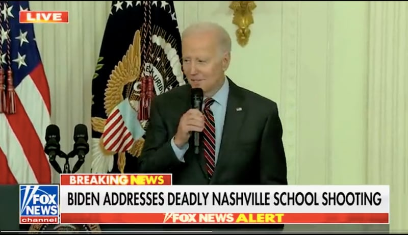
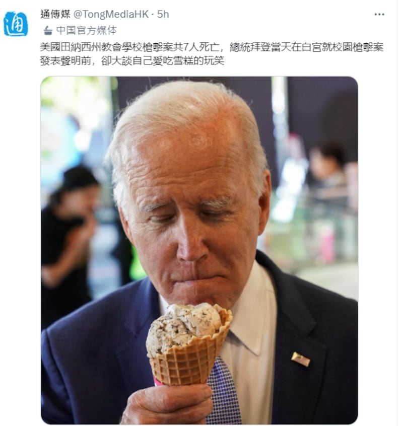

# 事實查覈｜ 哀悼校園槍擊案前，拜登先開玩笑大談喫冰淇淋？

作者：莊敬

2023.03.31 12:37 EDT

## 標籤：誤導

## 一分鐘完讀：

觀察者網、通傳媒等中國媒體最近在微博、推特等平臺發佈短影音或貼文，指美國總統拜登就田納西州校園槍擊案發表講話前，開了玩笑說：“我來這是因爲聽說有巧克力冰淇淋”。

亞洲事實查覈實驗室檢視完整過程後發現，這是拜登27日於校園槍擊案後不久，依行程在白宮出席一場女性企業家峯會活動，開場時開了個愛喫冰淇淋的應景玩笑，發言2分鐘後才主動談到校園槍擊案。但剪輯後不到30秒的短影音，看起來就像是拜登在針對槍擊案發表聲明的場合開玩笑。部分媒體、網民發佈的影片或文章因資訊不全而誤導受衆；一些中國媒體跟進此事時，也同樣有所誤導。

## 深度解析：

美國田納西州納什維爾（Nashville）27日上午發生校園槍擊案，一名年輕女子持槍闖入聖約小學（The Covenant School）校園，造成3名成人和3名兒童死亡，槍手遭警方擊斃。

拜登於華府時間27日下午2時許,按照日程在白宮出席小型企業女性企業家峯會並發表 [談話](https://www.whitehouse.gov/briefing-room/speeches-remarks/2023/03/27/remarks-by-president-biden-at-the-sba-womens-business-summit/) ,他開場時說,"謝謝。我的名字是喬·拜登,我是吉兒·拜登博士的丈夫,我喫珍妮冰淇淋的巧克力脆片口味,我來這裏是因爲我聽說有巧克力脆片冰淇淋。對了,我在樓上有一整個冰箱的冰淇淋。你們以爲我在開玩笑,我不是開玩笑。"

拜登所說的“這裏”指女性企業家峯會，而珍妮冰淇淋的創辦人正是一名女性企業家。

接着拜登向臺下的國會議員等來賓打招呼，也問候陪同與會者出席的兒童。拜登花了點時間聊家庭、兄弟姊妹、兒童等話題，然後解釋他之所以談論兒童，是因爲他接着要講田納西州納什維爾校園槍擊案。

“這令人心碎，是家庭最可怕的惡夢。”拜登說，正在密切關注情勢，必須採取更多措施阻止槍枝暴力，也必須做更多工作來保護校園；拜登並再度呼籲國會通過對於攻擊性武器的禁令。

拜登又說，“很抱歉以這種方式開始（活動），但我無法在不說明這件事之下開始。”之後，拜登繼續向與會者問好，並談及幾位企業家的貢獻，以及拜登政府在促進小型企業發展的作爲等。

拜登當天發言約20分鐘,但被剪輯爲一則 [22秒的短影音](https://twitter.com/greg_price11/status/1640425123378282503) 在推特廣傳,畫面是福斯的突發新聞報導,字幕寫着"拜登針對納什維爾槍擊案發言",而在這22秒內,畫面裏唯一的主角—拜登正在開場談冰淇淋。這則短片的觀看數在短時間內破百萬,許多網友看了不敢相信,直問"這是真的嗎?"

福斯突發新聞報導字幕寫着“拜登針對納什維爾槍擊案發言”，但拜登正在開場談冰淇淋。（圖/ 福斯電視節目截圖）

這起事件讓拜登招致不少批評,德國之聲28日即針對此事進行 [事實查覈](https://www.dw.com/en/fact-check-bidens-gaffe-about-ice-cream-and-nashville/a-65159845) 、新聞週刊(Newsweek)也發佈 [事實查覈](https://www.newsweek.com/fact-check-did-joe-biden-joke-about-ice-cream-before-nashville-remarks-1790836) 報告,查覈結論是:雖然短影音爲真,拜登確實在開場談了冰淇淋,但剪輯後的短影音沒有呈現拜登發言的背景,他發言的場合並非針對槍擊案,而是爲了一個非常不同的事件—女性企業家峯會。若觀看 [完整的活動影片](https://www.c-span.org/video/?526980-1/president-biden-calls-congress-pass-assault-weapons-ban-nashville-school-shooting) ,可知活動氣氛輕鬆愉悅,開場講者的致詞就笑聲不斷,接着纔是拜登的冰淇淋玩笑。

部分中國媒體注意到這起事件,觀察者網28日在微博發佈僅 [18秒的短影音](https://weibo.com/1887344341/MzlIMmlfy?refer_flag=1001030103_) ,配文爲"校園槍擊案致6死,拜登:我來這是因爲聽說有巧克力冰淇淋"。截至30日,觀察者網發的這則短影音已有超過18萬次觀看,底下不少網民留言批拜登老年癡呆、胡言亂語,還有人說"6條人命沒有權貴的冰淇淋重要"。

"中國網直播"則在視頻彈幕網站bilibili發佈 [14秒的短影音](https://www.bilibili.com/video/BV1bv4y1G7Er/?spm_id_from=333.999.0.0) ,字幕寫着"就校園槍擊案發表演說前,拜登先開玩笑:我來這裏是因爲聽說有巧克力冰淇淋"。據百度百科,中國網是國務院新聞辦公室領導,中國外文出版發行事業局管理的國家重點新聞網站。

隸屬於中國國務院僑務辦公室的通傳媒29日在 [推特](https://twitter.com/TongMediaHK/status/1640894599068540930) 發佈一張拜登喫冰淇淋的照片,並寫道:"美國田納西州教會學校槍擊案共7人死亡,總統拜登當天在白宮就校園槍擊案發表聲明前,卻大談自己愛喫雪糕的玩笑"。

通傳媒在推特賬戶發文，指拜登就校園槍擊案發表聲明前打探自己愛喫冰激凌的玩笑（圖片來源/通傳媒推特賬號截圖）

## 結論：

拜登在相對輕鬆的場合談論槍擊案，這樣的情緒轉變是否適宜，也許有討論空間；但無論如何，拜登是在女性企業家峯會發言時開玩笑，然後談到校園槍擊案，並非“就校園槍擊案發表聲明”的場合開玩笑。

拜登完整講稿與活動影片都在網路公開，也很容易查到該場活動的性質。然而即使已有英文媒體迅速完成事實查覈，但部分中國媒體在社媒發佈相關短影音或短文時，卻仍提供受衆去脈絡化的誤導資訊。

*亞洲事實查覈實驗室（Asia Fact Check Lab）是針對當今複雜媒體環境以及新興傳播生態而成立的新單位，我們本於新聞專業，提供正確的查覈報告及深度報道，期待讀者對公共議題獲得多元而全面的認識。讀者若對任何媒體及社交軟件傳播的信息有疑問，歡迎以電郵 [afcl@rfa.org](http://afcl@rfa.org)寄給亞洲事實查覈實驗室，由我們爲您查證覈實。*

[Original Source](https://www.rfa.org/mandarin/shishi-hecha/hc-03312023123323.html)