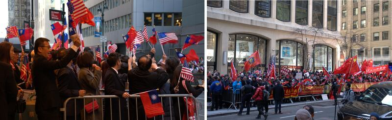
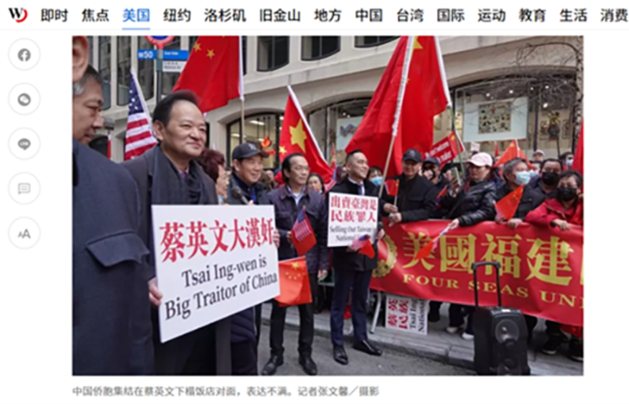
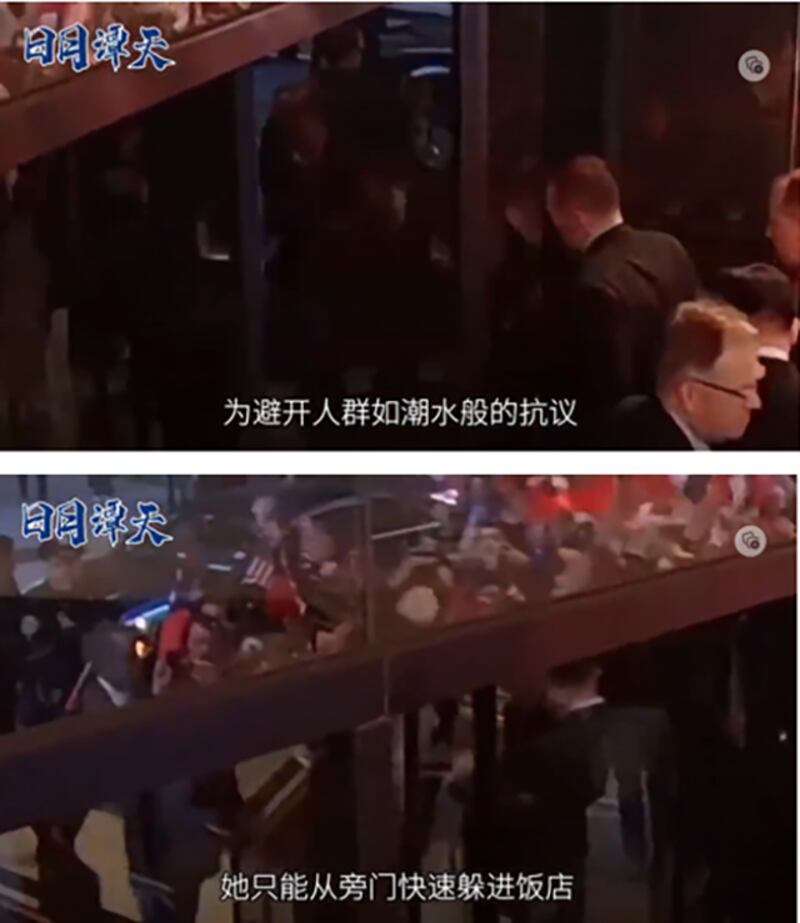
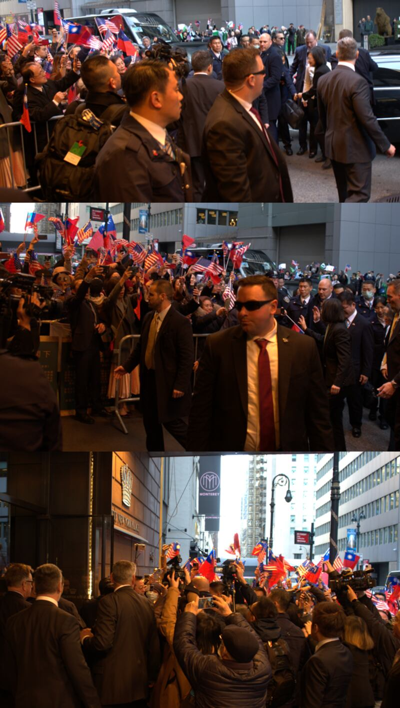
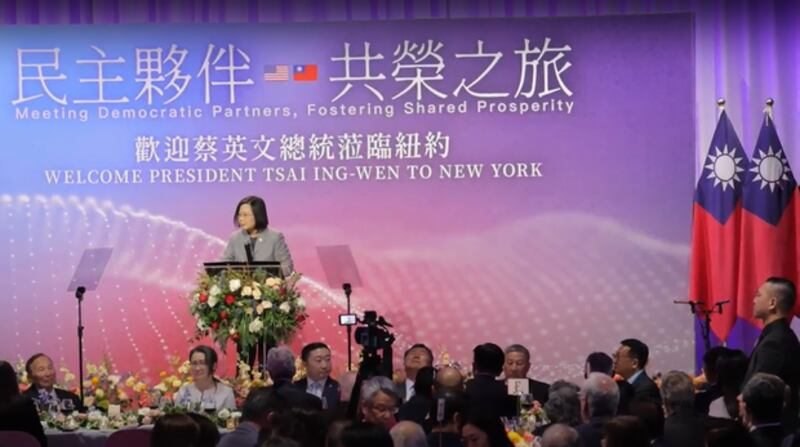
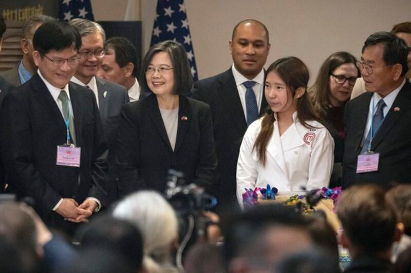

# 事實查覈｜ 過境紐約，蔡英文遭"人人喊打"嗎？

作者：艾瑪

2023.04.04 12:29 EDT

## 標籤：誤導

## 一分鐘完讀：

近日，臺灣總統蔡英文過境美國。中國中央廣播電視總檯下屬多個品牌媒體在報道中形容蔡英文在紐約遭受 “冷遇” 和 “難堪” ，比如：描寫在美華人華僑視她如 “過街鼠” ， “人人喊打” ；用視頻片段證明她爲了躲避抗議人羣 “只能從旁門快速躲進飯店” ；也引用《華爾街日報》稱她 “此行幾乎沒有出現在公衆視野中” 等等。 這些內容很快被中國日報、環球網等國家級媒體和各省級媒體機構轉載，並廣泛在中文互聯網上傳播。

而經亞洲事實查覈實驗室查證，上述描述均不符合主流媒體報道和記者現場所見，爲片面或歪曲的敘事。

## 深度解析

3月29日下午至3月31日上午,蔡英文在前往中美洲國家訪問途中,過境美國紐約。中國政府對蔡英文過境美國反應激烈,不僅強烈譴責, [還組織了在美僑團對其進行聯合抵制](https://www.rfa.org/mandarin/yataibaodao/gangtai/lam-03292023101610.html) 。

29日下午4點，蔡英文抵達紐約曼哈頓樂天酒店。亞洲事實查覈實驗室向多名現場記者瞭解到，酒店對面西南邊的空地上，聚集了大約四五百名大陸僑團組織的抗議羣衆，他們揮舞着五星紅旗，唱着紅歌，高喊着 “打倒蔡英文” “臺獨死路一條” 等口號；同時，在酒店門口東側南邊和北邊的區域內，聚集了大約一兩百位歡迎蔡英文的僑民，他們舉着青天白日旗，高喊着 “臺灣加油” “中華民國萬歲” 等口號。

3月29日下午蔡英文下榻酒店東側（左圖）和西側（右邊圖）的兩派民衆 圖：RFA

兩派民衆時不時以言語抗衡,用口號角力,多名紐約警察和特勤人員在中間維持秩序,沒有再發生 [2019年蔡英文過境紐約時發生的衝突事件](https://www.voachinese.com/a/FIGHT-TSAI-NY-20190713/4998502.html) 。

然而,在中國大陸媒體的報道中,卻只有反對者一邊的聲音和圖像。比較有代表性的口徑是把蔡英文形容爲 ["人人喊打"的"過街老鼠"](https://baijiahao.baidu.com/s?id=1761980855556105203&wfr=spider&for=pc)

3月29日下午3點左右，大陸僑團組織的示威羣衆到達蔡英文下榻的酒店，在酒店街對面表達抗議 《世界日報》報道截圖

《世界日報》記者張文馨拍攝的這張照片被央視旗下" [看臺海](https://mp.weixin.qq.com/s/bhH3gBFIuHAB1NR318xR8Q) "" [日月譚天](https://news.cctv.com/2023/04/03/ARTI8DJdtdrwb2Gz5aaz9Caa230403.shtml) ",人民日報旗下 [環球網](https://taiwan.huanqiu.com/article/4CHgtZRrlcb) 等多個媒體平臺不具名轉載,作爲蔡英文遭遇華人華僑抵制的證據之一。但《世界日報》 [該條新聞](https://www.worldjournal.com/wj/story/121469/7066052?from=wj_maintab_cate&zh-cn) 還同時發佈有多張對立陣營民衆熱情歡迎蔡英文的照片,大陸媒體並沒有採用。

## 蔡英文從旁門快速躲進飯店？

在央視新媒體賬號"日月譚天"廣爲流傳的視頻節目 [《"過境"美國的蔡英文何以成了"過街鼠"》](https://mp.weixin.qq.com/s/-ShRYQbHOi0y7K2rEFo9LQ) 中,有一段蔡英文及其隨行人員快速進入樂天酒店的視頻,對應的配音解說詞是:"爲避開人羣如潮水般的抗議,她只能從旁門快速躲進飯店"。

“日月譚天”報道截圖

然而，亞洲事實查覈實驗室通過考察酒店實地並結合現場完整視頻，發現蔡英文進入的樂天酒店大門是其正門，而且她也沒有躲避人羣。相反，她在酒店門口下車後，先是向酒店門口歡迎她的民衆揮手致意，隨後主動走近人羣，與多人握手後，在人羣的簇擁中走進酒店。

“日月譚天”的節目雖然剪掉了這段視頻中她與歡迎她的民衆握手的前半段，但從後半段反光的玻璃門上，依然可以看到人羣中有多面中華民國國旗。

被“減掉”的前半段情景：蔡英文下車後主動走向民衆，在簇擁下進入酒店 圖：RFA

## 蔡英文幾乎沒有出現在公衆視野？

《華爾街日報》中文網 [3月31日的報道](https://cn.wsj.com/articles/%E8%94%A1%E8%8B%B1%E6%96%87%E7%BE%8E%E5%9C%8B%E4%B9%8B%E8%A1%8C%E5%88%BB%E6%84%8F%E4%BF%9D%E6%8C%81%E4%BD%8E%E8%AA%BF-284c14cc) 稱,"蔡英文美國之行刻意保持低調,"此行期間幾乎沒有出現在公衆視野中"。值得注意的是,該文章翻譯自《華爾街日報》 [英文版](https://www.wsj.com/articles/taiwan-leaders-u-s-visit-is-purposely-low-key-f3f5b1ef)  [。但將原文中涉及臺灣"總統"(president)的部分都按照中國官方的習慣對應翻譯爲"臺灣領導人"。](https://www.wsj.com/articles/taiwan-leaders-u-s-visit-is-purposely-low-key-f3f5b1ef)

另外，該英文原文使用的措辭則是“蔡英文總統大部分時間都不太出現在公衆視野中”（President Tsai Ing-wen is keeping largely out of the public eye.）， 與中文表達的“幾乎沒有出現在公共視野中”有一定差別。

亞洲事實查覈實驗室通過追溯蔡英文紐約之行的軌跡和訪問現場記者及民衆,發現蔡英文過境期間的三天兩晚中,參加了多個公開活動, 其中,她在29日晚和30日全天都有安排活動。29日晚的僑宴有700人蔘加,也有媒體出席。蔡英文在宴會上發表了講話。 [她在演講中使用英文、國語和閩南話,與來賓和鄉親們輕鬆互動](https://www.rfa.org/mandarin/Xinwen/15-03292023231926.html) 。

蔡英文在僑宴上發言 圖：RFA

30日上午，她來到了布魯克林與臺裔青年創業者們座談，臺灣土特產店 “雲海嚴選” 的合夥人林思妤告訴亞洲事實查覈實驗室，蔡英文嚐了他們店的鳳梨乾，傾聽了他們講述自己如何幫助臺灣農產品走出去的故事。當蔡英文跟他們在咖啡廳座談完了走出來之後，也與現場等待她的媒體和民衆互動，大家一起豎起大拇指喊 “臺灣No.1” 。

30日中午，蔡英文又到了臺北駐紐約經濟文化辦事處出席與友邦駐聯合國代表的酒會，並與臺裔 “小廚神” 朱如茵及赴紐約參展的插畫家鍾逸婷、張雅晴互動。

在她的行程中，其中只有30日晚在哈德遜研究所的活動是閉門性質，沒有媒體參加。

蔡英文在30日下午參加臺北駐紐約經濟文化辦事處的活動 圖：美聯社

美國衆議院議長麥卡錫辦公室本週一證實，蔡英文返程過境加州時，麥卡錫（Kevin McCarthy）將與她會面。這將是臺灣的總統首次與美國衆議院議長在美國本土會面。

## 結論：

蔡英文在過境美國的時候，沒有召開新聞發佈會，也沒有接受任何記者的專訪，確實保持了低調。但與中文媒體所描述的“遭冷遇”和“如過街老鼠”的情況也相去甚遠。她過境紐約期間的活動確實遭到了一部分僑民的激烈抵制和反對，但同時也受到了另外一部分僑民的熱情歡迎，她也曾多次在公共場合出現併發言。因此，部分媒體稱她如“過街鼠”一般，在美國遭到了“人人喊打”的”過街鼠”狀態，是爲誤導讀者的不準確信息。

*亞洲事實查覈實驗室(* *Asia Fact Check Lab)是針對當今複雜媒體環境以及新興傳播生態而成立的新單位,我們本於新聞專業,提供正確的查覈報告及深度報道,期待讀者對公共議題獲得多元而全面的認識。讀者若對任何媒體及社交軟件傳播的信息有疑問,歡迎以電郵*  *[afcl@rfa.org](http://afcl@rfa.org/)*  *寄給亞洲事實查覈實驗室,由我們爲您查證覈實。*

[Original Source](https://www.rfa.org/mandarin/shishi-hecha/hc-04042023121033.html)