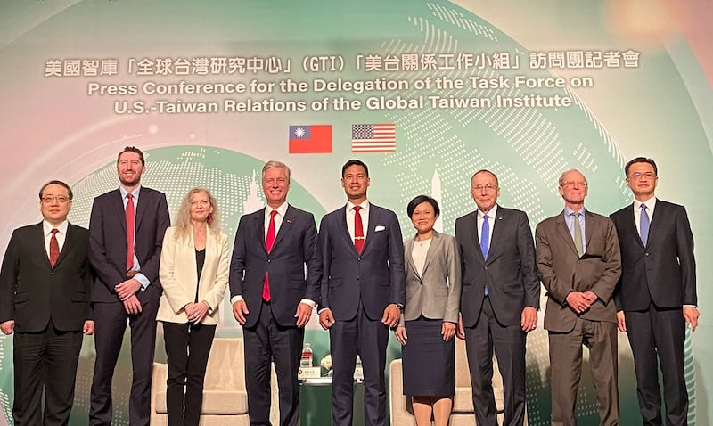

# 事實查覈｜白宮前高官鼓吹“毀臺積電”計劃嗎？他的原話是什麼？

作者：莊敬

2023.04.07 12:08 EDT

## 標籤：去脈絡、誤導

## 一分鐘完讀：

前白宮國安顧問歐布萊恩（Robert O'Brien）三月底訪臺，並獲臺灣的總統蔡英文頒授勳章，中國外交部評論稱：民進黨當局給這種鼓吹“毀臺”計劃的人授勳，表明“賣臺”纔是真。歐布萊恩被外界貼上“鼓吹毀臺”標籤，主因他訪臺前曾於一場論壇表示，他認爲若中國侵臺，臺灣半導體產業恐難完好無損；但他的說法被錯誤報道成“若中國侵臺，美國將摧毀臺灣的半導體產業”。

亞洲事實查覈實驗室在詢問歐布萊恩，以及檢視論壇完整影片後，認爲歐布萊恩在論壇的發言雖可能引起誤會，但當事人已多次澄清，中國官方、官媒卻持續指控歐布萊恩爲“鼓吹毀臺計劃的人”，甚至稱民進黨當局支持“毀臺”，屬於誤導言論。

## 深度解析：

歐布萊恩3月13日參與智庫蘇凡中心(The Soufan Center)在卡達首都杜哈舉行的"全球安全論壇",與美國新聞網站Semafor創始總編輯克萊門斯(Steve Clemens)對談。會後,克萊門斯於 [Semafor報導中](https://www.semafor.com/article/03/13/2023/the-us-would-destroy-taiwans-chip-plants-if-china-invades-says-former-trump-official)稱歐布萊恩說,若中國成功入侵臺灣,美國將摧毀臺灣先進的半導體產業,"美國及其盟友永遠不會讓那些工廠落入中國手中"。

["商業內幕"(Business Insider)](https://www.businessinsider.com/us-would-destroy-taiwan-semiconductor-factories-avoid-china-trump-adviser-2023-3)等美國媒體,以及許多臺灣、中國媒體基於Semafor的文章跟進報導,再指歐布萊恩宣稱美國寧願摧毀臺積電,也不容讓半導體產業若入中國之手。相關報導再度掀起"毀臺論"、"疑美論",國民黨前立委 [蔡正元在臉書發文](https://www.chinatimes.com/realtimenews/20230314004848-260407?chdtv),聲稱"看來摧毀臺灣是美國兩黨的共識"。

## 完整影片公開 歐布萊恩在論壇說了什麼？

相關報導引發熱烈討論,但蘇凡中心一直沒有公開歐布萊恩與克萊門斯對話的 [完整影片](https://www.youtube.com/watch?v=xPe7kqYg67w&list=PLQpNt6D4P3-vszulZ65qQtIr7iPzonPaL&index=30),直到4月6日才上傳公開。亞洲事實查覈實驗室檢視影片發現,相關段落是克萊門斯先問,若中國想要掌控整個半導體制造能力,美國會讓這件事發生嗎?歐布萊恩回答,若中國控制檯積電的工廠與設施,將讓它得以控制世界經濟,而那種情況絕對不會發生。

前白宮國安顧問歐布萊恩（左4）率團訪臺，24日在臺舉行記者會，再度表明美國無意摧毀臺灣。 (亞洲事實查覈實驗室記者攝影)

歐布萊恩說，“我的意思是，美國和它的盟友永遠不會讓那些工廠落入中國手中，即便他們成功入侵臺灣。你會見到和法國艦隊類似的情況。當維希法國向德國投降時，英國人並未允許法國艦隊維持原狀，因爲那可能落入德國手中而改變大西洋戰役的實力平衡。”

克萊門斯說，“他們把艦隊炸燬了！”

歐布萊恩說，“那艦隊被摧毀了，當時邱吉爾流着淚走進英國下議院，他可是位親法人士，因爲那是他在戰爭中所做的最困難的決定......再說一次，我認爲會有一個非常類似的局面。”

克萊門斯接着問，“你的意思是，它們將消失？你的意思是，若中國成功取得臺灣，那些設施和生產能力將消失？”

“我無法想像它們會完好無損。”歐布萊恩說。

## 報導引誤會 歐布萊恩即澄清

相關報導引起熱議, [歐布萊恩3月14日即在推特發文說明](https://twitter.com/robertcobrien/status/1635548402741284864),也接受臺灣媒體 [中央社專訪](https://www.cna.com.tw/news/aipl/202303150017.aspx)表示,除了中國國家主席習近平與中共,沒有人想毀掉臺灣或入侵臺灣,任何指控美國將以某種方式摧毀臺灣或攻擊臺灣的說法,都是中共的宣傳與假訊息。

[歐布萊恩推文](https://twitter.com/robertcobrien/status/1635549964289064960)寫道,"晶片廠需要來自國外的能源、設備及技術;若中國入侵,這些全都會被阻絕。最重要的是,臺灣技術熟練的工程師、科學家級主管都將逃向自由,中國入侵永遠不會達到中國共產黨控制世界晶片市場的結果。"克萊門斯也轉發了歐布萊恩的推文。

歐布萊恩3月20日至24日率團訪臺,21日獲蔡英文頒授"特種大綬景星勳章",表彰他對臺美關係的貢獻。歐布萊恩受勳卻遭到臺灣、中國部分政治人物及媒體批評,蔡正元21日 [在臉書發文](https://www.facebook.com/tsaichengyuan/posts/pfbid0JCYAHGXmSrpsvQV4Va1yQTf2CN7x37qMPhWktapB9gu8ewGDipRS5gBULpFaYVRql)嘲諷這是"毀臺勳章",蔡英文是在獎勵歐布萊恩的毀臺主張。媒體人 [陳鳳馨在電視節目問](https://www.youtube.com/watch?v=Z2YCs7R5kYw),"是要表彰他提出炸燬臺積電的功勞嗎?"

## 中國指控"鼓吹毀臺" 歐布萊恩：假訊息攻擊

中國外交部發言人汪文斌在 [3月22日例行記者會](https://www.mfa.gov.cn/web/fyrbt_673021/202303/t20230322_11047173.shtml)回複相關提問時說:"如果我沒有記錯的話,這位美國白宮前高官不久前還聲稱,美國寧可摧毀包括臺積電在內的臺灣半導體工廠,也不會讓這些工廠落到大陸手中。民進黨當局給這種鼓吹『毀臺』計劃的人授勳,只能表明他們嘴上說的『愛臺』是假,賣臺纔是真。"

歐布萊恩3月24日在臺灣舉行的 [記者會](https://www.youtube.com/watch?v=EY_v2m4emwo)上回應亞洲事實查覈實驗室記者的提問。對於中國外交部的說法,歐布萊恩認爲,這是中共針對他的假訊息攻擊;他並重申,唯一威脅毀臺的是由中國共產黨所領導的中國,美國絕對不會想入侵臺灣,美國是要保衛臺灣。

有關他在蘇凡中心全球安全論壇上的發言，歐布萊恩再度說明，他之所以認爲臺灣半導體產業不可能在中國入侵後存活，理由包括半導體產業運作需要大量能源與電力，以及掌握技術的工程師、科學家不會想生活在專制極權的中國共產社會；另一方面，來自美國、荷蘭、日本等國在設計、工具、智慧財產權方面的協助，也絕不會想提供給中共。

歐布萊恩說，他在該場論壇上所要強調的是中國對臺灣的威脅；“唯一可能摧毀臺灣或臺灣半導體產業的敵人絕對是中國跟中國共產黨，絕對不會是美國。”

## 結論：

歐布萊恩在“全球安全論壇”談臺積電重要性時，舉了二戰時期英國摧毀法國艦隊的例子，可能引發聯想；但歐布萊恩並未說出“若中國侵臺，美國將摧毀臺灣的晶片廠”這句話，且在報導引起誤會後，他即透過推文、受訪、公開發言等多個管道解釋其論點。

亞洲事實查覈實驗室認爲，歐布萊恩的發言有其脈絡和前提，中國官方、官媒、部分臺灣媒體人持續宣稱歐布萊恩主張毀臺，是無視當事人發言脈絡，刻意誤導受衆的行爲。

*亞洲事實查覈實驗室(* *Asia Fact Check Lab)是針對當今複雜媒體環境以及新興傳播生態而成立的新單位,我們本於新聞專業,提供正確的查覈報告及深度報道,期待讀者對公共議題獲得多元而全面的認識。讀者若對任何媒體及社交軟件傳播的信息有疑問,歡迎以電郵*  *[afcl@rfa.org](http://afcl@rfa.org/)*  *寄給亞洲事實查覈實驗室,由我們爲您查證覈實。*

[Original Source](https://www.rfa.org/mandarin/shishi-hecha/hc-04072023120541.html)