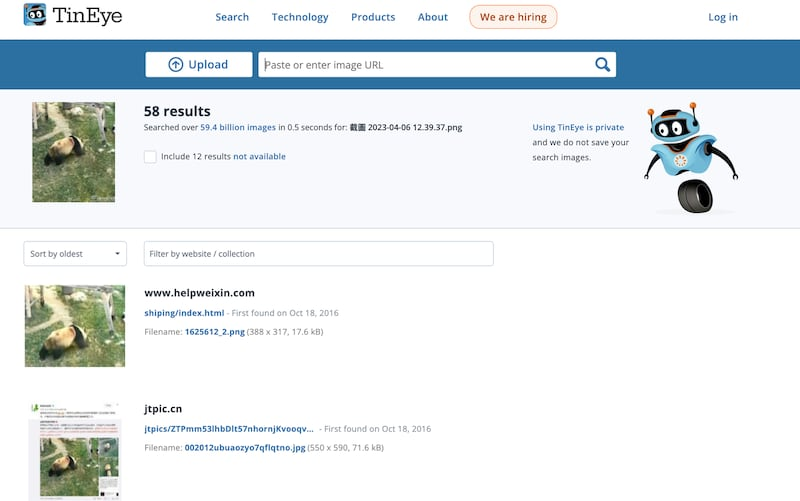
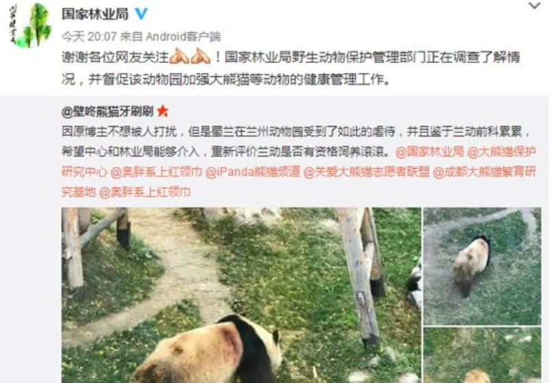
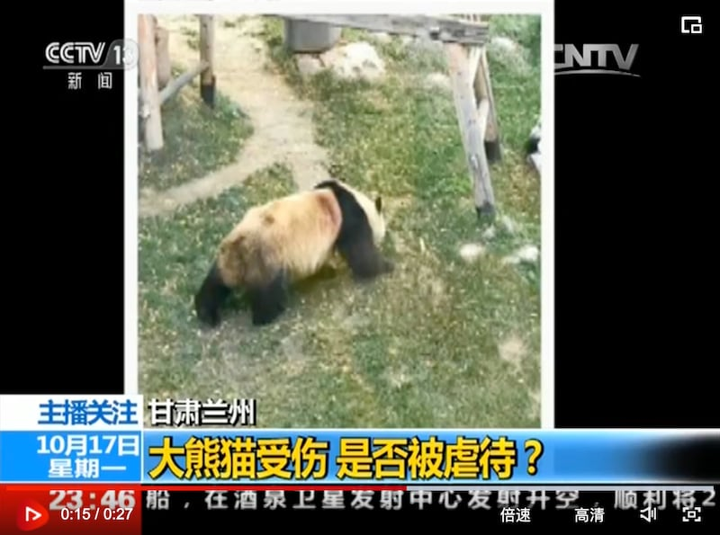
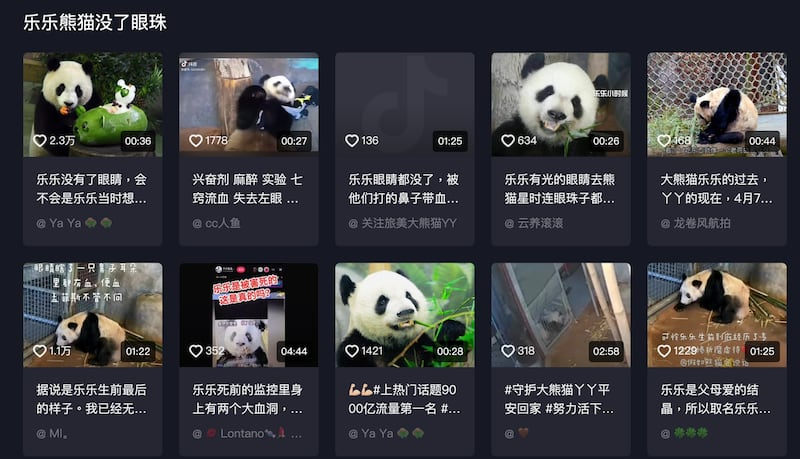
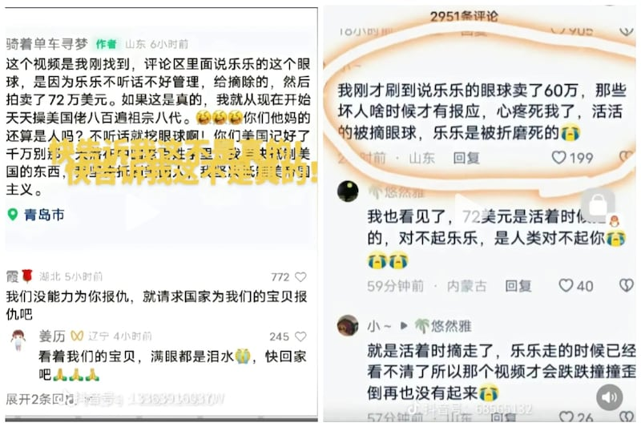
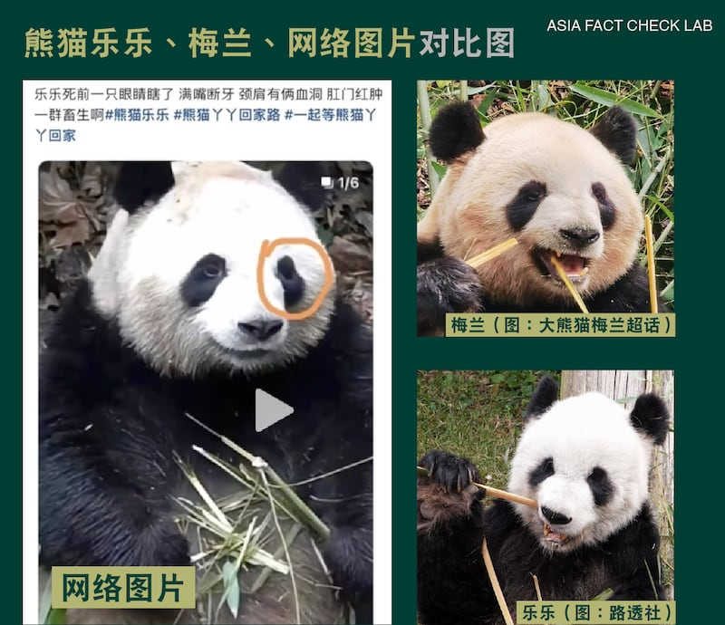
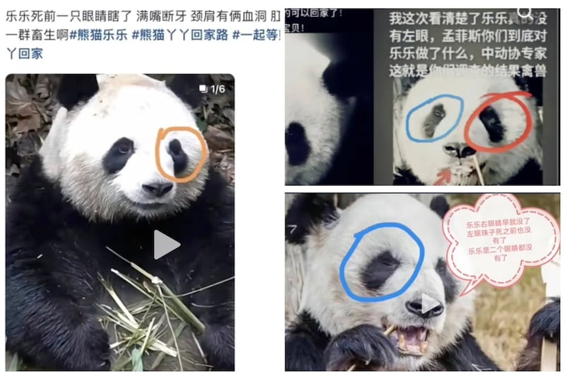

# 事實查覈｜大熊貓樂樂生前在美國遭砍傷、挖眼？

作者：董喆、沈軻

2023.04.10 18:30 EDT

## 標籤：錯誤

## 一分鐘完讀：

2003年，中國以有償方式出借兩隻年幼的熊貓給美國孟菲斯動物園，分別爲公熊貓樂樂與母熊貓丫丫 ，2013年又續約十年。去年十二月，孟菲斯動物園宣佈，預計將於2023年4月將這兩隻熊貓送回中國。

但還來不及返回中國，樂樂在2023年2月1日死亡。中國大量網民對此表達了悲憤，社交媒體上 也迅速地出現這兩隻熊貓曾被動物園虐待且營養不良的說法，甚至有人聲稱樂樂生前曾被虐待致殘。

亞洲事實查覈實驗室發現這些聲稱是虛假的，缺乏任何可信的來源。

**深度分析**:

## 樂樂遭保育員砍傷？

抖音及微博上提及樂樂遭虐的短視頻中，多采用了同一張圖片作爲證據，圖片的字幕提到“國寶大熊貓樂樂，被美國孟菲斯（動物園）用刀砍傷，血跡斑斑”，圖片中間是一隻熊貓背向鏡頭，上下背脊旁疑似各有一處傷口。

然而,在微博上同時也有人闢謠。一名擁有61.6萬粉絲的科學科普博主"FabuLous 樓長" [發帖](https://weibo.com/5835261195/MAGygpxJJ#repost)指出:所謂被刀砍的"受虐"照片主角不是樂樂,而是蘭州動物園飼養的大熊貓 [蜀蘭](https://pandanews.org/the-pandas/407_shu-lan.html)。

亞洲事實查覈實驗室爲了覈實哪一方的說法爲真，先以百度搜圖找到了視頻中的大熊貓受傷圖，接著將未壓字幕的原圖以溯源工具Tineye查詢，發現這張照片最早出現在2016年10月18日，以時間軸來看，遠早於樂樂疑似遭虐視頻發佈的時間。

Tineye查詢截圖

接着確認視頻中的熊貓身份，Tineye的搜尋相關結果中有一則中國國家林業局的微博貼文，可發現這張照片是由網友提供的，是大熊貓蜀蘭疑似在中國蘭州動物園遭虐的畫面。

中國國家林業局官方微博截圖

亞洲事實查覈實驗室繼續以"蜀蘭""蘭州動物園"作爲關鍵字進行搜尋,發現中國中央電視臺新聞頻道曾在2016年10月17日有 [相關報道](https://tv.cctv.com/2016/10/18/VIDEY4jmGsVUOihetHUYTEfm161018.shtml)。

央視報道截圖（央視網往期節目視頻）

經過雙重驗證可證實，視頻中據稱樂樂遭砍的照片，實際是2016年蘭州動物園熊貓蜀蘭的受傷照，是移花接木的錯誤訊息。

## 樂樂左眼遭挖，賣了72萬美元？

除了出現樂樂遭砍的謠言外，抖音上也瘋傳樂樂的左眼遭挖，眼珠以72萬美金高價被賣出。

抖音上有很多討論大熊貓樂樂的眼睛遭挖去變賣的視頻（抖音截圖）

亞洲事實查覈實驗室從抖音上的描述中，發現了兩大疑點：第一是眼睛變賣的價格說法不一，有人說是72萬美金，也有60萬美金的說法，但並未有任何權威單位發佈這項消息。第二則是遭挖的究竟是右眼、左眼還是雙眼，也是衆說紛紜。

中國動物園協會長期在官網上發佈與孟菲斯動物園的 [項目合作進展](https://docs.google.com/document/d/1608KprCfxYpUg0M8NfFjROzMkxDP66dI0Kr8nL7bm1g/edit)信息,從樂樂歷次的各項身體檢查記錄看,它從未有過眼睛缺失的記錄,也沒有任何當地遊客發佈相關質疑信息,網上盛傳的"挖眼變賣"指控均從中國境內發出,且爲多次轉發的二手資訊。

此外，中國大熊貓專家與美方共同完成樂樂的屍體解剖，初步死因確定是心臟病變，並未提及任何遭挖眼的情形。

網傳"挖眼變賣"指控截圖

科普博主"FabuLous 樓長"也對此 [闢謠](https://weibo.com/5835261195/MALD7yi8f?pagetype=profilefeed),指出網上流傳的挖眼照(下圖左一)的主角,其實是中國都江堰的大熊貓梅蘭,且看似無眼只是照片陰影造成。

網傳圖片與梅蘭和樂樂的照片對比

亞洲事實查覈實驗室以樂樂、梅蘭以及網傳照進行比對發現，不同大熊貓的臉型與眼周黑毛的特徵差異明顯。網傳圖中的熊貓黑眼圈形狀與梅蘭接近，左眼有明顯凹陷，右眼較圓滑，樂樂的黑眼圈則較爲對稱。從頭型看，網傳圖的頭型較爲圓扁，兩側臉頰較豐腴，也與梅蘭接近，樂樂的頭則爲橢圓形，雙頰消瘦。

雖然，單憑照片不能斷定網傳圖就是熊貓梅蘭，但與梅蘭比起來，網傳圖片中熊貓的頭型與黑眼圈都與樂樂相差甚遠。網傳圖既非樂樂，也不足以判斷其眼球缺失。

亞洲事實查覈實驗室網逐一驗證網傳的“挖眼照”，每隻熊貓的頭型、眼周黑色毛髮分佈皆不同，極有可能是用各種熊貓照片拼湊而成，畫面解析度都不高，更無從判斷是否有眼球遭挖除的情形。

網傳樂樂不同的"挖眼照"

## 結論：

孟菲斯動物園及其合作組織中國動物園協會在今年與去年都發表了相關聲明，聲明指出“中國動物園協會相信，孟菲斯動物園的大熊貓正在接受最高品質的照護”。儘管如此，仍有輿論質疑樂樂與丫丫受到虐待，批評者中不僅有中國國內的大量網民，也有美國動物權利組織“In Defense of Animals”（IDA）等機構。

儘管大熊貓受到的照護是否得當的問題仍有爭議，但亞洲事實查覈實驗室認爲，網傳的美國動物園虐待大熊貓的指控則是虛假的。如孟菲斯動物園保育員砍傷樂樂的指控，以及動物園將其眼珠挖掉變賣的指控。

*亞洲事實查覈實驗室（Asia Fact Check Lab）是針對當今複雜媒體環境以及新興傳播生態而成立的新單位，我們本於新聞專業，提供正確的查覈報告及深度報道，期待讀者對公共議題獲得多元而全面的認識。讀者若對任何媒體及社交軟件傳播的信息有疑問，歡迎以電郵afcl@rfa.org寄給亞洲事實查覈實驗室，由我們爲您查證覈實。*

[Original Source](https://www.rfa.org/mandarin/shishi-hecha/hc-04102023172711.html)