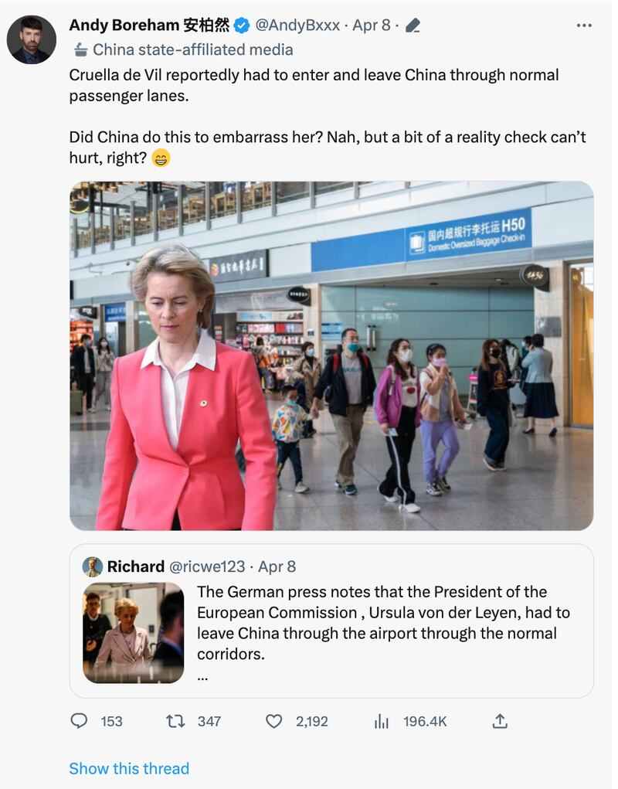
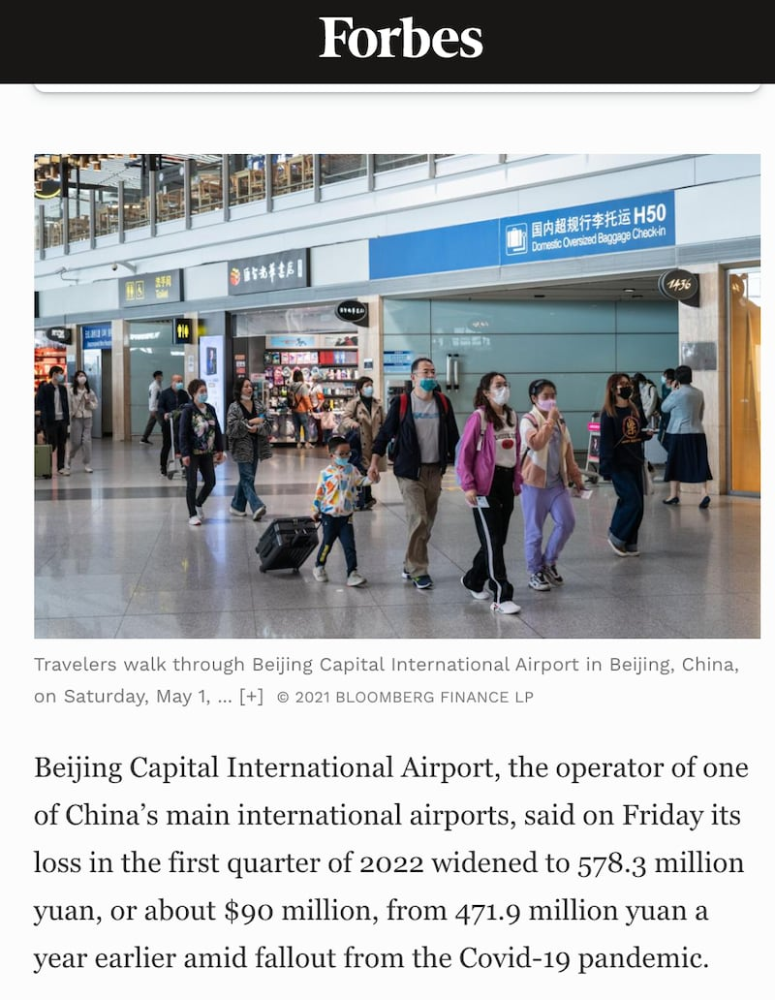
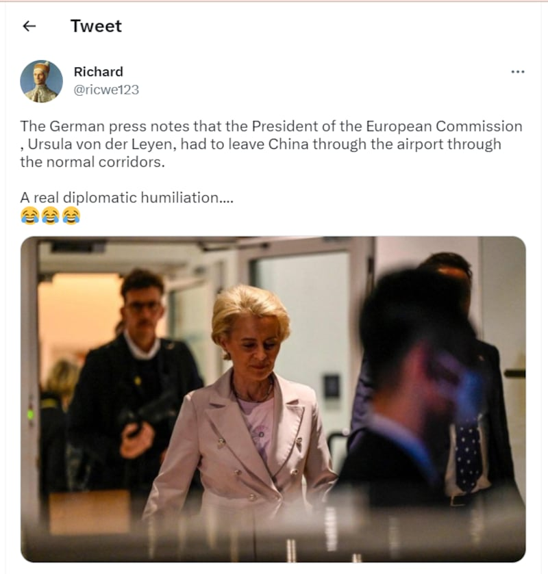
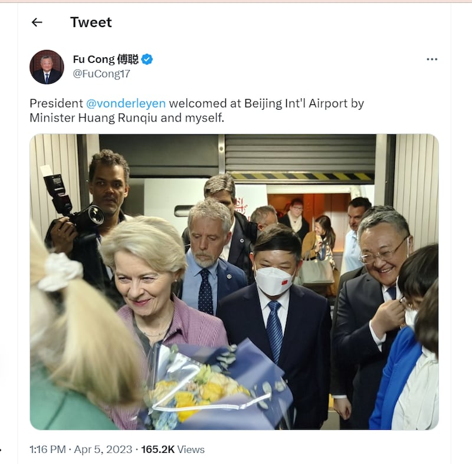
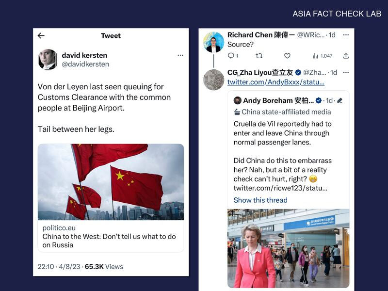

# 事實查覈｜馮德萊恩走普通旅客通道？訪華遭冷遇？

作者： 鄭崇生

2023.04.11 14:55 EDT

## 標籤：虛假、誤導

## 一分鐘完讀：

法國總統馬克龍（Emmanuel Macron）4月5日至7日訪華的同一時間，中國也迎接了歐盟委員會主席馮德萊恩（Ursula Von der Leyen）到訪，兩人在中國受到的不同待遇，除了在中文世界廣爲討論外，在德文與英文世界中，有不少虛假和誤導信息也隨之流傳。

推特認證信息爲專欄作家,在《上海日報》工作的安柏然(Andy Boreham)在其 [推特上](https://twitter.com/AndyBxxx/status/1644873515244617728?s=20)發文暗示馮德萊恩是走一般旅客進出通道,中國沒有給她任何特殊外交禮遇,並登出一張她獨自在機場的照片,說這是"事實查覈"(reality check)。

亞洲事實查覈實驗室發現，這張照片是虛假的合成照片，安柏然等傳播的有關馮德萊恩未受到外交禮遇，需要走機場的普通通道的信息和照片，是虛假的。而許多媒體以馬克龍的高級別國事訪問和馮德萊恩的一般級別訪問所受的待遇相對比，得出馮德萊恩受“冷落”的結論，也有誤導之嫌。

## 深度分析：

“主席（馮德萊恩）不是走一般通關通道，她照慣例得到貴賓待遇。”

歐盟委員會發言人馬莫爾（Eric Mamer）回覆亞洲事實查覈實驗室的詢問明確指出，馮德萊恩受到了正規的禮遇。

然而因爲訪華之前的強硬言論，馮德萊恩此次訪問受到了各方關注，從推特到主流媒體，很多討論稱，她此次訪華收到了中國方面的“冷遇”，有一些說法甚至表示，她連基本的機場外交禮遇都沒有。

## 馮德萊恩走普通旅客通道？相關照片虛假、誤用

“據報導，庫伊拉須走一般旅客通道進出中國。這是中國在爲難她嗎？不妨來點事實查覈。”

（原文：Cruella de Vil reportedly had to enter and leave China through normal passenger lanes. Did China do this to embarrass her? Nah, but a bit of a reality check can’t hurt, right?）

安柏然用電影反派人物黑白魔女“庫伊拉”（Cruella de Vil）嘲諷名字發音相似的馮德萊恩，暗示對中國立場較爲強硬的馮德萊恩訪華行未受到外交禮遇，作爲“事實查覈”，他登出了一張馮德萊恩現身北京機場大廳的照片，但亞洲事實查覈實驗室發現，這是一張合成圖像。

在上海日報工作的安柏然發佈圖片，暗示馮德萊恩沒有受到外交禮遇。（推特截圖）

根據溯源工具Tin Eye的 [搜尋](https://tineye.com/search/45c578a8fa16b8bd057da64d3293e204e7f8bbbd?sort=score&order=desc&page=1)結果,安柏然的推文附圖, [是以美國福布斯網站(Forbes)](https://www.forbes.com/sites/russellflannery/2022/04/30/beijing-capital-airport-losses-since-start-of-pandemic-hit-735-million/?sh=4dfe2c7d4435)刊登彭博財經於2021年拍攝北京機場大廳畫面爲底圖,再合成馮德萊恩的圖像,但他完全沒有提到這是合成示意圖的說明。

安柏然發佈的圖片爲一張普通新聞圖片作爲背景合成而來（福布斯網站新聞截圖）

[據介紹](https://www.newsroom.co.nz/the-kiwi-journalist-defending-the-ccp),安柏然是新西蘭人,爲中共上海市委宣傳部主管的英文報刊《上海日報》工作多年,在推特上小有名氣。批評者稱他是爲中國大外宣服務,但他在推特上自述"不是吹捧中國的投機者,而是講述事實的媒體人 "。至截稿,他沒有回覆亞洲事實查覈實驗室的詢問與置評請求。

另有一些其他賬號也稱中國官方只把馮德萊恩視爲普通來訪民衆，沒有提供任何外交禮遇，並移花接木，使用不同場合的照片作爲配圖。

安柏然發表附加合成照片的推文時,還轉發了以爲一則轉發名叫Richard的推特網民 [發文](https://twitter.com/ricwe123/status/1644749375271305225?s=20), Richard 推文所發的照片中,也展示馮德萊恩"獨自一人"的場景,然而,這張來自法新社的圖片,是馮德萊恩結束在北京的記者會後,離開歐盟駐中國代表團所在地,而並不是離開機場的場景。然而這張照片則被錯用成馮德萊恩遭到"真正的外交恥辱"的證據,在英文世界中快速傳播。

網絡傳言誤用馮德萊恩來開記者會的圖片作爲她沒有收到禮遇的證據（推特截圖）

真實的情況是什麼樣的?中國駐歐盟使團團長 [傅聰](https://twitter.com/FuCong17/status/1643663984103391248)推特賬號刊出5日當天的場景。 傅聰與中國生態環境部長黃潤秋到機艙口送花、歡迎馮德萊恩抵達北京。不像馬克龍是搭乘法國專機,馮德萊恩此行沒有像馬克龍那樣搭乘專機,確實與一般民衆一樣出機艙後、走上空橋。然而,傅聰發佈的照片顯示,中國官員已經在空橋出口迎接。中國沒有給馮德萊恩任何外交禮遇的說法,明顯有誤。

中國駐歐盟使團團長傅聰表示，自己去機場歡迎了馮德萊恩。（推特截圖）

## 馬克龍與馮德萊恩禮遇大不同？主流媒體推波助瀾錯誤信息

馮德萊恩在訪問前夕發表對中國立場較爲強硬的談話，包括中國在烏克蘭戰爭上的立場、歐盟對中國經濟依賴去風險化的言論，讓許多歐洲主要媒體都聚焦這位歐盟高階官員罕見地與歐盟單一成員國元首同時訪問中國，也難以避免地將中國接待兩人的規格做了比較。

但一些報導中卻沒有提到馬克龍這趟中國行是外交最高級別的“國事訪問”（State Visit），而馮德萊恩是則是一般級別的“訪問”（Visit）。按照國際外交慣例，國事訪問的接待規格是有不同。

中國許多自媒體人引用德國媒體 [《柏林日報》報導](https://www.berliner-zeitung.de/wirtschaft-verantwortung/ursula-von-der-leyen-muss-in-china-durch-ausgang-fuer-normale-passagiere-li.336085)馮德萊恩在華遭"冷淡對待",報導標題提到馮德萊恩下飛機使用普通旅客的出口,是遭冷遇。

《柏林日報》內文引述的則是 [歐洲版《政客》(Politico)雜誌](https://www.politico.eu/article/china-divide-rule-eu-france-unity-ursula-von-der-leyen-emmanuel-macron-xi-jinping/),原始報導指出,"法國總統馬克龍受到紅地毯的全規格接待,包括國宴、天安門廣場上的閱兵式與禮炮歡迎。 馬克龍專機降落時,中國外長親自迎接。而當歐盟委員會主席馮德萊恩抵達北京,迎接她的是生態環境部長——在一般乘客出口處。"

上述兩篇報導都沒有提到馬克龍的訪問性質是國事訪問,而安柏然去脈絡化的發文,更有中國外交官轉發,中國駐加爾各答總領事 [查立友](https://twitter.com/ZhaLiyou/status/1645094969722413058?s=20)回覆推特網友查詢馮德萊恩在中國"排隊等通關"的說法時、轉發安柏然的推文, 爲對馮德萊恩"受冷遇"的說法背書。

網絡傳言稱馮德萊恩受到"羞辱"，中國外交官回覆時，用安柏然的合成照片作爲證據。（推特截圖製圖）

## 結論：

對照中國外交部發言人汪文斌7日在例行記者會上評價，馮德萊恩這次訪華，是繼去年12月歐洲理事會主席米歇爾後、中國與歐盟間又一次重要的戰略溝通。馮德萊恩此次訪問，收到了相應的外交禮遇，但一些網絡傳言稱她需要走普通旅客通道，是錯誤信息。而一些媒體將她的待遇與進行更高級別國事訪問的馬克龍做比較，得出她受“冷遇”的結論，也有誤導之嫌。

*亞洲事實查覈實驗室(* *Asia Fact Check Lab* *)是針對當今複雜媒體環境以及新興傳播生態而成立的新單位。我們本於新聞專業,提供正確的查覈報告及深度報道,期待讀者對公共議題獲得多元而全面的認識。讀者若對任何媒體及社交軟件傳播的信息有疑問,歡迎以電郵* *afcl@rfa.org* *寄給亞洲事實查覈實驗室,由我們爲您查證覈實。*

[Original Source](https://www.rfa.org/mandarin/shishi-hecha/hc-04112023143402.html)