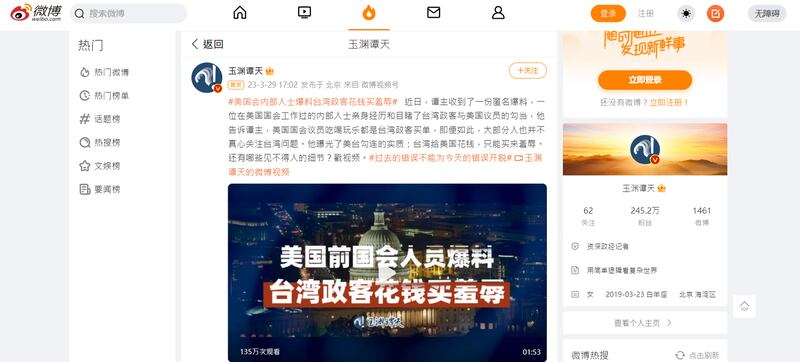
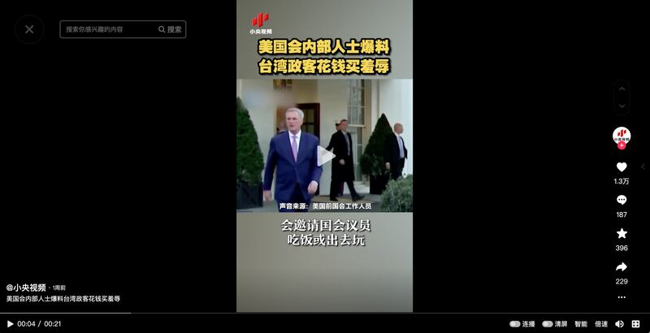

# 事實查覈｜美國前國會人員爆料臺灣政客花錢買羞辱？

作者：莊敬

2023.04.13 16:52 EDT

## 標籤：誤導

## 一分鐘完讀：

臺灣總統蔡英文3月29日出訪並過境美國。出訪當天，中國中央電視臺"玉淵譚天"發佈了一條由三段錄音組成的段視頻，字幕標記聲音來源爲"美國前國會工作人員"。這三段錄音爆料了臺灣政客試圖買通美國國會議員的"內幕"，並建立起社媒話題"#美國會內部人士爆料臺灣政客花錢買羞辱#"，一天內累積觀看次數破百萬。

亞洲事實查覈實驗室通過採訪熟悉臺美關係的人士及檢視相關資料，發現這位匿名爆料者所說的部分內容並不屬實；然而，環球網、中通社等許多華文媒體在3月底至4月初期間，接力轉發這則未經查證的單信源消息，誤導其受衆。

"玉淵譚天"微博帳號截圖

## 深度解析：

蔡英文3月29日至4月7日出訪，前往瓜地馬拉、貝里斯兩個邦交國，途中過境美國紐約、洛杉磯，在美國停留時會晤聯邦衆議院議長麥卡錫（Kevin McCarthy）等國會議員。

"玉淵譚天"3月29日在 [微博](https://weibo.com/tv/show/1034:4884672912752705?from=old_pc_videoshow)等平臺發佈一段音頻,"譚主"聲稱收到一份匿名爆料,"一位美國國會的內部人士親身經歷和目睹了臺灣政客與美國議員的勾當"。在1分53秒的音頻中,經變聲處理的"美國前國會工作人員"以英文發言講了三條爆料信息:

一“臺政客沒有渠道接觸美政府高層”：對於那些很想贏得美國親臺政客支持的臺灣政客，（遊說）是一種很常見的手段，但他們自己（臺灣政客）知道進入白宮、國務院和五角大樓比較困難，所以他們選擇國會作爲突破口。

二“國會議員喫喝玩樂 臺政客買單”：一些在華盛頓特區活動的（臺灣）政客會邀請國會議員喫飯或出去玩，或者他們甚至爲國會議員支付當地或國內甚至國際旅行的費用，以促進他們與國會議員的關係，甚至有時候臺當局會邀請國會議員訪問臺灣，並給他們高薪，甚至會爲其支付商務艙機票，給予他們高級別的待遇，甚至給他們的競選活動捐贈大筆資金。

三“大部分人不關心臺灣問題”：通常國會議員會讓立法助理會見臺灣當局說客或政客，在（國會）中心的國會議員，通常沒有足夠的時間考慮涉臺議案的內容，我想（總共）有幾百個國會議員，對臺灣問題了解的人不多，興趣也不大，他們中的大多數人會讓他們的立法助理來做這些事。

## 蔡英文出訪期間 爆料影片迅速傳播

在錄音中，爆料者並沒有說出“臺灣政客花錢買羞辱”這句話，但“譚主”以此爲標題，並標記“#美國會內部人士爆料臺灣政客花錢買羞辱#”在社媒上建立話題，許多網民跟著轉發，在微博上一天累積約120萬次觀看。

"玉淵譚天"發佈的爆料內容以聲音與字幕爲主,其視頻背景畫面並無特定的人或事物,錄音也沒有點名具體的人。而央視網的短視頻品牌" [小央視頻](https://www.douyin.com/user/MS4wLjABAAAADxxSM17aDo5GBB7mt6bHbOS2jzQpBxevn8Lh2rMkY8g?modal_id=7216227588157525283)"把它剪輯成僅21秒、配上畫面的短視頻,不僅出現蔡英文、臺灣的外交部長吳釗燮、國安會祕書長顧立雄等臺灣政治人物,還有美國衆議院議長麥卡錫等人。

中國"小央視頻"截圖

"玉淵譚天"3月29日在微博、 [抖音](https://www.douyin.com/user/MS4wLjABAAAAYOsiCanymbZvJgHxqiXAjLnY83wdCm-bZSG9b75hPxZMhD1udB-yWw_RmtennPhB?modal_id=7215896157493447993)等平臺發佈的這則短視頻引起熱議, [環球網](https://taiwan.huanqiu.com/article/4CHIUmlVA0L)、 [北京日報](https://ie.bjd.com.cn/5b165687a010550e5ddc0e6a/contentShare/5b16573ae4b02a9fe2d558f9/AP64241230e4b0e0511d887789.html)等媒體皆以"美國國會前工作人員爆料:臺灣政客花錢買羞辱"爲題進行轉載;相關音頻、視頻、文章也出現在網易、搜狐等衆多平臺。

"玉淵譚天"3月30日又在微博發佈" [獨家揭祕:#蔡英文竄美爲何遭反噬](https://s.weibo.com/weibo?q=%23%E8%94%A1%E8%8B%B1%E6%96%87%E7%AA%9C%E7%BE%8E%E4%B8%BA%E4%BD%95%E9%81%AD%E5%8F%8D%E5%99%AC%23)#"一文,同樣標記"#美國會內部人士爆料臺灣政客花錢買羞辱#",這則文章也出現在中國各大新聞網與平臺。話題延續數日, [香港中通社微博視頻號](https://weibo.com/5999251130/MzZYlhAgh)4月1日還在轉發"玉淵譚天"的爆料音頻。臺灣 [聯合報](https://udn.com/news/story/7331/7065201)等媒體也注意到相關爆料內容,但懷疑是在蔡英文出訪之際,中國官媒打輿論戰。

## 爆料內容多處不實

熟悉美臺事務、曾任美國在臺協會（AIT）臺北辦事處副處長的葛天豪（David Keegan）告訴亞洲事實查覈實驗室，民進黨和國民黨都在華府設有辦事處，致力於與白宮國安會、國務院、其它行政機構、國會建立關係；他們也幫助來訪的政治人物安排與行政部門官員及國會議員會面。

葛天豪表示，臺灣確實花錢在遊說及遊說公司上，就和其它外國政府一樣，多年來都是這麼做的；但他們這麼做並不是因爲缺乏接觸渠道，而只是爲了加強接觸。

2020年2月,當時爲副總統當選人的 [賴清德訪美](https://www.cna.com.tw/news/firstnews/202002060008.aspx)並進入白宮國安會與美方官員會談;國民黨主席 [朱立倫多次訪美](https://www.cna.com.tw/news/aipl/202206070010.aspx),最近一次是2022年到華府拜會國務院等行政部門官員。"玉淵譚天"發佈的音頻中,所謂"臺政客沒有渠道接觸美政府高層"的說法並不成立。

至於匿名爆料者所說，“美國幾百個國會議員，對臺灣問題了解的人不多，興趣也不大”。葛天豪表示，顯然參議員和衆議員都關心臺灣，也願意與來訪的臺灣高層政治人物會面，光看過去幾年支持臺灣的立法行動就知道了。

事實上,根據衆議員 [薛曼(Brad Sherman)的網站](https://sherman.house.gov/taiwancaucus),成立於2002年的"國會臺灣連線"現爲美國國會最大議員組織,致力於改善美國與臺灣的關係, [第117屆(2021-2022)國會衆院臺灣連線成員有229位](https://fapa.org/house-taiwan-caucus/); [參議院"臺灣連線"則有33名議員](https://fapa.org/senate-taiwan-caucus/)。

美國的《外國代理人登記法》（FARA）要求在美境內任何代表外國政府進行政治遊說的人士或公司，都要登記爲外國代理人，並讓遊說資訊公開透明，可在美國司法部的網站查詢相關資料。臺灣的外交部也多次說明，駐美國代表處聘用公關公司提供諮詢，並擴大對美國工作的觸角，是臺灣政府長年的一貫作法，世界各主要國家也都普遍採用，公關聘用一向嚴格符合當地國法規。

針對這次“玉淵譚天”發佈的爆料音頻，臺灣的外交部對亞洲事實查覈實驗室表示：“據瞭解，該影片是中國對其內部宣傳之用，內容不實，外界實不宜隨之起舞。”

*亞洲事實查覈實驗室（Asia Fact Check Lab）是針對當今複雜媒體環境以及新興傳播生態而成立的新單位。我們本於新聞專業，提供正確的查覈報告及深度報道，期待讀者對公共議題獲得多元而全面的認識。讀者若對任何媒體及社交軟件傳播的信息有疑問，歡迎以電郵afcl@rfa.org寄給亞洲事實查覈實驗室，由我們爲您查證覈實。*

[Original Source](https://www.rfa.org/mandarin/shishi-hecha/hc-04132023163923.html)