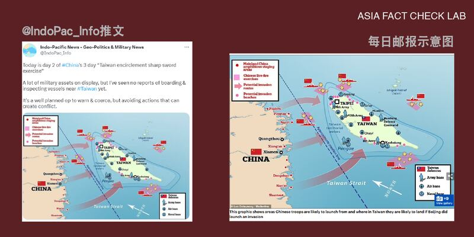
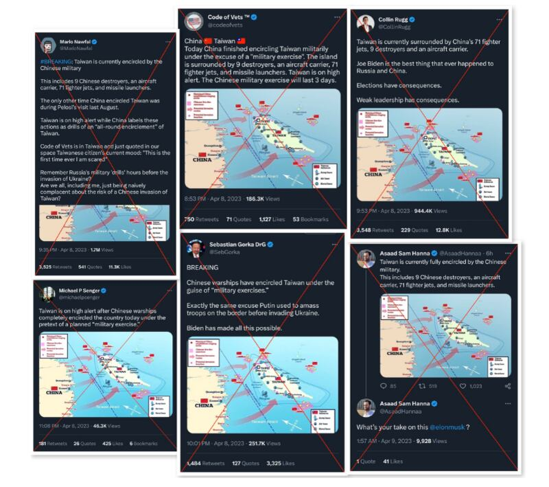
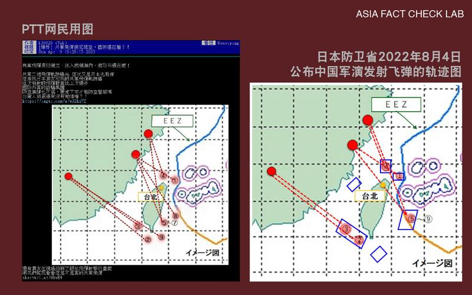
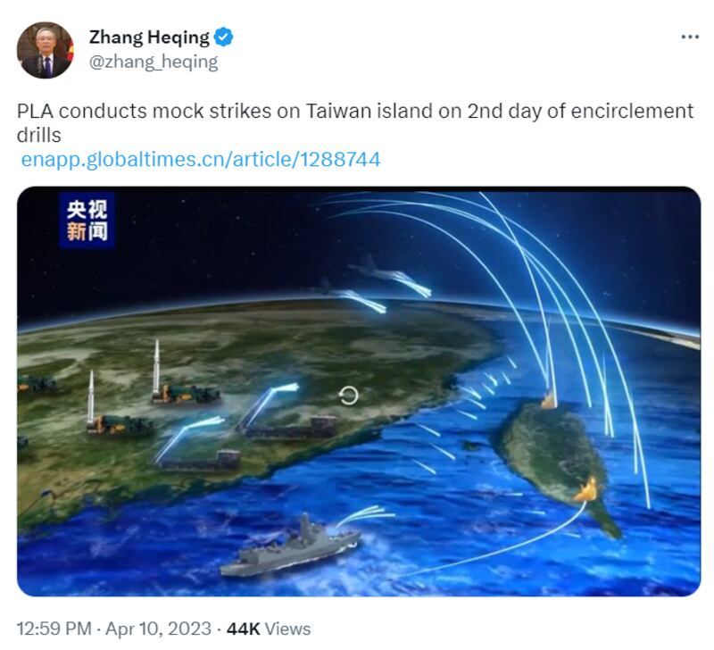

# 事實查覈｜深度 | 中國對臺軍演 不實消息滿天飛

作者：莊敬

2023.04.14 14:26 EDT

臺灣總統蔡英文3月29日至4月7日出訪，期間過境美國並會晤聯邦衆議院議長麥卡錫，中國強烈不滿，人民解放軍東部戰區在4月8日至10日進行"環臺軍演"。亞洲事實查覈實驗室注意到，在軍演期間不實消息充斥媒體和社交平臺，包括軍演一開始的"超級傳播者"，到接連不斷的虛假信息。網路安全專家相信，配合演習瘋狂傳播的不實消息，似乎意圖放大恐懼，使臺灣民衆相信中國的軍演意味着侵臺迫在眉睫。

## 超級傳播者力推舊圖 , 臺灣被中國解放軍包圍?

美國網路安全專家、曾在拜登競選團隊分析網路安全事件應對與威脅的傑基·辛格(Jackie Singh)4 月 9 日 [撰文](https://www.hackingbutlegal.com/us-based-disinfo-actors-spread-fear-about-taiwan/)指出,4月8日上午,一個在推特上擁有逾11萬7千人追蹤的賬號 ["@IndoPac\_Info"](https://twitter.com/IndoPac_Info/status/1644919261427830784) 發文引述臺灣國防部的說法,有71架共機穿越臺海中線,中共正在進行"包圍臺灣島"軍演。

這篇推文的配圖上標有示意共軍進犯臺灣路線的紅箭頭，臺灣北、東、南三側也標有共軍軍艦，整張圖呈現臺灣遭四面合圍的態勢。

但亞洲事實查覈實驗室發現,這張圖是去年的舊圖,它是英國"每日郵報"2022年8月配合一篇 [報道](https://www.dailymail.co.uk/debate/article-11080927/SAMUEL-CRANNY-EVANS-China-STARVE-Taiwan-submission-carry-amphibious-assault.html)所製作。當時,中國以時任聯邦衆議院議長裴洛西(Nancy Pelosi)訪臺爲由在臺灣周邊進行軍演,報道的配圖顯示的是,如果北京真的入侵臺灣,可能從哪裏出發和登陸。

亞洲事實查覈實驗室還發現，原本《每日郵報》配圖的左下角有標註製圖者與來源，並且加註了前提說明，但“@IndoPac\_Info”在推特發佈的照片卻沒有左下角的重要資訊。也就是說，該推文使用了一張經過裁切，且不能代表臺海現狀的舊圖，可能誤導受衆。

左圖爲@IndoPac\_Info推文，右爲《每日郵報》示意圖，兩者區別在於《每日郵報》原圖有加註：“本圖呈現如果北京當局決定進犯臺灣，部隊可能的進發和登陸地點。”

然而，4月8日當天已有數個賬號轉發這張被截掉註記的地圖，包括幾位擁有“藍勾勾”的用戶，其中有賬號宣稱臺灣已被中國解放軍包圍。

辛格稱這些“藍勾勾”爲早期的“超級傳播者”（super-spreader）。他們的推文有許多共同點：他們發佈時間緊密相關；部分發文者將中共軍演的責任直接或間接歸咎於美國總統拜登或裴洛西；這些推文都使用“包圍”（encircled）；寫到軍演、演習等，通常還加上煽動恐懼的字句；另外還有賬號宣稱他們位於臺灣，或聲稱認識的臺灣人說他們“害怕”。

早期超級傳播者的推文。圖片截取自辛格文章。

辛格認爲，從這幾則推文來看，不實信息正在瘋狂傳播，似乎意圖恐嚇民衆相信中國的軍演意味着侵臺迫在眉睫，放大恐懼，完全是心理戰。

[政治大學助理教授南樂(Lev Nachman)](https://twitter.com/lnachman32/status/1644949007956082689)也發現這個誤導信息,並點出在推特擁有逾43萬追蹤人數的"藍勾勾"用戶—杜拜風險投資公司 IBC Group 創辦人兼執行長諾法(Mario Nawfal)不僅發佈這張舊圖,還使用"突發新聞"字眼。南樂推文表示,這是誤導,圖片並不代表當前軍演,言詞也誇大了,人們應剋制散佈戰爭與恐懼言論。

這張舊圖也在華文世界傳播,有網民發佈這張圖,配文寫道:"臺軍宣佈,越過中線的就開火。(不僅越了已經包圍了)"。但 [臺灣的國防部長邱國正4月6日在立法院](https://ivod.ly.gov.tw/Play/Clip/1M/144957)答詢時表示,中共從去年開始模糊化海峽中線,但臺灣方面對中線維護沒有停止與退讓,軍機、軍艦越過中線一定要抵擋,驅離一定要做的。至於開火的底線,邱國正也明確表示是 [12海里](https://www.cna.com.tw/news/aipl/202303060278.aspx),而非越過中線國軍就會開火。

## 解放軍導彈侵犯領空？臺國防部認定假消息

臺灣網路論壇批踢踢實業坊(PTT)4月9日出現"爆料"文章,標題爲 ["共軍飛彈侵犯領空,國防還在睡](https://disp.cc/b/Gossiping/fYuj)",發文者聲稱日本先發布共軍二炮飛彈軌跡,他還收到日本朋友給的共軍飛彈軌跡圖。亞洲事實查覈實驗室以圖反搜,發現該發文配圖與去年8月 [日本防衛省公佈中國軍演發射飛彈的軌跡圖](https://www.mod.go.jp/j/press/news/2022/08/04d.html?s=cl&fbclid=IwAR1TxEAn4pW-PdG7WXQ9pfESDeSbwjBM2PjjvmEbTUImJU7j4O61J7vi6wo)相似,但圖片有多處被修改。

PTT網民用圖(左)和日本防衛省2022年8月4日公佈中國軍演發射飛彈的軌跡圖（右）對比

許多網民質疑文章的可信度,有人留言附上去年8月日本防部省公佈的圖,也有人問"圖怎麼跟上次落點差不多";板務管理人員迅速將文章設爲 ["待證實文章](https://www.ptt.cc/bbs/Gossiping/M.1681029882.A.FD2.html)",表示目前無任何資訊可確認其來源正確,爆料賬號爲近期才活躍起來的賬號。

針對網路論壇這篇爆料,臺灣的國防部12日發佈 [新聞稿](https://www.mnd.gov.tw/Publish.aspx?p=81315&title=%e5%9c%8b%e9%98%b2%e6%b6%88%e6%81%af&SelectStyle=%e6%96%b0%e8%81%9e%e7%a8%bf)表示,這是網路流傳的假消息,將於完整蒐證後,移請警方協助調查、依法追究。

而臺灣國防部認定的假消息不只一起。一名自稱海偵部一中隊雷達一兵4月9日在臉書社團"靠北長官" [發文](https://www.facebook.com/groups/3021499278168209/posts/3392374504414016),指控軍方未能掌握真實敵情,造假共軍動態。國防部10日通過 [新聞稿](https://www.mnd.gov.tw/Publish.aspx?p=81304&title=%e5%9c%8b%e9%98%b2%e6%b6%88%e6%81%af&SelectStyle=%e6%96%b0%e8%81%9e%e7%a8%bf)指出,相關內容經國安單位嚴密查證後,確認爲假信息,將完整蒐證後,移請警方協助調查。

然而，在臺灣軍方說明後，仍有網民持續散佈這則消息，並稱“你們（指臺軍）掌握不了大家都知道，每次都是外媒公佈了，你們才知道才承認！”

軍演期間,中國釋出多部影片與畫面宣傳,央視9日公佈一段僅10秒的 ["東部戰區聯合精確打擊模擬動畫](https://www.youtube.com/watch?v=BCE4QsM-66Y)"引發熱議,影片中多枚飛彈襲臺,其中兩枚分別命中臺灣的北部和南部。而 [環球時報英文網](https://enapp.globaltimes.cn/article/1288744)、中國駐巴基斯坦外交官張和清 [推特](https://twitter.com/zhang_heqing/status/1645290443972956161?cxt=HHwWgsDSlaK8n9UtAAAA)所用的影片截圖,正是臺灣北部與南部爆炸的一幕,恐嚇意味濃厚。

中國央視在對臺軍演期間釋出飛彈攻臺模擬動畫，中國駐巴基斯坦外交官張和清在推特發佈的影片截圖，正是臺灣北部與南部爆炸的一幕。圖片截取自張和清推特。

意圖打擊臺灣信心，引起人們恐慌的傳言不斷，像是有網民在社媒宣稱“所有進入臺灣海峽的大小船隻，全部出示證件接受人民海軍檢查”；軍演期間，臺灣花蓮發生巨響也引發聯想，不少媒體以“民衆以爲要開戰了”爲題報道。

雖然網路安全專家、政治學者、事實查覈單位已注意到可能誤導人們的錯假資訊，例如辛格通過撰文、南樂推文提醒受衆留意資訊的真實性與代表性，也有部分媒體報道此事，但直到軍演結束，上述“超級傳播者”仍未刪除或修改他們的發文。

辛格在文中指出，那些轉發特定舊圖、沒有連結任何報道的推文，累積數百萬瀏覽量，放大了恐懼。“這是一個放大虛假信息的網絡。想像一下，這種情況每天都發生在各個政治議題上。”

*亞洲事實查覈實驗室(* *Asia Fact Check Lab* *)是針對當今複雜媒體環境以及新興傳播生態而成立的新單位。我們本於新聞專業,提供正確的查覈報告及深度報道,期待讀者對公共議題獲得多元而全面的認識。讀者若對任何媒體及社交軟件傳播的信息有疑問,歡迎以電郵* *afcl@rfa.org* *寄給亞洲事實查覈實驗室,由我們爲您查證覈實。*

[Original Source](https://www.rfa.org/mandarin/shishi-hecha/hc-04142023141420.html)