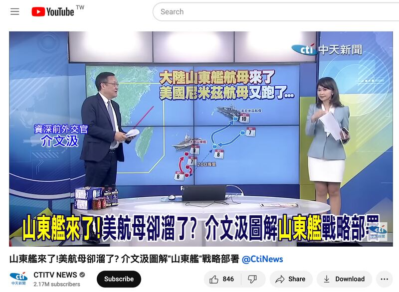
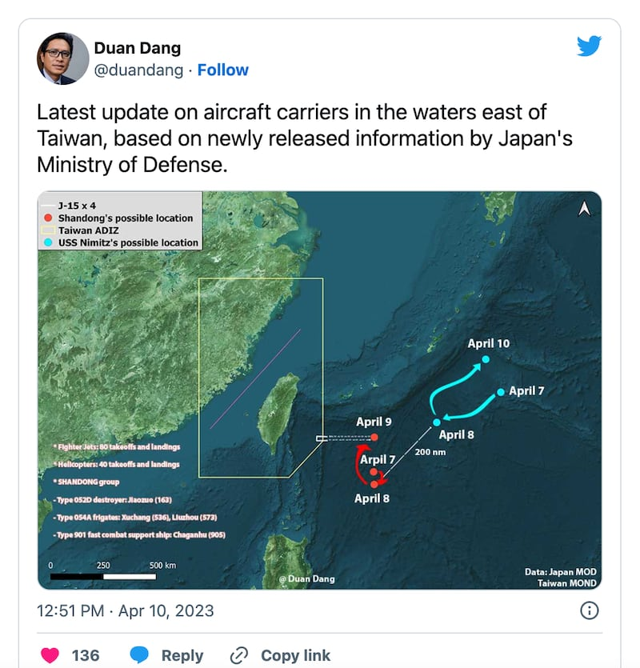
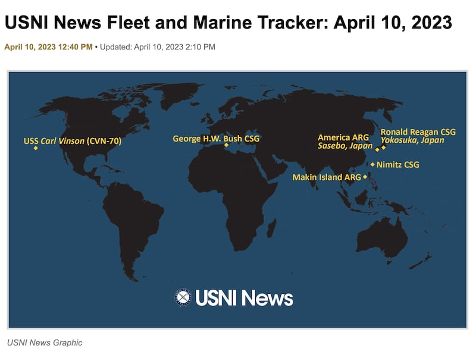
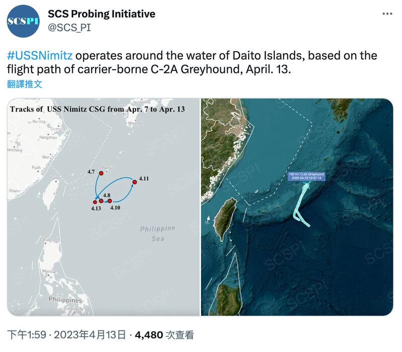

# 事實查覈 │ 山東艦一來，美國航母就逃了？

作者：莊敬

2023.04.17 15:35 EDT

## 標籤：欠缺證據

## 一分鐘完讀：

中國結束三天環臺軍演後，部分中國與臺灣媒體聲稱，原本在臺灣東部附近的美國尼米茲號航母艦隊於4月8日演習一開始就"果斷"一路北上，並以《山東艦來了，美航母又跑了》《美航母遇中共軍演就落跑》爲題報道，網民也討論"尼米茲號爲何習慣性逃跑""五千美軍比臺人重要的殘酷真相"。

亞洲事實查覈實驗室詢問美國第七艦隊並檢視包括中國智庫發佈的相關資料，發現尼米茲號曾在軍演期間往北移動，但並未離開臺灣以東的菲律賓海域；因此，並無證據支持所謂尼米茲號“逃離”“落跑”等說法。

## 深度解析：

中共人民解放軍海軍航空母艦山東艦編隊4月5日穿越巴士海峽,並參與8日至10日的環臺軍演。臺灣的 [國防部長邱國正4月6日在立法院答詢時說](https://ivod.ly.gov.tw/Play/Clip/1M/144957),美國尼米茲號也在臺灣東部約400海里處,雖不能說美航母是爲山東艦而來,但尼米茲號所在位置都有關聯。

中國對臺軍演後,《環球時報》旗下公衆號"樞密院十號"11日發表 [《山東艦來了,美國航母又跑了》](https://taiwan.huanqiu.com/article/4CRWPBKhY8s)一文,文中引用據澳大利亞網站"新聞"(news.com.au)的相關報道中刊登的一張示意圖,宣稱原本山東艦抵達臺灣東部海域之際,尼米茲號航母遠遠地保持跟蹤監視狀態,但解放軍東部戰區的演習8日一開始,美國航母就果斷地一路北上了。

臺灣的 [中天新聞節目"盧秀芳中天辣晚報"](https://www.youtube.com/watch?v=X3fpMEawb2w)11日也以《山東艦來了!美航母卻溜了?》爲題發起討論。來賓介文汲認爲,尼米茲號這時離開,是爲了不要給中國錯誤的訊息,也不想被誤判、誤擊、誤傷,此舉是"識時務者爲俊傑"。

主持人盧秀芳問,演習都不願意留下來,臺灣人民會怎麼想?介文汲說,一艘航母上大概5千名官兵,"這5千個官兵的性命絕對高於臺灣人怎麼想"。中時新聞網11日晚間以 [《美航母遇中共軍演就落跑?前大使:5千美軍比臺人重要》](https://www.chinatimes.com/realtimenews/20230411005189-260407?chdtv)爲題報道;12日再發一篇 [《美尼米茲號遇中共軍演就掉頭?網爆殘酷真相》](https://www.chinatimes.com/realtimenews/20230412001553-260407?chdtv)。

臺灣新聞節目談論“山東艦來了！美航母就溜了？”（YouTube截圖）

網易、Bilbili等平臺也出現相關文章: [《美航母爲何遇到山東艦就逃跑?臺前官員:五千美軍比臺灣人更重要》](https://c.m.163.com/news/a/I2332684055356HZ.html?spss=backflow-index-hotlist) [《里根號與尼米茲號爲何習慣性的逃跑?》](https://www.bilibili.com/read/cv23017689/)

"樞密院十號"提及的 [澳大利亞新聞網站報道](https://www.news.com.au/technology/innovation/military/china-and-us-square-off-as-beijing-escalates-over-taiwan/news-story/afee0ab9e6290e1c7e2648befe5892d4)使用的示意圖乃是由越南記者段當(Duan Dang,音譯)10日在推特發佈,顯示山東艦和尼米茲號的可能位置;報道指出,據開源情報分析師的資料,尼米茲號航母艦隊正在臺灣以東約700海里處。

澳大利亞新聞網站刊登越南記者段當發佈在推特上的一張山東艦和尼米茲號的可能位置示意圖（澳大利亞新聞網站截圖）

["美國海軍學會新聞網"(USNI News)10日報道](https://news.usni.org/2023/04/10/u-s-chinese-aircraft-carriers-operating-near-taiwan-chinese-carrier-shandong-launched-80-fighter-missions-in-weekend-drills)指出,在臺灣的總統蔡英文與美國衆議院議長麥卡錫(Kevin McCarthy)會晤後,緊張局勢升溫,美國和中國的航母打擊羣都在臺灣附近行動;根據 ["美國海軍學會新聞網"的艦隊位置追蹤](https://news.usni.org/2023/04/10/usni-news-fleet-and-marine-tracker-april-10-2023),尼米茲號航母打擊羣週一(10日)在近臺灣的菲律賓海行動。

據美國海軍學會新聞網的報道及艦隊位置追蹤圖，尼米茲號航母打擊羣4月10日在臺灣以東的菲律賓海。（USNI截圖）

但中國智庫 ["南海戰略態勢感知計劃"(SCSPI)](https://twitter.com/SCS_PI/status/1646392568916377602?cxt=HHwWhIDU8bDUlNktAAAA)13日在推特發佈的追蹤位置示意圖上(以C-2A"灰狗"艦載運輸機的飛行活動爲基礎),尼米茲號在軍演期間的動態,和"樞密院十號"所引用的示意圖路徑不同,並不符合其文章所說的8日起"一路北上"。

中國智庫"南海戰略態勢感知計劃"4月13日在推特上發佈的尼米茲號追蹤位置示意圖（SCS Probing Initiative Twitter）

尼米茲號發言人德米特（Adam Demeter）14日回覆亞洲事實查覈實驗室，尼米茲號在菲律賓海執行美國第七艦隊的例行任務，尼米茲號經常與盟國和合作伙伴互動及行動，以維護自由開放的印太地區。

## 結論：

亞洲事實查覈實驗室未能獨立查覈尼米茲號執行任務的確切位置，但若以美國海軍媒體的位置追蹤爲準，在中國對臺軍演期間，尼米茲號在臺灣附近的菲律賓海域行動。媒體、評論家和網民依據一張位置示意圖就說成美國航母遇到軍演就“逃跑”，屬於主觀揣測，並無證據支持。

*亞洲事實查覈實驗室（Asia Fact Check Lab）是針對當今複雜媒體環境以及新興傳播生態而成立的新單位。我們本於新聞專業，提供正確的查覈報告及深度報道，期待讀者對公共議題獲得多元而全面的認識。讀者若對任何媒體及社交軟件傳播的信息有疑問，歡迎以電郵afcl@rfa.org寄給亞洲事實查覈實驗室，由我們爲您查證覈實。*

[Original Source](https://www.rfa.org/mandarin/shishi-hecha/hc-04172023152230.html)