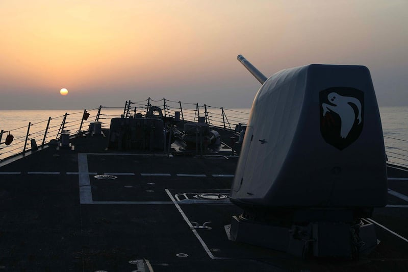
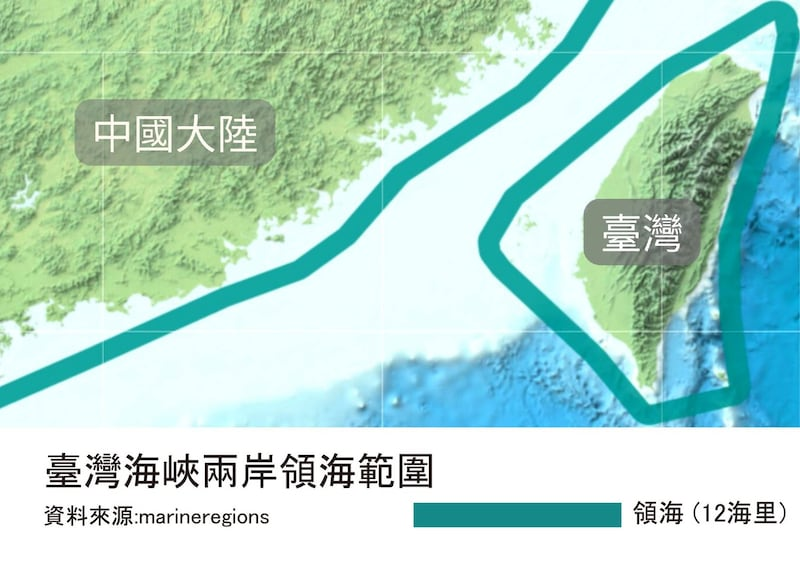
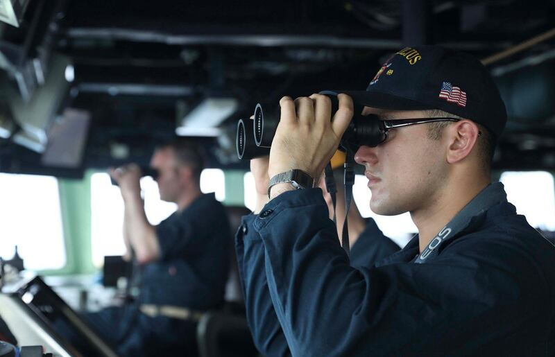

# 事實查覈 │ 美軍主張臺灣海峽是"國際水域"，中國反對有理嗎？

作者：李潼

2023.04.18 12:20 EDT

## 標籤：誤導

## 一分鐘完讀：

美國導彈驅逐艦米利厄斯號16日由南向北穿越臺灣海峽。中國外交部和解放軍東部戰區先後聲明抗議。

美軍也聲明強調，米利厄斯號是在“國際法適用之公海航行和飛越自由”水域，做“例行性”航行穿越。但中國外交部強調，國際海洋法沒有“國際水域”的稱法，反對以這種說法“操弄涉臺問題、威脅中國主權安全”。

亞洲事實查覈實驗室查證認爲，“國際水域”一說有國際法依據，根據《聯合國海洋法公約》，臺灣海峽的確爲各國船隻享有公海自由航行權利的水道，空中亦然。中國外交部的聲明內容屬誤導。

米利厄斯號通過臺灣海峽的照片 （圖/美海軍第七艦隊網站）

## 深度分析：

## 美、中雙方的基本主張是什麼？

美國海軍第七艦隊在米利厄斯號通過臺灣海峽後 [發出聲明](https://www.c7f.navy.mil/Media/News/Display/Article/3364101/7th-fleet-destroyer-transits-taiwan-strait/),強調美國軍艦是在"國際法適用之公海航行和飛越自由"水域。而米利厄斯號航行的通道,"位於任何沿海國家的領海以外",美國軍隊可以在國際法允許的任何地方飛行、航行和作業。

另一方面,中共解放軍東部戰區新聞發言人施毅陸軍大校在第一時間批評美國"公開炒作"米利厄斯號的行動, [同時聲明](https://weibo.com/u/7483054836):中國人民解放軍東部戰區組織兵力對美艦過航行動全程跟監警戒。戰區部隊隨時保持高度戒備,堅決捍衛國家主權安全和地區和平穩定。

在例行記者會上被問及相關議題時,中國外交部發言人汪文斌 [批評美國](https://www.fmprc.gov.cn/fyrbt_673021/jzhsl_673025/202304/t20230417_11060477.shtml)派軍艦來臺灣海峽炫耀武力,危害中國主權和安全,破壞地區和平穩定,是臺海和平穩定的麻煩製造者。

但值得留意的是,針對美國主張的"公海航行和飛越自由",中國外交部曾在去年6個月做出重要法律意見宣示,當時,外交部發言人汪文斌 [表示](https://www.fmprc.gov.cn/fyrbt_673021/jzhsl_673025/202206/t20220613_10702387.shtml):

“根據《聯合國海洋法公約》和中國國內法，臺灣海峽水域由兩岸的海岸向海峽中心線延伸，依次爲中國的內水、領海、毗連區和專屬經濟區。中國對臺灣海峽享有主權、主權權利和管轄權，同時也尊重其他國家在相關海域的合法權利。

此外，國際海洋法上根本沒有‘國際水域’一說。有關國家聲稱臺灣海峽是‘國際水域’，意在爲其操弄涉臺問題、威脅中國主權安全製造藉口。中方對此堅決反對。 ”

## 臺灣海峽的法律定位是什麼？

中國外交部的聲明衍生出的問題是：臺灣海峽的法律地位是什麼？這些名詞的詮釋關係到什麼？

1994年生效的《聯合國海洋法公約》規定，各國由領海基線向外延伸12海浬爲“領海”，再向外12海浬爲“毗連區”（臺灣稱“鄰接區”)。

臺灣海峽最窄處約70海里，最寬處約 220海里。根據兩岸政府各自宣告的領海及毗連區範圍，可以發現臺灣海峽仍有兩岸各自的領海和毗連區覆蓋不到的部分，這部分確實是各國船艦可以自由航行、通過的水域。

臺灣海峽兩岸領海範圍示意圖（圖/亞洲事實查覈實驗室製圖）

## 美國的主張的 “國際水域”什麼意思？

美國國務院發言人 [內德·普萊斯](https://zh.wikipedia.org/wiki/%E5%86%85%E5%BE%B7%C2%B7%E6%99%AE%E8%8E%B1%E6%96%AF)(Ned Price)在2022年6月回覆媒體查詢臺灣海峽法律定位時表示:

“臺灣海峽是一個國際水道（國際水路），這意味着臺灣海峽的海上和空中的公海航行自由（公海自由），都受到國際法的保障。 ”

臺灣學者林正義研究 [發現](https://www.pf.org.tw/tw/pfch/12-9541.html),雖然美國並未簽署《聯合國海洋法公約》,而是另外頒佈適用美國海軍、海軍陸戰隊的《美國海上行動法指揮官手冊》,認爲各國領土 24海浬以外的水域都是可以自由航行的'國際水域'。美國政府在2022年年3個月版的《指揮官海軍行動法手冊》指出,有五類適用於國際航行的海峽,其中臺灣海峽和宗谷海峽、大隅海峽、宮古海峽等共同被列爲"公海自由"水域。

國際法專家，臺灣制憲基金會副執行長宋承恩對亞洲事實查覈實驗室指出，“國際水域”向來是國際法上的慣用語詞，指的是不爲“領海水域”領海所涵蓋的水域。在航行自由或管制權利的意義上，“國際水域”一詞的確有合法、明確的意義。

亞洲事實查覈實驗室也在臺灣國家教育研究院網站上,查得" [國際水域](https://terms.naer.edu.tw/detail/6b7766b62190052331d86d74a21f3a6e/?startswith=zh)""國際海域"等名詞,解釋爲"符合公海自由原則之水域,如鄰接區,專屬經濟海域及公海",可以使用在造船、地理、機械、海事等領域。

美國海軍第七艦隊發佈米利厄斯號通過臺灣海峽的照片（圖/美海軍第七艦隊網站）

## 中國的主張在法律和政治上如何解讀？

汪文斌在聲明中提到：“臺灣海峽完全被‘中國的內水、領海、毗連區和專屬經濟區’所涵蓋……中國享有主權、主權權利和管轄權”。

汪文斌上述的說法，意指如果中國在政府在臺灣海峽宣告200海浬專屬經濟區，就必定覆蓋整個臺灣海峽。但宋承恩強調“專屬經濟區”保護的是當事國的經濟權利，當事國不能干涉專屬經濟區裏的航行自由。

臺灣國際法學會副祕書長林廷輝在接受媒體採訪時進一步 [指出](https://news.ltn.com.tw/news/politics/breakingnews/4014805),中國的主張不只依據《國際海洋法公約》,也可以依照三部中國的國內法:《專屬經濟區和大陸架法》《海警法》和《海上交通安全法》。就這三部法律,中國政府如果認定外國軍用或政府船舶有違法行爲時,可以強制驅離或拖離。

林廷輝形容中國政府的立場是企圖將臺灣海峽“內海化”，藉此制止其它國家介入臺灣問題。

## 結論：

臺灣海峽確實存在開放給各國船艦、飛行器自由航行、通過的水域。而這個事實和兩岸政府各自的政治主張無關。也就是不論視中國大陸與臺灣爲同一個國家的領土，還是分屬兩個國家或政治實體，都不會改變臺灣海峽中間存在得以自由航行的水道或水域的事實。

*亞洲事實查覈實驗室(* *Asia Fact Check Lab* *)是針對當今複雜媒體環境以及新興傳播生態而成立的新單位。我們本於新聞專業,提供正確的查覈報告及深度報道,期待讀者對公共議題獲得多元而全面的認識。讀者若對任何媒體及社交軟件傳播的信息有疑問,歡迎以電郵*  [*afcl@rfa.org*](http://afcl@rfa.org)  *寄給亞洲事實查覈實驗室,由我們爲您查證覈實。*

[Original Source](https://www.rfa.org/mandarin/shishi-hecha/hc-04182023121036.html)