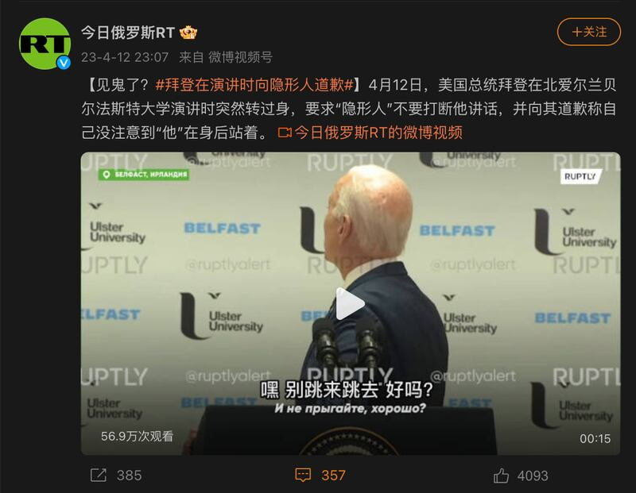
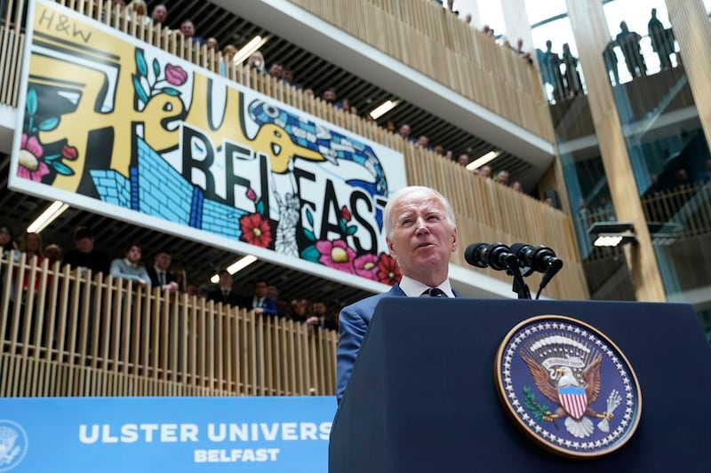
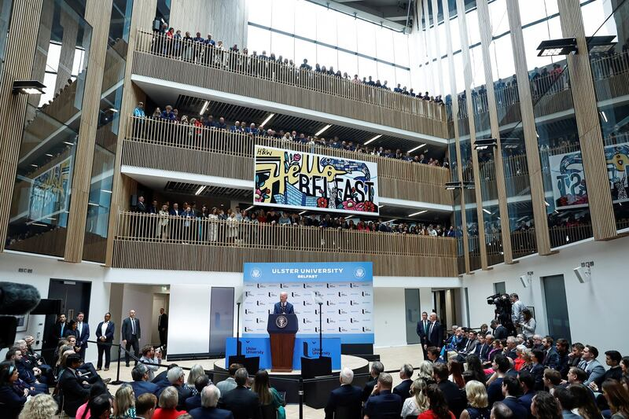
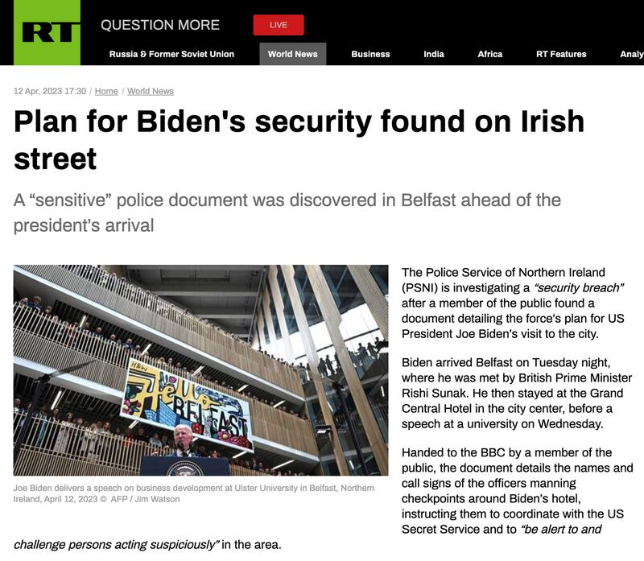

# 事實查覈│俄媒稱拜登"向隱形人致歉"，是真的嗎？

作者：董喆

2023.04.19 14:14 EDT

## 標籤：錯誤

## 一分鐘完讀：

近日，包含《今日俄羅斯》（RT）、《四川觀察》等中俄媒體熱傳一則視頻，爲拜登在北愛爾蘭一所大學演講，並稱拜登在演講中曾經轉身向着牆壁說話，被形容是“向隱形人道歉”。

亞洲事實查覈實驗室查證後發現，影片拍攝的範圍只到拜登和活動背板，但根據現場其它角度照片，拜登身後其實有三層樓的看臺，並有師生羣聚聆聽演講，拜登轉身實際是與看臺的師生互動。

## 深度分析：

美國總統拜登4月11日前往北愛爾蘭及愛爾蘭訪問四天。 4月12日時他在北愛爾蘭阿爾斯特大學(New University of Ulster)演講,會後,俄羅斯通訊社《今日俄羅斯》 [在微博張貼視頻](https://weibo.com/6244553417/MBH8vypHd?refer_flag=1001030103_),指出拜登在演講時突然轉身,要求"隱形人"不要打斷他。中國地方媒體 [《看看新聞》](https://military.china.com/news/13004177/20230414/44869117_all.html)、《四川觀察》等也都跟進討論拜登的"迷惑行爲"。

《今日俄羅斯》針對拜登演講發表的不實視頻。 （圖／擷取自《今日俄羅斯》官方微博）

## 拜登身後真有隱形人嗎？

《今日俄羅斯》的視頻拍攝範圍僅止於拜登與活動背板，爲了檢視完整活動場地，亞洲事實查覈實驗室查閱包含《路透社》與《美聯社》當天的活動照片，發現拜登身後其實有三層看臺，上頭全是聆聽演講的師生。

美聯社當天拍攝的照片顯示，拜登身後其實有師生站立在看臺。 （圖／美聯社）

從路透社的照片可以確認，拜登身後的看臺其實高達三層，容納了不少師生。 （圖／路透社）

## 拜登說了什麼？

根據《衛報》的直播影片,17分28秒處,拜登的確向後轉向看臺上方的羣衆互動。根據白宮釋出的 [逐字稿](https://www.whitehouse.gov/briefing-room/speeches-remarks/2023/04/12/remarks-by-president-biden-marking-the-25th-anniversary-of-the-belfast-good-friday-agreement/),該段對話內容爲:" (對學生們說)不要跳,好嗎?(笑聲)哦,我沒看到你們在那麼高的地方。(笑聲。)正如我父親說的:『不好意思背對你們。我道歉。』(笑聲)(Addressing the students.) And don't jump, okay? (Laughter.) Oh, I didn't see you all the way up there. (Laughter.) As my father would say, "Please, excuse my back. I apologize." (Laughter.)"

爲何拜登要對看臺的羣衆說出"別跳"?美國《新聞週刊》2022年曾經 [做過查覈](https://www.newsweek.com/fact-check-does-viral-video-show-joe-biden-tell-paralympians-dont-jump-1704126):拜登說"不要跳",是他在許多公開活動中習慣對高處羣衆的玩笑話。例如2021年3月拜登在華盛頓的一次行程中,他對商店二樓圍觀的民衆說"別跳,我們需要你。"

英國《獨立報》也曾也曾 [報導](https://manstaging.rfaweb.org/mandarin/shishi-hecha/hc-04192023140833.html/href="https:/www.independent.co.uk/tv/news/midterms-elections-biden-heckler-jump-b2219949.html),2022年美國期中選舉時,拜登也在馬里蘭州的民主黨集會中對一名起鬨的觀衆說"別跳!"

## 《今日俄羅斯》的雙重表述

查覈過程中，亞洲事實查覈實驗室也發現，《今日俄羅斯》在中文世界中以微博視頻號發表視頻，以不實資訊渲染拜登的“詭異行爲”。但在其英文版官方網站中，卻未見相關內容。

我們更發現當天《今日俄羅斯》發表了一則 [拜登訪北愛爾蘭維安計劃遭外流的報導](https://www.rt.com/news/574608-biden-belfast-security-breach/),使用的照片爲法新社拍攝的演講活動照片,拜登身後的看臺一覽無遺。

《今日俄羅斯》在中國社羣上的操作顯然與英文版網站自相矛盾，雖無法直接推斷動機，但《今日俄羅斯》的確在中英文世界分別有兩種操作手法。

《今日俄羅斯》由俄羅斯總統普丁於2013年12月9日簽署命令成立，是以俄新社爲基礎而設立的新聞通訊社。

《今日俄羅斯》英文版針對拜登當天活動的插曲進行報導。 （圖／擷取自《今日俄羅斯》英文網站）

## 結論：

《今日俄羅斯》和中國媒體流傳的“美國總統拜登演講時向隱形人道歉”是錯誤訊息。事實上當時是拜登是與二樓看臺的師生互動。

*亞洲事實查覈實驗室（Asia Fact Check Lab）是針對當今複雜媒體環境以及新興傳播生態而成立的新單位，我們本於新聞專業，提供正確的查覈報告及深度報道，期待讀者對公共議題獲得多元而全面的認識。讀者若對任何媒體及社交軟件傳播的信息有疑問，歡迎以電郵 [afcl@rfa.org](http://afcl@rfa.org)寄給亞洲事實查覈實驗室，由我們爲您查證覈實。*

[Original Source](https://www.rfa.org/mandarin/shishi-hecha/hc-04192023140833.html)