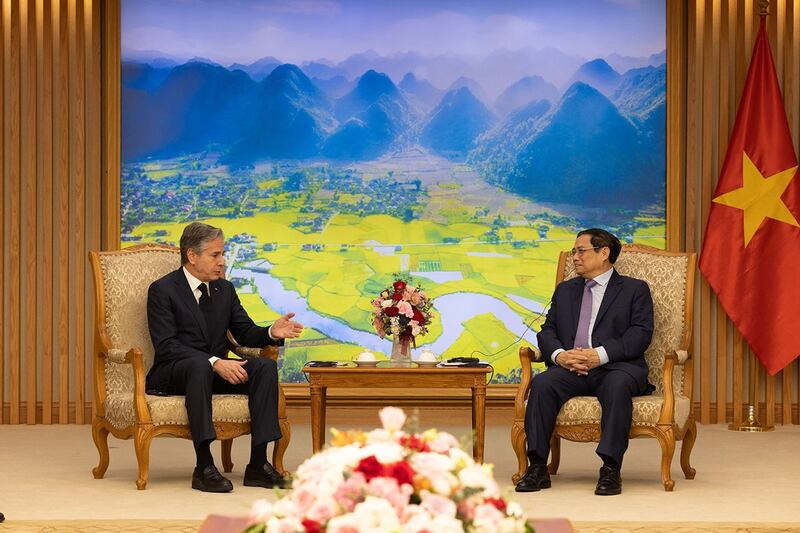
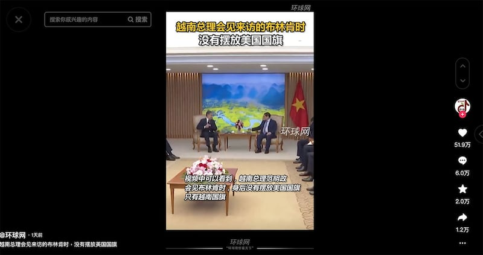
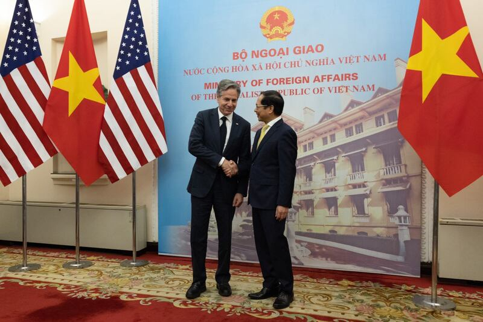
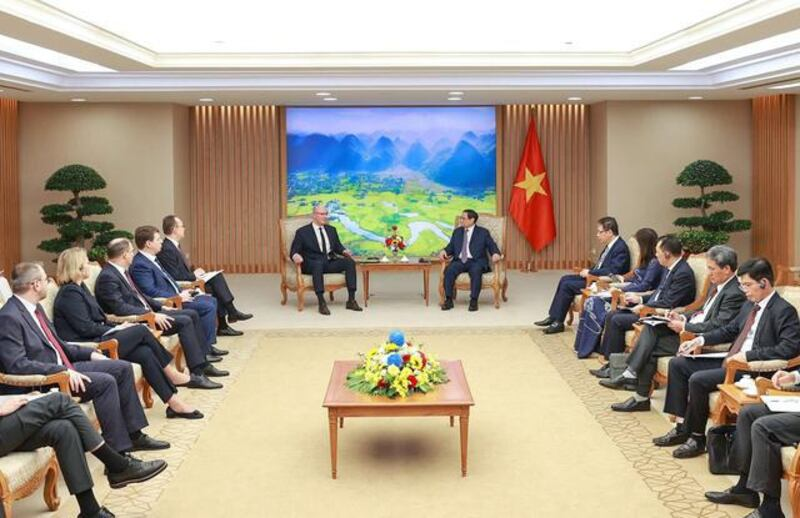
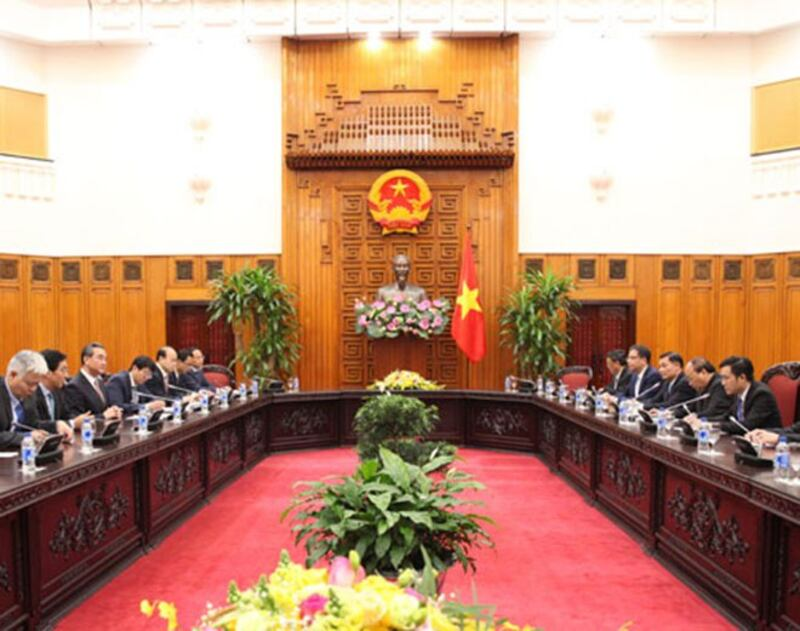

# 事實查覈│越南總理見布林肯 沒放美國國旗"極不尋常"？

作者：莊敬

2023.04.20 12:47 EDT

## 標籤：錯誤

## 一分鐘完讀：

美國國務卿布林肯4月中旬訪問越南，期間會見越南總理範明政等高層官員。中國媒體環球網在抖音平臺發佈短視頻，指布林肯與範明政會見時，會議室內僅擺放了越南國旗，沒有美國國旗，在外交場合”極不尋常”。這件事在網易、知乎等多個平臺掀起討論，有網民認爲這代表“美國被越南狠狠羞辱”。

亞洲事實查覈實驗室查詢越南政府接待外賓的規定等相關資料，發現越南政府接待部長級的外賓時，若雙方官員職級對等，會於接待場地懸掛兩國國旗，但若客人的職級低於主人，則只懸掛越南國旗。這說明爲何越南總理在政府辦公室會見布林肯，以及過去接待加拿大外長、俄羅斯外長、中國外交官等人時，都只有放置越南國旗。

## 深度解析：

美國國務卿布林肯(Antony Blinken)4月14日至16日訪問越南,期間會見越南共產黨中央總書記阮富仲(Nguyen Phu Trong)、總理範明政(Pham Minh Chinh)、外交部長裴青山(Bui Thanh Son)等高層。布林肯盼深化美越關係,並表達美國願幫助該地區國家提高海域態勢感知能力,應對其他國家對本國漁船的脅迫行爲。對此,中國批美國" [搬弄是非、挑撥離間](http://vn.china-embassy.gov.cn/sgxw/202304/t20230415_11059909.htm)"。

布林肯在推特分享了其越南行程，其中，他會見範明政的場景引起關注。許多網民留言問：怎不見美國國旗？

美國國務卿布林肯（左）會見越南總理範明政（右）。會場僅擺放越南國旗引起網民熱議。（圖取自布林肯推特）

對此,中國媒體環球網在抖音平臺發佈了10秒長的 [短視頻](https://www.douyin.com/user/MS4wLjABAAAACmUNK8yr2VV3JyWj5_zVxjC0llSWAcYSjtOV0EdyQxs?modal_id=7222488100365274425),標題爲"越南總理會見來訪的布林肯時,沒有擺放美國國旗",並在底部配上字幕: "據悉,這在外交場合是極不尋常的,因爲雙邊會晤,擺放雙方國旗是基本的禮儀,哪怕雙方有極大的分歧"。

環球網發佈的短視頻，指越南總理會見布林肯時沒有擺放美國國旗，在外交場合極不尋常。（環球網抖音視頻截圖）

相關照片與視頻在社媒迅速傳播,微博、網易、知乎等華文平臺也有許多討論,一些網民認爲" [美國被越南狠狠羞辱](https://www.163.com/dy/article/I2G5CGIJ0552ZDAQ.html)"、" [越南不想得罪中國,布林肯訪越遇恥辱場面](https://m.163.com/dy/article/I2IQPAHJ0552ZK96.html)"、" [越南也看不起美國](https://www.mobile01.com/topicdetail.php?f=780&t=6771877)",還有一些機構媒體,如中天新聞的 [新聞評論節目](https://www.youtube.com/watch?v=cYNTH-ACljs)以此爲題,分析美國爲什麼遭受如此"難看"的對待。

上述視頻與討論文章大多有一個共同點，他們聚焦範明政與布林肯會見時沒有擺放美國國旗，卻忽略布林肯與和他職級對等的裴青山會談時，會場擺放了兩國國旗。

美國國務卿布林肯（左）4月中訪問越南，期間與越南外交部長裴青山（右）會談，會場擺放越南與美國國旗。（圖取自布林肯推特）

亞洲事實查覈實驗室查證過往越南總理在政府辦公室會見外國官員的照片,發現範明政今年4月 [會見俄羅斯副總理切爾內申科](https://cn.baochinhphu.vn/%E8%8C%83%E6%98%8E%E6%AD%A3%E6%80%BB%E7%90%86%E4%BC%9A%E8%A7%81%E4%BF%84%E7%BD%97%E6%96%AF%E8%81%94%E9%82%A6%E6%94%BF%E5%BA%9C%E5%89%AF%E6%80%BB%E7%90%86%E5%BE%B7%E7%B1%B3%E7%89%B9%E9%87%8C%E5%88%87%E5%B0%94%E5%B0%BC%E7%94%B3%E7%A7%91-116230407095804349.htm)(Dmitry Chernyshenko)、 [中國廣西壯族自治區黨委書記劉寧](https://cn.baochinhphu.vn/%E8%B6%8A%E5%8D%97%E6%94%BF%E5%BA%9C%E6%80%BB%E7%90%86%E8%8C%83%E6%98%8E%E6%AD%A3%E4%BC%9A%E8%A7%81%E4%B8%AD%E5%9B%BD%E5%B9%BF%E8%A5%BF%E5%A3%AE%E6%97%8F%E8%87%AA%E6%B2%BB%E5%8C%BA%E5%85%9A%E5%A7%94%E4%B9%A6%E8%AE%B0%E5%88%98%E5%AE%81-116230402020446043.htm),以及去年會見 [俄羅斯外交部長拉夫羅夫(Sergei Lavrov)](https://www.youtube.com/watch?v=jH9mdWy6MDc)、 [加拿大外交部長趙美蘭(Melanie Joly)](https://twitter.com/melaniejoly/status/1514393074801205248)等人時,都只有擺放越南國旗。

今年4月，越南總理範明政（右）會見俄羅斯副總理切爾內申科（左）僅擺放越南國旗。（圖取自越南政府新聞網）

2017年11月,時 [任中國外交部長王毅訪問越南](https://www.fmprc.gov.cn/web/wjbz_673089/xghd_673097/201711/t20171104_7584955.shtml),分別會見阮富仲與當時的越南總理阮春福,雙方外交人員會談時,會場也僅擺放了越南國旗。但這在當時並未引起"越南羞辱他國"的揣測。

時任中國外交部長的王毅（左三）率團訪問越南並與越方人員會談時，會議室內也只懸掛了越南國旗。（圖取自中國外交部官網）

亞洲事實查覈實驗室查閱越南政府於2022年2月更新發布的 [有關外交禮儀的規定](https://thuvienphapluat.vn/van-ban/EN/Bo-may-hanh-chinh/Decree-18-2022-ND-CP-Diplomatic-Ceremonies/506791/tieng-anh.aspx),在"懸掛國旗的規則"明確寫道:接待部長及同層級以上的客人(同職級接待),在接待場合懸掛兩國國旗,若客人的層級低於主人,則只懸掛越南國旗。

## 結論：

範明政會見布林肯時，場地僅擺放越南國旗，沒有擺放美國國旗，並非“極不尋常”或爲羞辱美國，而還是因爲該國規定高級別官員會見職級較低的來訪人員時，會見場合只懸掛本國國旗。部分華文媒體選擇性的忽略越南領導人在會見其他國家外交人員時也遵循同樣的規定，傳播“美國被羞辱”，是錯誤信息。

*亞洲事實查覈實驗室(* *Asia Fact Check Lab* *)是針對當今複雜媒體環境以及新興傳播生態而成立的新單位。我們本於新聞專業,提供正確的查覈報告及深度報道,期待讀者對公共議題獲得多元而全面的認識。讀者若對任何媒體及社交軟件傳播的信息有疑問,歡迎以電郵* [afcl@rfa.org](http://afcl@rfa.org) *寄給亞洲事實查覈實驗室,由我們爲您查證覈實。*

[Original Source](https://www.rfa.org/mandarin/shishi-hecha/hc-04202023124011.html)