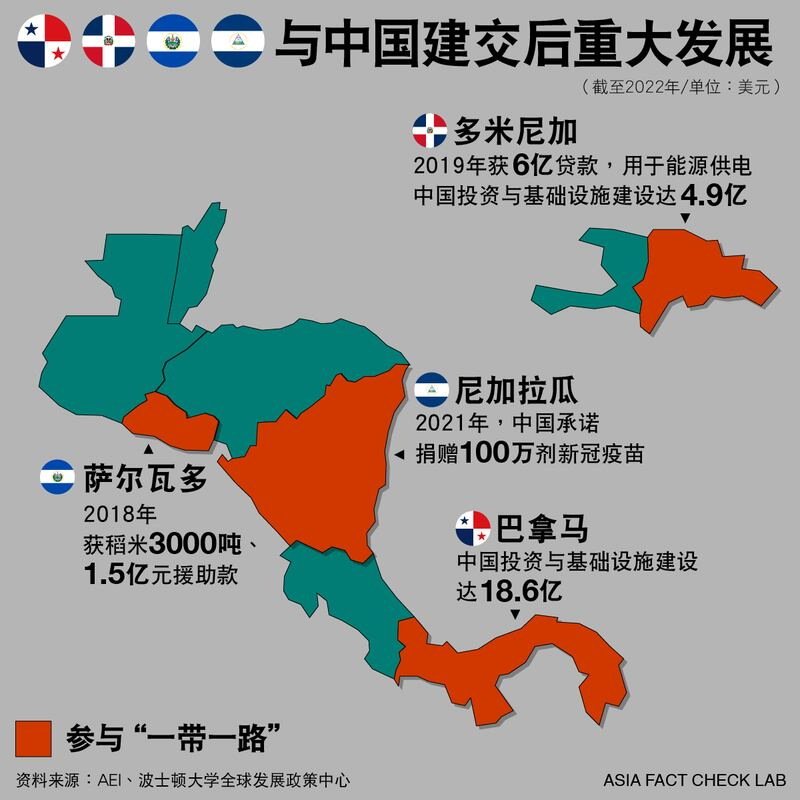

# 事實查覈│拉美多國無條件和中國建交？細數北京的金錢外交

作者：沉軻、鄭崇生

2023.04.21 13:16 EDT

## 標籤：誤導

## 一分鐘完讀：

3月26日，洪都拉斯與中華人民共和國建交，與在臺灣的中華民國斷交。臺灣總統蔡英文當天指出，臺灣“不會和中國進行無意義的‘金錢外交’競逐”。中國外交部發言人毛寧則在27日例行記者會上說，洪都拉斯與中國建交不設任何前提，她反指臺灣才“慣於施展金錢外交”，警告“金錢外交沒有出路”。毛寧也說，近幾年巴拿馬等國陸續與中國建交或復交都不附加任何前提條件。

但亞洲事實查覈實驗室針對毛寧上述說法查覈後發現，這些位於拉丁美洲或加勒比海地區國家與中國建交後，都獲得了貸款或援助。

## 深度分析：

臺灣外交部3月26日發表 [聲明](https://www.mofa.gov.tw/News_Content.aspx?n=95&s=99965),當天起終止與洪都拉斯(臺譯:宏都拉斯)的外交關係。洪都拉斯做出外交承認轉變的決定前,外界已揣測數月。目前,臺灣的邦交國僅剩13個,其中7個位於拉丁美洲或加勒比海地區。

中國外交部發言人毛寧在3月27日的 [記者會](https://www.mfa.gov.cn/web/fyrbt_673021/202303/t20230327_11049724.shtml)上說,洪都拉斯決定與中國建交,是在"一箇中國原則"基礎上作出的政治決斷,不設任何前提。她還指,"建交不是交易籌碼,而近幾年來,包括巴拿馬、多米尼加、薩爾瓦多、尼加拉瓜等國陸續與中國建交或復交,也都不附加任何前提條件。"

她更指控臺灣才慣於施展“金錢外交”。毛寧更說要正告臺灣當局，“金錢外交沒有出路，任何逆歷史潮流的圖謀註定會以失敗告終。”

就在中國與洪都拉斯建交前,路透社22日曾 [報道](https://www.reuters.com/world/honduras-demanded-25-bln-taiwan-aid-before-china-announcement-source-2023-03-22/),洪國向臺灣索取25億美元金援,洪都拉斯外交部長雷依納(Eduardo Enrique Reina)當時則駁斥:25億美元"不是金援",是"協商的再融資機制"。

## 與中國建交是否有前提？

以洪都拉斯的例子來說,在中國外交部公佈 [《中華人民共和國和洪都拉斯共和國關於建立外交關係的聯合公報》](https://www.fmprc.gov.cn/zyxw/202303/t20230326_11049264.shtml)中,就明確呼應北京的"一箇中國原則"提到,洪都拉斯共和國政府承認世界上只有一箇中國,中華人民共和國政府是代表全中國的唯一合法政府,臺灣是中國領土不可分割的一部分。洪都拉斯共和國政府即日斷絕同臺灣的"外交關係",並承諾不再同臺灣發生任何官方關係,不進行任何官方往來。

儘管中方聲稱這是洪國的“政治決斷”，但與中華人民共和國建交的國家，都必須聲明與臺灣的中華民國斷交、停止與臺灣官方往來，並宣佈中華人民共和國是唯一代表中國的合法政府，否則不可能與其建立外交關係。

## 中國是否金援與臺灣斷交的國家？

美國約翰霍普金斯大學高級國際研究學院（SAIS）國際政治與經濟教授博黛蓉（Deborah Brautigam）在她的著作《龍的禮物：中國在非洲的真實故事》（The Dragon’s Gift: The Real Story of China in Africa）中就指出，中國政府通常極爲反對以提供現金的方式、援助任何國家，但當北京企圖與和臺北斷交的國家建立外交關係時，這一規則往往有例外。

她在書中以哥斯達黎加於2007 年決定與北京建立外交關係爲例，提到哥國法院在中哥建交同年頒佈了一項命令，迫使哥斯達黎加政府公佈與中國簽署的官方外交協定內容。協定內容包括：中國承諾在建交後兩年內提供 3000 萬美元的現金款項，以及另有 1 億美元、通過中國常規的“一站式”（turn-key）方案交付。“雖然哥國政府後來並沒有公佈與中國的建交協定，但金援寫入正式的外交協定中，而不是轉入某個人的私人銀行戶頭裏，仍引起關注。”

博黛蓉身兼該校中非研究倡議項目主任，她告訴亞洲事實查覈實驗室，北京利用獎勵措施來討好臺灣爲數不多的邦交國改變立場，往往與臺灣的國內政治有關。 “這幾年，‘金錢外交’有時升溫、有時趨緩，反映了臺灣領導人採取的行動。當臺灣的國民黨執政時，金錢外交就趨緩，當民進黨執政時，就升溫。”

## 中國式援助的多種方案

中國2018年成立了國家國際發展合作署(CIDCA),掛牌成立之前在商務部轄下。美國智庫全球發展中心( [全球發展中心](https://www.cgdev.org/),CGD)的 [報告](https://www.cgdev.org/publication/chinas-foreign-aid-primer-recipient-countries-donors-and-aid-providers)曾指出,中國國家國際發展合作署的援助計劃主要投注在中亞、東南亞、太平洋島國與非洲。

而值得注意的是,中國2013年成立"一帶一路"項目後,尤其是拉丁美洲與加勒比海地區、這些非"一帶一路"原始計劃內的國家,最近幾年也都紛紛 [加入](https://www.yidaiyilu.gov.cn/xwzx/roll/77298.htm),與中國簽訂專門的《諒解備忘錄》,已經成了近十年與中國建交的標準配備。2017年與中國建交的巴拿馬,就是首個 [加入"一帶一路"計劃的拉美國家](https://www.yidaiyilu.gov.cn/xwzx/gnxw/35763.htm)。多米尼加、薩爾瓦多與尼加拉瓜與中國建交後,也都加入"一帶一路"。

全球發展中心就指出，中國的對外援助除了傳統的“授魚”方式，借“一帶一路”也發展出多種中國特色的商業模式與成套項目（complete project）。

## 和中國建交後，巴拿馬、多米尼加、薩爾瓦多與尼加拉瓜得到了什麼？

波士頓大學全球發展政策中心(Boston University Global Development Policy Center)2005年開始就追蹤中國在拉丁美洲與加勒比海地區(LAC)的貸款發放,最新統計 [顯示](https://www.bu.edu/gdp/2023/03/21/at-a-crossroads-chinese-development-finance-to-latin-america-and-the-caribbean-2022/),截至2022年,肩負執行國家政策的中國國家開發銀行(Development Bank)與中國進出口銀行(Export-Import Bank of China)累計已對拉美與加勒比海地區發放貸款1360億美元,主要集中在2010-2015年間。

波士頓大學這項與美洲對話組織(IAD)合作的統計庫 [資料顯示](https://www.thedialogue.org/map_list/),多米尼加在建交後的2019年獲得中國進出口銀行貸款6億美元,用於能源供電項目。這一中心的最新報告指出,2021年新冠疫情全球大流行期間,中國已連續二年未通過上述兩家銀行、與拉加國家簽署新的官方融資承諾。

波士頓大學全球發展政策中心資深研究員雷貝卡（Rebecca Ray）告訴亞洲事實查覈實驗室，錄得中國對這一地區的貸款數字近年來看起來不高，除了中國的援助方式更爲多元，也和拉加國家的國內政治有關。

雷貝卡舉例，像是薩爾瓦多在總統布克雷（Nayib Bukele）上任後，他就有自己設定的優先議程；尼加拉瓜則在新冠疫情大流行期間選擇與北京建交，除了2022年加入“一帶一路”外，尼加拉瓜還獲得大量新冠疫苗援助。

和中國建交與否，確實關乎獲得援助的多寡。威廉與瑪麗學院（College of William & Mary）專研中國對外援助項目（AidData）的執行主任波克斯（Bradley Parks）曾在合著著作《寄希望於北京》（Banking on Beijing）中說，北京不會提供援助給外交承認臺灣的國家，只有少數例外，“而和臺灣斷交的國家，平均每年會得到 1.6 個來自中國的項目。”

除援助項目,與中國的經貿往來與投資也是相關國家看重的。英國《金融時報》在洪都拉斯與中國建交後,引述臺灣在拉丁美洲不具名外交官員的話 [報道](https://www.ft.com/content/9954b9dc-5a30-41ea-9225-b733cae3d0df),相關國家"真正想要的不是更多援助,而是貿易及投資。"

亞洲事實查覈實驗室根據公開數據，整理出2016年後和中國建交的拉加四國的基礎設施建設投資上確實都有增加，相關資訊條列如下：

**巴拿馬:**2017年與中國建交。華盛頓智庫美國企業研究所(AEI)的 [數據](https://www.aei.org/china-global-investment-tracker/)顯示,2017年後,來自中國的投資與基礎設施建設金額已達18.6億美元。

另外,多家巴拿馬媒體在主導與中國建交的前總統瓦雷拉(Juan Carlos Varela)卸任後 [報道](https://diario.elmundo.sv/El%20Mundo/china-pago-143-millones-a-expresidente-de-panama-para-romper-relaciones-con-taiwan),中國在與巴拿馬建交後捐款1.43億美元,過去不曾宣佈,是因爲不想留給外界"與臺灣斷交有價碼的對價關係印象。"

**多米尼加:**2018年建交。AEI數據顯示,2019年至今,來自中國的投資與基礎設施建設金額已達4.9億美元。

另有研究 [指出](https://www.thedialogue.org/analysis/is-the-dominican-republics-pivot-to-china-paying-off/),爲了中多建交,中方預估已提供30億美元的財政援助,2021年,兩國還簽署第二份《經濟技術合作協定》, [中國捐款3000萬美元](https://acento.com.do/actualidad/china-dona-us-30-millones-a-republica-dominicana-8926233.html),2022年中國駐多米尼加大使張潤接受多國媒體訪問時 [指出](https://revistacontactord.com/zhang-run-embajador-de-china-en-rd-china-rd-4-anos-despues/),建交4年來,中多雙邊貿易增長90%,年均增長超過25%。

多國與中國建交後獲得的援助

**薩爾瓦多:**2018年建交。有報道 [指出](https://dialogochino.net/en/trade-investment/22556-what-next-for-china-and-el-salvador/),中國當年提供薩爾瓦多逾3000噸稻米,並承諾提供1.5億美元的援助用於促進當地社會與科技發展的項目。

**尼加拉瓜:** [2021年建交後,中國隨即承諾捐贈100萬劑新冠疫苗](https://www.globaltimes.cn/page/202112/1241334.shtml)。另外,中尼建交後,據報道,北京提供尼加拉瓜警方防暴部隊數量不詳的物資。尼加拉瓜是拉美地區的低收入國家,多年來飽受政治動盪與社會騷亂,而尼加拉瓜的警察部隊由備受外界抨擊的獨裁總統奧蒂嘉(Daniel Ortega)岳父所領導。

## 結論：

亞州事實查覈實驗室發現，中華人民共和國的確爲與中國建交設定前提條件，並且提供大量經濟、非經濟的援助與激勵措施，以吸引各國與臺灣斷交，中國外交部指自己與各國建交”沒有前提”，是具有誤導性的說法。

*亞洲事實查覈實驗室(* *Asia Fact Check Lab* *)是針對當今複雜媒體環境以及新興傳播生態而成立的新單位。我們本於新聞專業,提供正確的查覈報告及深度報道,期待讀者對公共議題獲得多元而全面的認識。讀者若對任何媒體及社交軟件傳播的信息有疑問,歡迎以電郵* [afcl@rfa.org](http://afcl@rfa.org) *寄給亞洲事實查覈實驗室,由我們爲您查證覈實。*

[Original Source](https://www.rfa.org/mandarin/shishi-hecha/hc-04212023131311.html)