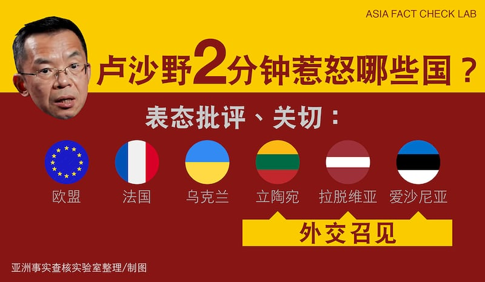
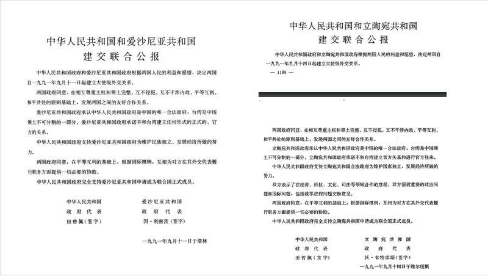
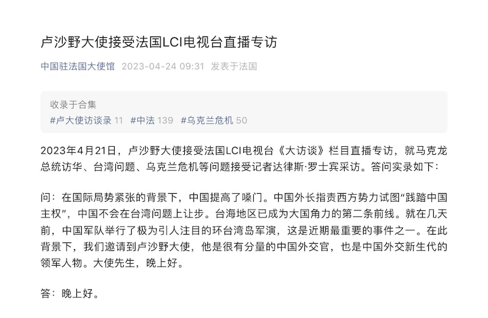

# 事實查覈 | 盧沙野的國際關係"理論"出了什麼問題？媒體"曲解"他了嗎？

作者：鄭崇生

2023.04.25 12:03 EDT

## 標籤：錯誤、誤導

## 一分鐘完讀：

"蘇聯時期,是赫魯曉夫把克里米亞送給了烏克蘭。那些前蘇聯國家沒有有效的國際法地位,因爲沒有國際協議認定他們作爲主權國家的地位。"——4月21日,中國駐法國大使盧沙野在接受法國電視新聞頻道(LCI) [訪問](https://youtu.be/8XYDYf1gmtA?t=882)時語出驚人,如此評價中國外交承認的邦交國、前蘇聯成員烏克蘭等加盟國,讓全球多數輿論譁然。

在這次訪談中，盧沙野做出了多處錯誤聲明，已經廣泛媒體報道，亞洲事實覈查查覈相關史實和文件，爲讀者提供深度資料作爲參考。

另外，雖然中國外交部、駐法使館等部門已發文聲明盧沙野言論不代表中國官方立場，但外交部發言人在發佈會上表示，有媒體在報道此事件時“刻意曲解”、“惡意挑撥”。 經比對中國駐法使館微信號發佈的採訪實錄（已刪）截圖，大部分法國和國際主流媒體對此事的報道都較客觀翔實。不點名地指責媒體的說法，是誤導行爲。

## 深度解析：

過去一個週末，盧沙野在2分多鐘的的訪問裏，一口氣“得罪”了歐洲聯盟（EU）至少10多個國家。

針對盧沙野宣稱前蘇聯加盟共和國"沒有國際協議認定他們作爲主權國家的地位",中國外交部週一重申,前蘇聯是聯邦制國家,對外作爲一個整體具有國際法主體地位。但外交部發言人毛寧特別指出: ["這不否認蘇聯解體後各加盟共和國具有主權國家地位。"](https://www.fmprc.gov.cn/wjdt_674879/fyrbt_674889/202304/t20230424_11064751.shtml)

盧沙野言論惹怒了不少國家，部分提出外交召見要求。（圖/亞洲事實查覈實驗室製圖）

肩負協調歐盟27個成員國外交政策的歐盟外交與安全政策高級代表博雷利(Josep Borrell)24日在記者會上 [回應](https://www.eeas.europa.eu/eeas/foreign-affairs-council-press-remarks-high-representative-josep-borrell-after-meeting-4_en),歐盟"樂見北京的官方聲明與盧沙野保持距離",但仍不忘重申盧沙野的言論令人"無法接受"。博雷利還明確提醒中國,"身爲聯合國安理會常任理事國,應該要全面、而不是選擇性的捍衛國際規則與規範。"

## 盧沙野的國際關係理論出了什麼問題？

一個國家是否具備完整的主權獨立國家地位，國際關係學有明確的理論基礎。耶魯大學法學院蔡中曾中國中心（Paul Tsai China Center）研究員魯道夫（Moritz Rudolf）告訴亞洲事實查覈實驗室，“盧沙野的評論背離對國際法的基本理解，及對蘇聯解體後這些國家在國際層面互動的現實情況。他的說法也偏離了中國官方的立場與作法。”

盧道夫解釋，國際法有一套對主權國家地位認定的標準，也就是參照聯合國登記註冊在案的《蒙特維多國家權利義務公約》（Convention on Rights and Duties of States adopted by the Seventh International Conference of American States）。

1933年，第七屆美洲國家會議在南美洲烏拉圭首都蒙特維多簽署的這項國際公約第一條就明確指出，作爲國際法承認的國家應具備四個資格：1. 常住人口、2. 具有一定界限的領土、3. 政府、4. 與其他國家建立關係的能力。

另外，從國際政治上實務上來說，關於承認（recognition）一個獨立國家的地位，國際關係理論中可分爲兩種，一是構成論（constitutive theory），一是宣示論（declaratory theory）。盧道夫指出，在構成論中，要想成爲一個獨立國家，獲得其他國家的承認是前提，一個國家需要通過其他國家的承認纔在國際社會中具有“國際人格”；

依照中國政府自己在網上公佈的 [政策文件](http://hk.ocmfa.gov.cn/chn/jb/topic/zgwj/wjlshk/200011/t20001107_6779702.htm)顯示,在蘇聯1991年解體後,中國"及時與15個加盟國建交",波羅的海三國是最早的一批;愛沙尼亞、拉脫維亞和立陶宛三個共和國獨立後的第二天,時任外長錢其琛就分別致電三國外長,宣佈承認三國的獨立,而 [和這三國的《建交公報》](http://www.gov.cn/gongbao/shuju/1991/gwyb199134.pdf),也都把中國對外關係一項秉持的"和平共處五項原則"寫入:同意互相尊重主權和領土完整、互不侵犯、互不干涉內政、平等互利、和平共處。其中,中國官方在公報中還分別 [明確指出](http://www.gov.cn/gongbao/shuju/1991/gwyb199134.pdf),支持愛沙尼亞和立陶宛申請成爲聯合國正式會員國。

中國和立陶宛、愛沙尼亞的建交公報（圖/亞洲事實查覈實驗室製圖）

中國與烏克蘭則是1992年1月4日簽署 [《建交公報》](https://www.fmprc.gov.cn/web/gjhdq_676201/gj_676203/oz_678770/1206_679786/1207_679798/200011/t20001107_9348937.shtml),北京特別提到,"中華人民共和國政府尊重烏克蘭的領土完整。"

以大衆最爲熟知的國際體系聯合國來說,這個由主權國家組成的國際組織,根據聯合國 [《憲章》](https://www.un.org/zh/about-us/un-charter/full-text)第一章"宗旨與原則"的第二條、第一項原則就是:聯合國系基於各會員國"主權平等之原則";第四項原則是:各會員國在其國際關係上不得使用威脅或武力,或以與聯合國宗旨不符之任何其他方法,侵害任何會員國或國家之領土完整或政治獨立。

不只是現在的俄羅斯，波羅的海三國與烏克蘭也都是聯合國會員國，雖然如盧沙野所說，確實沒有國際協議寫明認證蘇聯解體後、加盟國的主權國家地位，但相關國家都是聯合國會員國，早在併入蘇聯前也是獨立國家，蘇聯解體後，也都對外宣佈獨立，這些國家還與中國建交，展現與其他國家建立關係的能力，他們當然具有有效的國際法地位，是主權獨立的國家。

## 面對輿論危機，中國的輿論管控和操作

關注中國網絡審查的平臺 ["自由微信"](https://freewechat.com/a/MzIxNTIwNTA3OQ==/2247516867/1)追蹤中國駐法國大使館的動態,在盧沙野言論引發歐洲各國譁然後,使館微信公衆號於北京時間4月24日上午約9時30分刊出名爲《盧沙野⼤使接受法國LCI電視臺直播專訪》問答逐字稿中文翻譯,還附上訪問視頻截圖。但不到2個小時,"自由微信"就偵測到同天上午約11時全部內容遭發佈者刪除。亞洲事實查覈實驗室則能夠獨立證實,至少到當天上午10時38分,中國駐法使館微信公衆號都還看得見中譯版。

至本文截稿，中國駐法國大使館未回覆亞洲事實查覈實驗室有關微信公衆號刪文處理的詢問請求，中國駐外單位主動發文後再刪除的做法，儘管可能是希望該議題降溫，但在歐洲，對於盧沙野的反感，仍然餘波盪漾。

法國《世界報》(Le Monde) [報道](https://www.lemonde.fr/en/opinion/article/2023/04/23/ms-colonna-we-ask-you-to-declare-the-chinese-ambassador-to-france-lu-shaye-persona-non-grata_6023969_23.html),80位歐洲議會成員更致函給法國外長柯隆納(Catherine Colonna),要求將盧沙野列爲不受歡迎人物,將他驅逐出境。

截至發稿,除歐盟外、包括 [立陶宛](https://twitter.com/GLandsbergis/status/1649760482549440512?s=20)、 [愛沙尼亞](https://twitter.com/Tsahkna/status/1649835020427640833?s=20)、 [拉脫維亞](https://twitter.com/edgarsrinkevics/status/1649771216578723840?s=20)外長都已通過官方推特賬號、表達關切或不認可盧沙野的說法;法國總統馬克龍譴責他"言論不當",烏克蘭總統辦公室顧問波多利亞克(Mykhailo Podolyak)則在 [推特](https://twitter.com/Podolyak_M/status/1650072783936798721?s=20)上暗示中國,如果想扮演重要政治角色,就不要"鸚鵡學舌般、重複俄羅斯的宣傳。"

據報道，波羅的海三國外長也已經外交召見中國派駐當地的大使或代辦。

## 西方媒體曲解盧沙野了嗎？

另一方面,中國駐法大使館在應對這波輿論海嘯時,除了對內轉趨低調、對外也試圖降溫,先在官網上以法文刊出 [聲明](http://fr.china-embassy.gov.cn/fra/zfzj/202304/t20230424_11064824.htm),盧沙野在節目上的談話不是政策宣示,"只是個人觀點表達",中國尊重蘇聯解體後各加盟共和國主權國家地位,第二步纔在官網發出中文版的 [聲明](http://fr.china-embassy.gov.cn/chn/ttxw/202304/t20230425_11064967.htm)。

但毛寧在24日外交部例行記者會上又宣稱：“一些媒體刻意曲解中方在烏克蘭問題上的立場，惡意挑撥中方同有關國家關係，我們應對此保持警惕。”

中國駐法大使館一度自行發佈了訪談實錄。訪問前記者特別介紹盧沙野是“中國外交新生代的領軍人物。” （圖/中國駐法大使館微信公號被刪除的文章截圖）

根據中國駐法使館已經刪除的問答實錄，亞洲事實查覈實驗室擷取關於這次爭論的內容如下：

> 問:請明確⼀下你們的⽴場,因爲它似乎飄忽不定。⾸先,在您看來,克⾥⽶亞到底屬不屬於烏克蘭?
>
> 答:這取決於如何看待這個問題。歷史上,克⾥⽶亞⼀開始就是俄羅斯的。蘇聯時期,赫魯曉夫把克⾥⽶亞送給了烏克蘭。
>
> 問:對不起,從國際法看,克⾥⽶亞就是屬於烏克蘭。這個問題上可以討論,可以提出爭議,但從國際法⻆度,克⾥⽶亞就是屬於烏克蘭。
>
> 答:從國際法的⻆度,甚⾄可以說那些前蘇聯國家沒有有效的國際法地位,因爲沒有國際協議認定他們作爲主權國家的地位。
>
> 問:您意思是說,蘇聯解體後,邊界秩序的問題仍未解決。
>
> 答:現在不是糾結這些問題的時候,現在最要緊的是實現停⽕。
>
> 問:這並不是糾結細枝末節。如果我們拿掉中國的⼀部分,然後說:"抱歉,這只是細枝末節"。不是這樣的。在烏克蘭看來,這顯然是⼀個⾮常嚴重的問題。
>
> 答:正如我之前所說,要考慮到衝突的來⻰去脈,不能簡單地⼀概⽽論。有問題可以⼀起討論。

亞洲事實查覈實驗室檢視,美聯社在 [報道](https://apnews.com/article/baltics-china-ukraine-soviet-republics-sovereignty-b92942a31a940f9192fb1fd797c74652)中完整呈現盧沙野談到關於克里米亞的歷史以及相關國家國際法地位的完整回答,法國《費加洛報》全文引用法新社的 [報道](https://www.lefigaro.fr/international/guerre-en-ukraine-la-france-consternee-par-des-propos-de-l-ambassadeur-de-chine-sur-la-crimee-20230423),還多引述盧沙野呼籲"實現停火更急迫"的說法。

與中國駐法大使館已經刪除的訪問逐字稿中文翻全文比對，上述媒體引述的都是盧沙野談話的完整句子，並未從中只截取部分內容。亞洲事實查覈實驗室未發現國際重要媒體有“刻意曲解”中方在烏克蘭問題上的立場，或是“惡意挑撥”中方與相關國家關係的報道。

## 結論：

從盧沙野的談話，到中國外交部的回應聲明，亞洲事實查覈實驗室認爲，盧沙野拿部分事實作不實陳述，是錯誤的；而中國外交部在不具體點名的情況下指控媒體“刻意曲解”、“惡意挑撥”的說法，則具誤導性。

*亞洲事實查覈實驗室(* *Asia Fact Check Lab* *)是針對當今複雜媒體環境以及新興傳播生態而成立的新單位。我們本於新聞專業,提供正確的查覈報告及深度報道,期待讀者對公共議題獲得多元而全面的認識。讀者若對任何媒體及社交軟件傳播的信息有疑問,歡迎以電郵* [afcl@rfa.org](http://afcl@rfa.org) *寄給亞洲事實查覈實驗室,由我們爲您查證覈實。*

[Original Source](https://www.rfa.org/mandarin/shishi-hecha/hc-04252023115707.html)