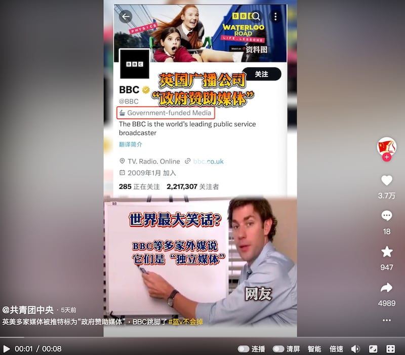
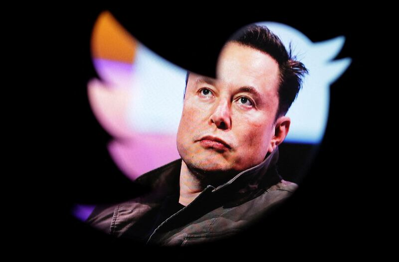
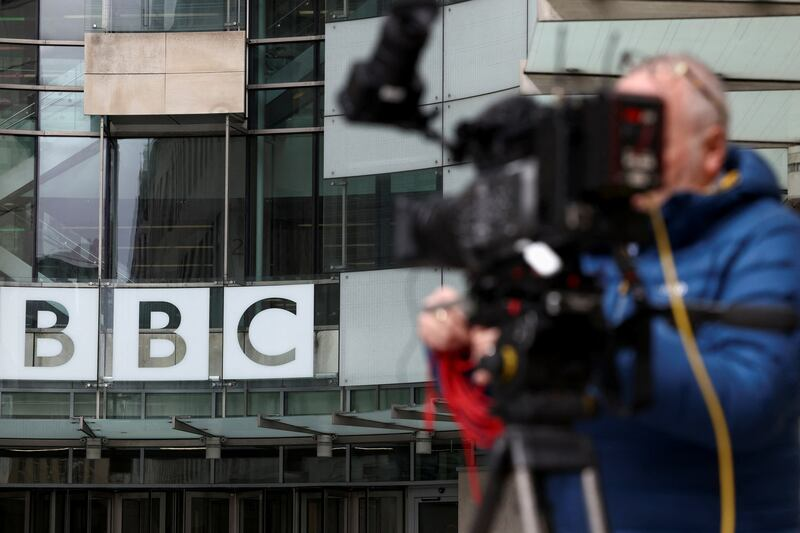

# 事實查覈 | BBC、NPR等媒體的獨立性是"世界最大笑話"嗎？

作者：董喆

2023.04.26 15:48 EDT

## 標籤：誤導

## 一分鐘完讀：

英美多家公共媒體遭推特標示爲"政府贊助媒體"，中國共青團中央官方社媒帳號以短視頻嘲諷，指這些媒體強調自己的獨立性是"世界最大笑話"。亞洲事實查覈實驗室查覈英美兩國公共媒體相關法規和相關媒體資金來源構成，認爲共青團中央是在借推特標籤爭議，混淆官媒、公共媒體、政府贊助媒體和獨立媒體等概念，誤導公衆。

## 深度分析：

中國共青團本月12日發佈一則抖音視頻，標題爲“英美多家媒體被推特標爲‘政府贊助媒體’，BBC跳腳了”，內容列舉英國廣播公司（BBC）、美國全國公共廣播電臺（NPR）、美國公共電視網（PBS）、美國之音（VOA）的推特頁面截圖，並強調其“政府資助媒體（Government-funded Media）”標籤。

共青團以短視頻暗指多家外媒收受英美政府資金，並非獨立運作的媒體組織。（圖取自抖音）

伴隨畫面，視頻中響起旁白：“快看呀！快看呀！我是英美政府出資的！”，又輔以字幕“世界最大笑話”來抨擊上述媒體收受英美政府資金，並非獨立的媒體組織。

## 推特標籤爭議從何起？

推特的媒體帳戶標籤爲何突然遭到共青團截圖嘲諷？起因或與推特4月初的爭議有關。

推特在2020年8月推出針對各國官媒的標籤政策，揭露沒有編輯獨立性的官方媒體帳戶，人民日報、新華社等都被加註“中國國家附屬（China state-affiliated）”的標籤。

不過今年4月，推特先是將屬於公共媒體的英國BBC及美國NPR各自標示爲“政府資助媒體（government funded media）”及“國家附屬媒體（state-affiliated media）”，引發了輿論批評推特執行長馬斯克（Elon Musk）分不清“官媒”與“公共媒體”的差別。

推特執行長伊隆·馬斯克（Elon Musk）（路透社圖片）

雖然推特隨後將BBC標籤改爲“公共資助（publicly funded）”，同屬公共媒體性質的NPR及PBS則改爲“政府資助媒體（government funded media）”。但此舉仍讓NPR感到不滿，認爲標籤並不能反應其公共治理與編採獨立性，因此將停止在其52個官方Twitter上發佈新內容，PBS也以相同原因停止在推特更新。

## 英美公共媒體的經費來源爲何？

BBC、NPR以及PBS一般皆公認爲“公共媒體”，公共媒體最重要的認定標準是內容產製不受政府幹預，共青團僅以推特標籤爲證據，質疑接受政府捐款等於喪失獨立性。但事實上，各國公共媒體經費來源不一，主要來自電視機執照費、政府撥款或民間捐款。

根據BBC最新 [年度報告](https://www.bbc.co.uk/aboutthebbc/governance/licencefee/),2021年度經費有3800英鎊來自民衆繳交的電視執照費,佔總經費7成,商品與節目銷售則佔約2成。另外BBC亦有在報告中揭露,因應烏克蘭局勢升溫,基於對公正新聞的需求增加,英國政府提供了額外的400萬,資助BBC World持續提供準確且公正的新聞內容,但這筆經費佔BBC全年度預算極低比例。

BBC在英國倫敦的總部（路透社圖片）

在美國,1967年頒佈 [公共廣播法](https://cpb.org/aboutpb/act/)(Public Broadcasting Act),成立非營利性質的公共廣播公司(CPB),每年由國會通過預算,將納稅人的資金挹注到公共廣播基金中。NPR與PBS便是由CPB撥款補助以及仰賴募捐收入。

根據NPR公佈的 [財務資料](https://www.npr.org/about-npr/178660742/public-radio-finances),NPR年度運營預算中只有不到1%來自CPB和聯邦機構和部門的贈款。其最大宗的經費來源爲企業贊助與會員費(NPR Member organizations),兩者相加佔比爲七成。另外PBS公佈的 [財務報表](https://d1qbemlbhjecig.cloudfront.net/prod/filer_public/pbsabout-bento-live-pbs/Financial%20Reports/288a314672_FY_2022_PBS_Consolidated_Financial_Statements.pdf)也顯示,企業贊助是最主要的收入來源。

因此共青團抖音視頻中譏諷的3家英美公共媒體，其大宗資金皆不是來自政府。

## 推特撤除全球媒體機構標籤

鑑於媒體標籤引發的爭議，21日起推特針對全球媒體機構的帳戶推行了新的政策——移除所有媒體標籤，原先規範標籤準則的網頁也已下架。

目前BBC、NPR、PBS等媒體已不再擁有任何標籤，但這次的政策“一視同仁”地將中國與俄羅斯官媒的媒體標籤一併移除，又引起另一波批評。

## 結論：

BBC、NPR以及PBS的政府資助資金在其營運資金中佔比極低，且公共媒體的編輯獨立性接受到該國法律規範。共青團藉由推特與上述媒體機構的標籤爭議，稱英美多家公共媒體沒有獨立性是誤導論述。

*亞洲事實查覈實驗室（Asia Fact Check Lab）是針對當今複雜媒體環境以及新興傳播生態而成立的新單位。我們本於新聞專業，提供正確的查覈報告及深度報道，期待讀者對公共議題獲得多元而全面的認識。讀者若對任何媒體及社交軟件傳播的信息有疑問，歡迎以電郵afcl@rfa.org寄給亞洲事實查覈實驗室，由我們爲您查證覈實。*

[Original Source](https://www.rfa.org/mandarin/shishi-hecha/hc-04262023153903.html)