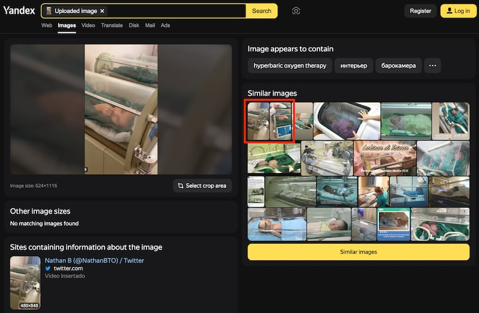
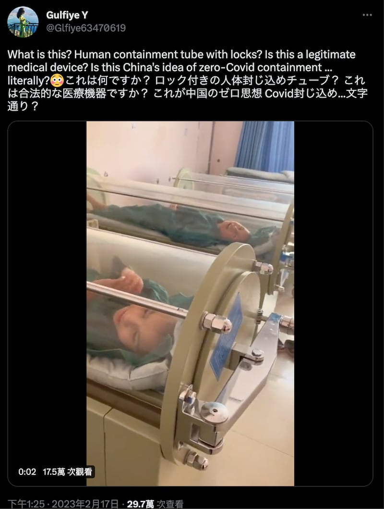
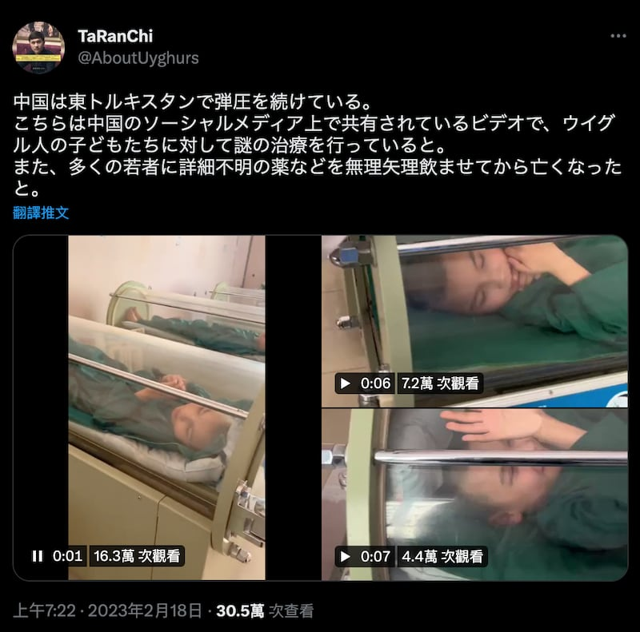
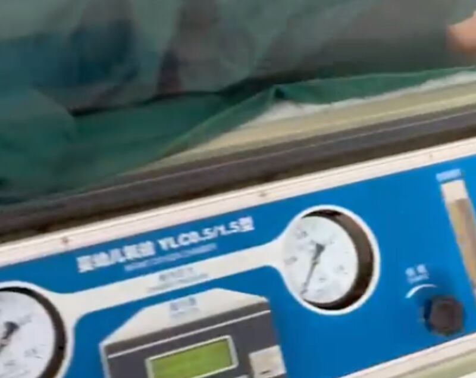
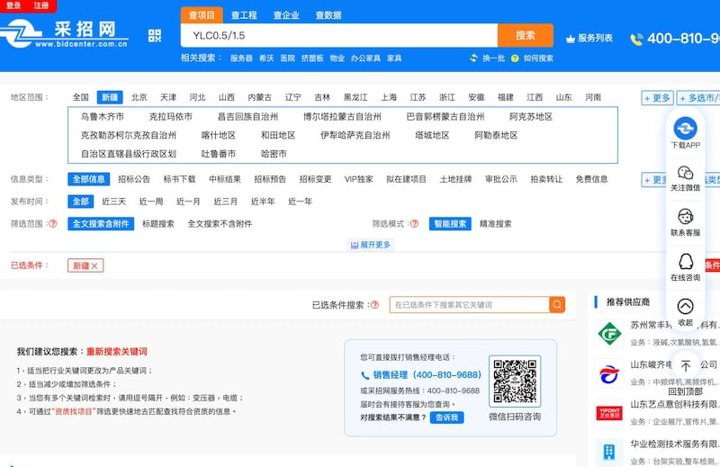

# 事實查覈 | 維吾爾族兒童"被關不明艙體"、"遭下毒摧殘"？

作者：董喆

2023.04.27 13:41 EDT

## 標籤：欠缺證據

## 一分鐘完讀：

4月，一些推特賬戶發佈了一段維吾爾兒童躺在圓筒形艙體中的影片，傳播者稱，這些兒童正遭到“中共恐怖集中營摧殘關押”，引起部分網友憤慨。但同時，也有網友質疑其真實性，批評該影片疑似低級造假，故意下套“釣魚”，誤導民衆。

亞洲事實查覈實驗室根據影片截圖找到該影片其餘更完整的片段，且從中找到艙體的型號與用途，確定該設備是兒童高壓氧艙，並通過採訪熟悉高壓氧治療的醫生，瞭解到影片中的情景是腦性麻痹兒童正在接受高壓氧治療。

## 深度分析：

4月15日,一則稱維吾爾兒童遭摧殘關押的 [推文](https://twitter.com/jielijian/status/1647129494413791232)引起了輿論廣泛關注,在短時間內被三百多人轉發,十餘萬人閱讀。有人義憤填膺聲討中共"反人性";有人則質疑其真實性,建議"反共要用真相,不能用謊言";也有網友批評推主發文的動機,質疑其爲"釣魚"的"反串黑"。

該名在推特上擁有4.6萬訂閱者的推主是旅美民運人士界立建。在他上傳的這則短視頻中，有兩名兒童仰躺在圓柱狀的艙體中，一旁有穿着白大褂的成年人正在操作艙體上的開關。

界立建爲該視頻配的推文是：“可憐的維吾爾族孩子被中共恐怖集中營摧殘關押中，他們的父母很多都被關押中共集中營進行種族滅迫害，直到生命最後一刻都沒有看到骨肉孩子最後一眼。#邪惡共匪人類公敵”。

值得注意的是，留言中有許多網友提出，推主引用的影片比較像是高壓氧治療，而並非關押施虐，呼籲推主審慎發言。

## 影片中的不明艙體究竟是什麼

爲了追查影片來源，亞洲事實查覈實驗室使用了各大圖片搜尋引擎查找，最後在搜索引擎網站Yandex上找到了相同的兩段影片（紅框處），來源皆是推特，且發佈時間最早可追溯回2023年2月。

較早發佈的同一影片 Yandex截圖

根據Yandex的搜尋結果，2月17日與2月18日皆有相同的影片在推特傳播，兩則推文皆是日文推主發佈，但對影片內容各有不同解讀。

[17日的推文](https://twitter.com/Glfiye63470619/status/1626452694658326531)質疑影片是中國爲了新冠清零而將人鎖在水管狀的艙內。 [18日的推文](https://twitter.com/AboutUyghurs/status/1626723759154679808)則與4月中在華文社羣裏傳播的口徑類似,指維吾爾兒童正遭受"神祕的待遇",且有人遭強迫餵食不明藥物後死亡。

2月17日和18日在日文社區流傳的該視頻及解讀截圖

2月17日和18日在日文社區流傳的該視頻及解讀截圖

由於18日的推文有更加完整的共三段影片，我們放大其中一段影片，發現可看見疑似簡體字印製的艙體型號——“嬰幼兒氧艙 YLC0.5/1.5型”。

在百度搜尋"嬰幼兒氧艙 YLC0.5/1.5型",結果顯示,影片中的艙體是由中國湖北武漢海博瑞科技有限公司生產的嬰幼兒氧艙,在 [中國環球醫療器械網](https://ylqx.qgyyzs.net/business/zs162213.htm)上,該產品用途的說明是:在醫療機構中使用,用於新生兒窒息、癲癇、新生兒吸入性肺炎、缺氧缺血性腦病的治療。

影片中的高壓氧艙型號截圖

## 高壓氧艙是用來虐童還是治療的？

成立於1967年、由30個國家共2千多名相關醫療專家組成的海底和高壓醫學會(UHMS)是高壓氧治療領域的權威組織,他們明確指出, [高壓氧的適應症包含](https://www.uhms.org/resources/hbo-indications.html):氣體栓塞、一氧化碳中毒、潛水夫症、急性燒灼傷與突發性耳聾等。

中華民國高壓暨海底醫學會理事長夏德椿醫師告訴亞洲事實查覈實驗室，影片中的設備確實是標準的兒童單人高壓氧艙。

夏德椿說明，兒童與成人的高壓氧治療適應症大致相同，但兒童的適應症多了腦性麻痹與自閉症。夏德椿根據影片中兒童手腳呈現抽筋狀的樣態，判斷應屬腦性麻痹患者。

夏德椿補充，目前全球主流的高壓氧艙多爲歐美國家制造，唯有中國使用的皆爲中國產設備，因此基本上可以確定該影片發生地點應是在中國，而根據影片中的設備陳列方式，應屬於某間醫院的高壓氧治療中心。

至於有一說影片是中國新冠清零政策的醫療手段，夏德椿解釋目前高壓氧治療並非新冠肺炎的正規治療方式。

## 結論：

根據影片中的設備型號以及高壓氧艙領域專業醫師判斷，網傳視頻中，兒童所處的“不明艙體”應是高壓氧艙，沒有證據表明他們正在遭受推特文中所指的“關押和虐待”。無論是2月流傳於日文社羣的推文，還是4月流傳於中文社區的推文，傳播的都是證據不足的信息。且由於缺乏足以精準識別人臉並定位身份信息的工具，AFCL無法準確判斷視頻中兒童究竟是不是維吾爾人，上述推文博主同樣也沒能提供證據證明這一點。

*亞洲事實查覈實驗室(Asia Fact Check Lab)是針對當今複雜媒體環境以及新興傳播生態而成立的新單位。我們本於新聞專業,提供正確的查覈報告及深度報道,期待讀者對公共議題獲得多元而全面的認識。讀者若對任何媒體及社交軟件傳播的信息有疑問,歡迎以電郵 [afcl@rfa.org](http://afcl@rfa.org)寄給亞洲事實查覈實驗室,由我們爲您查證覈實。*--------------------------------------------------------------------------

## [ 2023/5/4 更新 ]

亞洲事實查覈實驗室收到了讀者的反饋，認爲我們沒能查覈出影片的確切地點。

面對讀者的質疑，我們的回覆是：

進行這個議題查覈時，第一目標就是找出時間地點，但待查覈的三段影片均不到10秒，透過各大影像查覈工具，僅能找出twitter上的轉發影片，未能追查出最原始的影片來源。

既然無法判斷原始來源，我們希望透過影片中的諸多細節來貼近事實。

首先是找出機器的型號,我們在百度以「嬰幼兒氧艙 YLC0.5/1.5型」進行搜尋,發現中國有不少省份都曾有此型號的招標公告,包含 [2018年河南省開封市](https://www.bidcenter.com.cn/newscontent-63547109-1.html) 、 [2010年山東省濟南市](https://www.bidcenter.com.cn/newscontent-6466970-1.html) , [2016年江西省贛州市](https://www.bidcenter.com.cn/newscontent-27648871-4.html) 。但若將範圍設定在新疆,則查無相關資訊。

考量採招網站可能有所侷限性，未登錄資料，我們也不能直接推論新疆地區的醫院不曾採購該型號機器，因此我們也無法確實排除影片拍攝的地點在新疆的可能性。

面對讀者的質疑，亞洲事實查覈實驗室認爲，因此根據現有線索及工具，疑則存疑，我們確實無法斷定或者排除影片拍攝的地點。我們將持續關注相關資訊，若發現有新的證據，我們將隨時更新、補充。

## [ 2023/5/8 更新 ]

經過進一步討論，亞洲事實查覈實驗室認爲將本文標籤爲“欠缺證據”，比原標籤“錯誤”在邏輯上更加嚴謹，因而做此改動。

[Original Source](https://www.rfa.org/mandarin/shishi-hecha/hc-04272023133655.html)