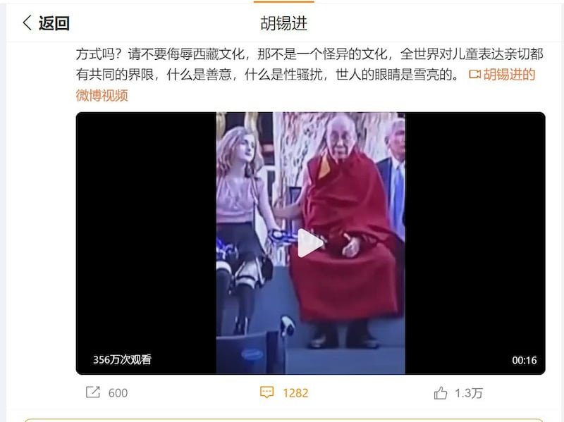
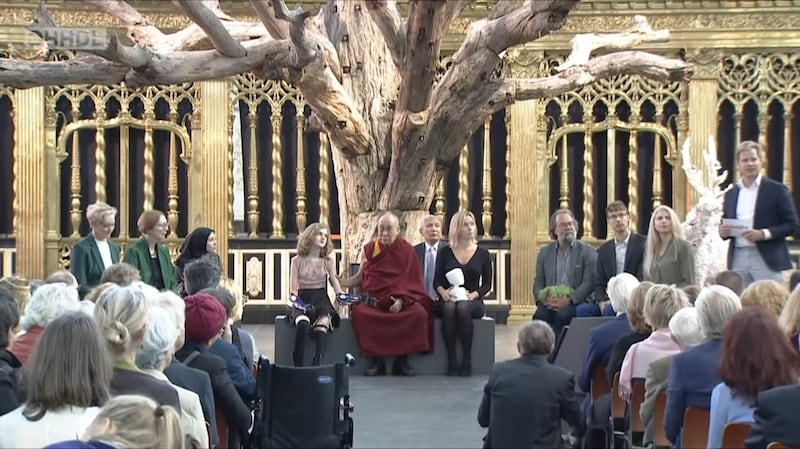
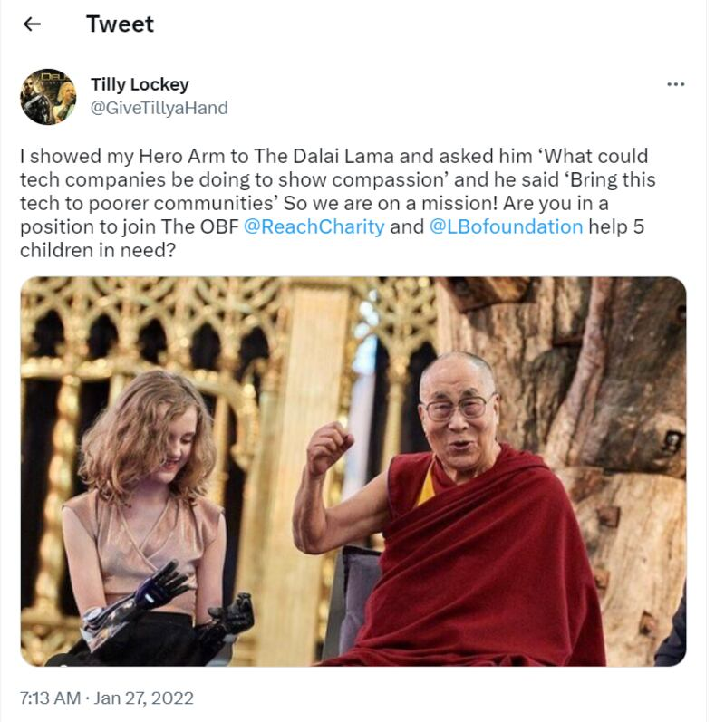
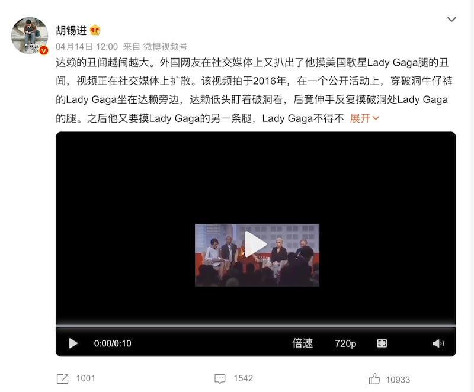

# 傳播觀察｜達賴喇嘛"舌頭門"事件之後，有人在組織輿論嗎？

作者：鄭崇生

2023.04.28 14:21 EDT

"哪個年輕女人願意接受老男人這樣的'親切表達'呢?""全世界對兒童表達親切都有共同的界限,什麼是善意,什麼是性騷擾,世人的眼睛是雪亮的。"——4月16日,環球時報前總編輯胡錫進在個人 [微博](https://weibo.com/1989660417/MCiP1mfhO)上發佈了一段模糊的影片,影射達賴喇嘛騷擾因病失去雙手雙腳的英國女孩蒂莉∙洛基(Tilly Lockey)。

影片中，達賴喇嘛和蒂莉一起坐在公開活動現場，撫摸着她裝着仿生機械手臂的上臂。這一段視頻在胡錫進微博上至少已有超過350萬人次觀看。文章下面，有留言者批判達賴喇嘛是“戀童癖”、“老流氓”。

這是前不久達賴喇嘛“舌頭門”事件發生之後，中國社交媒體上流傳衆多關於達賴喇嘛的負面消息之一。2月，達賴喇嘛在印度出席一個公開活動，對一個求他擁抱的小男孩說“吸我舌頭”。該影片經美國之音藏語主頁發佈一個多月後，引發爭議，4月11日，達賴喇嘛辦公室發佈了道歉聲明，衆多媒體跟進報道，激烈爭論仍在持續。

在這之後，中國媒體和社交媒體又有其它影片開始大量傳播，除了上述發生於2018年的達賴“撫摸”蒂莉的片段之外，還有2016年美國歌手Lady Gaga被達賴“摸膝蓋”的視頻。

這些影片，哪些內容是事實？哪些曾經被“加工”製作？背後是不是有“帶節奏”的集中傳播？

## "舌頭門"事件引發爭議

達賴喇嘛的"舌頭門" [完整視頻](https://www.newsweek.com/dalai-lama-kisses-boy-tibet-video-1793401)拍攝於印度達蘭薩拉,一位小男孩在公開活動中向達賴喇嘛提出,想要一個擁抱。男孩走上前去,達賴喇嘛指着自己的臉,說"先是這裏"。 男孩給了他一個吻,然後微笑着擁抱了他。接着,達賴喇嘛指指自己的嘴脣,親吻了男孩的嘴脣,現場可以聽到觀衆的笑聲和掌聲,然後,達賴喇嘛說,"吸我的舌頭",同時伸出舌頭,最後收回去,並用自己的額頭和男孩的額頭碰在一起。

這段視頻引發了激烈的批評和爭論。信仰藏傳佛教,或是擁護達賴喇嘛的一方認爲,這是一個純真無邪的場景,男孩受到了尊者的愛護和關懷,並引述傳統西藏文化的證據,強調達賴喇嘛的舉止行動並沒有侵犯和冒犯的意味。而另一方認爲,達賴喇嘛與男孩的接觸過於親密,讓人反感,在很多文化中,都會被解讀爲侵犯兒童權益的行爲, 例如印度兒童權利組織 ["Centre for Child Rights"組織表示](https://www.devdiscourse.com/article/politics/2411528-row-over-video-dalai-lama-apologises-for-hurt-his-words-may-have-caused),無法接受這樣的"西藏文化表達"。

當事雙方——小男孩和達賴喇嘛本人也對此做出了回應, [小男孩和媽媽接受採訪](https://www.youtube.com/watch?v=ZViETIhJ3Ek)時稱,他們認爲和達賴喇嘛的互動是非常美好的經歷, [達賴喇嘛辦公室聲明](https://twitter.com/DalaiLama/status/1645312490597937152?ref_src=twsrc%5Etfw%7Ctwcamp%5Etweetembed%7Ctwterm%5E1645312490597937152%7Ctwgr%5E69e930951bc622b2afe18cb0820a3ec4ff1b2f37%7Ctwcon%5Es1_&ref_url=https%3A%2F%2Fwww.dw.com%2Fzh%2FE8A2ABE689B9E4B88DE5BD93E4BAB2E590BBE5B08FE794B7E5ADA9E8BEBEE8B596E59687E5989BE585ACE5BC80E887B4E6AD89%2Fa-65272121)中則對可能造成的傷害表示道歉,並強調,達賴喇嘛經常會天真而俏皮的和身邊人"開玩笑"。

然而，此事餘波未了，尤其在視達賴喇嘛爲輿論禁區的中國，許多新聞媒體、意見領袖開始熱議達賴喇嘛的諸多“罪狀”，並有大量舊視頻開始傳播。

## 達賴喇嘛對蒂莉伸出“鹹豬手”？

其中一個流傳甚廣，引發不少網友憤慨的，即是達賴喇嘛“騷擾”著名的截肢女孩。

亞洲事實查覈實驗室查證了相關資料，並向蒂莉的經紀人問詢當時的情況。

這場活動2018年9月15日在荷蘭舉行,旨在探討科技如何幫助人類獲得更美好的生活。那時,蒂莉只有13歲,她左腳穿有輔具,一雙手則裝上如同剛鐵人般的仿生手臂。活動開始時,她緩步走上舞臺,與包括達賴喇嘛在內的衆人分享自己嬰兒時期罹患腦膜炎,引發敗血症並不得不截肢的經歷。2021年,17歲的蒂莉還在自己的 [推特](https://twitter.com/GiveTillyaHand/status/1486673771553603585?s=20)上回憶當時的情景,並貼出了兩人當時在活動上的合照。

胡錫進微博發貼展示被剪切的達賴喇嘛與蒂莉互動的視頻，並稱這是“性騷擾”。（胡錫進微博截圖）

達賴喇嘛官方Youtube賬號保留了這場近兩個小時活動的 [完整視頻](https://www.youtube.com/watch?v=wtgl3__oEv4),當時蒂莉笑着向達賴喇嘛展示科技的進步如何幫助她擁有了一雙與衆不同的手,達賴一開始表現得驚喜於女孩能開朗自信地操作智能手掌,並與她的機械手握手。

兩人真實的“肢體接觸”發生在蒂莉向達賴講述她的故事之後。

她說，醫生當時宣告才15個月大的她性命難保，而她卻奇蹟般地活了下來。達賴喇嘛聽到這裏時，拍撫了她的背。

被胡錫進引述的視頻片斷髮生於活動尾聲、視頻 [約1小時45分35秒處](https://www.youtube.com/watch?v=wtgl3__oEv4),主持人請蒂莉再上臺,坐在達賴喇嘛旁邊,她搖搖晃晃的走上前時,達賴喇嘛伸出手抓住了她的上臂,扶她坐下,之後,他用右手在蒂莉的上臂上撫摸了幾下。

2018年活動現場，達賴喇嘛扶截肢女孩坐下後，撫摸她的上臂。（圖/取自達賴喇嘛Youtube賬號）

對比原視頻發現，胡錫進引用的畫面擷取達賴喇嘛撫摸上手臂的16秒視頻，是經過放大處理的片段。原本現場全景的畫面，被裁切到只有蒂莉與達賴喇嘛兩個人。

長期觀察中國對外宣傳的美國智庫外交關係委員會東南亞事務資深研究員約書亞∙科蘭茲克（Joshua Kurlantzick）認爲，這種經後製、刻意放大“達賴喇嘛撫摸女孩手臂”做法，企圖達到的傳播效果或許是要讓事件“看起來更糟糕，甚至有些危險。”

蒂莉在推特上回憶自己與達賴喇嘛的互動（Tilly Lockey推特截圖）

在亞洲事實查覈實驗室的問詢下，蒂莉的經紀公司Tainted Ltd也代表她首次回應了外界關注。公司在電郵信函中表示：“蒂莉當時和達賴喇嘛的接觸完全只有善意與敬意，提出要讓蒂莉回答對達賴喇嘛充滿險惡用心的問題是讓人感到不悅的。”

## 達賴喇嘛摸Lady Gaga膝蓋是怎麼回事？

胡錫進發布的另一則廣爲流傳的視頻,則是 [達賴喇嘛和美國歌手Lady Gaga的互動,](https://s.weibo.com/weibo?q=%E8%BE%BE%E8%B5%96%20lady%20gaga)胡錫進表示,這證明了"達賴在公開場合搞變態、下流之舉已非'初犯'。"

達賴和Lady Gaga在一個活動上的視頻片段再引發爭議，胡錫進在其微博上轉發。（微博截圖）

亞洲事實查覈實驗室查證 [完整視頻](https://www.youtube.com/watch?v=K853S_1rzyU),該活動爲2016年6月26日在美國印第安納州舉行的全美市長會議,二人在一個活動上談論如何應對以善意和共情應對世界上的不公正。在視頻開始的第一分鐘,在主持人介紹本次活動時,達賴喇嘛低下頭看Lady Gaga牛仔褲上的破洞,並用手撓了撓她露出的膝蓋,並看着她呵呵笑了幾聲,然後又伸手去撓另一隻腿,Lady Gaga抓住了他的手,也笑了幾聲。

在接下來的一個小時裏，活動正常進行。

在關於該活動的 [另一個新聞剪輯](https://www.youtube.com/watch?v=IrYpqQQ6_1M)中,達賴喇嘛與LadyGaga站着握手後,他又低下頭去,似乎故意開玩笑的去碰Lady Gaga的牛仔褲上的破洞,Lady Gaga 大笑,轉頭對鏡頭說"他喜歡我今天的裝束"。

在上述"舌頭門"事件後,這個場景被剪切發佈到推特,亞洲事實查覈實驗室目前找到的 [最早一條推文](https://twitter.com/OliLondonTV/status/1646313645343752194)發佈於4月12日,引發大量討論、轉發,許多評論認爲達賴喇嘛的行爲讓人反感,是對女性的冒犯;也有人認爲他是在開玩笑,稱在很多文化背景中,身體接觸很正常。在這條推文下方評論中,反感達賴喇嘛行爲的評論明顯佔上風。

針對這個視頻，亞洲事實查覈實驗室並未找到Lady Gaga本人或是達賴喇嘛對此事的聲明。

## 敏感詞"達賴"忽然解禁

“吸舌頭”、“摸手臂”、“碰膝蓋”——這三段涉及達賴喇嘛的視頻都引發了不小爭議，檢視其原始視頻和事後造成的影響，達賴喇嘛與對話者“親密接觸”的行爲確實存在不少爭議，例如在達蘭薩拉與小男孩的接觸，與Lady Gaga對話時的舉動；但也有一些被斷章取義、刻意扭曲、誇大的情況，例如他和截肢女孩蒂莉的互動。

然而在中國的互聯網輿論場，亞洲事實查覈實驗室則發現了輿論操作的跡象。“達賴”——中國用以貶低達賴喇嘛的稱呼，是中國互聯網上長久以來的敏感詞或禁忌詞，這陣子突然在搜索引擎和社交媒體解禁，同時，在社交媒體上釋放出大量、單一的負面消息。

截至發稿爲止,以"達賴"兩字在新浪 [微博](https://s.weibo.com/topic?q=%E8%BE%BE%E8%B5%96&pagetype=topic&topic=1&Refer=weibo_topic)上搜索,累計共有2000個討論標註、超過2000萬次的閱讀量,所有內容無一例外都是對達賴喇嘛的"揭批"。

這個現象並不尋常，因爲長久以來，“達賴”是很難出現在中國大陸的互聯網討論中的。

達賴喇嘛的名字、照片在中國的公共空間都是長久以來的禁忌,德國之聲曾報道,在四川藏區,有僧人 [曾因手機中保存有達賴的照片遭到官方抓捕](https://www.dw.com/zh/%E4%BC%A0%E5%9B%9B%E5%B7%9D%E7%99%BE%E5%90%8D%E8%97%8F%E4%BA%BA%E8%A2%AB%E6%8D%95-%E7%96%91%E4%B8%8E%E4%BF%9D%E5%AD%98%E8%BE%BE%E8%B5%96%E5%96%87%E5%98%9B%E5%9B%BE%E5%83%8F%E6%9C%89%E5%85%B3/a-59069963)。

而自由亞洲電臺曾 [報道](https://www.rfa.org/cantonese/news/hacker-04242019122152.html?encoding=simplified),荷蘭非營利組織GDI基金會的安全研究員葛弗斯(Victor Gevers)研究、發佈了觸發微信審查的800多箇中文"敏感詞"列表,包括"達賴喇嘛"、"流亡藏人"等都在名單上。

加拿大多倫多大學的公民實驗室（Citizen Lab）在2022年針對北京冬季奧運手機app“冬奧通”的研究也發現，“達賴喇嘛”、“尊者”都被列爲敏感詞。

被列爲敏感詞後，置身於防火牆內的公衆不僅不能自由發佈含這些詞彙的信息，甚至無法從微博、微信等社交媒體的搜索框內找到與之相關的信息。最典型的特徵就是會出現“根據相關法律法規，該結果/部分搜索結果不予顯示”。

而此次“達賴”成爲輿論熱點，很可能是宣傳官方刻意放開了對相關敏感詞的管制。

亞洲事實查覈實驗室已無法查證在“舌頭門”事件之前微博、百度對於“達賴”等關鍵詞的搜索結果，然而多位關注西藏議題的人士都表示，曾經歷過此前中國國內對“達賴”等關鍵詞的嚴管，這次事件後，很多人也觀察到，中國內地互聯網對達賴喇嘛的討論，確實出現了突然的“井噴”。

並且，在中國的搜索引擎和社交媒體上，用相關關鍵詞能夠搜索到的內容，只有一邊倒的對“舌頭門”事件的片面報道，以及類似上述兩個舊視頻等負面消息。其他關於達賴喇嘛相關近況消息、“舌頭門”事件完整視頻和當事人採訪，都無法找到。

## 內、外宣分進合擊？

也有觀察人士懷疑，在中國之外，該事件的傳播或也有中國方面的力量助推、操縱。

在"舌頭門"風波中,一名香港作者 ["Pazu 薯伯伯"發帖分析](https://www.facebook.com/pazukong/posts/pfbid0vtWvF4y1M4cAyeNWPtSRTsfPup3Vam4cGWmwrpv1BpfEmUAX68z194KrhFjUUZDil)了YouTube 上幾個最早期發佈剪輯影片的帳戶,發現至少有三個傳播影片的帳戶在2023 年3月31日到4月6日間成立,而且一成立便馬上發佈"舌頭門"片段,沒有其他活動。另一個帳戶在2020年1月1日成立,也沒有發表過其它影片。因此有理由懷疑,這些賬戶是有人專門註冊來發布這條信息的賬戶。

亞洲事實查覈實驗室也發現,上述被歪曲的"達賴摸女孩手臂"視頻,也在推特上經由丹尼爾·鄧布里爾(Daniel Dumbrill) [傳播](https://twitter.com/DanielDumbrill/status/1646869466612129792),這位目前定居中國的"網絡博主",曾在 [中國官媒宣傳報道](https://www.chinanews.com.cn/gj/2021/04-11/9452465.shtml)中被稱爲"西方謊言的揭露者"。

## 結論

達賴喇嘛在印度與小男孩的互動在全世界引發輿論海嘯，基於不同社會文化背景，各界對該事件或批評、反感，或維護、讚揚，表達了多元意見。

在此事件之後，有更多關於達賴“不當行爲”的視頻流出，例如被誤讀、扭曲的“英國女孩手臂事件”，也有確實引發爭議和批評的“Lady Gaga膝蓋”事件。

然而，“舌頭門”風波後，在中國輿論場，對“達賴”等敏感詞的討論忽然解禁，並出現了一邊倒的負面訊息和言論井噴的現象，不同於中國境外的多元意見表達。

*亞洲事實查覈實驗室（Asia Fact Check Lab）是針對當今複雜媒體環境以及新興傳播生態而成立的新單位。我們本於新聞專業，提供正確的查覈報告及深度報道，期待讀者對公共議題獲得多元而全面的認識。讀者若對任何媒體及社交軟件傳播的信息有疑問，歡迎以電郵 [afcl@rfa.org](http://afcl@rfa.org)寄給亞洲事實查覈實驗室，由我們爲您查證覈實。*

[Original Source](https://www.rfa.org/mandarin/shishi-hecha/hc-04282023140936.html)