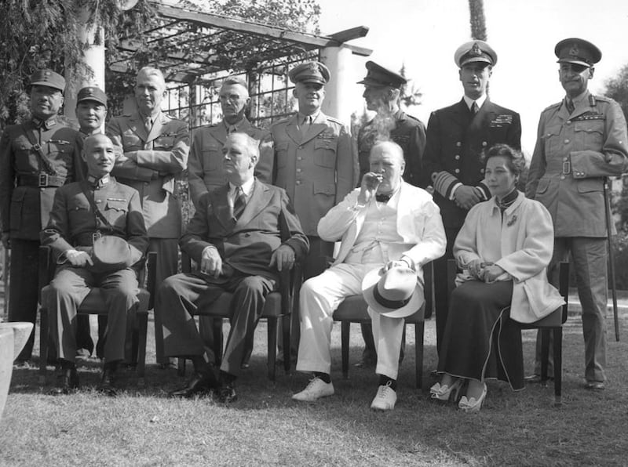
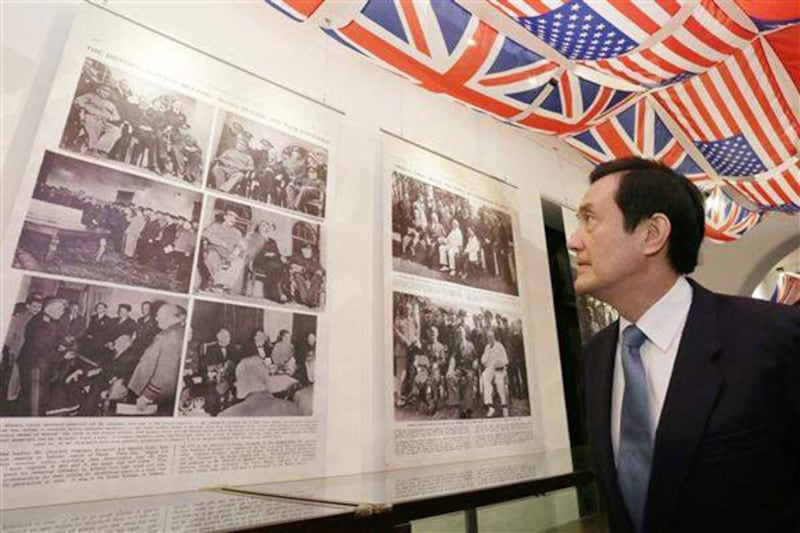

# 事實查覈｜《開羅宣言》和《波茨坦公告》把臺灣歸還給了中華人民共和國嗎？

作者：沈軻

2023.05.02 13:10 EDT

## 標籤：錯誤

## 一分鐘完讀

中國外交部長秦剛四月下旬在一場演講中表示，1943年發表《開羅宣言》和1945年的《波茨坦公告》是兩份證明北京政府對臺灣擁有主權的歷史文件。

但亞洲事實覈查實驗室認定中國的主張是錯誤的。

因爲考察這兩份文件發現，它明確規定了二戰結束時日本投降的條件，包括放棄對臺灣的控制權，並將臺灣歸還給中華民國。而且它們發表時，中華人民共和國根本還未建立。

亞洲事實覈查實驗室認爲，這兩份宣言不能作爲解決中華民國和中華人民共和國間關於臺灣主權歸屬政治爭端的依據，但秦剛等中國官員經常發表的類似聲明，忽視了中華民國對臺灣行使主權的既成事實。

## 深入分析：

從1949年中國內戰結束至今，統治中國大陸的北京政府聲稱自己是代表中國的唯一合法政府，並拒絕承認中華民國對臺灣的事實主權。中共外交部長王毅在2022年9月的一次講話中簡明扼要地說：“中華人民共和國政府是代表整個中國（包括臺灣）的唯一合法政府。”王毅也說：“上述具有法律約束力的國際文書（《開羅宣言》和《波茨坦公告》）已充分將臺灣無論是從事實上還是從法律上歸還給中國。”

中國外交部長秦剛2023年4月21日在上海的一場公開演講上再一次做出政策宣示：“臺灣迴歸中國是二戰後國際秩序的組成部分，《開羅宣言》白紙黑字寫着，《波茨坦公告》清清楚楚印着。”外交部發言人華春瑩隨後發推文重申了這一主張。

王毅和秦剛的聲明都認爲，上述兩份宣言最初的意圖正是解決中華民國和中華人民共和國之間關於臺灣主權的爭端。

開羅會議檔案照片，左起：蔣中正、羅斯福、丘吉爾、宋美齡。

## 《開羅宣言》或《波茨坦公告》可以確認臺灣歸屬"哪個中國"嗎？

答案是：“不行。”

卜睿哲(Richard C. Bush)目前擔任布魯金斯東亞政策研究中心(Center for East Asia Policy Studies,The Brookings Institution)高級研究員，他也曾是美國在臺協會理事主席，著有多本美中臺關係著作。他對亞洲事實覈查實驗室表示，兩份宣言的目的，並不是解決“中華民國是否應放棄對臺灣的主權，改由中華人民共和國統治臺灣”這樣的問題。

“這兩份宣言主要是二戰後臺灣主權問題的談判開始之前，各國發表的意向性聲明。中華人民共和國的推理是錯誤的。”卜睿哲指出，考慮到在這兩份宣言發佈時，中華人民共和國甚至還沒有宣佈成立，使用這樣的宣言來解決中華人民共和國和中華民國關於臺灣的爭端是不合邏輯的。

中華人民共和國官員經常聲稱《開羅宣言》將臺灣及其周邊島嶼“歸還給中國”，而不是原始條約中的完整措辭“中華民國”。在中國大陸印刷、發行的《波茨坦公告》，常常將文章開頭的“中華民國國民政府”縮寫爲“中國國民政府”。

這些看似微小的改變使中華人民共和國更容易聲稱該條約賦予他們對臺灣的司法管轄權和主權。這些術語與原始措辭非常接近，聽起來具有說服力，但又有所不同，可以迴避中華民國仍然存在的棘手事實。

卜睿哲表示，清朝自17世紀末至1895年期間在臺灣保持了司法管轄權和主權，而中華民國自二戰結束時臺灣的日本軍隊投降以來一直完全控制着臺灣。

卜睿哲說：“這兩份宣言只是關於二戰後關於臺灣歸屬的‘意向聲明’。當時，國際上公認的戰後領土轉讓機制是通過和約實現的。不過在太平洋戰後簽訂的《舊金山和約》中，日本只放棄了對臺灣的所有權，而沒有將其劃歸給任何國家。”

臺灣前總統馬英九任內非常重視《開羅宣言》將臺灣交還中華民國的歷史事實，曾經舉辦紀念展覽。(照片取自臺灣總統府新聞資料庫)

不過臺灣國民黨的 [主張](https://www.npf.org.tw/3/9664) 認爲中華民國與日本在1952年簽訂的《中日和約》中已經規定在1941年12月9日以前"所締結之一切條約、專約及協定,均因戰爭結果而歸無效。"換言之,1895年清朝簽訂的《馬關條約》也因此失效。

## 結論：

亞洲事實覈查實驗室發現，中華人民共和國官方聲稱《開羅宣言》和《波茨坦公告》證明臺灣的領土最終必須由中華人民共和國統治的說法是錯誤的。這些文件明確表示日本需要將臺灣歸還給中華民國，但兩份宣言的宗旨並不在解決中華民國和中華人民共和國之間關於臺灣歸屬的爭議。

中華人民共和國的官員聲明立場時，經常只採用有利於其自己政治目標的歷史解釋，同時忽視與這些解釋相矛盾的事實。本案就是一個例子。

*亞洲事實查覈實驗室（Asia Fact Check Lab）是針對當今複雜媒體環境以及新興傳播生態而成立的新單位。我們本於新聞專業，提供正確的查覈報告及深度報道，期待讀者對公共議題獲得多元而全面的認識。讀者若對任何媒體及社交軟件傳播的信息有疑問，歡迎以電郵 [afcl@rfa.org](http://afcl@rfa.org)寄給亞洲事實查覈實驗室，由我們爲您查證覈實。*

[Original Source](https://www.rfa.org/mandarin/shishi-hecha/hc-05022023130021.html)