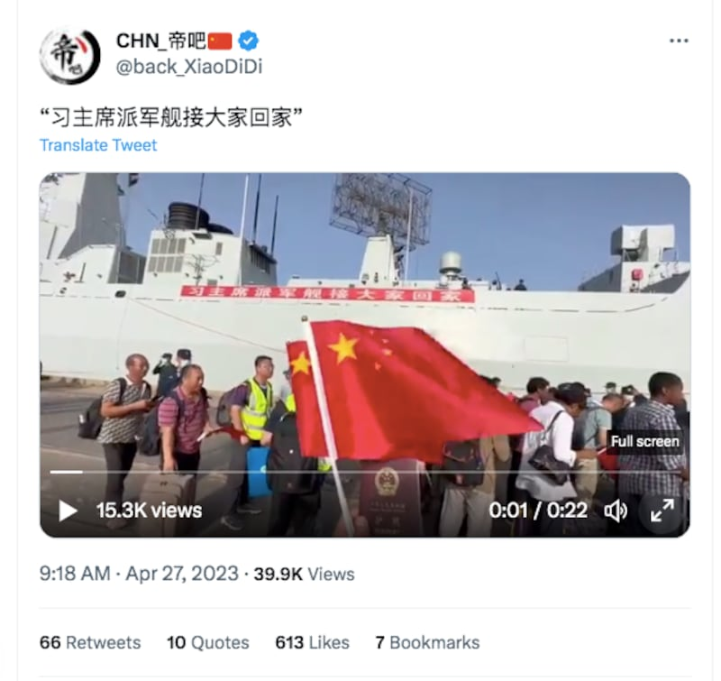
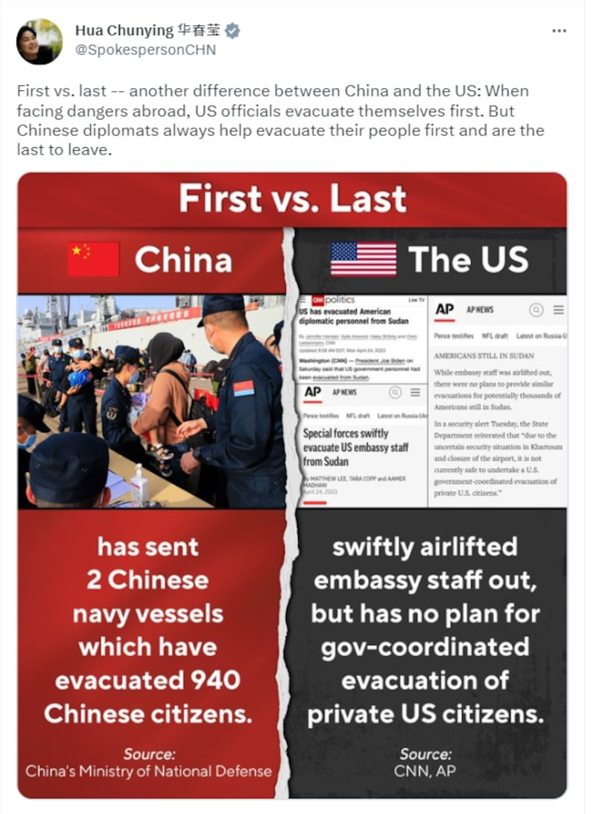

# 事實查覈│各國從蘇丹撤僑，美國卻棄國民不顧？

作者：莊敬

2023.05.04 13:12 EDT

## 標籤：誤導

## 一分鐘完讀：

蘇丹4月15日發生奪權內戰，傷亡慘重，各國陸續撤僑。中國外交部發言人華春瑩29日在推特發文比較美中撤僑的不同，指中國派軍艦順利撤僑，美國政府迅速撤離使館人員，卻沒有撤離美國公民的計劃。中國媒體、社媒平臺也有許多關於美中在蘇丹撤僑的文章，將輿論導向“中國順利撤僑，美國棄國民不顧”。

亞洲事實查覈實驗室發現，美國撤僑速度也許較某些國家慢，但並非“棄國民不顧”。在蘇丹爆發衝突後不久，美國已派軍艦至蘇丹外海待命，也採取措施聯絡在蘇丹的公民以協助他們離開；美國國務院於29日宣佈，由美國組織的車隊已將逃離蘇丹戰火的美國國民和其他國家公民撤離到沿海城市蘇丹港。

## 深度解析：

蘇丹自2021年10月發生軍事政變，局勢動盪。今年4月15日，政府軍和武裝團體“快速支援部隊”（RSF）爆發衝突，期間雖曾達成停火協議，仍未能阻止雙方交戰，造成數百人死亡、數千人受傷。蘇丹局勢持續惡化之下，美國、德國、英國、日本、韓國、中國等多個國家陸續展開撤僑行動。

## 中國藉撤僑大宣傳

[中國國防部新聞發言人譚克非29日表示](http://www.mod.gov.cn/gfbw/qwfb/16221029.html),中國海軍南寧艦、微山湖艦於北京時間4月26日至29日,從蘇丹港撤離940名中國公民、231名外籍人員至沙特吉達港。新華社、央視等官媒大幅報道中國成功撤僑,新聞畫面、照片中,軍艦上掛著"歡迎祖國同胞回到溫暖港灣"的紅色橫幅,撤離人員揮舞著五星紅旗,受訪者說:"強大的祖國是我們堅強的後盾!"

中國派往蘇丹撤僑的軍艦掛上了“習主席派軍艦接大家回家”的橫幅。(“帝吧”推文截圖)

[華春瑩29日在推特發文"最先vs.最後"](https://twitter.com/SpokespersonCHN/status/1652322104476594178),將其描述爲中美之間的"又一區別"——在國外遇到危險時,美國官員先撤離,但中國外交官總是幫助公民撤離,最後才離開。這則推文搭配了一張圖卡,左邊圖片是中國撤僑畫面,並寫道"中國已派2艘軍艦撤離940名公民";右邊圖片則是美國主流媒體所報道的美國撤僑行動,配文寫道"美國政府迅速用飛機撤離美使館工作人員,卻沒有由政府協調撤離美國公民的計劃"。

中國外交部發言人推特截圖

[觀察者網微博視頻號](https://weibo.com/tv/show/1034:4896255932039239?from=old_pc_videoshow)、中通社旗下 ["通說"](https://twitter.com/Tong_Shuo/status/1652925673525194756/photo/1)等媒體都轉發了華春瑩的推文,網易等平臺也出現許多比較美中從蘇丹撤僑差別的文章,像是 ["中國火速撤僑任務完成,美國卻不顧美公民生死"](https://www.163.com/dy/article/I3MCK2D005561Y1A.html?f=post2020_dy_recommends)、 ["中國宣佈成功撤僑,美國卻丟盡了臉,關閉大使館不管上萬公民死活"](https://m.163.com/dy/article/I3HCKABF05562783.html)等。

## 美國撤離蘇丹做法遭批

4月22日, [美國總統拜登下令美軍協助撤離在蘇丹的政府人員](https://www.whitehouse.gov/briefing-room/statements-releases/2023/04/22/statement-from-president-joe-biden-on-the-situation-in-sudan/),並暫停美國駐蘇丹大使館的運作。美國政府以飛機撤離約70名使館人員,其他國家也陸續撤離當地的政府人員或該國公民。但美國國務院仍表示,由於首都喀土穆的安全局勢不明且機場關閉,目前由美國政府協調撤離美國公民並不安全,但政府仍致力於協助留在蘇丹的美國公民在安全條件允許的情況下離開。

據 [美國有線電視新聞網(CNN)](https://edition.cnn.com/2023/04/26/politics/americans-sudan-us-government/index.html)等媒體報道,美國官員估計在蘇丹約有1萬6千名美國公民,多數爲雙重國籍,而且他們"並不想離開"。美國政府的反應引起人們不滿,CNN、 [《華盛頓郵報》](https://www.washingtonpost.com/world/2023/04/26/sudan-fighting-evacuation-americans-british/)等媒體記者採訪了在蘇丹的美國人,有人感到被政府拋棄,有人說自己像是二等公民,他們也抱怨國務院毫無用處。

從蘇丹爆發武裝衝突以來,國務卿布林肯(Antony Blinken)、白宮國安顧問蘇利文(Jake Sullivan)、國安會戰略溝通協調官柯比(John Kirby)等官員都有回應關於撤僑的問題。綜合美方官員的說法,政府2021年起便通過 ["旅遊建議"](https://sd.usembassy.gov/travel-advisory-sudan-level-4-do-not-travel-121421/)等渠道警示民衆勿前往蘇丹,在蘇丹內戰後,也與當地的美國公民聯繫,並積極協助他們離開蘇丹。而大規模撤離居住海外的美國公民並非政府的標準程序。上述官員的立場,其實在 [美國國務院領事事務局網站](https://travel.state.gov/content/travel/en/international-travel/emergencies/what-state-dept-can-cant-do-crisis.html)都有說明。

在蘇丹政府軍與RSF同意延長停火協議後,美國政府展開大規模撤僑。據 [紐約時報報道](https://www.nytimes.com/2023/04/28/world/africa/sudan-cease-fire.html),蘇丹當地時間4月28日,載有約300名美國公民的車隊從喀土穆出發,前往蘇丹港,而美國的無人機一直在監控車隊撤離路線。

[美國國務院29日發佈聲明](https://www.state.gov/evacuation-efforts-of-u-s-citizens-from-sudan/)指出,一支由美國組織的車隊已將逃離蘇丹戰火的美國國民和其他國家公民撤離到蘇丹港;美國在區域和國際合作夥伴的支持之下進行密集談判,爲上千外國和美國公民撤離創造了安全條件,包括這次的行動。

也就是說，在華春瑩發推比較美中撤僑之前，美國政府已採取行動大規模撤僑。事實上，在政府組織撤僑前，也已通過其它方式聯繫、協助在蘇丹的美國公民。

美國從蘇丹大規模撤離公民。(圖取自美國駐吉達總領事館推特賬戶)

## 蘇丹內戰以來，美國政府做了什麼？

4月15日蘇丹內戰,布林肯便通過 [聲明](https://www.state.gov/statement-by-secretary-antony-j-blinken-2/)對外說明蘇丹局勢,並表示一直在與可能在該地區的美國公民溝通安全措施。美國國務院16日發佈 [安全警示](https://sd.usembassy.gov/security-alert-u-s-embassy-khartoum-4/),指目前蘇丹局勢不明且機場關閉,尚無美國政府協調撤離的計劃,建議留在原地避難;有意撤離的美國公民可填表,若遇緊急狀況可致電聯繫。

17日,布林肯分別與蘇丹交戰雙方的兩位將領談話,"強調達成停火的急迫性"。據路 [透社報道](https://www.reuters.com/world/africa/sudans-rsf-leader-hemedti-says-discussed-pressing-issues-with-blinken-2023-04-18/),美國外交使團的車隊17日在蘇丹遭遇炮火襲擊,所幸無人傷亡。此後,布林肯多次與交戰雙方及相關國際夥伴交談,敦促蘇丹停火,並於 [21日](https://www.state.gov/on-the-announcement-of-an-eid-al-fitr-ceasefire-in-sudan/)、 [24日](https://www.state.gov/announcement-of-nationwide-ceasefire-in-sudan/)、 [27日](https://www.state.gov/joint-statement-by-the-trilateral-mechanism-and-the-quad-on-sudan/)分別宣佈達停火協議或同意延長停火。

22日, [美國暫停駐蘇丹大使館的運作](https://www.state.gov/suspension-of-operations-at-embassy-khartoum/),以軍機撤離美國政府人員及家屬,國務院並更新了對蘇丹的 [旅遊建議](https://travel.state.gov/content/travel/en/traveladvisories/traveladvisories/sudan-travel-advisory.html)。

[美國海軍協會新聞網24日報道](https://news.usni.org/2023/04/24/destroyer-uss-truxtun-operating-near-port-sudan-following-u-s-embassy-evacuation),海軍已先行部署驅逐艦特拉克斯頓號(USS Truxtun)到蘇丹港附近,另派遣排水量高達7萬8千噸的基地船路易斯·B·普勒號(USS Lewis B. Puller)至蘇丹外海待命,以支援國務院作業。

國務院副發言人巴特爾(Vedant Patel)在 [28日記者會](https://www.state.gov/briefings/department-press-briefing-april-28-2023/#post-442215-SUDAN1)表示,只有不到5000人與國務院聯繫希望能夠離開蘇丹; [截至5月2日](https://www.state.gov/briefings/department-press-briefing-may-2-2023/#post-443227-SUDAN),美國政府協調組織了三個車隊,讓700人得以離開,而自蘇丹爆發衝突以來,美國政府與盟友及合作伙伴一起幫助1千多名美國公民離開蘇丹。

## 結論：

美國政府對於從蘇丹撤僑行動的反應與速度，確實在國內引起質疑與抱怨，但自蘇丹內戰以來，美國政府持續通過多種管道聯繫、協助當地公民離開，並非外界所指控的毫無計劃、棄國民不顧。中國官員、媒體藉美國民衆批評聲浪進行宣傳，甚至在美國已大規模撤僑後，仍發佈未經更新、不完整的資訊誤導受衆。

*亞洲事實查覈實驗室（Asia Fact Check Lab）是針對當今複雜媒體環境以及新興傳播生態而成立的新單位。我們本於新聞專業，提供正確的查覈報告及深度報道，期待讀者對公共議題獲得多元而全面的認識。讀者若對任何媒體及社交軟件傳播的信息有疑問，歡迎以電郵 [afcl@rfa.org](http://afcl@rfa.org)寄給亞洲事實查覈實驗室，由我們爲您查證覈實。*

[Original Source](https://www.rfa.org/mandarin/shishi-hecha/hc-05042023130402.html)