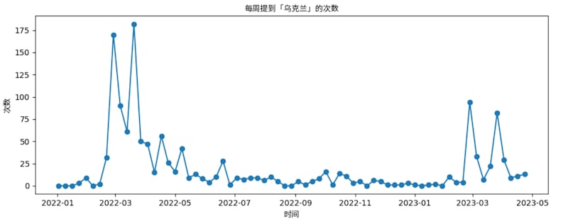
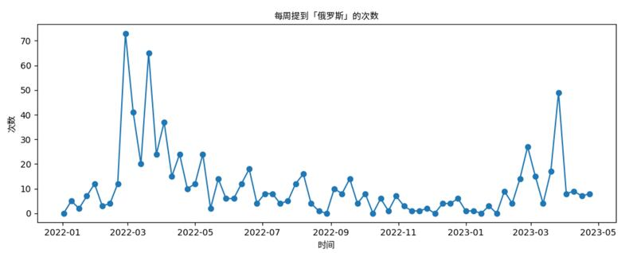
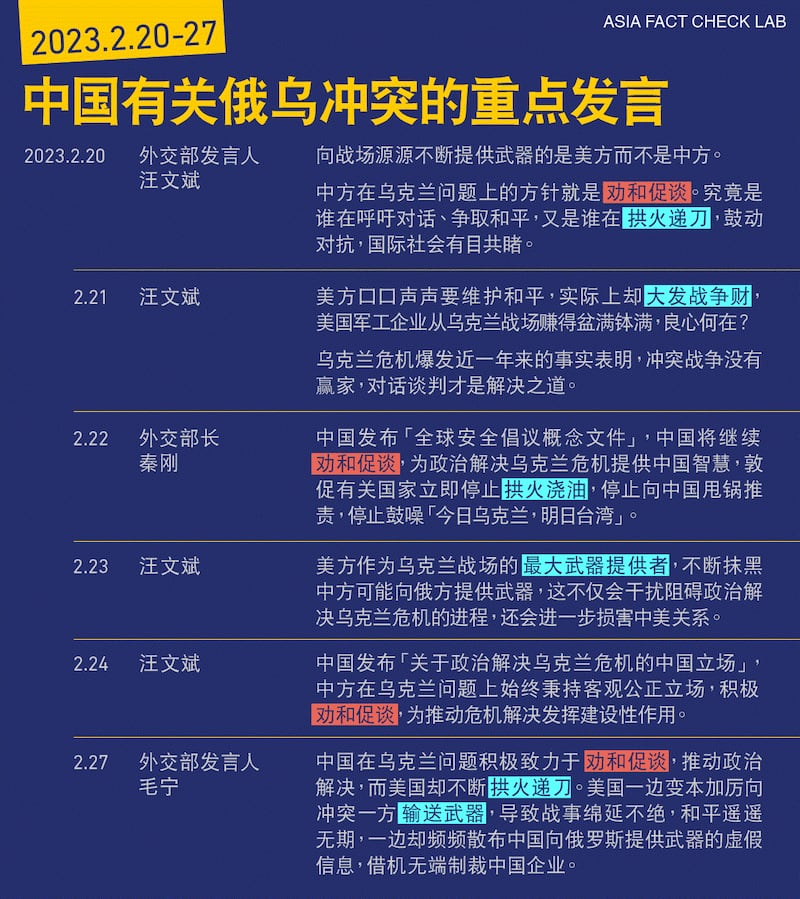
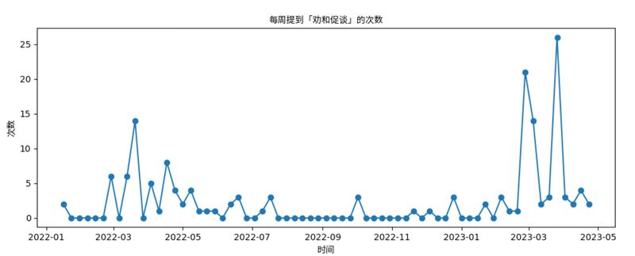
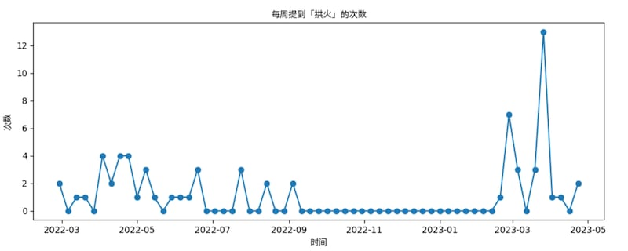

# 傳播觀察｜俄烏戰爭一年多來， 中國怎樣講戰爭故事？

作者：莊敬

2023.05.08 08:30 EDT

2022年2月24日俄烏戰以來，中國國家主席習近平遲未與烏克蘭總統澤連斯基接觸，直到今年春季傳出烏克蘭準備反攻，習近平於4月26日與澤連斯基通話，這也是俄烏開戰後兩人首次通話；中方堅持勸和促談，並將派代表赴烏克蘭等國訪問與各方深入溝通。習澤通話當天，聯合國大會一項議案提到“俄羅斯侵略烏克蘭”，中國在全案表決時仍投下了贊成票，此舉讓外界猜測中國對俄烏戰的態度有所改變。

過去一年多，美國等西方國家持續強烈譴責俄羅斯入侵烏克蘭，與俄羅斯“友好無止境”的中國則始終宣稱對俄烏衝突保持中立，但相關研究與數據顯示，中俄敘事存在一致性，中國政府及其控制的輿論環境，實際上協助宣揚俄羅斯關於戰爭的論點。

近日,亞洲事實查覈實驗室與臺灣民主實驗室(DoubleThink Lab)、烏克蘭公民組織Detector Media和研究機構IRI Beacon Project聯合發佈研究—— ["入侵烏克蘭的一百天:中俄兩國戰爭敘事比較分析"](https://d430ely3up8ax.cloudfront.net/docs/first-100-days-full-report-chn-simplified.pdf)。研究報告顯示,從俄軍侵烏後100天內,中文信息空間的敘事以低成本的方式重複俄語敘事,並且,中俄兩個信息空間中可觀察到共同主題︰反美主義與反西方情緒、認定俄羅斯爲受害者和英雄。

俄烏戰事進入第二年，類似傳播現象仍在持續。亞洲事實查覈實驗室觀察中國對俄烏衝突的敘事，發現，中國媒體仍經常轉載俄方論點，但宣傳重點有所調整，兩個主題逐漸成爲主流敘事：中國爲“勸和促談”的“英雄”、美國爲“拱火澆油”的“反派”。

## 研究：俄烏戰期間 中國複製俄語敘事

上述報告收集了2022年2月12日至5月31日的敘事，選擇三個話題進行分析：生物武器實驗室理論、布查大屠殺、制裁俄羅斯。根據角色、故事寓意和操縱技巧分析敘事，其中將西方國家、俄羅斯、烏克蘭等國家的角色進一步細分爲英雄、反派、受害者、棋子。

敘事分析表明，中國敘事在普通話信息空間中以低成本的方式重複俄語敘事，一種方法是在中文語境中間接或直接引用俄羅斯官員或媒體的言論。在生物武器實驗室陰謀論中，俄羅斯在兩個信息空間中都扮演了英雄和受害者的雙重身份，中俄宣傳都旨在推動一個敘事，即美國和烏克蘭正在合作攻擊俄羅斯。

在針對俄羅斯制裁的敘事中，俄羅斯通常被描繪成受害者，且在中俄兩個信息空間觀察到的敘事都突出了西方機構和國際社會在俄羅斯制裁問題上存在分歧和對立。例如，在布查大屠殺的敘事中，很多媒體報道將西方社會描繪爲反派，俄羅斯則被描繪爲受害者，這些敘事格外注意將布查大屠殺的責任轉嫁給烏克蘭和西方。

亦有其他機構發現,俄羅斯虛假信息使用的主要敘事在俄烏戰爭期間持續進行。美國國務院爲揭露和打擊外國宣傳和虛假信息所設立的"全球參與中心"(Global Engagement Center, GEC),在俄烏戰週年之際發佈 ["克里姆林宮爲無理戰爭詭辯的謊言之年"](https://www.state.gov/disarming-disinformation/%E8%99%9A%E5%81%87%E4%BF%A1%E6%81%AF%E8%BD%AE%E7%9B%98%E8%B5%8C%E5%8D%9A%EF%BC%9A%E5%85%8B%E9%87%8C%E5%A7%86%E6%9E%97%E5%AE%AB%E4%B8%BA%E6%97%A0%E7%90%86%E6%88%98%E4%BA%89%E8%AF%A1%E8%BE%A9%E7%9A%84/)報告,介紹俄羅斯虛假信息和宣傳生態系統所採用的五種最主要的虛假言論:1) 北約對俄羅斯的包圍以及俄羅斯"不是侵略者";2)" 烏克蘭挑釁"和"對頓巴斯的種族滅絕";3) 去納粹化和去軍事化;4) 將戰爭從"去納粹化"重新描述爲"去撒旦化";5) "捍衛俄羅斯主權"對抗西方。

"全球參與中心"特使暨協調員魯賓(James Rubin)日前接受 [英國廣播電臺(BBC)訪問](https://twitter.com/BBCr4today/status/1629040287212269570)時表示,中國一遍遍重複俄羅斯關於這場戰爭的謊言,重複俄羅斯對於生物武器主張的謊言,還稱美國推動這場戰爭,這都是他們的虛假陳述。另據 [德國之聲報導](https://www.dw.com/zh/%E7%BE%8E%E5%9B%BD%E5%9B%BD%E5%8A%A1%E9%99%A2%E7%89%B9%E4%BD%BF%E4%B8%AD%E5%9B%BD%E5%9C%A8%E5%85%A8%E7%90%83%E8%8A%B1%E8%B4%B9%E6%95%B0%E5%8D%81%E4%BA%BF%E4%BC%A0%E6%92%AD%E8%99%9A%E5%81%87%E4%BF%A1%E6%81%AF/a-64852300),魯賓說,中國在全球範圍內花費數十億傳播虛假信息,包括在烏克蘭問題上完全與俄羅斯保持一致的虛假信息。

## 中國宣傳主題 勸和vs拱火

俄羅斯入侵烏克蘭至今逾14個月，據臺灣人工智慧實驗室（Taiwan AI Labs）所設置的未來媒體暨虛假訊息研究中心觀測發現，中國外交部提到烏克蘭、俄羅斯的次數在戰爭初期出現高峯，當年5月後減少，今年2月至4月顯着增加。

中國外交部提到“烏克蘭”、“俄羅斯”的次數，高峯出現在戰爭初期，去年5月後開始減少，到今年2月至4月顯着增加。來源：臺灣人工智慧實驗室－未來媒體暨虛假訊息研究中心

今年2月至4月發生許多重大事件，包括俄烏戰週年、習近平訪問俄羅斯、芬蘭加入北約等；亞洲事實查覈實驗室檢視中國外交官員近期有關俄烏衝突的發言，發現他們經常提及中國“勸和促談”、美國“拱火”。這些高級別官員的觀點，也經過中國國內媒體進一步傳播、放大。

2023年2月20日至27日中國有關俄烏衝突的重點發言（亞洲事實查覈實驗室整理／製表）

臺灣人工智慧實驗室（Taiwan AI Labs）未來媒體暨虛假訊息研究中心查詢中國外交部使用“勸和促談”、“拱火”等關鍵字的次數，發現中國外交部在俄烏戰初期說過，但今年2月至4月出現使用高峯。要注意的是，中方常用這兩個詞回應俄烏議題，但談論臺海情勢時，也會指控美國拱火。

中國外交部每週提到“勸和促談”（上圖）、“拱火”（下圖）的次數。來源：臺灣人工智慧實驗室－未來媒體暨虛假訊息研究中心

今年2月以來,中國陸續發佈 ["全球安全倡議概念文件"](https://www.fmprc.gov.cn/wjbxw_new/202302/t20230221_11028322.shtml#:~:text=%E4%B8%AD%E5%9B%BD%E5%9B%BD%E5%AE%B6%E4%B8%BB%E5%B8%AD%E4%B9%A0%E8%BF%91%E5%B9%B3%E6%8F%90%E5%87%BA,%E4%B8%96%E7%95%8C%E6%8C%81%E4%B9%85%E5%92%8C%E5%B9%B3%E4%B8%8E%E5%8F%91%E5%B1%95%E3%80%82)、 ["關於政治解決烏克蘭危機的中國立場"](https://www.fmprc.gov.cn/zyxw/202302/t20230224_11030707.shtml), [習近平訪問俄羅斯](http://politics.people.com.cn/BIG5/n1/2023/0320/c1024-32647061.html)前在俄媒發表文章,都可看出中國將自己角色定調爲政治解決危機的倡導者、勸和促談的推動者,站在正義和正確一邊。

習近平與澤連斯基通話後的中方聲明更明確指出“核心立場就是勸和促談”、“中方將堅持勸和促談，爲儘快止戰停火、恢復和平作出自己的努力”。若套用本文開頭所列舉，按照報告中定義的角色類別，中國正塑造自己爲“英雄”。

面對美國等西方國家指控中國可能軍援俄羅斯，中國否認向衝突的任一方提供武器，並塑造自己爲遭污衊抹黑的“受害者”。

有關軍援爭議,中國一方面澄清,一方面藉機傳播美國等西方國家是向烏克蘭戰場輸送致命性武器、大發戰爭財的"拱火"反派。外交部發言人毛寧在4月6日例行記者會直說,"美國還有北約這樣的軍事集團對烏克蘭危機負有不可推卸的責任",媒體也經常以"拱火"爲題報導,例如新華網 ["一年了,美國還在給烏克蘭危機拱火"](http://www.xinhuanet.com/mil/2023-02/22/c_1211731674.htm),中新網 ["美國繼續拱火,爲烏克蘭辦'兵棋推演'"](https://www.chinanews.com.cn/gj/2023/03-03/9964952.shtml)等。

## 媒體借題發揮，放大虛假敘事

亞洲事實查覈實驗室觀察到,在俄烏戰爭中,中方立場站在批評美國、北約,但外交官員在正式場合發言時,對某些較敏感議題表現相對剋制。然而,不少有官方背景的媒體會在官方表態的基礎上進一步解讀、並增添誤導、虛假的細節報道(參考: [事實查覈 | 中國促俄烏和談,美國主張"戰爭不應停止"?](2023-03-23_事實查覈 ｜ 中國促俄烏和談，美國主張"戰爭不應停止"？.md));而在觀點評述時,中媒則經常直接單方面地引述俄國媒體、專家的評論。

例如,拜登2月密訪烏克蘭時, [外交部發言人汪文斌在記者會](https://www.mfa.gov.cn/web/fyrbt_673021/202302/t20230221_11028718.shtml)僅簡短回應:"各方尤其是大國,應採取負責任態度,爲勸和促談創造條件,多做有利於政治解決的事,而不應火上澆油,更不能趁機牟利。"

而環球網自2月20日至21日對拜登密訪烏克蘭發佈多則具針對性的報導，以下列舉三則：

["拜登突訪基輔再次宣佈軍援,梅德韋傑夫回應,提到一個問題"](https://world.huanqiu.com/article/4Bme6NdOHID)指出,俄羅斯聯邦安全會議副主席梅德韋傑夫在社媒發文,指西方向基輔提供大量武器和資金,允許北約國家的"軍事工業綜合體"賺取大量資金,並"隱藏"武器以將其出售給世界各地的恐怖分子。

["白宮謊報行程之後,拜登閃訪基輔送5億美元禮包"](https://world.huanqiu.com/article/4Bmu0k9XVny)指俄新社稱,俄羅斯科學院教授亞歷山大.古謝夫認爲,拜登此次訪問烏克蘭證明美西方已成爲烏克蘭衝突的直接參與方,意味着在美西方國家支持下,俄烏衝突對抗將繼續進行下去。塔斯社稱,俄羅斯獨聯體國家研究所副所長弗拉基米爾・扎裏欣認爲,拜登此舉意在挑戰普京。

["](https://world.huanqiu.com/article/4BnCpMdCqsq) [拜登突訪基輔在社交媒體引餘波:網友質問'爲什麼不去俄亥俄'?](https://m.huanqiu.com/article/4BnCpMdCqsq) "一文大量引用推特網友說法,質疑拜登爲何不去近日發生"毒列車事件"的俄亥俄州,並搭配嘲諷拜登的漫畫、照片等。而且,這一篇又出現上述報導引用的俄國學者古謝夫與扎裏欣。

上列幾則新聞，有的僅報導單一俄羅斯官員說法，有的雖然引述衛報、紐時等英美媒體報導拜登行程的內容，但在觀點評述上，明顯以俄羅斯媒體報導所訪問的俄國學者爲主。

另一個案例是芬蘭加入北約。中國外交官過去曾多次公開抨擊北約東擴，但去年5月談及有關芬蘭申請加入北約時，中方稱“重大的進展”，並表示會給中芬關係帶來新的因素；芬蘭於今年4月正式加入北約，中國官方並未對此表態。

亞洲事實查覈實驗室注意到,中國官方相對冷處理芬蘭入北約,但中國日報、央視等多家媒體報導了 [俄羅斯官方立場](https://cn.chinadaily.com.cn/a/202304/05/WS642cae03a3102ada8b236dff.html), [俄羅斯官媒](https://big5.sputniknews.cn/20230405/1049292973.html)也引述所謂中國專家的分析,指芬蘭加入北約將損害歐洲安全。

從上述報導可見中國官媒持續引用俄羅斯官員或媒體的言論，以及中俄宣傳協作的痕跡；另一方面，也展現出中國官員、官媒在宣傳工作上的角色與分工。

## 結論

透過上述研究、臺灣人工智慧實驗室－未來媒體暨虛假訊息研究中心的數據資料，以及深入分析中國針對俄烏衝突的發言要點，我們發現，俄烏開戰至今，中國對這場戰爭的敘事有其變與不變。不變的是，中國媒體的戰爭敘事始終和俄國媒體輿論保持一定程度的一致性；變化的是，在中國媒體和官方發言的戰爭敘事中，中國對自身角色定位隨戰事出現微妙轉變，從初期官方表面上維持中立，欲置身事外，到後期更變爲積極打造和平維護者的“人設”。

亞洲事實查覈實驗室總結觀察到的現象：1) 從俄烏開戰至今，中國一直透過引述、轉載等方式協助俄羅斯宣傳，也持續將責任歸咎於美國和西方；2) 中國今年尤其頻繁傳播自己“勸和促談”，指控美國“拱火澆油”，包括習近平與澤連斯基通話後的中方聲明，也使用這兩個詞；3) 涉及美國領導人出訪、特定國家加入北約等較敏感議題，官方正式發言相對剋制，由官媒借引述俄國官方、媒體說法，或是所謂國際專家分析，以達到批判目的。

*亞洲事實查覈實驗室（Asia Fact Check Lab）是針對當今複雜媒體環境以及新興傳播生態而成立的新單位。我們本於新聞專業，提供正確的查覈報告及深度報道，期待讀者對公共議題獲得多元而全面的認識。讀者若對任何媒體及社交軟件傳播的信息有疑問，歡迎以電郵 [afcl@rfa.org](http://afcl@rfa.org)寄給亞洲事實查覈實驗室，由我們爲您查證覈實。*

## 附：入侵烏克蘭的一百天：中俄兩國戰爭敘事比較分析

[ [報告全文Opens in new window](https://d430ely3up8ax.cloudfront.net/docs/first-100-days-full-report-chn-simplified.pdf) ]

[ [報告概覽Opens in new window](https://manstaging.rfaweb.org/mandarin/shishi-hecha/hc-05082023081536.html/first-100-days-report-summary-chn-simplified.png) ]

[Original Source](https://www.rfa.org/mandarin/shishi-hecha/hc-05082023081536.html)