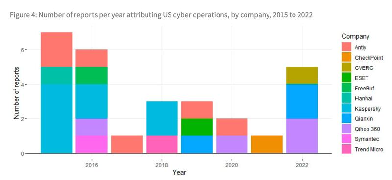
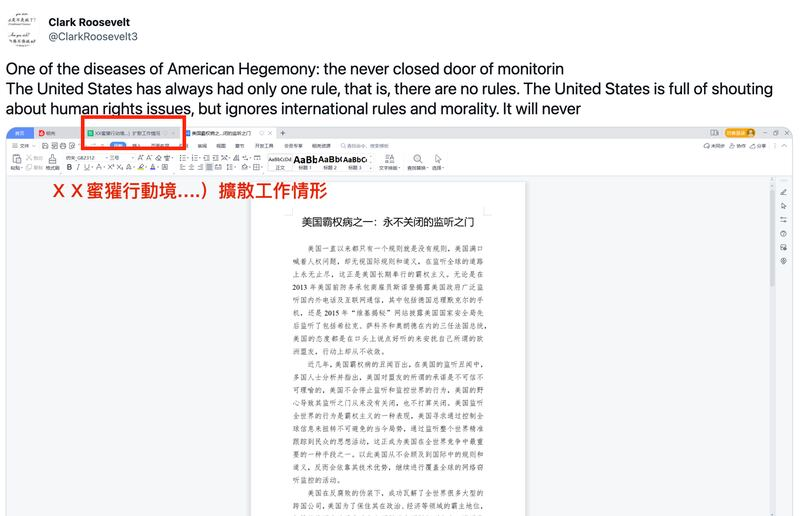
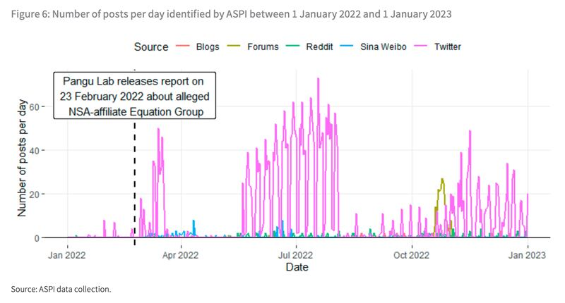
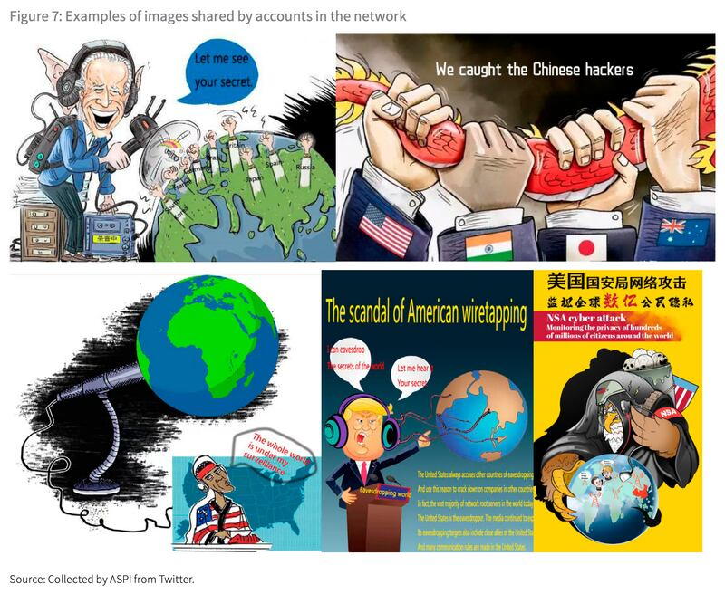
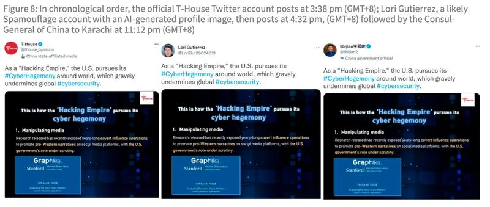
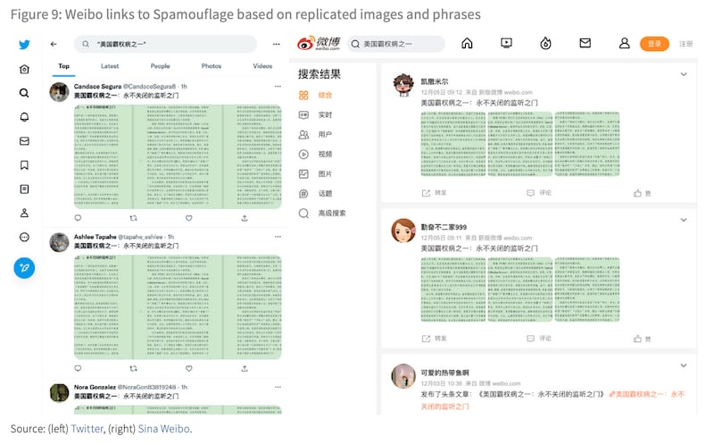
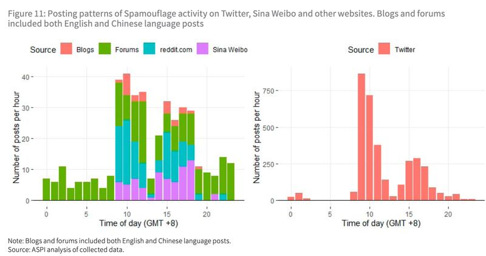
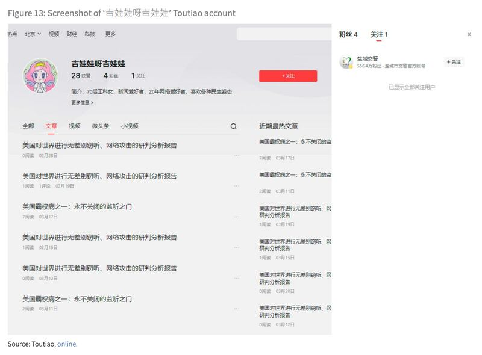
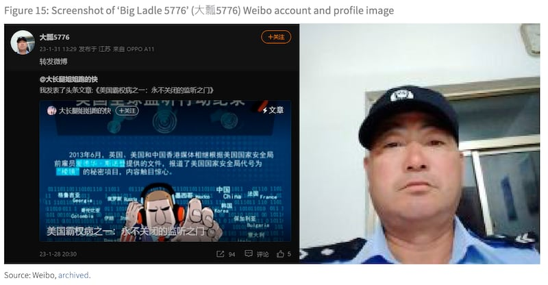
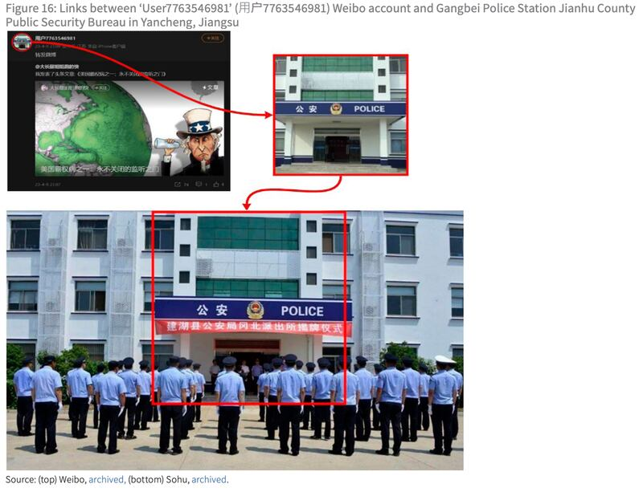

# 深度專題｜"蜜獾行動"揭密(上)：一張螢幕截圖泄露中國隱密的輿論操作

編譯：董喆

2023.05.10 19:34 EDT

"美國一直只有一個規則,就是沒有規則。"2022年3月,推特帳號Clark Roosevelt發表了一則 [推文](https://web.archive.org/web/20220713035553/https:/twitter.com/ClarkRoosevelt3/status/1498863694406909953) ,附上文件截圖"美國霸權病之一:永不關閉的監聽之門",指控美國對中國人權問題"叫囂",卻"無視國際規則和道義"。

這個帳號在推特上宛若孤狼，未與任何帳號建立連結，這篇推文也僅只收穫一個點贊。但巧合的是，“美國霸權病之一：永不關閉的監聽之門”這則螢幕截圖，2022年12月時卻在微博上獲得兩百多個帳號的轉發。

澳洲戰略研究所(ASPI)的一份研究" [操控輿論](https://www.aspi.org.au/report/gaming-public-opinion) ",收集Twitter、Facebook、Reddit、新浪微博和字節跳動產品等多個平臺的數據,揭開了一個與"Spamouflage"相關的中共網路影響力營運行動,旨在描繪美國的網路霸權形象。

ASPI將Clark Roosevelt指向“垃圾僞裝Spamouflage”中國大外宣行動的一環，而Clark Roosevelt截圖的一隅疑似泄露了這一行動的代號——“蜜獾行動”，背後牽涉的是中國鹽城市公安局以及中國網路安全公司奇安信。

## 什麼是Spamouflage？他們如何進化？

Spamouflage結合英文單字Spam（垃圾郵件或訊息）和Camouflage（僞裝），代表一個散播虛假消息的行動單位。

Spamouflage一詞最早由社羣媒體分析公司"Graphika" [提出](https://public-assets.graphika.com/reports/graphika_report_spamouflage.pdf) ,一個行動單位由數個虛假帳號組成,他們的頭像多數來自圖庫甚至是AI生成肖像,並使用虛構的名字,在社交平臺上發表抖音影片或是風景照,卻也穿插對特定政治話題的看法,時而輕鬆時而政治地的偷渡假訊息攻擊。在Spamouflage網絡中的帳號經常在同一時間發表類似的內容,也經常點贊、分享或評論彼此的貼文。

2018年下半年Spamouflage就已略見活躍，被用以攻擊中國異議富豪郭文貴，但並未激起漣漪。 Graphika接着觀察到一個跨平臺的中文社羣網絡在2019年持續在YouTube、Twitter和Facebook上攻擊香港示威者，目的疑似在支持中國政府。

歷時5年，ASPI發現Spamouflage更進化了，這個社羣網絡更加專注於影響中國以外的受衆，推送的敘事從中英文擴展至俄語、菲律賓語、韓語、法語、日語、印尼語、西班牙語等，且至少在全球40個社羣平臺上運作，中國與俄羅斯都不例外。

且有別過往Spamouflage的假帳號只在圈內互動、使用假名假圖的特徵，ASPI發現這些虛假帳號開始學會打造自己的“人物設定”。

名爲Erin Chew的Spamouflage帳號自稱居住在悉尼和聖地亞哥。 （圖／ASPI）

2021年美中在澳洲大打 [稀土之戰](https://www.rfa.org/mandarin/yataibaodao/ql1-05182021034913.html) ,ASPI揭露Spamouflage帳號更直接的介入澳洲政治,試圖煽動邊緣政黨和支持陰謀論的個人帳號,增加民衆對政府的不信任。這些虛假帳號變得更加"真實",他們有名有姓有工作,將自己打造爲一個真實的澳洲人。

將時間推進至2023年4月,ASPI發表了最新報告 [操控輿論](https://www.aspi.org.au/report/gaming-public-opinion) ,揭露2022年期間社羣平臺上再度出現一起疑似由中國政府主導的網路行動,大力宣稱美國中央情報局(CIA)和國家安全局(NSA)正在不負責任地對中國和其他國家進行網路間諜活動。

ASPI仍根據社羣平臺上的多方證據，認爲這些論述的目的除了戰略宣傳，甚至可能爲了支持中國網路安全服務拓展到一帶一路國家。

## 中國網路安全公司報告如何帶動輿論

ASPI首先從中國網路安全公司發表報告嗅到不對勁。

從2015年至2022年，中國網路安全公司至少發佈了16份報告將針對中國的APT攻擊（注）歸咎於美國，其中2015年與2016年的兩個高峯，各自起因前一年度的史諾登事件以及美國中情局Vault 7（中國譯作“穹頂7”）外泄事件。

2022年中國網路安全公司相關報告數量突增，但前一年美國政府並未有大規模泄漏事件，俄羅斯網路安全公司卡巴斯基也未有相關報告，因此ASPI認爲這並不尋常。

2015至2022中國網路安全公司發表有關美國網路運作的報告數量。 （圖／ASPI）

同年，ASPI統計中國外交部發言人至少評論了13次有關美國網路活動的問題，中國官媒如《環球時報》、新華社和《人民日報》至少發表了23篇有關美國網路行動的英文文章。

通過分析中國政府的公開聲明及官媒報道，ASPI發現“美國的網路間諜行動”的指控，主要是基於兩家中國網路安全公司在2022年發表的報告，同時社羣平臺上也出現了大量且同質的輿論。

奇安信旗下的盤古實驗室於2022年3月 [宣稱](https://www.globaltimes.cn/page/202202/1252952.shtml) 美國國安局(NSA)使用後門程式Bvp47監控45個國家長達十年;9月,中國一家網路安全公司"奇虎360"與國家計算機病毒應急處理中心發表 [調查報告](https://www.rfa.org/mandarin/Xinwen/2-09132022111408.html) ,指控NSA曾經試圖滲透中國西北工業大學。

中國網路安全公司發佈美國網路活動報告，接着中國官方與媒體口徑一致的指責美國的網路霸權，再到社羣平臺可疑帳號的羣起唱和，隱晦透露了中共產黨的對外宣傳。

## Spamouflage與黨同行的美國霸權敘事

ASPI認定“蜜獾行動”是一項對外宣傳串聯行動的專案代名，它來自一則推文的螢幕截圖，截圖中露出了“蜜獾行動...擴散工作情況”，讓ASPI一窺這個代名。 “蜜獾行動”的主軸，是在網絡上力推一篇文章““美國霸權病之一：永不關閉的監聽之門”（One of the diseases of American hegemony: the door of wiretapping that never closes）”。

ASPI收集了他們認爲是“蜜獾行動”的帳號在2022年1月1日至2023年1月1日間所發佈的 3,560 則推文、209 則網站論壇文章、126 則 Reddit貼文、37 則部落格貼文、10 則 Facebook 貼文和 71 則新浪微博貼文。

Spamouflage帳號截圖的頁籤不慎泄漏疑似這項網路行動的名稱。 （圖／ASPI）

ASPI發現，這一輿論操作網絡中的帳號應該已經存在多年，因爲他們與過去遭揭發的Spamouflage相關帳號具有相同的特徵，像是使用AI生成的圖像，以及曾張貼批評郭文貴的貼文。而這些貼文皆是在北京時間的工作日的上班時間發佈，發文頻率更是在盤古實驗室發表報告後達到高峯。

ASPI偵測2022年1月1日至2023年1月1日的Spamouflage相關推文，虛線處爲盤古實驗室有關美國NSA間諜行動報告發布時間。 （圖／ASPI）

在Twitter 上，這些帳號經常使用 #USCyberHegemony、#USsurveillance、#美國黑客入侵別國、#美式霸權、#抵制雲法案、#駭客美國、#霸權主義等標籤，並搭配嘲諷圖卡，譴責美國的網路操作。

Spamouflage帳號推文的嘲諷圖卡。 （圖／ASPI）

ASPI還發現，這些帳號並未把宣傳範圍侷限在Spamouflage之間，而是與中共的宣傳者一同唱和。環球電視網評論部門T-House以及中國駐喀拉蚩總領事李碧建，都曾轉發推特一則由Spamouflage帳號發表的推文，該推文指控美國是駭客帝國。

中國官員與官媒轉發Spamouflage帳號推文的證據。 （圖／ASPI）

## 蜜獾行動也在中國防火牆內運作的證據

蜜獾行動也不只侷限在西方社交平臺，更與中國社交平臺協作。 ASPI從發佈內容、時間以及IP位置揭露了這一行動的串連證據。

ASPI觀察到，“美國霸權病之一：永不關閉的監聽之門”的報告截圖在twitter上幾乎沒有引起任何互動，因此不太可能觸及到中國網民，並將其搬運到中國社交平臺。 ASPI在中國網站上搜尋後，卻發現有200多個帳號曾發表相同的截圖和描述，而這些帳號通常使用卡通或女模當作大頭貼，這與西方平臺上Spamouflage帳號特徵雷同。

推特與微博流傳相同的“美國霸權病之一”文章截圖。 （圖／ASPI）

且與先前的Spamouflage網絡一樣，幾乎所有新浪微博貼文都是在北京時間的“996期間”（上午9點上班，晚上9點下班，每週工作6天。）發佈的。且這些帳戶明顯非真實，卻沒有被微博視爲假帳號而停權，ASPI認爲平臺沒有阻止Spamouflage在中國社交媒體上的活動，可能是中國政府默許。

Spamouflage帳號在西方與中國社羣平臺發佈推文的時間大致相同。 （圖／ASPI）

## Spamouflage與公安局的微妙關係

ASPI進一步追蹤微博以外的社交平臺，發表類似貼文的帳號IP位置經溯源，來自鹽城市的有8個，南京市有8個，鎮江市有7個，另外有5個來自北京——幾乎都環繞在江蘇省。

首先ASPI發現知乎上一個名爲“新垣結衣”的帳號反覆發佈一篇題爲“美國霸權病之一”的文章。這個帳號先前的活動歷史包含曾點贊鹽城市阜寧縣和響水縣小學教師工資問答，並收藏了有關江蘇自學考試報名的文章。

而在字節跳動旗下的平臺今日頭條，一個名爲“吉娃娃呀吉娃娃”的帳號僅發佈了6篇有關美國監視的文章，而這些文章傳播範圍僅止於中英社交平臺上的Spamouflage帳號。 ASPI發現，截至報告發布時，這個帳號僅有4個粉絲，每篇文章最多隻被閱讀了7次。且“吉娃娃呀吉娃娃”關注的帳號只有一個——鹽城市公安局交通警察支隊。

今日頭條帳號“吉娃娃呀吉娃娃”。 （圖／ASPI）

其一是僅有一篇貼文，且正巧與美國網路霸權相關的帳號“大鵬5776”，其大頭照是一名中國員警的自拍，且貼文發佈位置顯示爲江蘇。另一則是名爲“用戶7763546981”的帳號，其大頭照是一公安局，華郵通過定位得出該照片爲江蘇省鹽城市建湖縣港北派出所。這兩個帳號在本文發表前都以自行向微博申請註銷。

“大鵬5776”微博帳號的大頭照爲一名中國員警的自拍。 （圖／ASPI）

“用戶7763546981”的帳號，其大頭照是一公安局。 （圖／ASPI）

但ASPI也表示，儘管這些帳號存有潛在的關聯，但仍然沒有足夠的公開證據可以證實鹽城市公安局直接經營Spamouflage帳號。有鑑於推特和臉書母公司Meta早已將Spamouflage歸咎於中國政府，ASPI根據上述證據推斷，中國公安機構可能是中國宣傳系統開展Spamouflage行動的關鍵行爲者之一。

## 中共有插手Spamouflage嗎？

長期以來，各大智庫或是民主國家機構一直缺乏直接證據證明Spamouflage這類型的資訊戰，是直接由中國解放軍或是中國國家安全部直接伸手操作。

ASPI指出，由於各大社羣平臺開始揭露帳號來源，Spamouflage行動需要通過VPN掩飾，且要進行跨中西平臺的資訊操作，中國需要批准這些帳號繞過防火牆，以上顯示中共極有可能投入人力與成本經營Spamouflage行動。

ASPI發現蜜獾行動中多數帳號的操作手法並不成熟，顯示這些帳號可能是由商業公司或是網路評論員操作的。報告引述蘭德公司（RAND Corporation）分析師的說法，指出Spamouflage 關聯帳號並非由中國軍方運營，而可能是由中共宣傳部門、統戰部門或兩者共同營運的。

ASPI認爲，中共通過這一波外宣，企圖展示中國網路安全公司有能力揭發美國的祕密行動，並營造中共纔是一個負責任大國的形象。

下一篇我們將討論奇安信公司與鹽城市公安局在這一波宣傳中各自扮演的角色，以及中國網路安全公司如何配合外宣，並進一步滿足自身利益。

注：APT攻擊全名爲進階持續性威脅（dvanced Persistent Threat），意指針對特定組織的複雜且多面向網路攻擊，這類型攻擊時間可以是數天、數週甚至是更長。

*本系列由亞洲事實查覈實驗室編譯並對翻譯負全部責任。此報告的英文原版可在澳洲戰略政策研究所的網站上找到，連結如下：*

*<https://www.aspi.org.au/report/gaming-public-opinion> ”*

*“亞洲事實查覈實驗室對本研究的翻譯負全部責任。該報告的英文原版可以在澳大利亞戰略政策研究所的網站上找到： <https://www.aspi.org.au/report/gaming-public-opinion> “*

[Original Source](https://www.rfa.org/mandarin/shishi-hecha/hc-05102023174311.html)