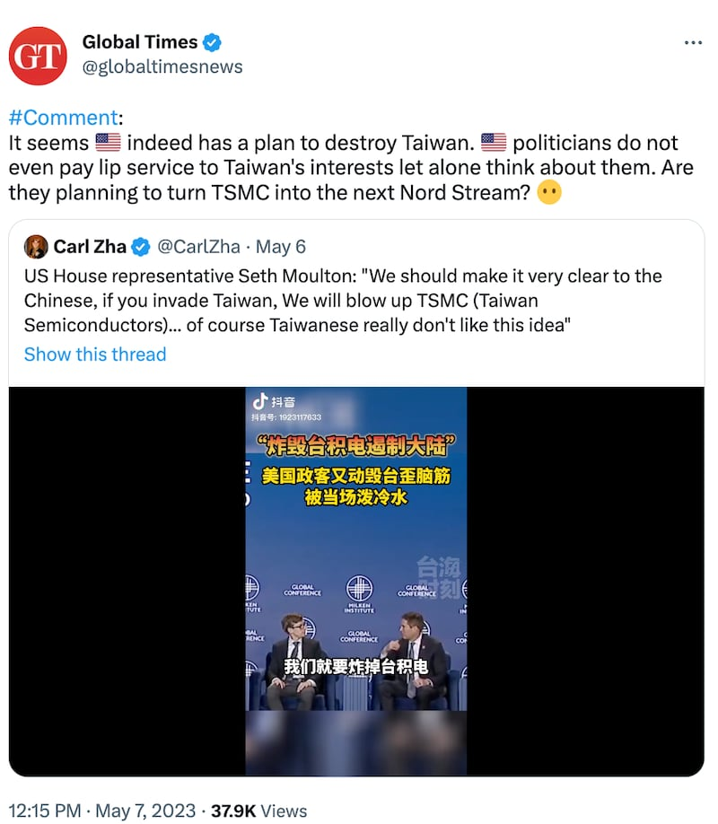

# 事實查覈│ 美國政客又在倡議"炸燬臺積電"嗎？

作者：莊敬

2023.05.11 14:44 EDT

## 標籤：誤導

## 一分鐘完讀：

中國官媒《環球時報》近日在推特轉發抖音短視頻，稱“美國政客又動毀臺歪腦筋，被當場潑冷水”。短視頻截取了美國聯邦衆議員莫頓（Seth Moulton）在一個公開論壇中的發言：“大陸非常清楚，如果‘入侵’臺灣，我們就要炸掉臺積電”。對此，《環時》的評論寫道：“看來美國真有摧毀臺灣的計劃”。

亞洲事實查覈實驗室認爲，無論是剪輯成30秒的抖音短視頻，或《環時》在推特的評論，都可能誤導受衆，因爲只要聽全莫頓的完整發言便可知，他並不是在提倡炸燬臺積電，只是在引述美國的決策者們針對可能發生的臺海戰爭進行的爭論。

## 深度解析：

《環球時報》英文版推特賬號 [5月7日轉發評論用戶"Carl Zha"的抖音短視頻](https://twitter.com/globaltimesnews/status/1655063897697824768),標題寫着"炸燬臺積電遏制大陸,美國政客又動毀臺歪腦筋,被當場潑冷水"。影片中,美國聯邦衆議員莫頓說:"大陸非常清楚,如果'入侵'臺灣,我們就要炸掉臺積電。我只是拋出這個想法,不是因爲這是最佳策略,這只是一個例子,當然臺灣不喜歡這個想法。"

接着，美國防部前政策次長佛洛諾伊（Michèle A. Flournoy）說：“不能炸掉臺積電，如果你那麼做，在第一年將對全球帶來2萬億美元的經濟衝擊，讓全球製造業停滯，這是個糟透了的主意。”

《環時》英文版在推特評論：看來美國真有毀臺的計劃，美國政客連臺灣利益都不談了，更不用說會考量了。他們打算把臺積電變成下一個“北溪”嗎？

《環球時報》英文版推特帳號5月7日轉發抖音短視頻，標題寫着“美國政客又動毀臺歪腦筋，被當場潑冷水”。

經查,《環時》在推特發佈的短視頻,是由中國電視臺東南衛視 ["海峽新幹線"抖音賬號](https://www.douyin.com/video/7229591717052271909)於5月5日上傳,已有許多用戶在社媒轉發。

而這則短視頻的內容也引起中國、臺灣媒體關注。《中國時報》5月6日報道稱 ["美衆議員瘋狂建議炸燬臺積電威懾中國"](https://www.chinatimes.com/newspapers/20230506000318-260119?chdtv), [中天](https://www.youtube.com/watch?v=ZpcrmmohCuc)等電視臺的節目也討論此事。接着, [臺灣的國防部長邱國正](https://www.cna.com.tw/news/aipl/202305080047.aspx)、 [行政院長陳建仁](https://udn.com/news/story/7240/7152500?from=udn-ch1_breaknews-1-cate6-news)等官員陸續對此事表態。

5月10日, [臺灣外交部長吳釗燮在立法院受訪](https://www.cna.com.tw/news/aipl/202305100033.aspx),被問及如何看"莫頓提到如果要威懾中國,要炸燬臺積電"時,吳釗燮回應:如果仔細去看莫頓講的前言後語,得到的結論會很不一樣。外交部也隨後發佈 [聲明](https://www.mofa.gov.tw/News_Content.aspx?n=95&sms=73&s=114642),指抖音影片曲解原意、刻意誤導,與莫頓實際說法有明顯出入。

莫頓也回應此事,他向臺灣媒體 [中央社](https://www.cna.com.tw/news/aipl/202305110080.aspx)、 [Focus Taiwan](https://focustaiwan.tw/politics/202305110005)表示,中共方面選擇性擷取他的發言,在社羣網路上散播,試圖破壞臺美夥伴關係。

## 莫頓在研討會說了什麼？

莫頓5月2日參加智庫 ["梅肯研究院"(Milken Institute)研討會](https://milkeninstitute.org/panel/14484/united-states-and-china-navigating-strategic-competition-invite-only),在完整影片的36:12處,研討會主持人向莫頓以及與會的衆議院外委會主席麥考爾(Michael McCaul)提問——美國如何以晶片相關政策製造威懾力?

莫頓回答：“你知道，有關威懾的有趣想法之一，就是讓中國清楚——如果你入侵臺灣，我們將炸燬臺積電。我只是拋出來這個觀點，不是因爲這是最佳策略，而是這是一個正在被爭辯的想法，當然臺灣人不喜歡這個想法，對吧？因此當我們考慮如何執行一個策略時，必須考慮它的後續影響。這會促進中國國內晶片產業發展，最終趕上我們？或者我們仍可以保持領先，充分控制這個產業？這都是我們正努力想回答的問題。”

美國防部前政策次長佛洛諾伊接着說：“我可以提出一點內部不同的看法嗎？有關炸燬臺積電，如果你那麼做，將在第一年將對全球帶來2兆美元的經濟衝擊，讓全球製造業停滯。這是個糟糕的主意。”

莫頓回應：“我不是在提倡這個主意。我所想說的是，這是美國決策者間正在熱烈爭辯的事情。順便一提，如果中國接管臺積電，無論是香港式的接管還是實際入侵，如果他們能完好無損掌控這家公司，美國都很可能會面臨同樣程度的經濟後果。”

莫頓的談話經剪輯、傳播後,讓"炸燬臺積電"再度成爲兩岸媒體、社媒熱門話題,部分報道、評論人士提及美國前國安顧問歐布萊恩(Robert O'Brien)也曾提出炸燬臺積電。亞洲事實查覈實驗室此前已發佈 [查覈報吿](2023-04-07_事實查覈｜白宮前高官鼓吹“毀臺積電”計劃嗎？他的原話是什麼？.md),歐布萊恩當時的發言遭到斷章取義。

## 結論：

莫頓已表明自己並非提倡炸燬臺積電，只是在引述美國的決策者們針對可能發生的臺海戰爭發生過的爭論。也就是說，他並沒有如某些報道所說的“建議炸燬臺積電以威懾中國”，抖音短視頻所謂“美國政客又動毀臺歪腦筋”，環球時報推論“美國真有摧毀臺灣的計劃”都屬誤導言論。

*亞洲事實查覈實驗室(* *Asia Fact Check Lab* *)是針對當今複雜媒體環境以及新興傳播生態而成立的新單位。我們本於新聞專業,提供正確的查覈報告及深度報道,期待讀者對公共議題獲得多元而全面的認識。讀者若對任何媒體及社交軟件傳播的信息有疑問,歡迎以電郵* *afcl@rfa.org* *寄給亞洲事實查覈實驗室,由我們爲您查證覈實。*

[Original Source](https://www.rfa.org/mandarin/shishi-hecha/hc-05112023142510.html)