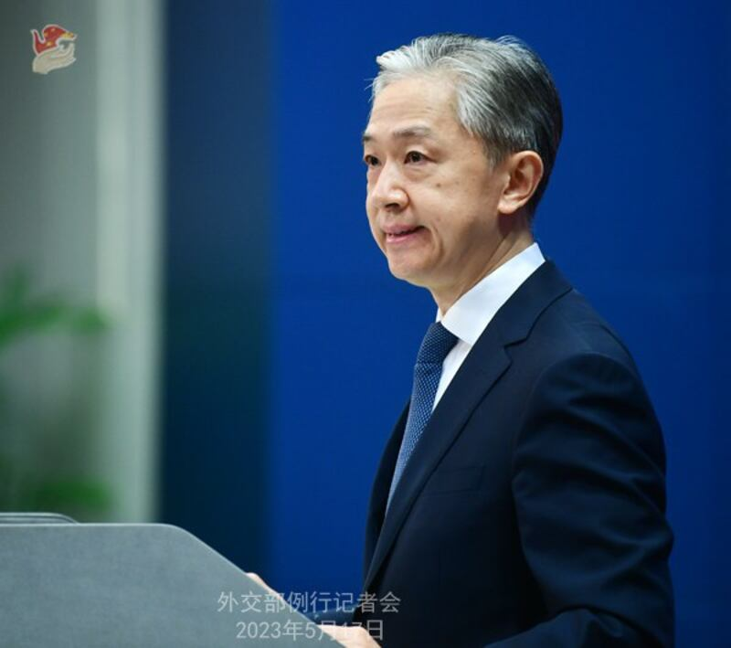
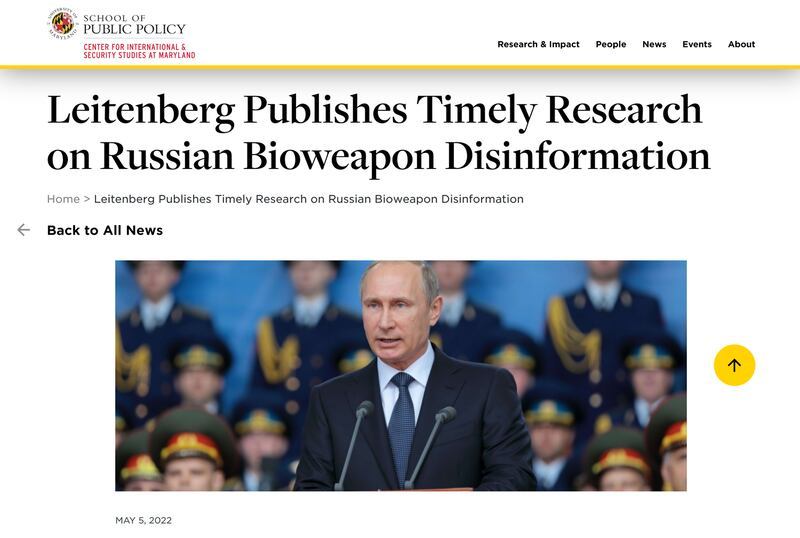

# 事實查覈│美國計劃研發基因武器，精準殺害華裔歐裔和中東人？

作者：辛西婭 沈軻

2023.05.17 15:00 EDT

## 標籤：虛假

**一分鐘完讀:** 中國外交部發言人汪文斌近日稱,《華爾街日報》曾披露美國五角大樓已制定了以基因武器打擊對手的研發計劃,亞洲華人、歐洲雅利安人、中東阿拉伯人的基因都被列入美軍蒐集範圍。

亞洲事實查覈實驗室發現，沒有任何證據顯示《華爾街日報》曾發佈此類報道。而中文網絡記錄顯示，關於美軍研發基於種族的基因武器的各類傳聞在簡體中文世界已經流傳了二十多年的，更早來源是是俄語世界自蘇聯時代就開始的宣傳。針對這項指控，美國國務院回覆亞洲事實查覈實驗室稱，中國的指責毫無根據。科技報道和美國國防部近期的聲明也顯示，人類當前的技術水平無法實現"按特定基因殺人"。

外交部發言人汪文斌 （圖取自中國外交部官網）

## 深度解析：

2023年5月10日,中國外交部發言人 [汪文斌在例行記者會上回答鳳凰衛視記者的提問時稱](https://www.fmprc.gov.cn/wjdt_674879/fyrbt_674889/202305/t20230510_11074604.shtml):"美國是廣泛蒐集並運用基因信息的國家。據《華爾街日報》披露,美國五角大樓已經制定了以基因武器打擊對手的研發計劃。參與者稱,亞洲華人、歐洲雅利安人、中東阿拉伯人的基因都被列入美軍蒐集範圍。"

同一天,中國外交部 [發言人官方認證推特上,也用英文發佈了這條消息](https://twitter.com/MFA_China/status/1656297450762805249)。

亞洲事實查覈實驗室發現，汪文斌的說法沒有任何根據，且明顯違反國際事務的運行邏輯。

## 1、"基因武器"指控缺乏依據

亞洲事實查覈實驗室在華爾街日報英文網站的搜索頁面，用“genetically engineered weapon” “Pentagon”等關鍵詞的組合搜索，找不到任何相關報道。

在谷歌、必應等搜索引擎上以同樣關鍵詞組合搜索，也找不到相關內容。

亞洲事實查覈實驗室給《華爾街日報》發郵件查詢，但截稿之前沒有收到回覆。

週一，美國國務院就該指控回覆亞洲事實查覈實驗室稱：中國的指責毫無根據，完全是錯誤的。

國務院在回覆中說：

“美國的基因研究是利用基因組信息來改善人類健康，而非攻擊人類健康，並且相關研究都是在保護個人的權利和隱私前提下進行的；

我們珍視生物技術爲全人類帶來的好處，並繼續與合作伙伴和盟友一起引領和制定關於先進生物技術的規範和規則，這些規範和規則符合我們的價值觀和保護人權的原則；

然而，包括中華人民共和國在內的其它國家正在濫用這些技術。”

## 2、中文網絡上，美國軍方收集華人基因以製造生物武器的說法已流傳了至少20年，但至今仍是“計劃”

亞洲事實查覈實驗室在中文網絡上以"華爾街日報" "五角大樓" "亞洲華人、歐洲雅利安人、中東阿拉伯人"搜索顯示,美國軍方收集華人基因以製造武器方面的內容不少,而且不少來自官方媒體,比如《中國國防報》2014年1月發佈的文章 [《基因戰爭將以洗牌方式變革人類戰爭》(原標題《基因戰爭,你不得不防》](http://www.81.cn/jwgd/2014-01/23/content_5747637.htm))。

最早的報道可回溯到 [2003年10月08日《中國青年報》文章《最後一道防線》一書提出](http://zqb.cyol.com/content/2003-10/08/content_744256.htm) [非典可能是針對中國的基因武器](http://zqb.cyol.com/content/2003-10/08/content_744256.htm)。該報記者陳爲民採訪了一個叫童增的活動家,此人作品《最後一道防線》宣稱美國英國一直在盜取中國人基因,而非典很可能是西方國家針對中國的基因武器。在中青報的採訪中有這樣一段:"爲了確保美國未來的霸主地位,美國軍方制定了以基因武器爲祕密武器打擊敵方的計劃。美國《華爾街日報》根據參與者的透露報道說,中國的華人、歐洲的雅利安人、中東的阿拉伯人的基因,均屬於美軍的蒐集範圍。"

與《中國國防報》的文章一樣，中國官媒的文章都提到了《華爾街日報》，但都沒有提供報道的日期、標題、直接引文和原文鏈接。被採訪人也沒有名字、職業等具體信息，只有“參與者”的模糊說法。

亞洲事實查覈實驗室日前致信中國外交部，詢問消息來源和《華爾街日報》報道的具體信息，但截至發稿時也沒有收到回覆。

其實，除了非典以外，新冠疫情和俄烏戰爭期間，“基因戰”和“基因武器”的傳言也多次在網絡空間重複。根據他們的說法，美國研發基因武器的“計劃”從20年前就已經開始了，但直到今天仍然只是被稱爲“計劃”，《華爾街日報》也沒做任何跟進報道。

## 3、"基因武器"和"生物戰"，是蘇俄信息戰長盛不衰的主題

美國國務院官方網站記載的歷史資料顯示,從前蘇聯時代開始, [蘇/俄情報機關就製造了大量與生物武器、病毒、細菌、疾病、基因有關的虛假信息,並根據時代變化而加入各種新元素](https://www.state.gov/the-kremlins-never-ending-attempt-to-spread-disinformation-about-biological-weapons/),艾滋病毒、炭疽、埃博拉、SARS、新冠病毒,都曾被蘇俄稱作美國或西方人爲製造的生物武器。而童增作品宣稱的"非典可能是針對中國的基因武器",與俄羅斯宣傳口徑類似。

2022年5月,美國馬里蘭大學公共政策學院研究員米爾頓·萊滕伯格( [Milton Leitenberg)發佈了一份項目的報道](https://cissm.umd.edu/news/leitenberg-publishes-timely-research-russian-bioweapon-disinformation),記錄了1998-2021年俄羅斯官方機構發佈的與生物武器有關的虛假信息。報告稱, [2007年,俄羅斯情報機關聯邦安全局(FSB的)負責人尼古拉·帕特魯舍夫(Nikolai Patrushev)告訴普京總統](https://cissm.umd.edu/sites/default/files/2021-10/NonProliferationReview_False%20allegations%20of%20biological%20weapons%20use%20from%20Putin%20s%20Russia.pdf),西方一些頂級醫學研究機構正在研究一種基因武器, [專門針對俄羅斯種族](https://cissm.umd.edu/sites/default/files/2021-10/NonProliferationReview%20Supplemental%20material_rnpr_a_1964755_sm5635.pdf)。

美國馬里蘭大學公共政策學院研究報告網頁截圖

該報告沒有顯示FSB提到了亞裔華人、中東人等信息。但翻譯成中文後，傳播者又加入了“五角大樓”“亞裔華人、歐洲雅利安人、中東阿拉伯人”等信息，繼續在網絡上傳播發酵，並在近日登堂入室，藉着外交部發言人之口宣告給了全世界。

## 4、按特定基因殺人的武器在當前的技術水平上無法實現

2021年上映的英國 [007電影《無暇赴死》(*No Time to Die*)](https://en.wikipedia.org/wiki/No_Time_to_Die)中,虛構了一個叫做"赫拉克勒斯計劃"(Project Heracles)的基因武器工程,該工程研發的納米機器人根據特定DNA編碼來定向傳播病毒,可對含有特定DNA的人發起精準攻擊,而不含特定DNA的其他人則不受任何影響。這種"按基因殺人"的橋段,常見於文藝作品。

2022年4月,劍橋大學旗下科普網站 ["裸體科學家"(The Naked Scientists)發佈文章《007電影中的生物武器可信嗎?》](https://www.thenakedscientists.com/articles/interviews/no-time-dies-bioweapon-plausible),明確說明按特定基因殺人的武器在當前的技術水平上無法實現。

## 5、聯合國《禁止生物武器公約》對生物武器進行了嚴格限制

但科技發展一日千里，如果對技術的運用不加任何限制，極有可能會導致失控。生物科技就像核武技術一樣，面臨的選擇不是“能不能”，而是“該不該”。

1975年生效的 [《禁止生物武器公約》(*Biological Weapons Convention, BWC*)](https://en.wikipedia.org/wiki/Biological_Weapons_Convention)對生物武器在全球的開發、生產、獲取、轉讓、儲存和使用進行了全面限制,爲生物科技的和平使用搭建了規範。目前該公約已有183個簽署,美國和中國都是締約國。

2022年春,"美國在烏克蘭建立生物實驗室"的虛假信息氾濫網絡空間時, [美國國防部專門召開新聞發佈會闢謠](https://www.defense.gov/News/News-Stories/Article/Article/2963280/russia-and-china-falsely-accusing-use-of-biological-weapons-against-russians-sa/)並再次重申,美國作爲《生物武器公約》的締約國之一,一直嚴格遵守公約規定。

*亞洲事實查覈實驗室（Asia Fact Check Lab）是針對當今複雜媒體環境以及新興傳播生態而成立的新單位。我們本於新聞專業，提供正確的查覈報告及深度報道，期待讀者對公共議題獲得多元而全面的認識。讀者若對任何媒體及社交軟件傳播的信息有疑問，歡迎以電郵afcl@rfa.org寄給亞洲事實查覈實驗室，由我們爲您查證覈實。*

[Original Source](https://www.rfa.org/mandarin/shishi-hecha/hc-05172023143653.html)