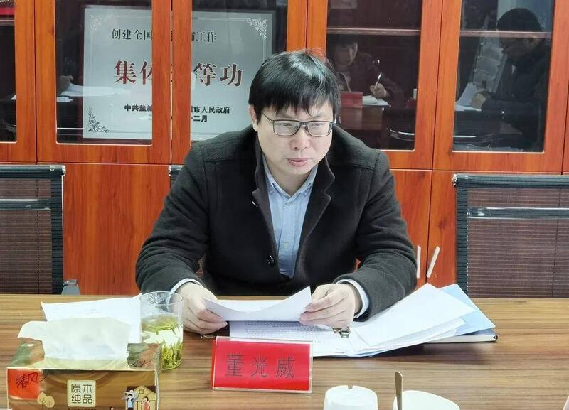
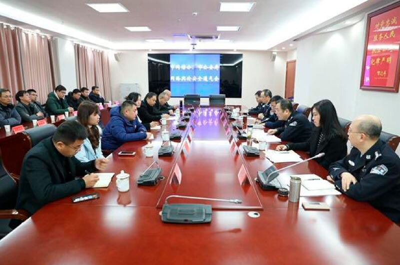
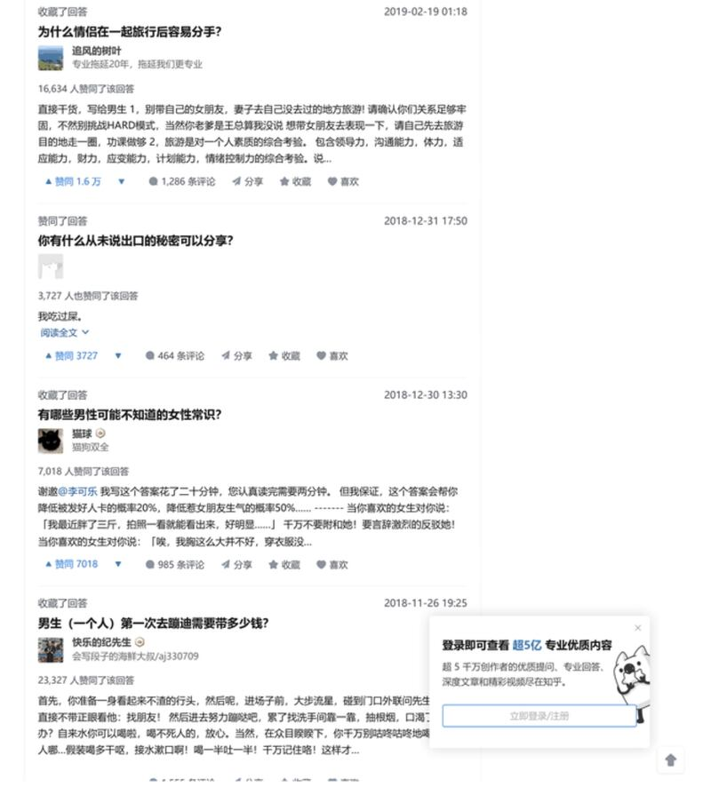
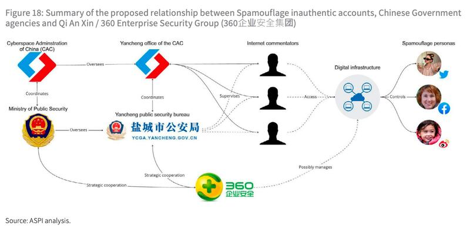
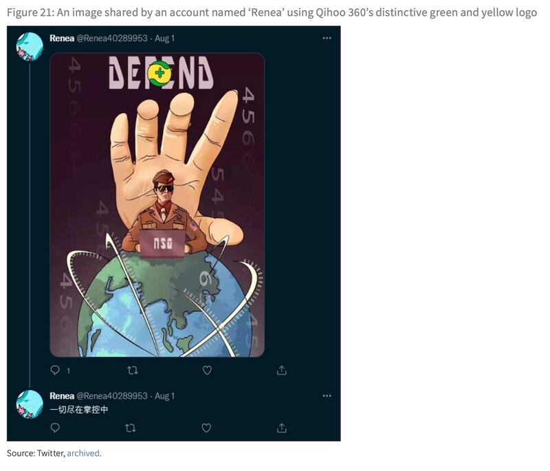

# 深度專題｜"蜜獾行動"揭密（下）：操作中國信息戰的官商協作機制

編譯：董喆

2023.05.18 13:34 EDT

[《蜜獾行動"揭密(上):一張螢幕截圖泄露中國隱密的輿論操作》](2023-05-10_深度專題｜"蜜獾行動"揭密(上)：一張螢幕截圖泄露中國隱密的輿論操作.md) 中提到,澳洲戰略研究所(ASPI)揭露了中共利用垃圾郵件營造網絡影響力,全力營造美國"網絡霸權"的形象。

ASPI還分析了社交媒體上的協力帳號,發現鹽城市公安局與蜜獾行動有着密切關聯,並通過宣傳貼文中的細節,進一步揭示了中國網絡公司 [奇安信](https://www.qianxin.com/)與其他中國政府機構的聯繫網絡。

ASPI以多項證據表明，盤古實驗室所屬的奇安信公司可能通過提供宣傳素材，支持中共的網絡影響力營運。又作爲蜜獾行動的一環，奇安信公司藉此壯大自身在網絡安全服務的影響力，將產品推廣至一帶一路國家。

## 鹽城市公安局的神祕任務

ASPI收集散播“美國霸權病之一”文章的帳戶，發現這些帳戶的關係紐帶與鹽城市公安局相連，這些帳戶有的頭像就是警察或派出所的照片，這條與中國鹽城市公安局緊密相關的聯繫網絡，也指向中國的公安機構可能是中國宣傳系統在美國和中國社交媒體平臺上展開Spamouflage活動的關鍵行爲者之一。

"講好鹽城警察故事,展示鹽城平安形象。"2018年時任鹽城市副市長、市公安局局長王巧全在 [一場公共活動中](https://www.yancheng.gov.cn/art/2018/6/8/art_94_1447409.html)這樣說道。

ASPI解釋，自2019年以來，中國各地的政法機關如一直遵循習近平的指示，全面提高引導公衆輿論和傳播宣傳的能力。而鹽城市公安局以警務宣傳工作聞名，2018年6月，中國公安部以“首顆平安中國之珠緣何花落鹽城？”爲題舉辦研討會，召集中國各地共200多名公安宣傳部成員向鹽城市學習。

中國的政法系統也以操控"網絡評論員"而聞名。 2018年時任中央政法委員會祕書長陳一新 [公開鼓勵](https://www.voachinese.com/a/news-china-build-up-web-forces-20180906/4560222.html)政法幹部、警察和宣傳員開設社交媒體帳號,"着力培育政法網紅大V,研究網絡鬥爭新戰略、新戰場、新戰法",影響線上輿論並操控熱門話題。

## 中國政府機構如何隱身於Spamouflage背後

但ASPI也提到，公安局警察雖然有可能參與協調 Spamouflage 宣傳活動、生產內容和操作某些社羣媒體帳號，但他們極不可能直接控制所有假帳號，因爲大多數貼文主要是在工作時間發佈的。

ASPI指出，當中國政府官員包括警察在內，以隱蔽的方式在中國社交平臺發表評論時，他們通常會在工作時間之外發布。但這一波Spamouflage 宣傳活動皆是北京時間的“996期間”（上午9點上班，晚上9點下班，每週工作6天。）發佈的。ASPI因此推測大多數社羣媒體上的虛假帳號營運可能是外包給一組經過特別培訓的網絡評論員，他們受僱於中國網信辦（CAC）的鹽城辦事處或者是商業公司。

ASPI通過 [採招網](https://web.archive.org/web/20221115214948/https:/www.bidcenter.com.cn/newscontent-118477922-4.html)找到商業公司介入的最直接證據——鹽城市公安局與北京智慧星光信息技術有限公司簽訂合約,提供在線輿情監測推送通知服務。

另外,ASPI以2021年的 [一則報道](https://web.archive.org/web/20221202031801/https:/www.sohu.com/a/447895005_120178083)證實鹽城市聘用網絡評論員,報道指出,鹽城市委網信辦組織開展2020年度全市互聯網信息服務單位社會效益評價,網絡評論員受邀其中。而 [同年2月](https://web.archive.org/web/20230116050427/https:/www.sohu.com/a/449238029_120178083),時任鹽城市網信辦主任、鹽城市宣傳部副主任董光威堅持要求地方政府打造一個"網絡鐵軍",落實整改。

2021年時任鹽城市網信辦主任、鹽城市宣傳部副主任董光威。 （圖／鹽城市網信辦）

而鹽城市網信辦早已和鹽城市公安局緊密合作，兩單位於2018年曾聯合召開“全市網絡輿論安全通氣會”，會中明確表示要強化網絡空間治理，爲鹽城市營造風清氣正的網絡環境。

鹽城市網信辦和鹽城市公安局聯合召開“全市網絡輿論安全通氣會”。 （ASPI報告圖片）

確認鹽城市網信辦僱用評論員後,ASPI分析了Spamouflage網絡中一個名爲 ["新垣結衣"的知乎帳號](https://www.documentcloud.org/documents/23319046-xin-yuan-jie-yi-zhi-hu),認定此人極有可能就是網信辦僱用的網絡評論員。

ASPI指出，“新垣結衣”在2022年突然大量轉發美國霸權病文章以前，曾收藏“情侶在一起旅行容易分手”的男性視角知乎帖子，以及另一篇“有哪些男性可能不知道的女性常識”，推測這個帳號很可能由一名年輕男性操作。

一個名爲“新垣結衣”的知乎帳號在過往收藏許多男性視角的帖子。 （ASPI報告圖片）

且通過“新垣結衣”IP位置以及他大量收藏有關高等教育自學考試（自考）的文章，ASPI推論“新垣結衣”可能是一名在鹽城生活的兼職學生。而未有大學學歷者，是無法成爲政府公務員的，這也是ASPI推論此一風向操作並非由政府機構直接插手的緣由。

## 奇安信公司如何爲蜜獾行動擴充輿論軍火庫？

除了鹽城市公安局,這整場輿論戰中的武器,是由奇安信公司旗下 [盤古實驗室](https://www.pangulab.cn/)推出的網絡安全報告。

2017年12月，當時中國網絡安全公司奇安信仍以“360企業安全集團”名義經營業務，在中國“網絡空間安全軍民融合創新中心”啓動儀式上，董事長齊向東指出，“網絡恐怖襲擊、網絡經濟犯罪、網絡輿論亂局成爲全球公害。網絡安全事關國家安全、政權鞏固、社會穩定和戰爭勝敗。”

當時齊向東還是全國工商聯大數據運維（網絡安全）委員會成員，該組織在統戰部轄下。全國工商聯黨組副書記樊友山稱讚，該委員會在控制中共公衆輿論和幫助中國成爲“網絡強國”方面做得很好。

ASPI認爲，這些言論強烈表明奇安信在齊向東的領導下，有意通過操縱網絡輿論來追求中共的目標。

奇安信公司過去被稱爲360企業安全集團，是360集團的子公司，2019年奇安信與360集團正式分家，2020年以奇安信之名在上海證交所掛牌上市。

奇安信仍被稱作360企業安全集團時，與鹽城市公安局簽訂了一項戰略合作協議，還共同推出了兩個新的合作中心“大數據協同安全技術國家實驗室涉網犯罪預防與打擊合作中心”和“網絡違法犯罪預防與打擊國際合作研究中心”。。 2020年，奇安信爲江蘇省政府提供了防火牆系統，其中包括鹽城市。

奇安信與鹽城市公安局除了檯面上的合作往來，ASPI也通過一些間接證據，推斷奇安信與這起Spamouflage有密切關聯。

ASPI點出奇安信與中國政府策略合作的同時，也與Spamouflage網絡有密切關聯。 （ASPI報告圖片）

有些Spamouflage帳號的圖片貼文中使用了360公司的標誌，暗示中國網絡安全公司正在捍衛自己，以抵禦NSA的網絡攻擊。 ASPI指出，Spamouflage網絡以前從未在宣傳材料中使用過中國企業標誌，目前尚不清楚動機，但可能是爲了推廣中國的網絡安全公司。

圖中黃綠色標誌即是360企業安全集團的商標。 （ASPI報告圖片）

## 奇安信參與蜜獾行動的目的爲何？

ASPI認爲，奇安信和其他中國企業一樣，商業活動經常與中共的外交政策利益保持一致。根據奇安信現任總裁吳雲坤錶示，奇安信將網絡安全服務出口到一帶一路國家，用以保護中國公司如華爲或中國電子信息產業集團。

2019年，奇安信董事長齊向東和印尼AG集團（Artha Graha Network）主席郭說鋒（Tomy Winata）在一帶一路國際合作高峯論壇上籤署了一項協議，將建立一個網絡威脅感知基礎設施平臺。

郭說鋒是印尼華人富商,與中國政商關係密切。 [《洛杉磯時報》曾揭露](https://www.latimes.com/archives/la-xpm-2000-feb-06-mn-61708-story.html)郭說鋒協助中國軍事情報部門,以非法渠道將資金通過崔亞琳(Charlie Trie)向美國民主黨候選人捐款,這成爲1996年美國競選財務醜聞的一環。

ASPI也指出，郭說鋒是中國航天國際控股公司的高管劉超英的商業夥伴，而劉超英曾任解放軍總參謀部情報部五局上校副局長。

據奇安信稱，與AG集團合作是中國推出的第一個大型海外網絡安全基礎設施項目。 ASPI分析，中共可能會將該協議視爲與印尼政治和軍事精英建立更緊密關係的機會。

此外，ASPI也指出，奇安信是中國技術外交的關鍵角色。 2022年奇安信旗下的盤古實驗室發表美國國安局APT攻擊報告的一個月後，奇安信邀請來自18箇中東與非洲國家的20名軍事武官，展示奇安信全套的網絡安全產品。 ASPI認爲，奇安信發佈這份報告，目的是要說服一帶一路國家的軍事與政治精英，中國網絡安全公司有能力監測美國的網絡操作。

奇安信邀請來自18箇中東與非洲國家的20名軍事武官，展示全套網絡安全產品。 （圖／奇安信公司）

## 中國宣傳行動的官商協作

中國共產黨的網絡影響力營運仍是塑造全球公衆輿論和增強中國“國際話語力”戰略的一部分，但ASPI認爲，中國共產黨暗中影響國際公衆輿論的策略與工具，和幾年前相比有了很大變化。

ASPI指出，這些行動推動公衆輿論朝向對中共更有利的立場，甚至干預其他國家的政治決策過程，這些行動通過運用中國本土網絡安全公司的新興技術，爲中共在西方社交平臺的祕密行動賦予了新的能力。

亞洲事實查覈實驗室對本研究的翻譯負全部責任**。**  [**該報告的英文原版**](https://www.aspi.org.au/report/gaming-public-opinion) 可以在澳大利亞戰略政策研究所的網站上找到。

*亞洲事實查覈實驗室（Asia Fact Check Lab）是針對當今複雜媒體環境以及新興傳播生態而成立的新單位。我們本於新聞專業，提供正確的查覈報告及深度報道，期待讀者對公共議題獲得多元而全面的認識。讀者若對任何媒體及社交軟件傳播的信息有疑問，歡迎以電郵 [afcl@rfa.org](http://afcl@rfa.org)寄給亞洲事實查覈實驗室，由我們爲您查證覈實。*

[Original Source](https://www.rfa.org/mandarin/shishi-hecha/hc-05182023132518.html)