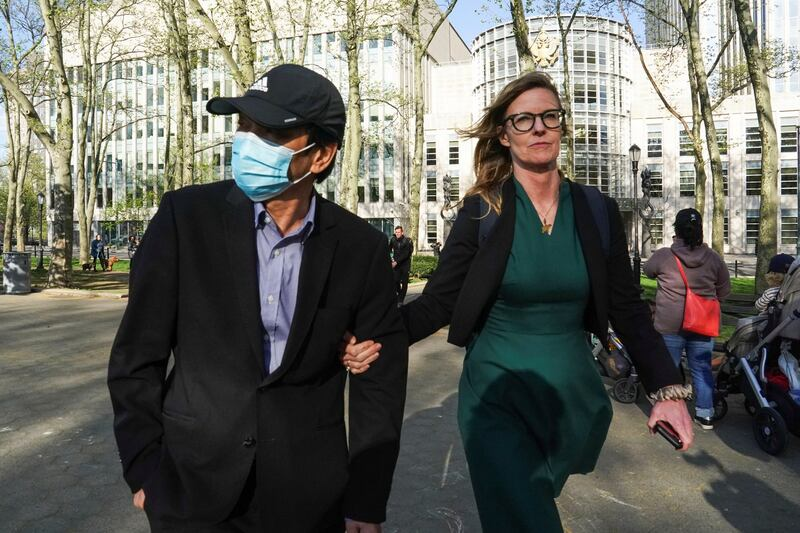
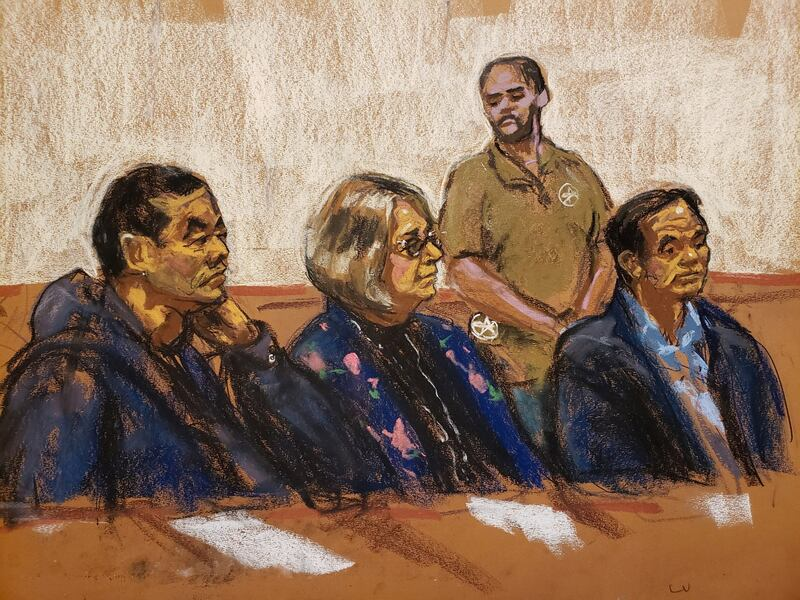
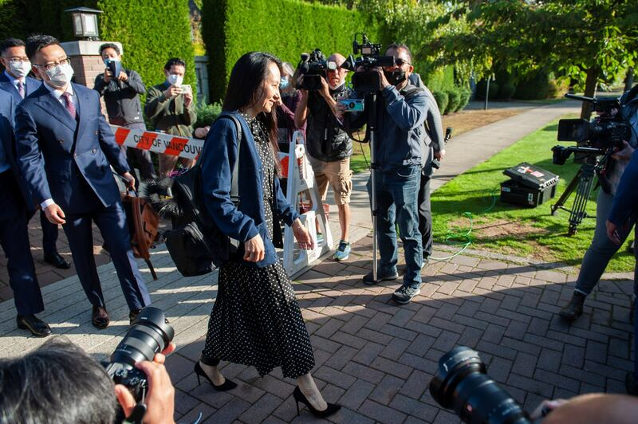

# 事實查覈 | 美國起訴中國官員，是以捏造的指控行使"長臂管轄權"嗎？

作者：沈軻

2023.05.19 19:08 EDT

## 結論：誤導

## 一分鐘完讀：

四月中，美國司法部以從事“跨國騷擾”爲由，起訴44名嫌犯，包括中華人民共和國（PRC）的警察、官員及兩位在美國公司工作的華人。中國政府隨後批評美國的行動是“跨國鎮壓”，以“基於捏造的指控，對中國公民行使長臂管轄權”。

亞洲事實查覈實驗室詳閱起訴文件後發現“捏造指控”的說法具有誤導性。美國司法部門公佈了大量證據支持其指控。

中國官員的言論也混淆了“長臂管轄權”與“境外管轄”兩種不同的法律概念。中國對美國將其法律適用至境外的指責，雖然在某些方面是合理的，但卻忽略了中國自己最近所頒佈與適用的法律中，同樣有境外適用的規定，其藉此擴張的權力，同樣令人不安。

## 深度分析：

4月17日,美國官員在 [兩起刑事案件中,總計對44名中國公民提起刑事追訴](https://www.justice.gov/opa/pr/40-officers-china-s-national-police-charged-transnational-repression-schemes-targeting-us)。其中一起案件控告34名中國警察;另一起案件的10名被告中,有6名中國警察,2名網信辦官員和2位民間公司職員。美國司法部指控他們騷擾對中華人民共和國持批評態度的美國居民。

中國駐美大使館發言人劉鵬宇隨即對路透社 [表示](https://www.reuters.com/world/us/us-charges-two-new-yorkers-with-conspiring-act-chinese-agents-statement-2023-04-17/),"美國方面根據捏造的罪名行使長臂管轄權(長臂管轄)。 "中國外交部發言人汪文斌在4月21日的記者會上 [指出](https://www.fmprc.gov.cn/fyrbt_673021/jzhsl_673025/202304/t20230421_11063331.shtml),"美方有關指控完全是政治操弄,毫無事實和法律依據。 "劉鵬宇和汪文斌的聲明,呼應了今年早前中國外交部批評美國 ["恣意行使司法權"](https://www.fmprc.gov.cn/mfa_eng/wjbxw/202302/t20230203_11019281.html)。

## 對於騷擾的指控，美國官方是否提出了證據？

是的。美國對於騷擾的指控,確實提出了證據。 [第一案起訴書共89頁,其中在第86至160段](https://www.justice.gov/d9/2023-04/squad_912_-_23-mj-0334_redacted_complaint_signed.pdf)描述了中國公安部34名官員如何騷擾14名美國居民。 [第二案82頁](https://www.justice.gov/d9/2023-04/jin_-_20-mj-1103_redacted_amended_complaint_signed.pdf)的起訴書中, [第24至176段](https://www.justice.gov/d9/2023-04/jin_-_20-mj-1103_redacted_amended_complaint_signed.pdf)的針對其他10名中國官員的騷擾行爲,提出了詳細紀錄文件。對於所指控的線上騷擾行爲,這兩份起訴書提出了圖片、引文、以及中國公安部團隊成員內部通訊的摘錄。

例如起訴書引用了一條推文，它來自一個社交媒體賬戶，設立這個帳戶的目的是騷擾一位受害者，內容是："我想請所有網民不要被謠言、流言和強姦犯、瘟疫鬼(編按：指這位受害者)控制的媒體所利用！"

2020年5月31日，涉嫌騷擾者在紀念1989年天安門廣場抗議活動的視頻會議上發表的另一條評論是："所有民運人士家屬的母親去死吧！"！你難道沒有一點想法，你當時在天安門殺了多少士兵，搶了多少槍，燒了多少坦克？"

起訴書提到，一名嫌疑人刪除了15名美國居民的Zoom賬戶，原因是懷疑這15人和居住在美國的一名中共批評者有關。

兩名在美華人在紐約被捕，他們被控在美國運作"境外警察局"，圖左爲其中一名嫌疑人 。(路透社)

## 本案是否屬於行使“長臂管轄權“的案件？

劉鵬宇批評美國行使“長臂管轄權”。但亞洲事實查覈中心發現，美國本案件中行使的不是“長臂管轄權“。國際法專家、加州大學戴維斯分校的威廉·道奇(William S. Dodge)教授向亞洲事實查覈實驗室表示，所謂的“長臂管轄權”(長臂管轄)並不是國際法上的概念。實際上，此處所討論的議題是美國法律制度中行使的刑事管轄權的界限。

事實上,同樣在四月下旬, [美國聯邦檢察官也宣佈逮捕了兩名盧姓與陳姓的在美華人](https://www.justice.gov/usao-edny/pr/two-individuals-arrested-operating-undeclared-police-station-chinese-government),他們被控在紐約設立"境外警察局。"美國紐約東區檢察官辦公室戰略運營與傳媒官員(Strategic Operations & Communications Officer)丹妮爾·哈斯(Danielle Hass)對亞洲事實查覈實驗室解釋本案時說:"在聯邦法院管轄區域犯罪之人,美國法院皆得行使管轄權;嫌犯的國籍爲何,在所不問。"

她強調：“無論是本案的盧姓與陳姓被告，或週一所公佈的起訴書中之任一被告(按：指前述的44人)，都有權行使管轄權，因爲他們被控的行爲地都在紐約東區。 ”

臺灣制憲基金會董事，國際法專家宋承恩對亞洲事實查覈實驗室表示：依上述美國官員所指出，本案美國法院行使管轄權之依據，屬於刑事管轄權的“屬地主義”，意即犯行如果發生在法院管轄區內，法院即可行使刑事管轄權。實務上，這是屬於一國刑事管轄權的界限問題。在許多國家的刑法上都有相同規定，包括中華人民共和國刑法。

兩名被控在美國運作"境外警察局"的嫌疑人在紐約出庭 (路透社）

## 究竟什麼是“長臂管轄”？

宋承恩說，“長臂管轄”與上述的“屬地主義”不同。 “長臂管轄”一詞，如同道奇教授受訪指出，是美國在州與州之間對個人管轄的界定規則。倘若A州立法規定該州有權管到身處B州的人民，則法律上要問：A州如此立法的依據何在？是否B州的人民與A州有怎樣的聯繫？

擴展到國際法上，若是A國立法，授權自己管到B國人民或實體（例如公司）之行爲，法律上同樣要問：A國如此立法的依據何在？中國的討論中，同樣稱此爲“長臂管轄”，但宋承恩指出，爲避免與美國法上的概念混淆，應稱之爲“境外管轄”（extraterritorial jurisdiction）。

主張“境外管轄權”的例子，例如1980年代美國爲防堵蘇聯取得軍事上的機敏科技，立法禁止位於任何地點的任何人，向蘇聯輸出該等科技。或在著名的“孟晚舟案”中所依據的立法，基於美國對伊朗的制裁，禁止任何個人或公司與伊朗的實體進行機敏物件的交易等。

宋承恩指出，不論稱之爲“長臂管轄”或“境外管轄”，上述立法例指向主張此種管轄權者，其管轄權之界限，與刑事管轄權的界限，屬於不同事物範疇的管轄主張。

華爲現任副董事長孟晚舟曾經被美國政府指控違反美國對伊朗制裁規定，是美國行使"長臂管轄"的案例。（路透社）

## 中國官員在批評"長臂管轄權"時，真正要批評的是什麼？

中國真正反對的，是美國在境外行使刑事管轄權。

新加坡國際法專家Zhengxin Huo 和 Man Yip在 [《中國法律的境外適用:神話、現實和未來》](https://academic.oup.com/cjcl/article-abstract/9/3/328/6274891?redirectedFrom=fulltext)一文中,指出:"中國政府所強烈譴責的美國長臂管轄權實踐,特別指的是美國單方面將其國內法律用於境外,對外國實體和公民實施制裁,而這種行爲在國際法中沒有合理的基礎或理據。"

不可諱言，美國確實不乏基於自身利益，將其法律適用於境外的例子。最近的包括將嫌犯拘禁於關塔那摩灣以逃避司法控制，或以非法揭露美國機密的罪名起訴維基解密創始人朱利安·阿桑奇。然而，美國製度上仍存在制衡機制，以確保當局不會對任何境外人士恣意起訴。

道奇教授指出：“只有在所指控的罪行符合刑法上的明文規定的情形下，美國當局才提起追訴。同時，法院對於法律的域外適用，會施以較嚴格的審查把關，這意味着除非法規明確表明它在境外也適用，法院通常僅將法規限制在國內適用。法院還適用一項假定，即國會不打算違反國際法，因此法院在解釋法律（包括刑法規定）時，會實踐’符合國際法解釋’，而不將法規解釋爲以違反國際法的方式，在域外適用。”

但中國法律中，是否同樣存在境外適用的情形？

同樣也有。 《中華人民共和國刑法》第六條規定：“犯罪的行爲或者結果有一項發生在中華人民共和國領域內的，就認爲是在中華人民共和國領域內犯罪。

## 結論：

關於美國對中國公安部門官員提出的指控“沒有依據”的說法是具有誤導性的。 AFCL認爲美國司法部門的確向法院提交了相當的證據以支持其起訴，並非全無證據。

AFCL還發現，中國外交官批評美國起訴中國公民的案件是“長臂管轄權”，這是誤用法律概念。中國當局實際上評論的是美國對外國公民或實體行使刑事管轄權。但中國自己的法律裏，同樣有適用境外的規定。其藉此擴張的權力，同樣令人不安。

*亞洲事實查覈實驗室(* *Asia Fact Check Lab* *)是針對當今複雜媒體環境以及新興傳播生態而成立的新單位。我們本於新聞專業,提供正確的查覈報告及深度報道,期待讀者對公共議題獲得多元而全面的認識。讀者若對任何媒體及社交軟件傳播的信息有疑問,歡迎以電郵* *afcl@rfa.org* *寄給亞洲事實查覈實驗室,由我們爲您查證覈實。*

[Original Source](https://www.rfa.org/mandarin/shishi-hecha/hc-05192023180623.html)