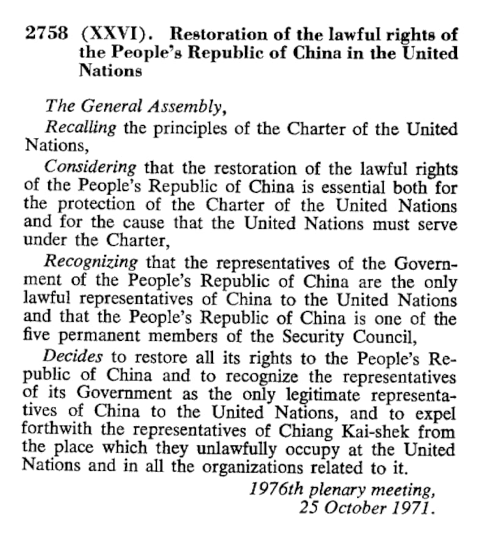

# 事實查覈｜聯大第2758號決議解決了“包括臺灣在內全中國在聯合國的代表權”？

作者：莊敬、沈軻

2023.05.22 16:02 EDT

## 標籤：曲解

## 一分鐘完讀：

美國聯邦衆議院外交委員會五月中通過法案，旨在反制中國試圖通過曲解聯大第2758號決議阻礙臺灣參與國際組織的論述。法案指聯大第2758號決議僅處理中國代表權問題，不涉及臺灣。中國國臺辦批美國提案錯誤、荒謬，聲稱聯大第2758號決議解決了"包括臺灣在內全中國在聯合國的代表權問題"。

通過覈對聯大第2758號決議原文，以及訪問國際法學者和專業人士，亞洲事實查覈實驗室認爲，聯大第2758號決議沒有解決“臺灣是否爲中國一部分”的問題，臺辦的說法是中國對該決議的曲解和單方面主張。

## 深度解析：

第76屆世界衛生大會(WHA)於5月21日至30日在瑞士日內瓦舉行,臺灣連續七年未獲邀請,美國政府、國會採取行動挺臺參與。美國國務卿布林肯(Antony Blinken)9日通過 [聲明](https://www.state.gov/taiwan-as-an-observer-in-the-world-health-assembly-2/)表示,美國強力鼓勵世衛組織(WHO)邀請臺灣以觀察員身分出席今年WHA;布林肯並指出:美國支持臺灣參與適當的國際活動,符合以臺灣關係法、美中三公報、六項保證爲準則的" [一中政策](https://www.rfa.org/cantonese/news/factcheck/onechina-02152023082542.html?encoding=simplified)"。

5月16日,美國衆議院外交委員會通過 ["臺灣國際團結法案"(Taiwan International Solidarity Act)](https://www.congress.gov/bill/118th-congress/house-bill/1176),旨在反制中國試圖通過曲解聯大第2758號決議阻礙臺灣參與國際組織的論述;法案指出,聯大第2758號決議僅處理中國代表權問題,不涉及臺灣及其人民在聯合國或任何相關組織的代表權,沒有就中華人民共和國與臺灣的關係表明立場,也沒有包含任何與臺灣主權有關的聲明。

中國國臺辦發言人馬曉光17日在 [新聞發佈會](http://www.gwytb.gov.cn/xwdt/xwfb/xwfbh/202305/t20230517_12535058.htm)分別回應上述美方行動。他說,關於臺灣參與世衛組織活動問題,中國立場是一貫、明確的,即必須按照一箇中國原則來處理,這也是聯大第2758號決議和世衛大會第25.1號決議確認的根本原則。

針對美國衆院外委會通過的法案內容，馬曉光指出聯大第2758號決議從政治上、法律上和程序上徹底解決了包括臺灣在內全中國在聯合國的代表權問題；他批評美國一些政客反反覆覆在聯大第2758號決議上做文章，不是無知就是別有用心，任何旨在歪曲甚至否定聯大第2758號決議的權威性和有效性的企圖都是徒勞的。

## 聯合國大會第 2758 號決議是什麼?

1949年國共內戰後，國民黨主政的中華民國政府退守臺灣，此後共產黨建立的中華人民共和國試圖取得聯合國中代表「中國」的席位。 1950年起，蘇聯等國陸續在聯大提出“中國代表權問題”，初期親美國家居多，提案未通過。直到1971年美國爲對抗蘇聯而向中華人民共和國讓步，接納中華人民共和國，使其取得聯合國代表權。美國曾提出雙重代表權設想，試圖推動中華民國與中華人民共和國同時擁有聯合國會籍，但未成功。

1971年10月25日，聯合國大會通過第2758號決議決定：恢復中華人民共和國的一切權利，承認該政府的代表爲中國在聯合國組織的唯一合法代表，並立即將蔣介石的代表從聯合國組織及它所屬一切機構中所非法佔據的席位上驅逐出去。

聯合國大會第2758號決議原文（聯合國官網截圖）

## 五十 多年後仍有爭議

聯大第2758號決議僅處理“中國代表權”，原文完全沒有提到中華民國或臺灣。然而，北京認爲“聯大第2758號決議解決了包括臺灣在內全中國在聯合國的代表權問題”，並長年引用這項決議，稱臺灣是中國的一部分，以反對臺灣參與國際組織活動。

[臺灣的外交部](https://www.roc-taiwan.org/ie/post/6299.html)多次反駁中方的論述,指聯大第2758號決議僅處理中國在聯合國的代表權,在法理上並未授權中華人民共和國在聯合國體系代表臺灣,亦未述及臺灣是中華人民共和國的一部分,因此該決議並未解決臺灣人民參與聯合國的問題。

美國霍夫斯特拉（Hofstra University）大學國際法教授古舉倫（Julian Ku）以電郵回覆亞洲事實查覈實驗室的訪問，他表示，聯大第2758號決議沒有解決臺灣是否爲中國的一部分的問題；該決議確實解決了由中華人民共和國或中華民國做爲聯合國合法代表的問題，並認爲中華人民共和國應該在聯合國內代表中國，但該決議根本沒有涉及中華民國或臺灣的主權地位。

曾任美國在臺協會（AIT）臺北辦事處副處長的葛天豪（David Keegan）告訴亞洲事實查覈實驗室，聯大第2758號決議根本沒提“一箇中國原則”，也沒有提到只有在北京治下的一箇中國。

## 中國錯誤詮釋聯大第 2758 號決議?

葛天豪指出，中國正在扭曲聯大第2758號決議，因爲這有助於北京向臺北施壓，接受按照北京的條件統一；北京利用扭曲該協議孤立臺灣，在經濟、外交安全、軍事安全方面直接或間接對臺灣造成損害，而美國國會的提案正是爲反制中國錯誤解讀聯大第2758號決議，以及利用這種錯誤詮釋對臺灣造成損害。

古舉倫說，中國一直致力於說服各國和聯合國機構，應該詮釋聯大第2758號決議把臺灣視爲中國的一部分，這種詮釋讓中國更有力聲稱聯合國大會（以及世界多數國家）支持中國把臺灣視爲中國一部分的主張。

古舉倫認爲，多年來，美國政府並未積極反制中國對聯大第2758號決議的詮釋，因爲想避免與中國發生不必要的衝突，也因爲臺灣的政府本身（在蔣介石和蔣經國領導下）未對這種詮釋提出異議；但近期有所變化的是，美國和臺灣都更加擔心中國會對臺採取軍事行動，而聯大第2758號決議將被用來限制外國對臺的支持。

*亞洲事實查覈實驗室(* *Asia Fact Check Lab* *)是針對當今複雜媒體環境以及新興傳播生態而成立的新單位。我們本於新聞專業,提供正確的查覈報告及深度報道,期待讀者對公共議題獲得多元而全面的認識。讀者若對任何媒體及社交軟件傳播的信息有疑問,歡迎以電郵* *afcl@rfa.org* *寄給亞洲事實查覈實驗室,由我們爲您查證覈實。*

[Original Source](https://www.rfa.org/mandarin/shishi-hecha/hc-05222023155625.html)