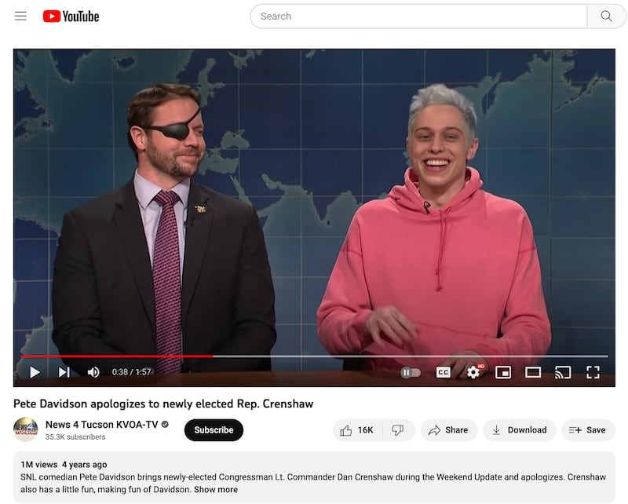

# 事實查覈｜美國脫口秀演員也會因爲批評軍人被重罰嗎？

鄭崇生 發自華盛頓

2023.05.23 15:22 EDT

## 標籤：誤導

## 一分鐘完讀：

"笑果不得"好死"（脫口秀演員House名字的諧音）"。——這句在微博與微信上還可見到的反諷諧音哏，具體描繪中國脫口秀演員李昊石（藝名：House）近來掀起的風波。House以一句"作風優良、能打勝仗"、形容他所領養野狗的剽悍，導致自己遭北京朝陽區警局立案調查，所屬公司笑果文化線下演出在中國多地已暫停，並面臨上千萬元罰款。

多方輿論批評中國政府反應過度，但中國時政博主"孤煙暮蟬"17日在新浪微博和推特上表示，在美國，如果脫口秀演員講了涉及軍人的笑話，後果同樣也很嚴重。

亞洲事實查覈實驗室發現，孤煙暮蟬指出的例子確有其事，但卻只有部分屬實。美國確實有脫口秀演員因爲講了涉及美軍的笑話引起爭議、批評和討論，但卻沒有被政府行政罰款、刑事立案調查這樣的遭遇。

## 深度分析：

## 一字上百萬

“作風優良，能打勝仗”，這八個字、每個價值人民幣超過183萬元——對中國脫口秀演員House來說，他這一陣子形同“禍從口出”的表演，讓自己和所屬公司在經濟上損失慘重，但行政處罰只是各種後果的開始。

本案起於5月17日,北京市文化和旅遊局在官方 [微信公衆號](https://mp.weixin.qq.com/s/lrGTNa5_6EXhSov_FI-B_w)上宣佈,"文化市場綜合執法總隊"接到"羣衆舉報",對上海笑笙文化傳媒有限公司依法立案調查。經查實,公司及其演員李昊石肆意篡改演出申報內容,於13日下午、晚上連續兩場"笑果脫口秀"演出中出現"嚴重侮辱人民軍隊"的情節,造成"惡劣社會影響",決定沒收經營所得及罰款共約1467萬元。

House到底說了什麼、"嚴重污辱人民軍隊"了嗎?根據網上流傳的 [錄音](https://www.youtube.com/watch?v=CWO5rsepI2U),亞洲事實查覈實驗室節選整理逐字敘述如下:

“我們是從家附近的一座山上撿回來兩條野狗，（觀衆笑），我們都不算救助他們，因爲他們在山上那個食物鏈上、完全不需要我們的救助……。這兩條狗他們在山上確實就是食物鏈的頂端，我看到他們第一時間，我感覺我不是在看兩條狗，是動物世界的拍攝現場，就兩條狗追着一隻松鼠、像炮彈一樣發射出去。那你平時看到一些狗，你會覺得很萌，心都要被融化了，你會想到這些詞；我看到這兩條狗，內心只閃爍出八個大字：‘作風優良、能打勝仗’，（觀衆大笑、鼓掌）‘非常優秀’。我牽着這兩條狗在上海的街頭威風凜凜。”

"作風優良、能打勝仗"是中共總書記習近平於2013年3月 [接見解放軍人大代表時提出](http://cpc.people.com.cn/n/2013/0312/c64094-20755159.html)。在這兩句話之前還有一句"聽黨指揮",習近平當時要求要"全面加強軍隊革命化現代化正規化建設,爲建設一支聽黨指揮、能打勝仗、作風優良的人民軍隊而奮鬥。"

用習近平對解放軍說過的話開了一個關於狗的玩笑,House在中國網絡上掀起這個笑話是否污辱解放軍的熱烈討論。笑果文化趕緊出面 [聲明](https://weibo.com/pc233),認了這是"不恰當比喻"並立刻道歉,且無限期停止House的工作。 中國官方的反應則將這個事件的嚴重性進一步升級。

首先北京市文旅局認定，House及其公司違反了《營業性演出管理條例》第25條、第26條規定，並依據同一《條例》的第46條作出相應行政處罰：警告、沒收違法所得132萬元、罰款1335萬元。

隨後,北京公安局17日宣佈對House個人展開立案調查, [公安局認爲](https://weibo.com/u/5556545776),House在演出過程中出現嚴重侮辱人民軍隊的情節,"造成惡劣社會影響"。一旦認定House構成犯罪,是可以依法追究刑事責任。

而可能被公安機關引用的《軍人地位和權益保障法》第32條明定，任何組織和個人不得以任何方式詆譭、貶損軍人的榮譽，侮辱、誹謗軍人的名譽；第65條則提到，若通過大衆傳播媒介或者其他方式，詆譭、貶損軍人榮譽，侮辱、誹謗軍人名譽，或者故意毀損、玷污軍人的榮譽標識的，由公安、文化和旅遊、新聞出版、電影、廣播電視、網信或者其他有關主管部門依據各自的職權責令改正，並依法予以處理；造成精神損害的，受害人有權請求精神損害賠償。

## 美國如何處理失言風波

事發之後，中國內外輿論許多批評，認爲政府反應過度，但也有人支持政府的處置，其中就包括擁有近700萬粉絲的新浪微博博主“孤煙暮蟬”。她在一則帖文中表示，就算是美國，也有不能污辱軍人的紅線。她舉出美國知名電視節目“週六夜現場”（SNL）2018年演出中，脫口演員戴維森（Pete Davidson）調侃才當選聯邦衆議員的共和黨人克倫肖（Dan Crenshaw）像是色情片裏的殺手，也遭到上百萬網友抵制，官員還出面呼籲開除戴維森。

克倫肖在美國海軍服役派駐阿富汗期間失去了右眼，戴維森拿他因公受傷的外貌開玩笑，的確引發軒然大波，兩黨都有政治人物譴責，時任白宮發言人史派塞（Sean Spicer）的確也公開要求製作單位應開除戴維森。

這則貼文在微博等社交媒體引發討論，有網友就此評論，“吹捧美國自由的人從來不會提及美國也有底線”。

亞洲事實查覈實驗室查證，美國脫口秀演員經歷的“嚴重後果”，與House、笑果所面臨的行政、刑事處罰並不可同日而語。

首先,孤煙暮蟬沒有言明,美國官員的批評也只是當時衆多美國輿論討論的觀點之一,戴維森不但沒有因此被開除,時隔一週,克倫肖與戴維森一起上 [週六夜現場節目](https://www.youtube.com/watch?v=0DhWJUBTonM&t=3s)回懟他,同時也不忘自嘲是戴維森的失言讓像他這樣的共和黨人有了好形象。至今,戴維森仍然活躍於喜劇界。

戴維森與克倫肖在爭議笑話事件之後一起上節目，繼續用玩笑消解此前的爭議。（/Youtube 截圖）

克倫肖更借這一次爭議的機會教育、呼籲美國民衆不要因爲政治立場的不同，而忘記了美國一向能在不同意見中妥協找到共識，他更提到戴維森的父親是“911”事件因公犧牲的消防隊員，以此呼籲美國民衆要懂得原諒，更勿忘第一線軍、警、消人員的爲國付出。

戴維森並非開美軍玩笑的唯一案例。另一名美國脫口秀演員博爾（Bill Burr）同樣在2018年的線下演出中質疑，美國軍人的英雄地位。他當時針對航空母艦上的戰機起降指導員，明白指出這樣的工作不過是在“做瑜珈練習的‘戰士一’姿勢”般，同樣的段子也曾引發爭議。

有觀衆直接在現場回嗆博爾應該尊重軍人,但也有身爲退伍軍人的觀衆支持讓博爾把話說完,而博爾不但沒買單,事後還上節目 [數度公開飆髒話](https://www.youtube.com/watch?v=MCaljpu1bW4)痛罵批評者,別想拿愛國主義的大旗來指控他的說法是恨美國。

儘管博爾在女性主義等話題上也常引發爭議,但他仍有演出機會,更主持 [播客節目](https://www.youtube.com/watch?v=lToQkB1UdAI&t=16s)。

美國政府機構也沒有能力因爲某位官員的一句批評，就對企業或個人展開調查或直接處罰。這類文化演出的邊界在哪，在不同時代背景下、仍多是由市場與觀衆的笑聲決定。

## 結論：

“那你們還...”(Whataboutlism）的話術，常是許多中國意見領袖用來批判美國“你不也一樣”的論證技巧，但在笑果文化與李昊石這次風波的例子中，孤煙暮蟬拿美國脫口秀演出涉及軍人的例子做參照，卻刻意不提美國政府的公權力不會針對所演出內容進行處罰，更無法調用司法調查，這種對比的說法是在誤導讀者。​

*亞洲事實查覈實驗室(* *Asia Fact Check Lab* *)是針對當今複雜媒體環境以及新興傳播生態而成立的新單位。我們本於新聞專業,提供正確的查覈報告及深度報道,期待讀者對公共議題獲得多元而全面的認識。讀者若對任何媒體及社交軟件傳播的信息有疑問,歡迎以電郵* *afcl@rfa.org* *寄給亞洲事實查覈實驗室,由我們爲您查證覈實。*

[Original Source](https://www.rfa.org/mandarin/shishi-hecha/hc-05232023151602.html)