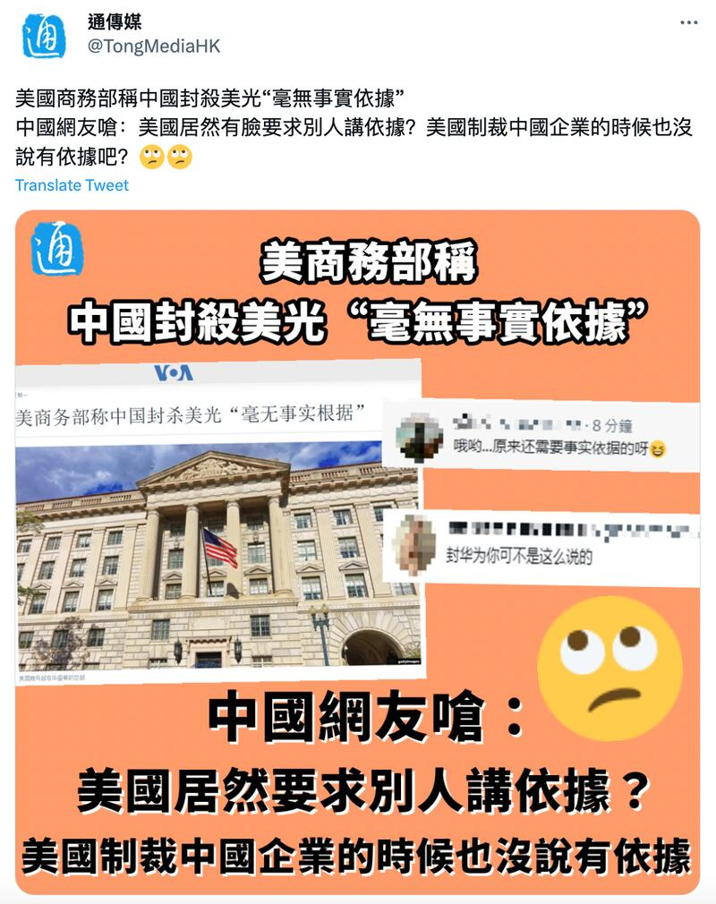
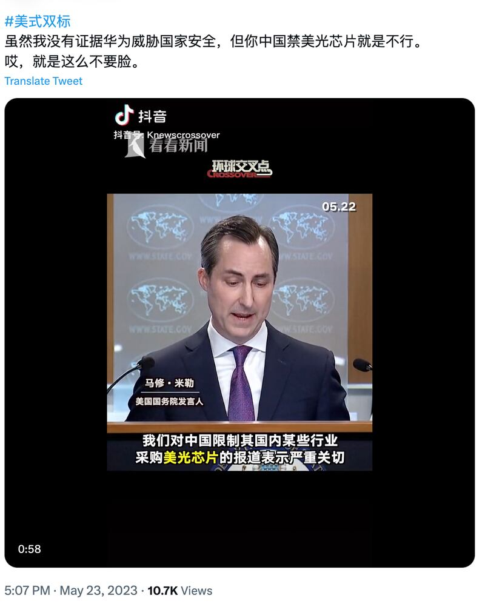
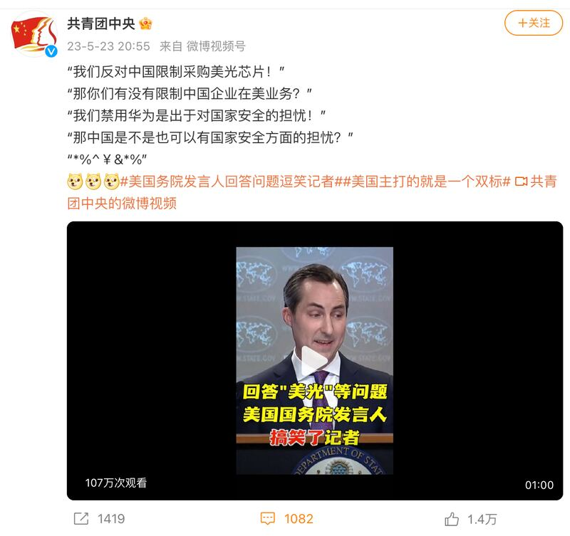
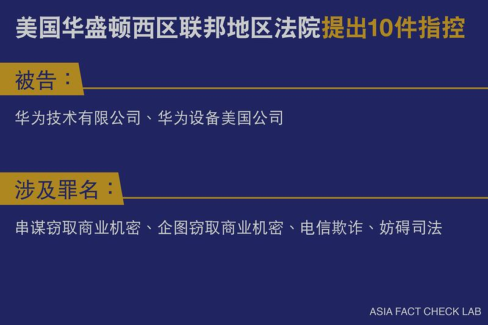
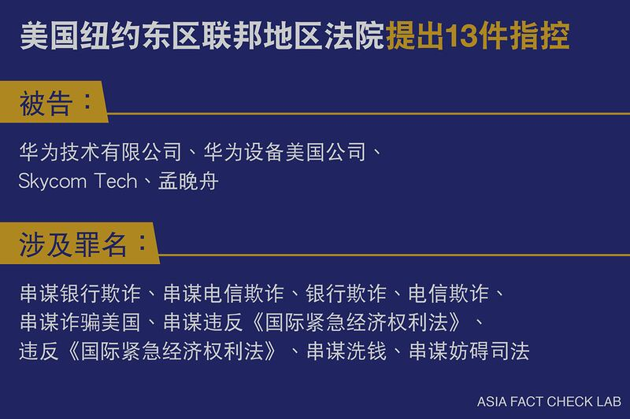

# 事實查覈｜美國製裁中國企業沒有依據嗎？

作者：莊敬

2023.05.24 12:44 EDT

## 標籤：錯誤

## 一分鐘完讀：

中國近日宣佈限制美國美光公司晶片產品在中國銷售，美國政府隨即回應指中方對美光的禁令“沒有事實依據”；部分中國媒體與網民以美國製裁華爲等中企爲例，指控美國“雙標”，質疑美國“制裁中國企業的時候沒有依據，現在要求別人講依據？”

事實上，美國製裁華爲有其依據。美國司法部2019年1月公佈對華爲和一些實體(個人和公司)的起訴書，指控華爲密謀向伊朗提供被美國政府禁止的金融服務，因而有合理的依據認定華爲“從事了違反美國國家安全或外交政策利益的活動”。

## 深度解析：

[中國互聯網信息辦公室5月21日宣佈](http://www.cac.gov.cn/2023-05/21/c_1686348043518073.htm),審查發現美光公司產品存在"較嚴重網路安全問題隱患",對中國關鍵訊息基礎設施供應鏈造成重大安全風險,影響國家安全,中國國內關鍵訊息基礎設施的運營者應停止採購美光公司產品。美國 [商務部](https://edition.cnn.com/2023/05/22/tech/china-ban-us-micron-chips-intl-hnk/index.html)、 [國務院](https://www.state.gov/briefings/department-press-briefing-may-22-2023/#post-448239-G7)、 [白宮](https://www.whitehouse.gov/briefing-room/press-briefings/2023/05/23/press-briefing-by-press-secretary-karine-jean-pierre-34/)分別回應此事,指中國以安全爲由對美光公司實施禁令"沒有事實依據",這些行動與中國宣稱的開放市場及致力建立透明監管的說法不一致。

美國政府的回應卻被部分中國媒體與網民視爲"美式雙標"。 [中國日報網](https://www.chinadaily.com.cn/a/202305/24/WS646d6aa9a310b6054fad4c7a.html)5月24日報道美國對美光禁令的回應,稱美國對於中國的批評,再次顯示美國政府的雙標與虛僞;中國社科院一位研究員高凌雲接受 [環球時報](https://world.huanqiu.com/article/4D1A1SE8681)訪問時表示,美方相關表態是其在對華態度上大玩雙標的典型表現。另有網民在推特標註"美式雙標",稱"雖然我沒有證據華爲威脅國家安全,但你中國禁美國芯片就是不行。哎,就是這麼不要臉。"

中通社旗下“通傳媒”推特帳號發文，稱中國網民嗆：美國製裁中國企業的時候沒說有依據。圖取自通傳媒推特

網民以簡體中文在社媒發文，指美國批評中國禁美光產品“沒有依據”是雙標、不要臉。圖取自推特

## 美國務院發言人“說不贏就跑”？

["共青團中央"微博視頻號](https://weibo.com/3937348351/N1Xl2eCgx?pagetype=profilefeed)23日發佈經剪輯的一分鐘短視頻,標題以簡體中文寫着"回答'美光'等問題,美國國務院發言人搞笑了記者",內容是美國國務院發言人馬修・米勒(Matthew Miller)22日於例行記者會上,與美聯社記者馬修・李(Matthew Lee)有關美光禁令的部分問答。截至24日已累積逾百萬次觀看,一千多則留言,有網民酸:"主打一個雙標""說不贏就跑了"等。

“共青團中央”微博視頻號發佈經剪輯的短視頻，以美國國務院發言人回應美光禁令的部分內容，稱美國“雙標”。圖取自微博

畫面中，李提問：“你們有沒有禁止或試圖禁止一家中國公司在這裏或海外開展業務？爲什麼不允許他們做同樣的事？”米勒回應：“美國已明確表示禁用華爲和華爲技術是出於國家安全的擔憂。”

李追問：“中國是不是也可以有國家安全的擔憂？”米勒說：“他們是，但正如我所說，他們已明確表示他們對商業開放⋯⋯”李打斷米勒的發言，笑說：“但你也明確表示，你也對商業開放”。米勒接續說：“他們說有透明的監管框架，我認爲我們這裏有，但他們沒有。”緊接着下一個畫面便是米勒轉頭離開了講臺。

[美國國務院5月22日記者會的完整影片](https://www.state.gov/briefings/department-press-briefing-may-22-2023/#post-448239-G7)顯示,米勒之後解釋美中不同之處在於透明監管框架,法治在美國是非常明確的。而且,米勒談完美光禁令後,並未立即離開講臺,而是繼續回答其他記者的問題。

## 美國製裁華爲有依據嗎？

2019年1月, [美國司法部公佈起訴書](https://www.justice.gov/opa/pr/chinese-telecommunications-conglomerate-huawei-and-huawei-cfo-wanzhou-meng-charged-financial)
,指控華爲技術有限公司、公司首席財務官孟晚舟,以及兩家分支機構涉嫌銀行和電信欺詐、竊取商業機密、違反制裁伊朗的規定等,共23項刑事控罪。美國聯邦調查局(FBI)局長克里斯托弗.雷(Christopher Wray)當時表示,像華爲這樣的公司,對美國經濟與國家安全構成雙重威脅。華爲隨後發表聲明否認全部指控。

## # 美國製裁華爲的依據 來源：美國司法部、 英國廣播公司（BBC）報道 。製圖：亞洲事實查覈實驗室

[美國商務部](https://2017-2021.commerce.gov/news/press-releases/2019/05/department-commerce-announces-addition-huawei-technologies-co-ltd.html)於2019年5月中宣佈,將把華爲及70家關聯企業列入"實體清單",未來若沒有美國政府的批准,華爲將無法向美國企業取得零組件和技術。商務部聲明指出,有合理的依據認定華爲從事了違背美國國家安全或外交政策利益的活動,司法部此前公佈的起訴書指控華爲涉嫌違反《國際緊急經濟權利法》,向伊朗提供金融服務,以及妨礙司法等。

## 結論：

美國商務部2019年宣佈將華爲與關聯企業列入實體清單時，明確揭示了取得的資訊與法律依據，並非中國網民所稱“美國製裁中國企業的時候沒說有依據”。中國部分媒體與網民以華爲案爲證指控美國雙重標準，並不屬實。

*亞洲事實查覈實驗室（Asia Fact Check Lab）是針對當今複雜媒體環境以及新興傳播生態而成立的新單位。我們本於新聞專業，提供正確的查覈報告及深度報道，期待讀者對公共議題獲得多元而全面的認識。讀者若對任何媒體及社交軟件傳播的信息有疑問，歡迎以電郵 [afcl@rfa.org](http://afcl@rfa.org)寄給亞洲事實查覈實驗室，由我們爲您查證覈實。*

[Original Source](https://www.rfa.org/mandarin/shishi-hecha/hc-05242023123712.html)