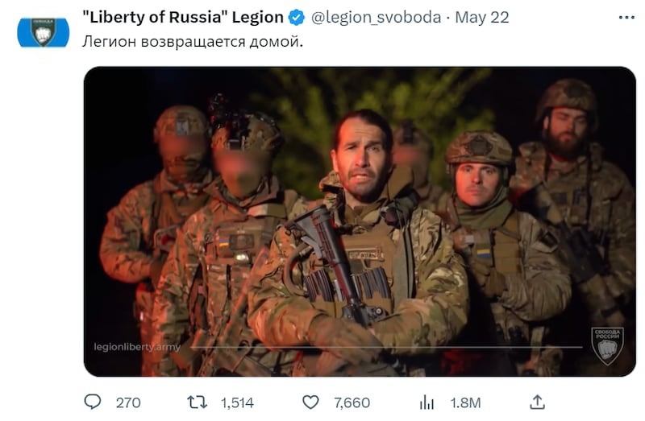
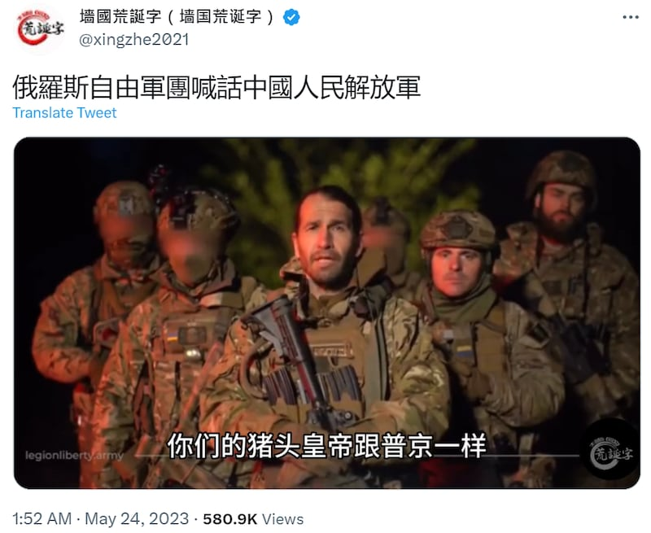

# 事實查覈｜俄羅斯自由軍團向中國人民解放軍喊話了嗎？

作者：莊敬

2023.05.26 13:47 EDT

## 標籤：錯誤

## 一分鐘完讀：

最近網上流傳"俄羅斯自由軍團喊話中國人民解放軍"短視頻，畫面是俄羅斯自由軍團成員以俄語發言，簡體中文字幕寫着"你們的豬頭皇帝跟普京一樣，都是欺壓百姓的獨裁者"等字句。

經查，俄羅斯自由軍團（Liberty of Russia Legion）確實發佈了這條視頻，但內容與中國人民解放軍無關，流傳版本的中文字幕的翻譯與原視頻不符。是由推特用戶"牆國荒誕字"加上。但發佈者聲明，他的作品大多是配字幕搞笑。亞洲事實查覈實驗室發現，部分網媒、網民轉發這段二次創作的中文字幕短視頻時，沒有標註字幕是諷刺創作，可能會導致受衆信以爲真。

## 深度解析：

亞洲事實查覈實驗室注意到,在油管(Youtube)擁有逾40萬訂戶、自介"堅持報導真相,對抗中共極權"的頻道"升旗易得到新聞媒體"近日發佈一段短視頻,標題爲 ["俄羅斯自由軍團喊話中國人民解放軍"](https://www.youtube.com/watch?v=336rJfbYwV8)。畫面爲身穿軍服男士以俄語發言,簡體中文字幕寫着"中國人民解放軍戰士們,我們是俄羅斯自由軍團,我們將爲我們的同胞而戰,爲自由而戰......你們的豬頭皇帝跟普京一樣,都是欺壓百姓的獨裁者"。

首先,我們查覈視頻真實性。 "俄羅斯自由軍團"5月22日在推特發佈短視頻,多家媒體均有轉載、報道。據 [加拿大廣播公司](https://www.youtube.com/watch?v=8cIjh3SY9qI)、英國《泰晤士報》旗下的 [泰晤士電臺](https://www.youtube.com/watch?v=0Rvyx-xFkF0)的報道和翻譯,該視頻內容大致是在講普京統治下的俄羅斯充滿謊言、腐敗、審查、限制自由,是時候結束克里姆林宮的統治了,俄羅斯將獲得自由。這些新聞報道中,並未提及該視頻中有涉及中國和中國解放軍相關內容。

"俄羅斯自由軍團"5月22日在推特發佈短視頻。圖取自"Liberty of Russia" Legion推特

再者,我們查覈視頻中的中文翻譯來源。 原始視頻右下角浮水印爲"俄羅斯自由軍團"徽章,但中字短視頻右下角浮水印卻寫着"牆國荒誕字"。經查, ["牆國荒誕字"](https://twitter.com/xingzhe2021/status/1661067499180376100)推特賬戶5月24日凌晨發佈中字短視頻,截至25日下午觀看次數逾58萬,超過400次轉推。該視頻推文下有留言稱讚字幕很有趣,但由於視頻並未標明此視頻翻譯是諷刺笑話,也有人問"這是真的嗎",另有留言評論指出,不該故意傳播錯誤訊息。

推特用戶"牆國荒誕字"發佈搭配中文字幕的短視頻，主題爲俄羅斯自由軍團喊話中國人民解放軍。圖取自推特

“牆國荒誕字”賬號24日在其推特的評論中兩度聲明，他並非專業翻譯，也非官方新聞頻道，“本推視頻作品大多是配字幕搞笑而已！質疑字幕真假實屬沒有必要！ ”。而他的推特帳號介紹也寫道，將電影、電視片段編輯中文字幕進行二次創作，以搞笑、諷刺等形式，揭露獨裁者的荒唐、邪惡。

然而，與前述發佈此視頻的“升旗易得到”類似，部分油管、推特賬戶在轉發該視頻時，並沒有標註這是一個諷刺笑話作品。

## 結論：

俄羅斯自由軍團的視頻爲真，搭配的中文字幕則爲諷刺的二次創作，因此所謂“俄羅斯自由軍團喊話中國人民解放軍”並不屬實。亞洲事實查覈實驗室認爲，搞笑、諷刺屬創作自由，而且多數受衆都能辨識明顯爲惡搞的內容，但自稱媒體的平臺轉發此類影片時如不註明，仍有可能造成誤會。

*亞洲事實查覈實驗室（Asia Fact Check Lab）是針對當今複雜媒體環境以及新興傳播生態而成立的新單位。我們本於新聞專業，提供正確的查覈報告及深度報道，期待讀者對公共議題獲得多元而全面的認識。讀者若對任何媒體及社交軟件傳播的信息有疑問，歡迎以電郵 [afcl@rfa.org](http://afcl@rfa.org)寄給亞洲事實查覈實驗室，由我們爲您查證覈實。*

[Original Source](https://www.rfa.org/mandarin/shishi-hecha/hc-05262023133926.html)