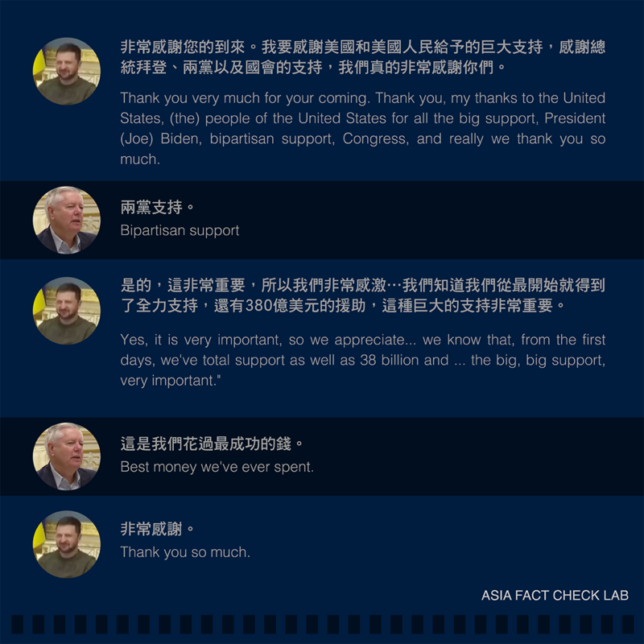

# 事實查覈｜因爲"俄國人將會死去"，美參議員大讚"錢花得成功"？

作者：董喆

2023.05.29 13:51 EDT

## 標籤：移花接木

## 一分鐘完讀：

美國共和黨籍參議員琳賽.格雷厄姆（Lindsey Graham）5月26日在基輔與烏克蘭總統澤倫斯基會面。俄羅斯衛星通訊社在28日的報導中"引述"格雷厄姆說："俄羅斯人將會死去。我們還從未這樣成功的花過錢"。

中國官媒環球時報跟進了衛星通訊社的報導，並剪輯了影片搭配字幕"美議員稱俄羅斯人將會死亡。這是我們花過最成功的錢"。香港通傳媒轉發了這則影片，在華文社羣流傳。

亞洲事實查覈實驗室查看完整影片後發現，"俄羅斯人將會死去"以及"我們還從未這樣成功的花過錢"各有前言後語，並非格雷厄姆的連續發言。流傳的影片是經剪輯和拼接的結果。

## 深度分析：

美國共和黨參議員琳賽.格雷厄姆（Lindsey Graham）26日在基輔與烏克蘭總統澤連斯基會面，俄羅斯衛星通訊社28日報導，稱格雷厄姆在會中表示"俄羅斯人將會死去。我們還從未有這樣成功的花過錢"，但報道沒有附帶影像。

## 流傳的格雷厄姆的說法是什麼？

亞洲事實查覈實驗室以"Lindsey Graham"爲關鍵字在推特上搜尋，看到亦有許多西方帳號轉貼了英國太陽報（The Sun）剪輯的影音，發出時間與俄羅斯衛星通訊社報導刊出的時間大致相同。

中國官媒《環球日報》以此爲素材,發表" [美議員稱"俄羅斯人正在死亡"所以援烏成功,網友:美政策真面目](https://world.huanqiu.com/article/4D4kmqPSfrV)"一文,其中亦提到"根據英國《太陽報》發佈的視頻...."並且將《今日俄羅斯》作爲第二消息來源,闡述"在會晤中格雷厄姆告訴澤連斯基,"俄羅斯人正在死亡,我們從未這麼成功地花過錢"一事,並搭配短視頻。這則短視頻在微博與推特上皆有流傳。

## 兩人的會晤說了什麼？

檢視 [太陽報影片](https://youtu.be/R8ejPbK99B0)可發現0'23"至28"秒攝影機爲同一視角,澤連斯基和格雷厄姆對話如下:

澤連斯基：要麼自由，要麼死亡。 （自由或死亡。）

格雷厄姆：要麼自由，要麼死亡。 （自由或死亡。）

澤連斯基：現在你們自由了。（現在你自由了。）

格雷厄姆：是的。（Yes.）

澤連斯基：我們將會自由。（我們會的。）

格雷厄姆：俄羅斯人將會死去。（俄羅斯人快死了..）

接着0’29”秒切換至另一鏡位，緊接着對話如下：

格雷厄姆：我們花過最成功的錢。 （Best money we've ever spent.）

澤連斯基：非常感謝。 （Thank you so much.）

由於第29秒前後有明顯剪接痕跡。爲了驗證影片是否遭移花接木，亞洲事實查覈實驗室檢視了路透社提供的完整影片。發現格雷厄姆提及“花過最成功的錢”是回應澤倫斯基感謝美國兩黨合作的支持。原始對話如下：

"俄羅斯人將會死去"，則是以下這段對話：

格雷厄姆28日以電郵路透社回應爭議，表示他向澤倫斯基提到"烏克蘭已經接受了美國的箴言——要麼自由，要麼死亡。美國幫助烏克蘭免於俄羅斯戰爭犯行是很好的投資"。

## 結論：

我們無法證明太陽報的剪輯基於何種動機。但經過俄羅斯衛星通訊社、推特部分網民及中國官媒的傳播及解讀下，格雷厄姆對美國援助烏克蘭成效的讚賞，連結上了在俄烏戰爭中死亡的俄羅斯人，極可能造成誤解。

根據完整影片，格雷厄姆表達"我們還從未有這樣成功的花過錢"是回應澤倫斯基感謝美國的援助。至於"俄羅斯人將會死去"一說，則是回應澤倫斯基表達烏克蘭會爲自由奮戰至最後一刻的說法，兩者並無關聯。

*亞洲事實查覈實驗室（Asia Fact Check Lab）是針對當今複雜媒體環境以及新興傳播生態而成立的新單位，我們本於新聞專業，提供正確的查覈報告及深度報道，期待讀者對公共議題獲得多元而全面的認識。讀者若對任何媒體及社交軟件傳播的信息有疑問，歡迎以電郵afcl@rfa.org寄給亞洲事實查覈實驗室，由我們爲您查證覈實。*

[Original Source](https://www.rfa.org/mandarin/shishi-hecha/hc-05292023133428.html)