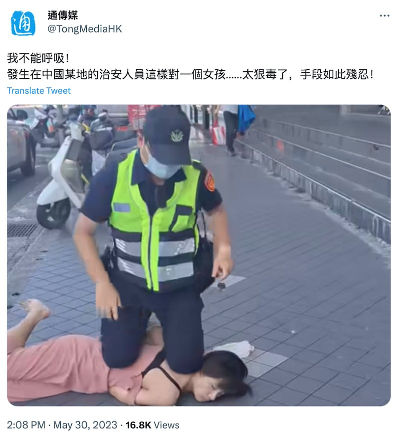
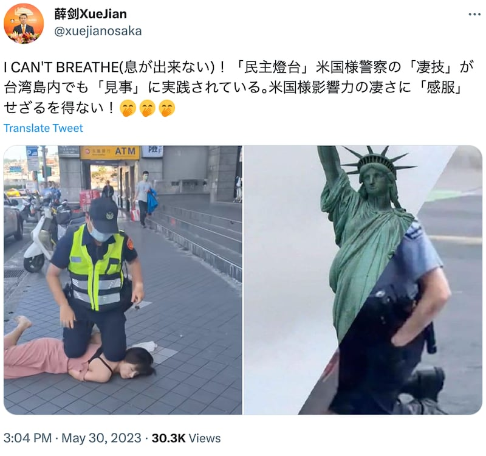
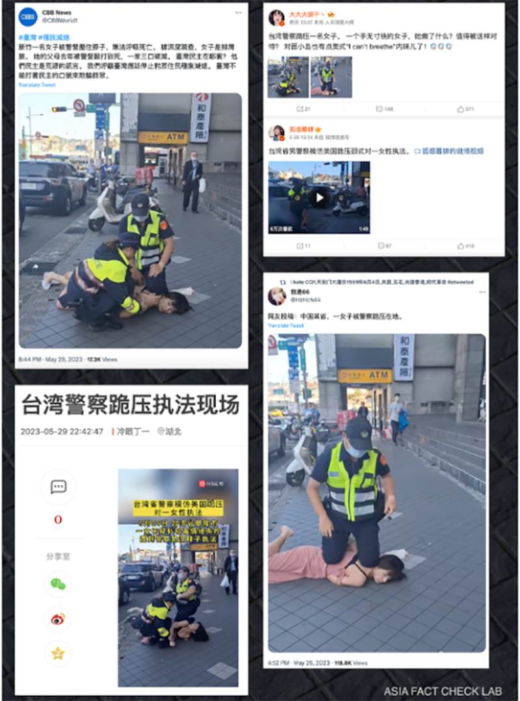

# 事實查覈｜男警"跪頸壓制"女子，"我不能呼吸"重現臺灣？

作者：莊敬

2023.05.31 18:23 EDT

## 標籤：錯誤

## 一分鐘完讀：

推特、微博、網易等平臺上近日瘋傳一張臺灣男警以跪姿壓制女子的照片，包括中國駐大阪總領事薛劍、中通社旗下"通傳媒"都轉傳相關照片，部分配文寫着"我不能呼吸"意指臺警模仿美國警察跪頸，行爲狠毒、殘忍，甚至有自媒體帳號稱女子因無法呼吸已經死亡。

亞洲事實查覈實驗室經採訪後得知，影像中的女子涉嫌吸毒，在警方逮捕過程中口出惡言，意圖動手襲警，被男警摔倒後壓制背部以便將她戴上手銬；之後她自行起身，由男警帶上警車。新聞報道引用的現場錄影，情節也和警察說法相同。該案件既無關"種族滅絕"，該女子也沒有死亡。

## 深度解析：

包括中國官媒香港中通社旗下 ["通傳媒"](https://twitter.com/TongMediaHK/status/1663427024390864896)(下左圖)等多個帳號5月30日在推特發佈以下照片,配文都提到"我不能呼吸",引人聯想到引發美國"黑人的命也是命(Black Lives Matter)"社會運動的弗洛伊德事件。2020年5月,美國明尼蘇達州一名白人員警以膝蓋壓制非裔男子喬治·弗洛伊德(George Floyd)頸部長達5分鐘,弗洛伊德多次掙扎表示不能呼吸,但最終斷氣,引爆社會憤怒,種族歧視爭議再起。

[中國駐日本大阪總領事薛劍](https://twitter.com/xuejianosaka/status/1663441142267146241)也發了這則訊息(下右圖),他發佈的合成圖右半部,更直接使用美國"弗洛伊德"案的照片。

中通社旗下"通傳媒"在推特發佈照片，配文寫上"我不能呼吸" （圖取自通傳媒推特賬號）

中國駐大阪總領事薛劍在推特發佈臺灣男警以跪姿壓制女子的照片，其合成圖右半部還使用美國"佛洛伊德"案的照片。（圖取自薛劍推特帳號）

亞洲事實查覈實驗室也注意到,自稱爲自媒體的推特用戶 ["CBB新聞"](https://twitter.com/CBBWorld1/status/1663164496951803910)5月29日晚間發佈類似照片,內容除了稱照片中的女子無法呼吸死亡,更指這名女子是排灣族原住民,她的父母去年才被警察打死,如今一家三口全滅等訊息,還呼籲臺灣應停止對原住民"種族滅絕"。 "CBB News"帳號於2023年1月加入推特,經常發佈未標註來源的照片或影片,指控臺灣警察毆打原住民,且會標註"#臺灣"、"# 種族滅絕"等。

該事件在中文社媒廣泛傳播 圖取自推特、微博、網易。

亞洲事實查覈實驗室發現,這起事件5月26日發生在臺灣基隆市,根據 [中央社](https://www.cna.com.tw/news/asoc/202305290135.aspx)、 [聯合報](https://udn.com/news/story/7315/7197090)、 [自由時報](https://news.ltn.com.tw/news/society/breakingnews/4316262)、 [TVBS](https://www.youtube.com/watch?v=uXJy5_IQAZk)、 [三立電視](https://www.setn.com/News.aspx?NewsID=1301635)等多家臺灣媒體報道,這名女子姓蔡,她被控與其他3人涉嫌在旅館內吸毒。基隆警方到場查獲毒品,將4人帶回調查時,蔡姓女子拒上警車而被員警壓制,期間對員警口出惡言,甚至欲襲警。警方偵詢後,依違反毒品危害防制條例、社會秩序維護法及妨礙公務罪嫌,全案移請基隆地方檢察署偵辦,涉案人已交保。

報道本案的臺灣媒體大多引用了網路上所流傳警方制伏女子的影片。亞洲事實查覈實驗室檢視了聯合新聞網的 [影片](https://fb.watch/kSIVPEooUH/),發現當時女子先是拒上警車,遭男警壓制在地,女警要幫女子上手銬時,女子掙扎並踢了員警一腳,女子上銬後隨即起身,對員警比中指、抵抗上車,之後男警纔將她帶進警車;從男警將女子壓制在地到她起身,過程約35秒。

儘管臺灣媒體將這起案件當作一般社會新聞報道，但推特、微博、網易等平臺29日至31日出現大量用戶轉發相關照片與短視頻，例如“孤煙暮蟬”微博視頻號在29日下午3點54分發布了視頻，未引述臺媒報道說明事件經過，配文僅寫“臺灣省男警察模仿美國跪壓頸式對一女性執法”，通傳媒於30日下午2點08分發布，薛劍則是同天下午3點04分發文。

亞洲事實查覈實驗室5月31日電訪基隆市警察局第二分局信六路派出所所長朱德望，他表示，該女子並非原住民，逮捕行爲符合規範，沒有導致嫌犯受傷或無法呼吸；至於警方以柔道技法“大外割”摔倒並壓制她，朱德望說明，這是員警制伏犯嫌的方式——先將對方摔倒在地，壓制背部，讓他無法起身，“我們不會壓在脖子讓他無法呼吸，我們會壓在他的身體上，讓他無法起來爲原則。”

## 結論：

經覈查原視頻並訪問負責此案的臺灣警方，我們得知社媒上所謂“臺警跪頸壓制”、“女子無法呼吸死亡”等說法都是不實資訊；然而，在多家臺灣媒體已報道、發佈影片後，中國外交官、官媒仍不查證，以一張截圖配文“我不能呼吸”，甚至使用弗洛伊德案的照片，以錯誤資訊指控臺灣警察學美警跪頸虐待嫌犯。亞洲事實查覈實驗室同時觀察到，本案有大量帳號在短時間集中發佈同一則錯誤資訊的協同行爲。

*亞洲事實查覈實驗室（Asia Fact Check Lab）是針對當今複雜媒體環境以及新興傳播生態而成立的新單位。我們本於新聞專業，提供正確的查覈報告及深度報道，期待讀者對公共議題獲得多元而全面的認識。讀者若對任何媒體及社交軟件傳播的信息有疑問，歡迎以電郵afcl@rfa.org寄給亞洲事實查覈實驗室，由我們爲您查證覈實。*

[Original Source](https://www.rfa.org/mandarin/shishi-hecha/hc-05312023180757.html)