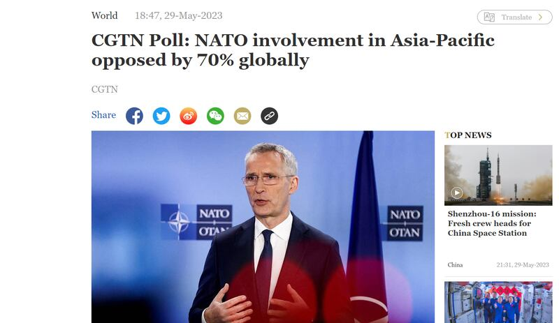
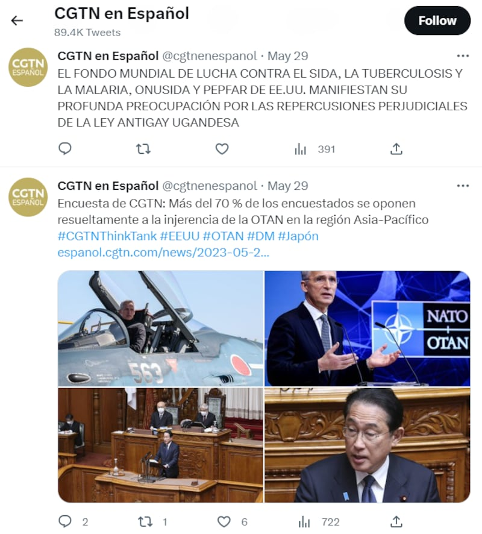
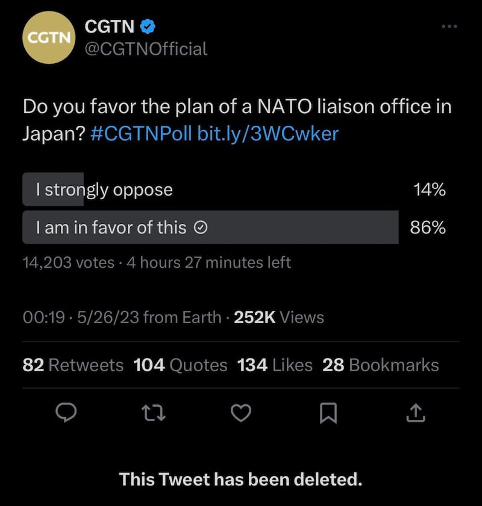

# 事實查覈 | 中國官媒民調：全球七成民衆反對北約染指亞太 ？

作者:鄭崇生、莊敬 發自華盛頓、臺北

2023.06.02 18:45 EDT

## 標籤：欠缺證據、誤導

## 一分鐘完讀：

“全球多數受訪者反對北約插手亞太”。中國國有媒體中央廣播電視總檯的外語頻道中國環球電視網（CGTN）5月29日引述自己的民調報道稱：日本首相岸田文雄24日證實北大西洋公約組織（NATO）計劃明年在東京設聯絡處後，有高達七成的受訪者表達“強烈反對”的立場。

但亞洲事實查覈實驗室發現，這則報道只交代了調查在“CGTN多個語種官網平臺上進行”，但完全沒有提供民調的基礎資料。除官網外，CGTN也曾在自己的官方推特賬號上發起“是否同意北約在日本設聯絡處”民調，結果是贊成者遠多於反對者。然而，CGTN刪除了推特民調頁面，在後來的報道中也沒有交代刪除的原因。綜上，CGTN民調給出的“七成民衆反對北約染指亞太”結論不可信，涉嫌誤導民衆。

CGTN發佈的關於70%民衆反對北約染指亞太的報道截圖 圖截取自CGTN官網

## 深度分析：

北約將在日本設立聯絡處的消息引起國際關注,CGTN於5月29日以 [英文](https://news.cgtn.com/news/2023-05-29/CGTN-Poll-NATO-involvement-in-Asia-Pacific-opposed-by-70-globally-1kcu7oTVVQs/index.html)、 [西班牙文](https://espanol.cgtn.com/news/2023-05-29/1663092793195958273/index.html)及 [中文](https://content-static.cctvnews.cctv.com/snow-book/index.html?t=1685348111764&toc_style_id=feeds_default&share_to=wechat&track_id=8D7289A3-1D88-4A06-8D2F-AD679A3585F9_707040969604&item_id=8698853393988945642)發表了相關報道。在英文報道中,CGTN提到,日前曾在"多語種網絡平臺"發起一次網絡民調,結果高達71.1%受訪者"強烈反對"北約的做法。

報道指出，在不同的語種中，以西班牙語、法語、阿拉伯語和俄語的平臺上，都有超過8成的受訪者反對這一可能舉措。如果以國家爲單位統計，俄語受訪者反對的比例最高，達到 92%。在英語平臺網站上反對比例最低，爲54%。

CGTN用西語發佈的民調結果 圖截取自CGTN西語推特帳號

## "全球"民調報道欠缺調查方法

民調機構“皮尤研究中心”（Pew Research Center）的高級調查顧問基特（Scott Keeter）曾撰文解釋民調如何運作，其中列出民調應該提供給受衆的重要資訊應包括“訪問了誰”、“訪問多少人”、“執行方式”、“結果有無加權”和“問卷題目”等。

基特認爲，現在很多民調甚至不採隨機抽樣，而是通過各種技術讓人民在網絡上自願、或選擇參與調查，這些民調怎能準確代表人們？雖然有些執行單位會通過加權調整，但這種調查的代表性較差，也容易受到虛假受訪者的影響——也就是沒有資格參加調查或提供不真誠的答覆。

臺灣民調專家戴立安6月1告訴亞洲事實查覈實驗室，CGTN並沒有提供受訪者的性別、年齡、教育程度、國別等詳細資料。同時，在網絡平臺上執行調查本身就欠嚴謹，因爲推特等社媒上有許多假賬號，即使有幾十萬人提交問卷，不一定有樣本代表性和真實性。

## CGTN在推特上做了什麼？

在這次民調過程中，CGTN在推特平臺上的一次“刪文”操作也引發了質疑。

5月26日,CGTN在推特上發起投票,詢問網民"是否支持北約到日本設立聯絡處"。美國聯邦參議員克魯茲(Ted Cruz)的前法案助理蘇柏力克(Michael Sobolik) [發現](https://twitter.com/michaelsobolik/status/1662431259165970432?s=20),CGTN又很快將推文刪除了。蘇柏力克的截圖顯示,至少到26日凌晨3時,投票推文仍是存在的,截至當時,有86.5%的參與者支持北約到日本設立聯絡處。亞洲事實查覈實驗室無法獨立證實與查覈CGTN刪除推特投票的確切時間點。

然而，上述推特上的即時投票情況，並不在CGTN後來發出的英文報道內容中，報道也沒有提到CGTN自己在推特上刪除了這一投票。

戴立安認爲，如果真的有刪文情況，很可能是預期結果不如執行單位所想。若是一般專業單位，發生這種情況“必須要交代”，但CGTN此次調查恐怕並不是要反映民意，而是爲倡議自己國家的立場。

就”刪除推特平臺民調結果”一事，亞洲事實查覈實驗室致信CGTN詢問原因，並希望瞭解究竟有多少人，在哪些平臺參與了投票。至截稿時，CGTN都沒有回覆。

CGTN刪除了推特平臺的調查結果，但沒有交代原因。蘇柏力克推文截圖

## "民調"的誘導性問題

亞洲事實查覈實驗室同時發現,CGTN設計的 [提問](https://news.cgtn.com/vote/dAA/index.html)存在預設的前提,例如:

提問一：日本作爲一個有侵略別國歷史的國家，近年來卻尋求擴大自身軍事實力。 你擔心嗎？

提問五：北約在美國的支持下，不斷擴大軍事勢力範圍，插手地區事務。 你認爲北約是否已成爲美國維護霸權和追求政治利益的工具？

戴立安對此批評，問卷雖然題目不多，“但每一題都充滿誘導性”，問卷目的是爲凸顯執行單位的立場。他說：“CGTN的調查是‘push poll’（導向性民意調查），把立場塞給民衆，所以是宣傳，不是民調。”

## 結論：

一般來說，規範的民調結果報告都會交代其樣本量、有效樣本數、置信率、民調進行時間及抽樣正負誤差值等。而CGTN的民調結果發佈只引述了自己官網上的調查結果，上述基礎信息都沒有給出說明。問題設計也具有導向性，還沒有給出任何解釋地刪除了推特平臺上的投票結果。

基於以上情況，亞洲事實查覈實驗室認爲，CGTN的這一民調本身欠缺科學性和可信度，CGTN基於這次民調發布的“全球逾7成受訪者強烈反對北約染指亞太”的報道也是在誤導輿論。

*亞洲事實查覈實驗室（Asia Fact Check Lab）是針對當今複雜媒體環境以及新興傳播生態而成立的新單位。我們本於新聞專業，提供正確的查覈報告及深度報道，期待讀者對公共議題獲得多元而全面的認識。讀者若對任何媒體及社交軟件傳播的信息有疑問，歡迎以電郵afcl@rfa.org寄給亞洲事實查覈實驗室，由我們爲您查證覈實。*

[Original Source](https://www.rfa.org/mandarin/shishi-hecha/hc-06022023183139.html)