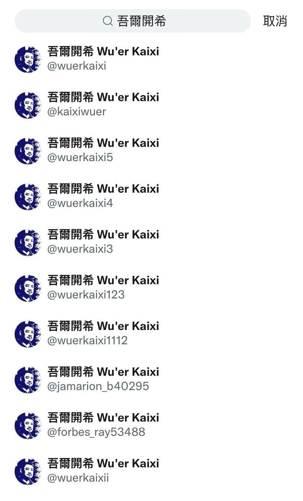

# 事實查覈｜傳播觀察：六四前夕，社媒上的假帳號、假訊息

作者：莊敬

2023.06.03 09:13 EDT

“六四”事件34週年之際，“六四紀念館”於美國紐約開幕，但就在開館前，社媒平臺上出現大量冒名“六四紀念館”或者民運人士“王丹”、“吾爾開希”的假帳號；亞洲事實查覈實驗室注意到，這些帳號之中，有些是今年2月至5月才加入的新帳號，有些帳號則是5月特別活躍、密集發文，經比對他們近期推文，發現他們傳播相同主題的假訊息。

## “六四紀念館”開幕在即 網上出現大量假帳號

王丹5月30日在臉書與推特發文，並附上列出“六四紀念館”假帳號的截圖（下圖）；他表示，“這種情況一方面說明當局已經視六四紀念館爲眼中釘，另一方面也等於變相證明了：六四紀念館的建立，是對中共的有效地抵抗和打擊。”

（圖取自王丹臉書）

"六四紀念館"原設於香港,2021年因《國安法》實施被迫關閉,王丹等民運人士開始募款,籌備在美國紐約重設。 ["六四紀念館"真正官網推特號"](https://twitter.com/64museum/status/1613434367791206402) [@64博物館"](https://twitter.com/64museum/status/1613434367791206402)也公佈收到的捐款金額與捐贈者名錄,截至今年1月12日,收到捐款逾53萬美元。

王丹發佈的截圖中有8個取名“六四紀念館”的假帳號，它們除了名稱、頭像相同，發文內容也相似，大多聲稱“六四紀念館”從未要求捐款、“@64博物館”爲詐騙的假冒帳號等錯誤資訊。明顯希望壓抑捐款人數和數量。

## “六四紀念館”推特假帳號

圖取自推特。製表：亞洲事實查覈實驗室（資料統計至2023年6月1日）

其中，用戶“@Bogdana94035980”主要發佈嘲諷文，稱歡迎各界隨意破壞紀念館、收到的捐款夠揮霍一陣子等內容。此帳號今年2月才加入，發文數不多，但常回覆他人推文，尤其針對因彙整白紙革命資訊而成推特名人的“李老師不是你老師”，留言指控對方造謠。

推特還在“六四紀念館”的假帳號下，推薦用戶追蹤王丹，但推薦的帳號卻是冒王丹之名開設的假帳號。

推特在「六四紀念館」假帳號下，推薦追蹤名爲「王丹」的假帳號。（圖取自推特）

## 六四將近 假帳號密集發文

王丹真實的推特號是“＠wangdan1989”，他5月17日發文，提醒網友注意盜用他名義開設的帳號（下圖左），雖然此一假帳號已被封鎖（下圖右），但推特上還存在其他以王丹爲名的帳號。

（圖取自推特）

例如，取名王丹的用戶“@MaisieRoby77722”今年4月加入推特，至今發了5則推文，其中5月25日推文寫道：“距離“六四”紀念館在紐約開幕只有10天的時間了，截止目前紀念館共收款60餘萬元，離150萬美元目標差距還是有點大。不過，沒關係，美國政府當初已經答應通過渠道給我們50萬美元，反正我們抹黑和攻擊中國，美國還是很樂意的，我們可以說是一拍即合！”

用戶“@MillerLynch16”顯示2013年4月加入，截至今年6月1日，共6則推文，皆在今年5月15日至6月1日間發佈，內容都和“六四紀念館”有關，包括籌款活動經費已夠、籌款活動停止、收款帳號出問題等，請支持者不要再匯款。

用戶“@spdytrader”2009年2月加入，推文132則，過去常轉發國際新聞與中國外交官的推文，但今年5月中起，開始發佈與王丹、“六四紀念館”有關的推文；例如，5月31日推文：“六四紀念館”開幕在即，網上開始出現大量紀念館官網的假帳號，這種情況說明紀念館可能無法按時進行，請大家做好準備。

再觀察用戶彼此的關係，可以發現“@Flanndner1”和“@TomasMcint14002”兩個帳號分別在5月29日、6月1日發佈文字、附圖，甚至標點符號都一模一樣的推文，兩者在5月30日、31日也接連發布相同推文。亞洲事實查覈實驗室認爲，這些在特定時間活躍的用戶之間，具有一定程度的協同操作行爲。

推特搜尋「吾爾開希」，出現一串名稱、頭像一樣的帳號。（圖取自推特）

在推特搜尋民運人士“吾爾開希”，也會出現一連串帳號，名稱、頭像都相同，有些用戶名只差一個“i”或阿拉伯數字；多個以“吾爾開希”爲名的帳號在今年3月至5月加入推特，已有部分帳號或文章遭刪除，其中部分帳號的推文與回覆內容主要批評美國槍支暴力等問題。亞洲事實查覈實驗室截至6月1日尚未發現這些帳號發佈與“六四紀念館”相關的假訊息。

## 如何辨識真假帳號？

以下爲真正的“六四紀念館”（下圖左）、王丹（下圖中）、吾爾開希（下圖右）推特帳號。

六四紀念館、王丹、吾爾開希推特帳號。（圖取自推特）

以“六四紀念館”爲例，用戶名爲紀念館英譯，其加入時間符合紀念館開始籌備時間，地點在美國紐約，過往推文無可疑之處，追蹤者人數明顯較其它用戶多，追蹤者之中包括獲藍勾勾認證的王丹、周鋒鎖等人，這些辨識帳號的線索。

[英國廣播公司(BBC)文章](https://www.bbc.com/zhongwen/trad/science-54255746)整理出識破假帳號的四個關鍵:首先,是否有認證;第二,查看用戶名稱和圖像,若用戶名稱出現隨機數字或字母,有可能是機器生成的用戶名稱;第三,查看用戶過去內容和追蹤數;第四,查看內容或消息來源。

*亞洲事實查覈實驗室（Asia Fact Check Lab）是針對當今複雜媒體環境以及新興傳播生態而成立的新單位。我們本於新聞專業，提供正確的查覈報告及深度報道，期待讀者對公共議題獲得多元而全面的認識。讀者若對任何媒體及社交軟件傳播的信息有疑問，歡迎以電郵afcl@rfa.org寄給亞洲事實查覈實驗室，由我們爲您查證覈實。*

[Original Source](https://www.rfa.org/mandarin/shishi-hecha/hc-06032023083440.html)