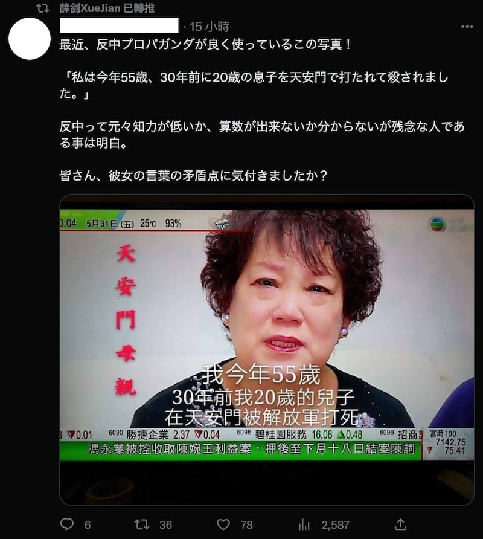
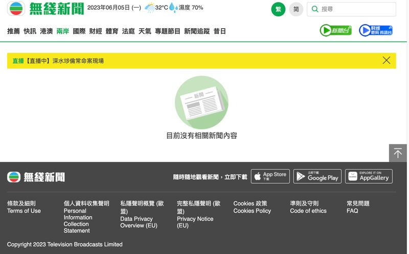
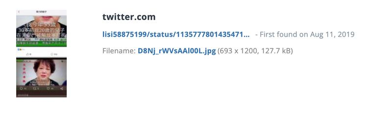
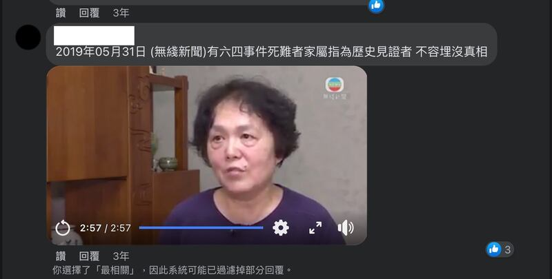
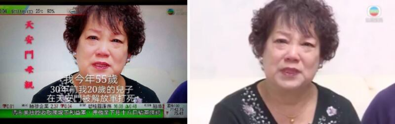
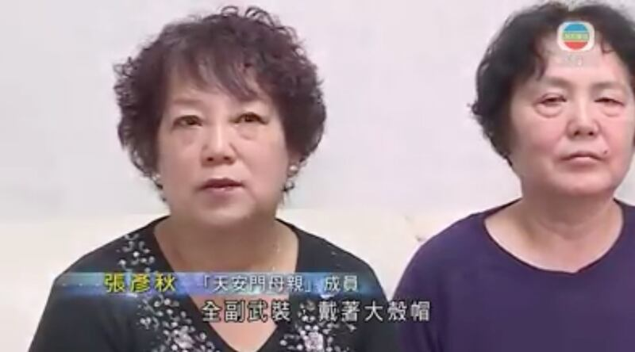

# 事實查覈 | 五十五歲的"天安門母親"在三十年前有個二十歲的兒子被解放軍打死？

作者：董喆，發自臺北

2023.06.05 18:34 EDT

## 標籤：造假

## 一分鐘完讀：

"六四"事件屆滿34週年之際，推特日文社羣上出現一張女性哭泣的圖片，圖片上的字幕寫着："我今年55歲，30年前我20歲的兒子，在天安門被解放軍打死"，一些網民質疑這名女性不可能在25歲時就有20歲的兒子，以此質疑"六四"事件真實性。中國駐大阪領事館總領事薛劍也轉發了質疑的推文附該圖片。亞洲事實查覈實驗室通過查覈發現，這張圖片來源於香港無線電視臺關於天安門事件紀念日的報道截圖，但圖中字幕並非該女士在原始視頻中的發言。

這張嫁接字幕的圖片最早出現在2019年，雖然臺灣的查覈組織曾在2020年發表報告闢謠，但直到日前該圖仍在網上流傳。隨着香港無線原始報道影片的下架，民衆更難以對證。亞洲事實查覈實驗室通過網頁回溯工具查覈並採訪了原報道記者，再次確認這則推文所言是錯誤訊息。

## 深度分析：

近日，推特日文社羣上出現一則質疑“天安門母親”真實性的推文，推文圖片上的字幕寫着：“我今年55歲，30年前我20歲的兒子，在天安門被解放軍打死”，圖中哭泣的中年女性旁邊，標註着“天安門母親”。這則推文評論說：“不知道反華是本來就智商低還是不會數學”，暗指這名女性不可能在25歲時就有20歲的兒子，質疑“六四”事件真實性，該篇推文也獲中國駐大阪領事館總領事薛劍轉發。

中國駐大阪領事館總領事薛劍轉發造假圖片。 (截圖取自薛劍推特帳號)

亞洲事實查覈實驗室通過比對圖片下方的港股資訊滾動消息以及右上角的節目LOGO，確定該畫面截取自香港無線新聞臺的電視節目。隨後以“天安門母親”“無線新聞”“我今年55歲，30年前我20歲的兒子，在天安門被解放軍打死”等關鍵詞組搜尋相關信息，定位了原報道。

搜尋結果顯示,臺灣事實查覈組織" [我的圍棋筆](https://www.mygopen.com/)"早在2020年就曾闢謠稱,該圖片出處爲香港無線電視2019年5月31的報道《有"六四"事件死難者家屬指爲歷史見證者 不容埋沒真相》,圖中"我今年55歲……"的字幕並不是原視頻字幕,是遭他人重置之作。然而,香港無線電視臺目前已經刪除了原始報道。

香港無線電視已經刪除了原始報道

這張圖片是在什麼時候出現的？亞洲事實查覈實驗室以照片溯源工具TinEye追查，發現該圖最早在2019年8月開始流傳，即便2020年曾遭查覈組織闢謠，仍持續被人轉發，更從原先的中文社羣傳至日文社羣。隨着原始報道遭香港無線下架，原圖和原報道內容更難以追溯。

推特上的記錄顯示，2019年8月就有人傳播該圖。

亞洲事實查覈實驗室以網頁回溯工具找到 [該則報道](https://web.archive.org/web/20190604025209/http://news.tvb.com/greaterchina/5cf0aa55e60383687b86d4bb/)的文字內容,並通過關鍵字搜尋在臉書找到曾有網友貼出原始影片備份,經過人工比對證實了原始素材的確出自香港無線的新聞報道,但是報道畫面遭到篡改。

網友備份的原始視頻截圖

原始新聞影片中，1分37秒處的畫面與推特流傳的圖片人物動作與表情一致，確定圖片中的人物爲天安門事件遇難者家屬張彥秋，她的丈夫王志英在“六四”天安門鎮壓中身亡，並非他的兒子。此時，張彥秋在影片中說：“這麼多年，我們真是強忍着悲痛，跟國家討說法。”

字幕造假的圖片（左）與視頻原始截圖（右）對比

據該報道，張彥秋在“六四”時目睹丈夫中彈，“全副武裝，戴着大殼帽，然後就開槍。當時我愛人一下子就中彈了，他打的是大動脈，子彈是從後心出來的。我跪在地上求大夫，我說你救救他、救救他，我說他有七歲的女兒。”

原始視頻截圖中的字幕與造假字幕相比，字體和大小完全不同 圖截取自原始報道視頻。

曾參與制作該報道的不具名前香港無線新聞員工告訴亞洲事實查覈實驗室，這則報道的確是由香港無線電視新聞製作，“我今年55歲...”的字幕字體大小與原片字幕明顯不同，是後期加工的，“天安門母親”的紅色字樣也非原片所有。

另外從新聞內容可判斷，張彥秋並未有兒子於“六四”事件中喪生，罹難的是她的先生。

## 結論：

天安門母親的年齡謊言是一則於2019年開始傳播的假消息，是以香港無線電視新聞往期報道爲素材製作的虛假資訊。即便2020年曾有查覈組織闢謠，但隨着原始資料亡佚，此錯誤資訊在2023年仍在廣泛傳播，且從中文社羣擴展至日文社羣，並獲中國高階外交官員轉推，用以污名化“天安門母親”組織，否認“六四”屠殺的真實性。

亞洲事實查覈實驗室經查覈後確認，圖片主角爲“天安門母親”成員張彥秋，她的丈夫於事件中喪生，而非兒子。她本人也是“六四”事件的受害者和歷史證人。

*亞洲事實查覈實驗室(* *Asia Fact Check Lab* *)是針對當今複雜媒體環境以及新興傳播生態而成立的新單位。我們本於新聞專業,提供正確的查覈報告及深度報道,期待讀者對公共議題獲得多元而全面的認識。讀者若對任何媒體及社交軟件傳播的信息有疑問,歡迎以電郵* *afcl@rfa.org* *寄給亞洲事實查覈實驗室,由我們爲您查證覈實。*

[Original Source](https://www.rfa.org/mandarin/shishi-hecha/hc-06052023173430.html)