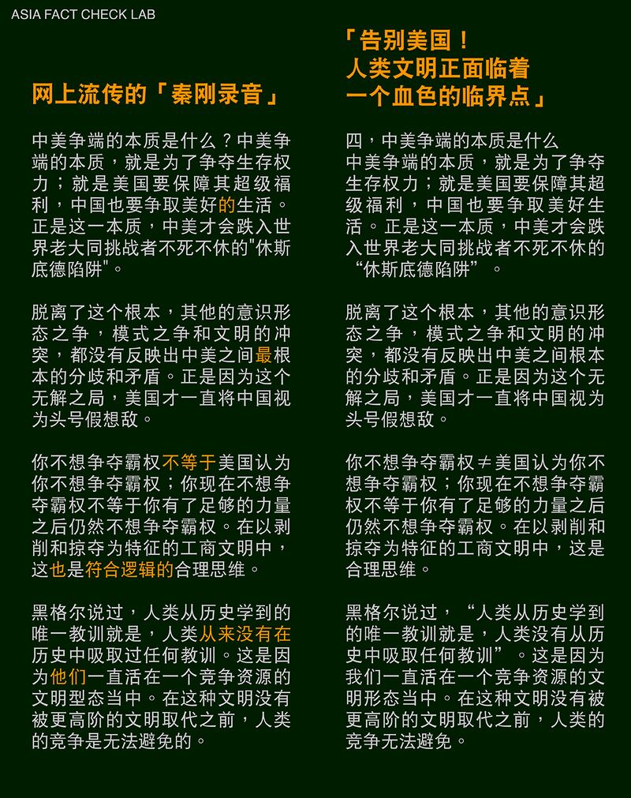

# 事實查覈｜秦剛"內部講話"流出，稱中美戰爭不可避免？

作者：莊敬

2023.06.06 15:27 EDT

## 標籤：冒名造假

## 一分鐘完讀：

最近網路流傳一段錄音，號稱"外泄的中國外交部長秦剛內部講話"，其內容大談中美爭端，兩國戰爭不可避免等。有網民認爲，錄音內的言論符合中國外交立場，甚至揣測音頻外泄應是"上層授意"要"放狠話與美國決戰"。

亞洲事實查覈實驗室發現，所謂秦剛內部講話的內容，與中國評論人"譚吉坷德"去年發佈的文章大致相同，一名抖音用戶在錄製的視頻中讀了這篇文章與他人分享。亞洲事實查覈實驗室以兩種獨立方式比對這位抖音用戶讀文章的聲音和網路上的所謂"秦剛錄音"，結果顯示聲音很可能爲同一人，也就是說，所謂"內部講話錄音"，極可能是秦剛遭中國網民冒名。

## 深度解析：

推特、油管(Youtube)近日流傳一段中國外交部長秦剛的內部講話錄音(下簡稱"秦剛錄音"),許多用戶轉傳的素材來源爲自媒體"全媒體財經小鎮"發佈的" [微視頻06012023期:秦剛的內部講話錄音:戰爭不可避免,中美只有生死存亡的關係"](https://www.qtown.media/share/linkPage/881D5921-269C-4680-BABF-20B53C065E41.html),但發佈者未提供所謂"秦剛講話"的時間、地點等其它資訊。

在十分多鐘的視頻中,畫面只有一張中美高層官員會談的照片,聲音是一名男子發表有關中美關係的談話,直言"美國一直將中國視爲頭號假想敵"、"美國要阻止中國崛起的唯一方法只有戰爭"等。這段所謂"秦剛內部講話"錄音引發關注,包括中文撰稿人 [蔡慎坤](https://twitter.com/cskun1989/status/1664646472598708229?s=12&t=iMT9e3zK4fPrPnDnWWxPUQ)、中國前外交官 [陳用林](https://twitter.com/chen_yonglin/status/1664949792089288706)等人都在社媒轉發、討論此事,還有人幫視頻配上英文字幕,但不少人質疑自媒體來源的可信度,另有網民留言懷疑是AI生成。

社交媒體流傳秦剛所謂"內部講話"錄音

## "秦剛講話"內容與網路文章高度相似

亞洲事實查覈實驗室查詢"秦剛講話"中的部分段落後發現,其內容與網路上一篇文章高度相似,是由自稱媒體人的"譚吉坷德"2022年發佈的 ["告別美國!人類文明正面臨着一個血色的臨界點"](https://www.163.com/dy/article/H684R8850550WCN1.html)。以下對比錄音與文章部分內容(黃字爲不同處):

網傳"秦剛講話"錄音內容和網路文章內容對比（亞洲事實查覈實驗室製圖）

## 音頻裏的聲音是秦剛嗎？

## 在4分40秒處，背景出現奇怪聲響。

亞洲事實查覈實驗室發現,有幾位抖音用戶以錄製視頻的方式分享"告別美國!人類文明正面臨着一個血色的臨界點"一文,其中用戶"風雨同路"去年九月發佈的視頻 ["告別美國(一)"](https://www.douyin.com/video/7149160800836537611),在8分42秒處出現上述一樣的奇怪聲響。顯示"風雨同路"和"秦剛錄音"極可能是同一來源,所謂秦剛錄音出自中國外交部的可能性大爲降低。

另名用戶"marriy"去年四月發佈 ["深度思考!!!告別美國,全球化死了,暴風雨真的來了(3/6)"](https://www.douyin.com/video/7091008599908044071)視頻,畫面中男子說話的口音、頓點、用字都與秦剛音頻相似。經查,畫面來源爲 ["六哥聊生活"](https://www.douyin.com/user/MS4wLjABAAAAqYmID85J8Ju6MHik-c2fmnUfUrWNXxGj5S8aBtitCM4)抖音號,但在該用戶的作品中並未找到原始視頻。

我們進一步透過聲紋比對工具測試,在 ["雲之聲AI開放平臺"](https://ai.unisound.com/voiceprint-recognition)比對"秦剛錄音"與"六哥聊生活"音頻,結果顯示"爲同一個人聲音的概率"是93.81%(下圖四);再比對"秦剛錄音"以及秦剛今年 [3月7日記者會](https://www.youtube.com/watch?v=-rtCeqgnRdI)的發言,結果顯示"爲同一個人聲音的概率"是65.78%(下圖五)。

網路流傳的“秦剛錄音”從一開始到4分32秒，內容爲上述文章的“四，中美爭端的本質是什麼”主題，從4分33秒起接到文章的其它部分。比對後發現，音頻與文章除了少部分用字不同，以及段落調整之外，絕大部分內容一致。

在AI開放平臺比對網路上流傳的秦剛錄音以及抖音用戶錄音，結果爲同一人的聲音概率是93.81%。

在AI開放平臺比對網路上流傳的秦剛錄音以及秦剛3月7日記者會發言，結果爲同一人的聲音概率是65.78%。

我們在臺灣另委託一名具有聲紋辨識經驗的資訊工程師執行辨識，他比對網路上流傳的“秦剛錄音”與“六哥聊生活”音頻，發現兩個音頻的起伏一致；其初步分析結果是，兩者極可能爲同一段音頻。

亞洲事實查覈實驗室6月5日透過電郵詢問中國外交部、中國駐美國大使館，有關網上流傳的錄音是否爲秦剛本人的聲音，但至截稿尚未獲回覆。

## 結論：

雖然中國官方並未回覆，亞洲事實查覈實驗室未能更進一步確認音頻的真實性，但秦剛在內部宣讀網路作者去年發佈的文章，且他的語氣、口音、用字都“恰巧”與抖音用戶相同的可能性相當低。

經對比網路文章、抖音視頻、聲紋辨識後，亞洲事實查覈實驗室認爲，網路上流傳的所謂秦剛內部講話錄音，很可能並非秦剛所言，而是某人剪輯網上已有的視頻後，冠上秦剛之名，傳播錯誤資訊。

*亞洲事實查覈實驗室(* *Asia Fact Check Lab* *)是針對當今複雜媒體環境以及新興傳播生態而成立的新單位。我們本於新聞專業,提供正確的查覈報告及深度報道,期待讀者對公共議題獲得多元而全面的認識。讀者若對任何媒體及社交軟件傳播的信息有疑問,歡迎以電郵* *afcl@rfa.org* *寄給亞洲事實查覈實驗室,由我們爲您查證覈實。*

[Original Source](https://www.rfa.org/mandarin/shishi-hecha/hc-06062023150630.html)