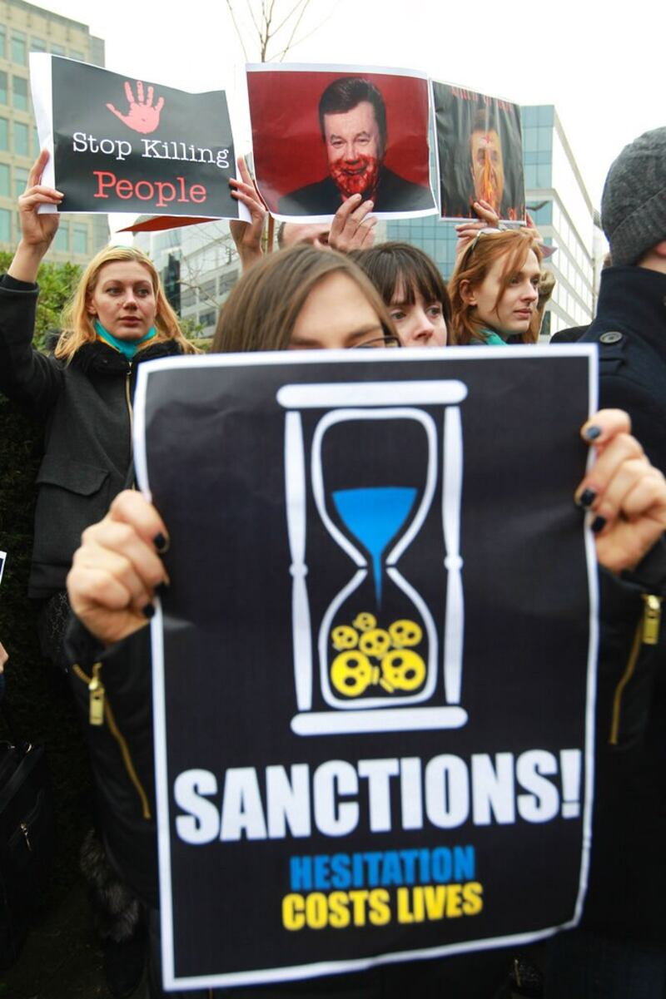
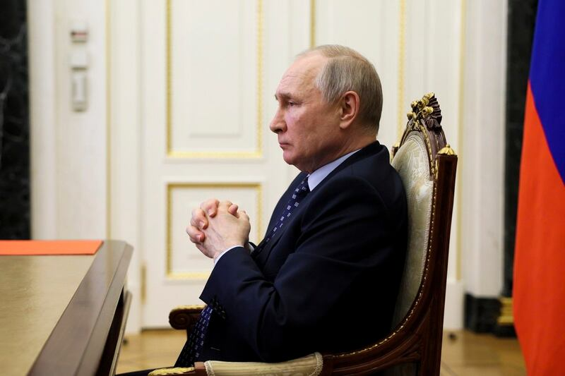

# 事實查覈｜美國經濟制裁影響了全世界一半人口？

作者：沈軻，發自華盛頓

2023.06.09 17:16 EDT

## 標籤：誇大誤導

## 一分鐘完讀

五月下旬在日本廣島舉行的七大工業國(G7)高峯會在一份聲明中提及，各國關切中國在貿易領域對其它國家的"經濟脅迫"。中國外交部回應中反指中國纔是美國經濟脅迫的受害者，尤其是美國施加的經濟制裁“影響了近一半世界人口”。

亞洲事實覈查實驗室發現，中國官方聲明中所提到的數字誇大了事實。儘管當前美國的制裁範圍廣泛，但受其影響的人數遠遠沒有達到全球人口的一半。

## 深度解析

G7峯會後，各國領導人於5月20日發佈了一份聯合公報，其中指出所有成員國將協調行動，遏制中國潛在的“經濟脅迫”。

G7倡議遏制中國“經濟脅迫”的說法稍早已先傳出，因此，在公報公佈前，中國外交部發言人汪文斌在5月12日的新聞發佈會上先回應了相關問題。他說美國實際上纔是真正的經濟脅迫實施者。汪文斌引述媒體報道指出，“美國已對世界上近40個國家實施過單邊經濟制裁，全球近一半人口受到影響”。

## 美國實施了哪些制裁？

美國製裁可分爲兩大類：全面制裁和針對特定對象的制裁。

彼得森國際經濟研究所資深研究員加里·赫夫鮑爾(Gary Hufbauer)告訴亞洲事實覈查實驗室：“‘全面’制裁通常指的是中斷貿易流動（進口和出口）和資金流動的措施，可能包括凍結和沒收資產。”這是大多數人印象中典型的經濟制裁，即對某個國家實施廣泛的貿易禁令。例如美國對古巴持續實施的制裁。它也可以針對一個國家經濟的關鍵部門或產品，例如美國在2014年克里米亞被克里姆林宮吞併後對俄羅斯能源部門實施的限制措施。

2014年，烏克蘭抗議者呼籲對俄羅斯實施制裁。圖片來源：AP/Yves Logghe

赫夫鮑爾解釋，相比之下，針對性制裁的目標是“特定個人或公司，通常禁止與這些實體進行貿易或金融交易”。近期遭美國製裁的著名例子包括打壓言論自由的香港特首林鄭月娥；或者下令入侵烏克蘭的俄羅斯總統普京。

林鄭月娥是特定受到美國製裁的公衆政治人物。圖片來源：AP

弗拉基米爾·普京是特定受到美國製裁的公衆政治人物。圖片來源：AP

## 美國的制裁對哪些人產生影響？

一個國家如果只受到針對部分人和機構的針對性的制裁，而不是被全面制裁的情況下，普通民衆很少遭受廣泛的苦難。

“指名制裁幾名沙特和中國官員，對他們國家大部分人民幾乎沒有影響。”普林斯頓大學威爾遜公共與國際事務學院的高級政治學家大衛·鮑德溫告訴亞洲事實覈查實驗室：“通常有針對性的制裁意在傳遞一種信息，而不是爲了產生具體的經濟效應。”

全面制裁則不然。美國對一個國家的通常引發高通貨膨脹，並通過強烈阻礙外國投資使受制裁的經濟體與全球供應鏈隔離。因此認爲全面制裁影響了受制裁國的全國人口，應是合理的。德馬雷舉例，1990年海灣戰爭後美國對伊拉克的制裁，以及新冠疫情爆發時對伊朗的制裁，都造成醫藥用品與醫療儀器的嚴重短缺.

赫夫鮑爾說：“對於(朝鮮、古巴或伊朗)的全面制裁，肯定會惡化普通人的生活條件，因此對普通人的影響是沉重的。”

## 美國製裁影響了近一半的世界人口嗎？

根據美國工業和安全局發佈的 [禁運執法指南](https://www.bis.doc.gov/index.php/documents/regulation-docs/420-part-746-embargoes-and-other-special-controls/file)與財政部外國資產控制辦公室發佈的 [具體國家制裁信息](https://ofac.treasury.gov/sanctions-programs-and-country-information),以目前爲止,全世界六個國家受到不同程度的全面制裁,即古巴、伊朗、朝鮮、敘利亞、俄羅斯和白俄羅斯。 [據Worldometer2023年6月世界各](https://www.worldometers.info/world-population/population-by-country/)國人口統計,前六國總人口約爲293,982,000人, [僅佔全球估計超過80億人口的不到5%](https://www.worldometers.info/world-population/population-by-country/)。

即使加上有針對性的制裁，德馬雷指出：“截至2022年，華盛頓實施了約70個制裁計劃，針對超過9,000個個人、公司和經濟部門。”外國資產辦公室維護的有針對性制裁數據庫的簡略統計數據證實了德馬雷提到的9000多個目標。截至2023年6月6日，總計有5353個實體（企業和公司）、4540個個人、740艘船和377架飛機列入名單。

整體制裁和針對性制裁兩相加總後，受影響者雖然些並非小數字，但也遠未達到全球一半的程度。

赫夫鮑爾表示：“‘全球一半的人口’是一種嚴重誇大。目前唯一受到全面制裁的主要國家是俄羅斯，與之相比，對中國的制裁相對較輕。粗略估計，目前大約有10%的世界人口受到實質性制裁的影響。”

## 結論

亞洲事實覈查實驗室發現，聲稱當前的美國製裁影響了全球一半的人口是一種誇大，很可能是出於政治目的。雖然當前的制裁確實廣泛，並作爲美國外交政策的工具，但直接受制裁或受影響的人數遠遠不及全球一半的人口。

*亞洲事實查覈實驗室(* *Asia Fact Check Lab* *)是針對當今複雜媒體環境以及新興傳播生態而成立的新單位。我們本於新聞專業,提供正確的查覈報告及深度報道,期待讀者對公共議題獲得多元而全面的認識。讀者若對任何媒體及社交軟件傳播的信息有疑問,歡迎以電郵* *afcl@rfa.org* *寄給亞洲事實查覈實驗室,由我們爲您查證覈實。*

[Original Source](https://www.rfa.org/mandarin/shishi-hecha/hc-06092023170554.html)