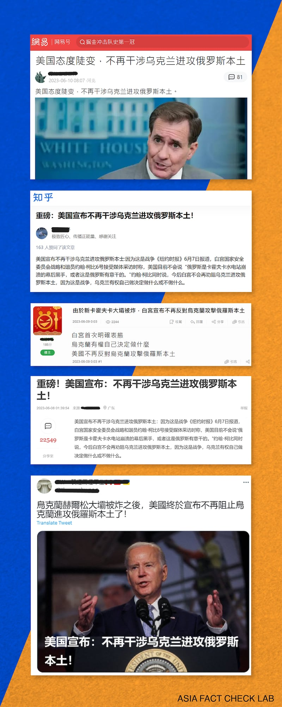

# 事實查覈｜美國宣佈不再幹涉烏克蘭進攻俄羅斯本土？

作者：莊敬

2023.06.13 12:29 EDT

## 標籤：錯誤

## 一分鐘完讀：

近日，在中國微博、知乎、網易等平臺，以及臺灣Ｍobile01論壇都有網民發文指“美國宣佈不再幹涉烏克蘭進攻俄羅斯本土”，部分發文者稱這是引述《紐約時報》報道美國國家安全會議戰略溝通協調員柯比（John Kirby）的說法。

亞洲事實查覈實驗室在《紐約時報》英文和中文網站上搜索，都沒有發現上述報道。實驗室同時也向美國白宮國安會、國務院查證，獲得的回覆是：美國立場明確，不支持烏克蘭襲擊俄羅斯境內。

## 深度解析：

在微博擁有逾70萬粉絲的大V用戶"史凝眸"6月7日發文: [《美國宣佈不再幹涉烏克蘭進攻俄羅斯本土:因爲這是戰爭》](https://weibo.com/1347322121/N4eYtESnu),文中"引述"柯比6日接受《紐約時報》採訪時表示:今後白宮不會再勸阻烏克蘭進攻俄羅斯本土,因爲這是戰爭,烏克蘭有權自己做決定做什麼或不做什麼。"史凝眸"說:"這是白宮首次明確表示'不反對'烏克蘭進攻俄羅斯本土"。

接下來幾天,中國網絡平臺網易、知乎,臺灣論壇Mobile01,以及推特等平臺,都有網民發佈類似內容,聲稱在烏克蘭南部城市赫爾松的新卡霍夫卡大壩被炸後,美國終於不再阻止烏克蘭進攻俄國本土。到6月12日,還有網媒刊載 [《【重磅】美國宣佈:不再幹涉烏克蘭進攻俄羅斯本土!》](https://redian.news/wxnews/436704)等文章。

網友發文稱美國宣佈不再幹涉烏克蘭進攻俄羅斯本土。（圖片取自推特、網易、知乎、Mobile01）

針對上述信息，亞洲事實查覈實驗室在白宮、國務院等機構官網並未查到有關聲明，檢索《紐約時報》中、英文版網頁也沒有相關信息，更沒有其它國際媒體報道美國政府這項“重要表態”。

亞洲事實查覈實驗室分別向美國白宮國安會、國務院查證。國安會副發言人肖恩·塞維特(Sean Savett)12日以電郵回覆表示,美國官方可以確認網傳內容是錯的,美國的立場很明確,可參閱近期白宮記者會的逐字稿。事實上,柯比 6日纔在 [白宮記者會](https://www.whitehouse.gov/briefing-room/press-briefings/2023/06/06/press-briefing-by-press-secretary-karine-jean-pierre-and-nsc-coordinator-for-strategic-communications-john-kirby-14/)上再度表明,美國不支持在俄羅斯內發動襲擊,美國不鼓勵也不允許烏克蘭這樣做。

一名國務院發言人12日向亞洲事實查覈實驗室提供背景說明：“一般而言，我們不支持在俄羅斯境內發動襲擊。我們一直把焦點放在提供烏克蘭所需的設備和訓練，好讓他們奪回自己的主權領土。”

## 結論：

美國不支持在俄羅斯內發動襲擊的立場未改變，網上所謂美國不再幹涉、阻止烏克蘭進攻俄羅斯本土的說法，經查覈確認爲不實資訊。流傳的貼文中所稱引述《紐約時報》報道，《紐時》網站上也搜尋不到相關內容。

*亞洲事實查覈實驗室(* *Asia Fact Check Lab* *)是針對當今複雜媒體環境以及新興傳播生態而成立的新單位。我們本於新聞專業,提供正確的查覈報告及深度報道,期待讀者對公共議題獲得多元而全面的認識。讀者若對任何媒體及社交軟件傳播的信息有疑問,歡迎以電郵* *afcl@rfa.org* *寄給亞洲事實查覈實驗室,由我們爲您查證覈實。*

[Original Source](https://www.rfa.org/mandarin/shishi-hecha/hc-06132023122534.html)