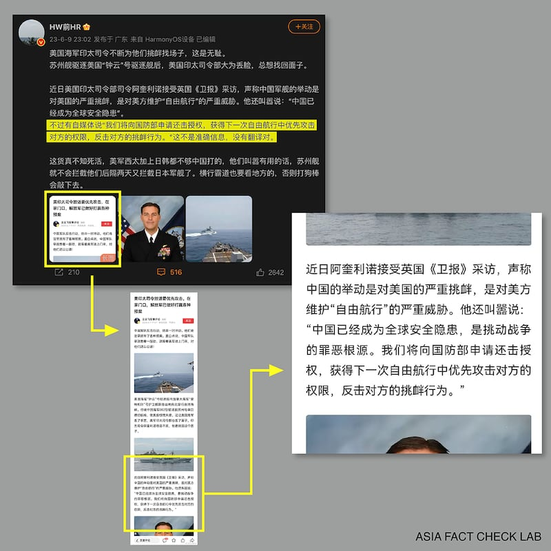
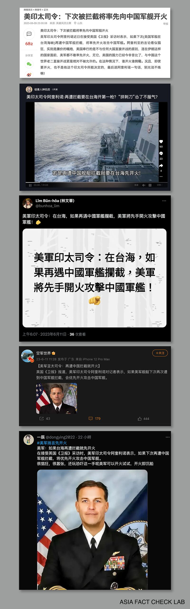

# 事實查覈｜美軍印太司令說如果再遭中國軍艦攔截，將優先開火？

作者：董喆

2023.06.14 15:59 EDT

## 標籤：錯誤

## 一分鐘完讀：

近日，一則關於所謂“美軍印太司令部言論”的文章在推特及中國國內幾大社交媒體平臺流傳。文中指出“在接受英國《衛報》採訪時，美國印太司令阿奎利諾表示，如果下次再遭中國軍艦攔截，將優先開火攻擊中國軍艦”。

亞洲事實查覈實驗室查找了英國、美國、澳洲以及國際版《衛報》，皆沒有發現上述報導。同時，美國印太司令部告訴實驗室，這樣的說法並不正確，美國印太司令並未接受《衛報》採訪，也未曾發表此言論。

## 深度分析：

美國海軍6月4日發佈 [一段影片](https://www.youtube.com/watch?v=5P_sxzBr4zU),鍾雲號(USS Chung-Hoon)驅逐艦3日與加拿大巡防艦蒙特利爾號(HMCS Montreal)穿行臺灣海峽時,遭中國蘇州號驅逐艦越過,彼此最短距離只有150碼,美方指這是"不安全互動"。中國軍方則斥責美加的聯合航行是"故意挑起風險",外交部發言人 [汪文斌則回應](http://mz.china-embassy.gov.cn/fyrth/202306/t20230605_11089966.htm),美方滋事挑釁在前,中方依法依規處置在後。

網易號王雲飛軍事評論7日發表"美印太司令放話要優先攻擊,在家門口,解放軍已做好打贏各種預案"貼文,當中提到,近日美國印太司令阿奎利諾( [John C. Aquilino](https://en.wikipedia.org/wiki/John_C._Aquilino))接受英國《衛報》採訪時表示,"我們將向國防部申請還擊授權,獲得下一次自由航行中優先攻擊對方的權限,反擊對方的挑釁行爲。"

微博平臺不少用戶轉發所謂阿奎利諾接受《衛報》採訪相關內容（/亞洲事實查覈實驗室製圖）

雖然網易號的說法在9日即遭微博網民反駁是錯誤解讀，但這段言論仍在網上發酵，不單是推特與臉書，在中國微博、網易、抖音及知乎等平臺皆有相關貼文，且內容再被簡化爲“美軍印太司令阿奎利諾表示，如果下次再遭中國軍艦攔截，將優先開火攻擊中國軍艦”，並加上“＃美軍揚言先開火”的hashtag，直到本文截稿（14）日，仍有相關言論在網上流傳。

所謂阿奎利諾採訪在各社交媒體進一步流傳成“美軍將先向中國軍艦開火”。（/亞洲事實查覈實驗室 製圖）

亞洲事實查覈實驗室查找包括英國、美國、澳洲以及國際版《衛報》,並以"Indo-Pacific command site:www.theguardian.com"進行搜尋,僅發現一則與此次航行衝突相關的報導,是《衛報》6月5日轉載自美聯社的報導" [臺灣海峽:中國軍艦與美國驅逐艦相撞的鏡頭被公開](https://www.theguardian.com/world/2023/jun/05/taiwan-strait-footage-released-of-near-miss-between-chinese-warship-and-us-destroyer)。"

該則報導中僅引述印太司令部說法，表示中國的行動違反了國際水域安全通行的海事規定。並未有印太司令阿奎利諾的說法，也未提及“直接開火”等用語。

亞洲事實查覈實驗室將中國社交媒體上流傳的“開火論”向美國印太司令部求證，美國印太司令部表示，“這些說法不屬實。阿奎利諾上將沒有接受《衛報》的採訪，也沒有發表你電子郵件中提到的聲明。”

## 結論：

美國印太司令部表示阿奎利諾上將並未接受《衛報》採訪，也未發表“再遭中國軍艦攔截，將優先開火攻擊中國軍艦”的言論，因此網上流傳“美軍揚言先開火”的說法爲錯誤資訊，英國《衛報》也未發表相關報導。

另外有關臺灣海峽是否爲國際水域,開放給各國船艦、飛行器自由航行、通過?可參閱 [美軍主張臺灣海峽是"國際水域",中國反對有理嗎?](https://www.rfa.org/cantonese/news/factcheck/twstrait-04182023152223.html)查覈報告。

*亞洲事實查覈實驗室（Asia Fact Check Lab）是針對當今複雜媒體環境以及新興傳播生態而成立的新單位。我們本於新聞專業，提供正確的查覈報告及深度報道，期待讀者對公共議題獲得多元而全面的認識。讀者若對任何媒體及社交軟件傳播的信息有疑問，歡迎以電郵afcl@rfa.org寄給亞洲事實查覈實驗室，由我們爲您查證覈實。*

[Original Source](https://www.rfa.org/mandarin/shishi-hecha/hc-06142023155404.html)