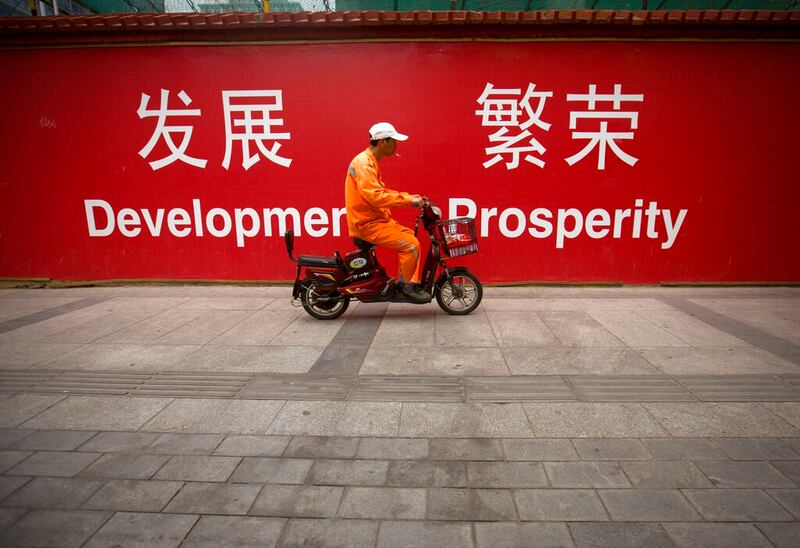
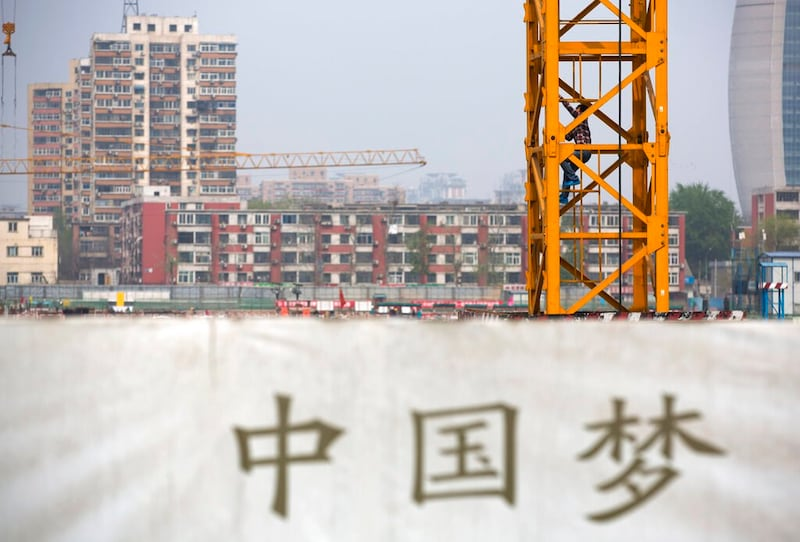

# 事實查覈｜中國是"發展中國家"嗎？該地位有"堅實的國際法基礎"嗎？

作者：沈軻，發自華盛頓

2023.06.15 13:36 EDT

## 標籤：部分正確

## 一分鐘完讀

《終止中國發展中國家地位法案》上週在美國參議院外交關係委員會全票通過，立法進程更進一步。中國外交部發言人回應時重申，中國處於發展中國家地位有事實依據及國際法基礎。

亞洲事實查覈實驗室發現，國際社會對於“發展中國家”並無統一的明確定義。在聯合國和世界銀行的分類中，中國是“發展中經濟體”和“中等偏上收入國家”。而世界貿易組織的“發展中國家”則是依照國家“自我宣告”的結果。

此外，中國在某些國際條約中，被歸類爲“發展中國家”，但這並不能反推爲有一套普遍的國際法將中國定義爲“發展中國家”。

## 深入分析

美國參議院外交關係委員會於6月8日批准了《 [終止中國發展中國家地位法案](https://www.congress.gov/bill/118th-congress/senate-bill/308)》(Ending China's Developing Nation Status Act)。該法案要求國務院努力"阻止中國在國際組織中被歸類爲發展中國家",並將世界貿易組織(WTO)明確列爲被改變的目標。推動立法的美國國會議員相信,中國因爲在世貿組織名列"發展中國家"地位而獲得許多有利待遇。

[中國外交部發言人](https://www.fmprc.gov.cn/fyrbt_673021/jzhsl_673025/202306/t20230609_11094353.shtml)汪文斌在6月9日的新聞發佈會上對該法案做出回應,表示"中國作爲世界上最大發展中國家的地位,有着充分的事實依據,也有着堅實的國際法基礎"。他之前也強調, [中國"發展中國家"的地位來自於WTO的承認](https://www.fmprc.gov.cn/eng/xwfw_665399/s2510_665401/2511_665403/202305/t20230512_11076522.html),這一點不應該改變。

一、WTO會員的發展狀態由誰決定？

目前在WTO組織中,中國確實屬"發展中國家"。然而汪文斌聲稱中國作爲發展中國家的地位"得到了世界貿易組織的承認"是錯誤的,因爲該組織 [允許各個成員國自行決定自己是否是發展中國家](https://www.wto.org/english/tratop_e/devel_e/d1who_e.htm)。

根據WTO的說法，對於“發展中國家”的定義，WTO對“發達國家”和“發展中國家”並不提供定義，成員國可以自行宣佈其屬於哪個歸類。然而，其他成員國有權對某個成員國自行利用發展中國家所享有的條款進行質疑。

二、聯合國和世界銀行的標準如何歸類中國？

除了WTO外，聯合國和世界銀行也有關於國家經濟發展程度的分類標準。它們都以人均國民總收入（GNI）爲標準。

在聯合國《 [世界經濟形勢與展望](https://www.un.org/development/desa/dpad/publication/world-economic-situation-and-prospects-2023/)》報告的分類定義中,世界上的國家被劃爲發達經濟體, 轉型中經濟體,發展中經濟體,以及最不發達國家。在他們的報告中,中國是發展中經濟體之一。

而世界銀行則並沒有用"發展"這個詞彙, [而是把全世界經濟體劃分爲四個收入組別](https://blogs.worldbank.org/opendata/new-world-bank-country-classifications-income-level-2022-2023),即,高收入、中等偏上收入、中等偏下收入和低收入組別。

中國的經濟被聯合國列爲 “發展中”，被世界銀行列爲 “中等偏上收入”。（美聯社圖片）

在這個分類中, [中國目前以11880美元的人均國民總收入](https://data.worldbank.org/indicator/NY.GNP.PCAP.CD?most_recent_value_desc=true)處於中等偏上收入國家。雖然與四十年甚至二十年前相比,這是一個巨大的飛躍,但這個數字仍遠低於其他廣泛認可的發達經濟體如日本、美國、德國、法國或臺灣。

三、有一套國際法體系保障中國是發展中國家嗎？

中國外交部曾表示,中國發展中國家的地位來自堅實的國際法依據,中國的發展中國家地位已由包括世界貿易組織機制、《 [聯合國氣候變化框架公約](https://unfccc.int/parties-observers)》《 [關於消耗臭氧層物質的蒙特利爾議定書](https://www.unep.org/ozonaction/who-we-are/about-montreal-protocol)》在內的國際條約所認可,併爲國際社會廣大成員所接受。中國的發展中國家地位不容剝奪。

這個說法有誤導之嫌。

“‘發展中國家’沒有權威定義，”喬治華盛頓大學法學副教授史蒂夫·查諾澤茨（Steve Chanozits）告訴亞洲事實查覈實驗室。“國際法中沒有共識性的定義。國家可以自行評估其實現發展目標的進展，國際社會也可以進行這樣的評估。”

全球發展中心高級研究員查爾斯·肯尼（Charles Kenny）則表示，儘管有許多國際條約根據收入將國家劃分爲不同的類別，並賦予每個類別不同的義務，但這些類別及其分界點是在相關各方協商後隨機確定的。

因此，中國的發展中國家地位不是永久的，而是有一定的時限、必須接受定期檢討、或得以由會員國重新議定，而不像外交部發言中所暗示的，是一種“合法權利”，不可質疑或改變，臺灣制憲基金會董事，國際法專家宋承恩接受亞洲事實查覈實驗室採訪時表示，中國所謂的發展中國家地位，必須與各該條約下的規定及不同地位國家的權利義務一起觀察，不能一概而論。

四、爲什麼國家被標記爲發達國家或發展中國家很重要？

在某些國際組織，如世界貿易組織，被認定爲發展中國家的國家可以尋求（但不一定能夠獲得）“特殊權利或額外寬容”。

“爲了實現各種全球目標，包括誰獲得財務支持，或者誰在國際貿易規則方面獲得更大的寬容，或者誰有資格獲得官方發展援助（ODA），人們使用各種分類方法。有各種原因使得國家希望將自己歸入‘發展中’的範疇，”肯尼表示。此外，被稱爲“發達”國家的標籤通常意味着有責任幫助經濟困境中的較貧窮國家，並遵守更嚴格的全球重要議題（如氣候變化）的規定。

世貿允許被指定爲 “發展中” 的國家申請"特殊權利或額外寬限"（美聯社圖片）

“中華人民共和國經常利用其中等收入國家的地位來豁免自己的全球責任，包括在應對氣候變化和提供目前的債務危機中提供債務減免。然而，中國龐大的經濟規模意味着如果繼續逃避責任或不遵守國際規範，無法在氣候問題上或在遏制許多發展中國家當前的債務危機方面提供全球公共產品，”美國國際開發署（USAID）的發言人告訴亞洲事實覈查實驗室。

## 結論

對於中國的總體經濟發展如何歸類，不同的國際組織有不同的評等、分類標準。如果依聯合國相關報告及世界銀行的分類，中國的確處於接近“發展中國家”的狀態。而目前在WTO組織中，中國也確實屬“發展中國家”。

然而，中國在WTO中的“發展中國家”的身份，來自加入之初的自我宣告，這個身份可能因未來的發展或者其它成員的挑戰而動搖。在其它國際條約下的“發展中國家”身份也是如此。因此,中國外交部關於中國之發展中國家地位有“堅實的國際法基礎”的說法是誤導。

*亞洲事實查覈實驗室（Asia Fact Check Lab）是針對當今複雜媒體環境以及新興傳播生態而成立的新單位。我們本於新聞專業，提供正確的查覈報告及深度報道，期待讀者對公共議題獲得多元而全面的認識。讀者若對任何媒體及社交軟件傳播的信息有疑問，歡迎以電郵afcl@rfa.org寄給亞洲事實查覈實驗室，由我們爲您查證覈實。*

[Original Source](https://www.rfa.org/mandarin/shishi-hecha/hc-06152023132934.html)