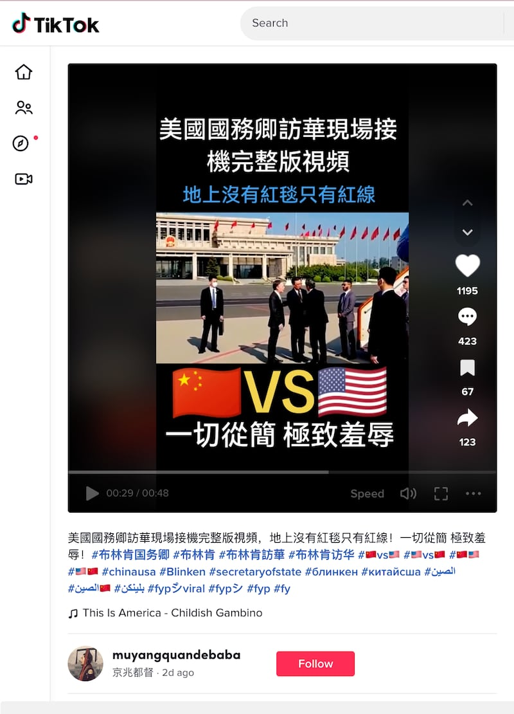
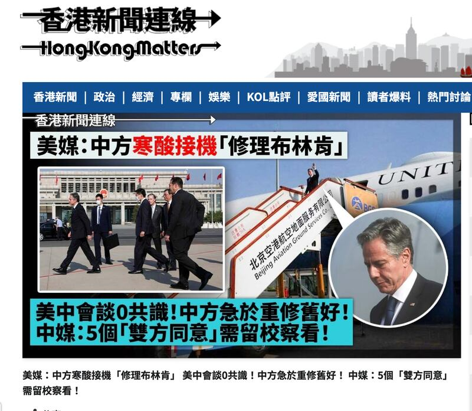
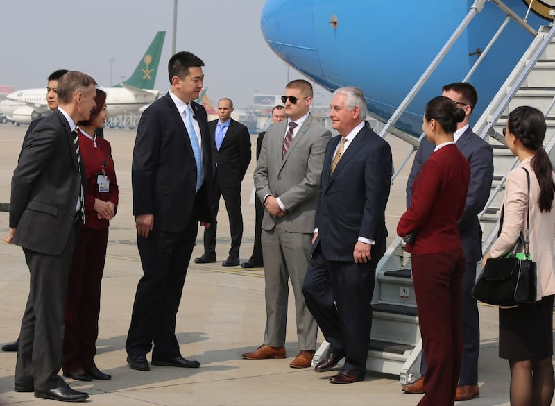
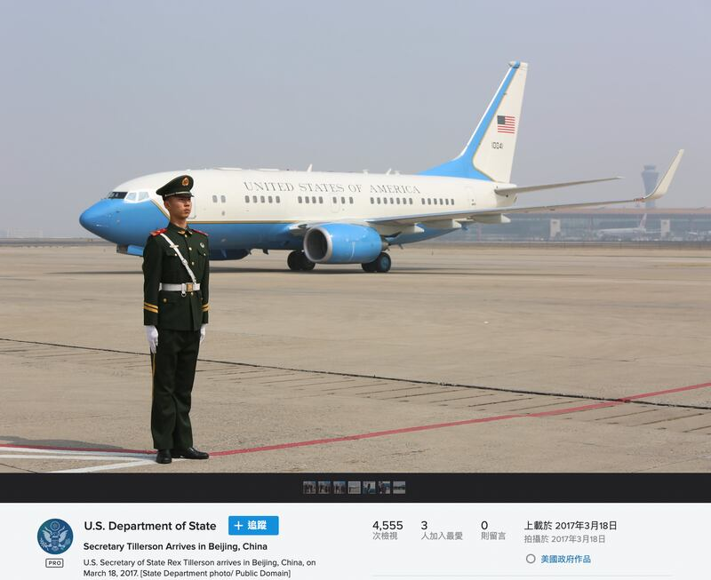
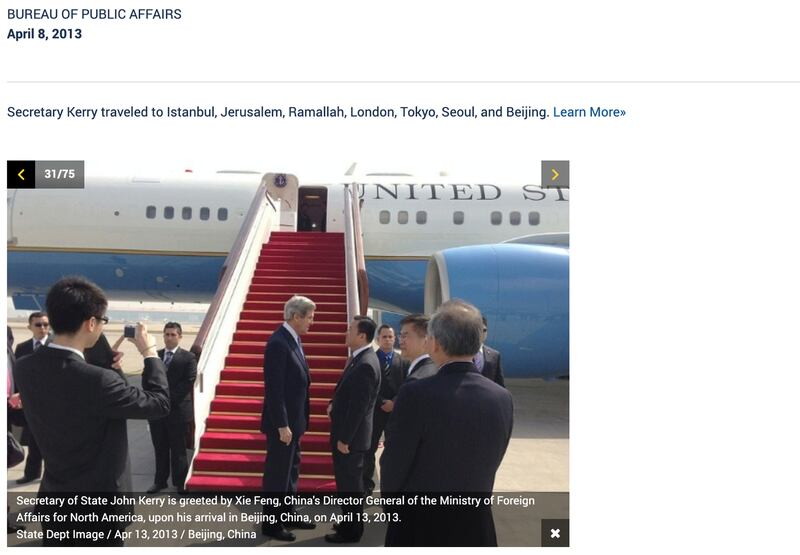
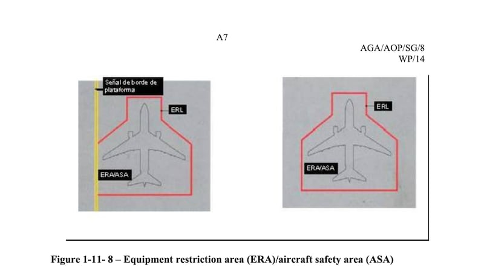

# 事實查覈｜"紅線"取代紅毯 布林肯遭中國羞辱？

作者：莊敬

2023.06.20 13:40 EDT

## 標籤：錯誤

## 一分鐘完讀：

美國國務卿布林肯（Antony Blinken）6月18日抵達中國訪問，他在北京下機時，未見中方鋪紅毯迎接，只見機場地面畫着紅線，引發外界聯想。 《華盛頓時報》等美媒解讀布林肯遭北京冷對待，在中文輿論場中，網民也在推特、微博等平臺上瘋傳佈林肯遭“極致羞辱”，還有評論文章指地上的紅線是在告誡"勿踩紅線"，以此羞辱美方。

亞洲事實查覈實驗室檢視蓬佩奧（Mike Pompeo）等四位歷任美國國務卿任內訪問中國的畫面，發現下機時中方不一定鋪紅毯迎接，顯示布林肯抵達北京時所受到的待遇爲慣例，而非部分媒體與網民所指寒酸接機、藉機羞辱。至於地面紅線，是機場固定畫設的標線。

## 深度解析：

美國國務卿布林肯6月18日至19日訪問中國，是自2018年蓬佩奧訪中以來，美國最高階外交官首度訪問中國；布林肯重啓之前因“間諜氣球”事件而推遲的訪中行程，被外界視爲美中關係破冰之旅。

布林肯18日抵達北京首都國際機場時，由中國外交部北美大洋洲司長楊濤、美國駐中國大使伯恩斯（Nicholas Burns）接機，中方未鋪紅毯迎接，只見機場地面上畫着紅線，而現場畫面也捕捉到布林肯腳踩紅線的瞬間，而這個過程成爲社羣平臺、媒體關注的焦點。

美國媒體 [《華盛頓時報》(Washington Times)](https://www.washingtontimes.com/news/2023/jun/18/no-red-carpet-antony-blinken-beijing-biden-offiica/)、 [《新聞週刊》(Newsweek)](https://www.newsweek.com/antony-blinken-muted-greeting-arrives-china-1807480)都報導布林肯抵京下機時,沒有紅地毯,由司長層級接機等安排,是遭到中國冷淡對待。中國新華社記者、《環球》雜誌前副總編輯劉洪的微信公衆號 ["牛彈琴"](https://mp.weixin.qq.com/s/SeU0z03Aj2iOvlat6iH45g)發文指,以往美國國務卿到訪,似乎都會有紅地毯,但這次沒有紅地毯,卻有一根紅線;他說,有所聯想也未嘗不可,"美方難道不知道中方的紅線嗎?"

上述“牛彈琴”發文、《新聞週刊》的報道，成爲中國、香港、臺灣等地媒體引述的來源，還有評論稱紅線取代紅地毯，告訴布林肯勿踩紅線。許多網民在推特、微博、抖音等平臺瘋傳佈林肯抵京的影片、照片，還有圖卡寫着“地上沒有紅毯只有紅線，一切從簡，極致羞辱”。

美國國務卿布林肯6月18日抵達中國訪問，下機時沒有紅毯，機場地面上畫紅線，成許多網民、媒體關注焦點。（圖/Tiktok、香港新聞連線網站截圖）

## "沒紅毯、有紅線"過往常見

亞洲事實查覈實驗室檢視前國務卿蓬佩奧、蒂勒森(Rex Tillerson)、克里(John Kerry)、希拉里(Hillary Clinton)任內抵達中國的影片和照片,發現並不如"牛彈琴"所說的"以往美國國務卿到訪,似乎都會有紅地毯"。例如, [蓬佩奧2018年6月抵達北京的影片](https://www.youtube.com/watch?v=KpJNB2a2XN8)顯示,停機坪並沒有紅毯,影片31秒處可見地面畫有紅線。

[蒂勒森2017年3月抵達北京的照片](https://twitter.com/StateDept/status/842968609232228352)顯示,中方並未鋪紅毯迎接他, [另張照片](https://www.flickr.com/photos/statephotos/32659745504/in/photostream/)則可看到機場地上也有紅線。

蒂勒森2017年訪問中國，照片顯示下機時沒有紅毯，機場地面有畫紅線。圖/美國國務院推特、Flickr

克里2013年4月抵達北京訪問時，機場未鋪紅毯，根據美國國務院的圖說，當時由中國外交部美大司司長謝鋒接機。

克里2013年4月訪問中國，由時任中國外交部美大司司長謝鋒接機。（圖/美國國務院網站）

[希拉里2010年5月抵達北京機場的影片](https://www.youtube.com/watch?v=rI7n_JCBs50)顯示,地上沒有紅毯。而 [希拉里2012年9月訪問](http://big5.cctv.com/gate/big5/news.cntv.cn/special/kelindunfanghua201209/index.shtml)時,中方在機場鋪紅毯迎接,當時由美大司司長謝鋒接機。

至於布林肯跨過的"紅線",亞洲事實查覈實驗室根據國際民航組織發佈的 [停機坪安全作業規範](https://www.icao.int/SAM/Documents/GREPECAS/2011/GRPAGAAOP8/AGAAOPSG08WP14REv.pdf)及 [中國交通運輸部規章"運輸機場運行安全管理規定"](https://xxgk.mot.gov.cn/2020/gz/202202/W020220228585885583214.pdf)第122條,確定它是機場的固定標線,稱爲"機位安全線"。它限制了在飛機剛進入或準備離開時,除非是導引或拖曳車輛,否則任何交通工具不準進入。

國際民航組織停機坪安全作業規範中展示的“機位安全線”的標準畫設法。（圖/國際民航組織相關文件截圖）

## 布林肯vs馬克龍

另有許多網民在社媒發佈對照圖，比較布林肯與法國總統馬克龍（Emmanuel Macron）訪問中國的差別，稱布林肯下機沒有紅地毯，也沒大陣仗歡迎，是被羞辱。

但 [馬克龍今年4月赴中國進行國事訪問](http://politics.people.com.cn/BIG5/n1/2023/0406/c1024-32658827.html),而國事訪問(State visit,或稱"國是訪問")爲一國的國家元首接受另一國元首的邀請,是兩國間最高等級的外交活動,接待規格非常正式,一般有紅地毯、檢閱儀仗隊、鳴禮炮21響等。

馬克龍與布林肯的層級與訪問性質都不同，比較中方對兩者的接待規格，毫無意義，也不能作爲中方羞辱布林肯的證據。

## 結論：

經檢視布林肯前任至少四位國務卿訪中畫面，亞洲事實查覈實驗室發現，中方並不一定會在機場鋪紅毯迎接美國國務卿。至於接機層級，克里、希拉里任內訪中時，也曾由中國外交部美大司長接機。

因此，此次布林肯抵達北京時的待遇，符合過去的慣例。部分媒體與網民聲稱中方“以紅線取代紅毯”羞辱布林肯，並非事實。地上的“紅線”，則是機場固定畫設的標線。

*亞洲事實查覈實驗室（Asia Fact Check Lab）是針對當今複雜媒體環境以及新興傳播生態而成立的新單位。我們本於新聞專業，提供正確的查覈報告及深度報道，期待讀者對公共議題獲得多元而全面的認識。讀者若對任何媒體及社交軟件傳播的信息有疑問，歡迎以電郵afcl@rfa.org寄給亞洲事實查覈實驗室，由我們爲您查證覈實。*

[Original Source](https://www.rfa.org/mandarin/shishi-hecha/hc-06202023130648.html)