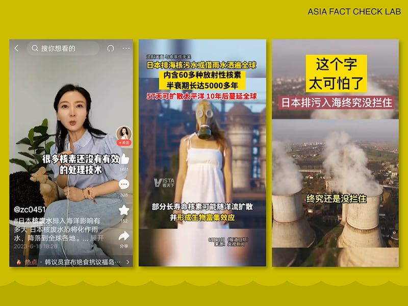
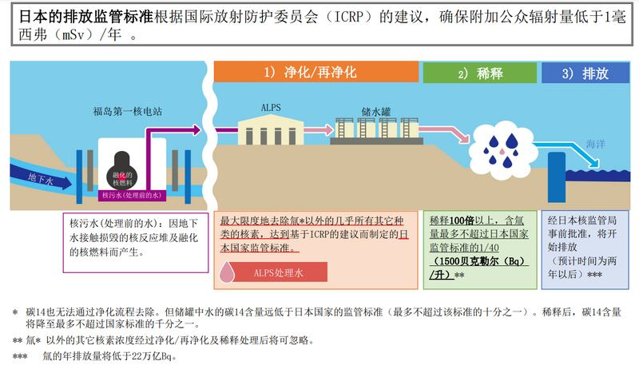
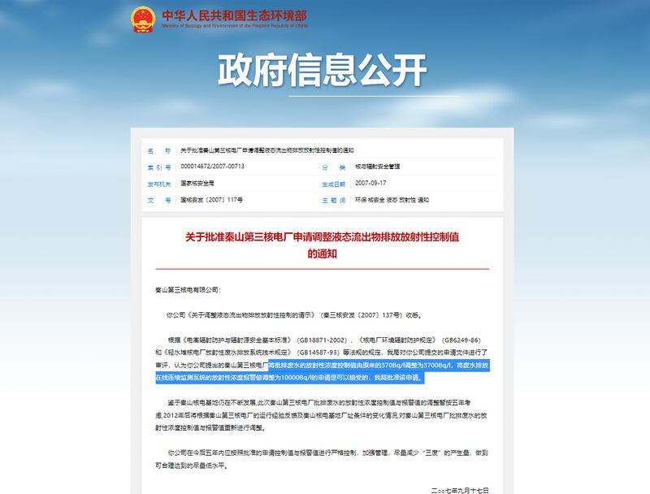
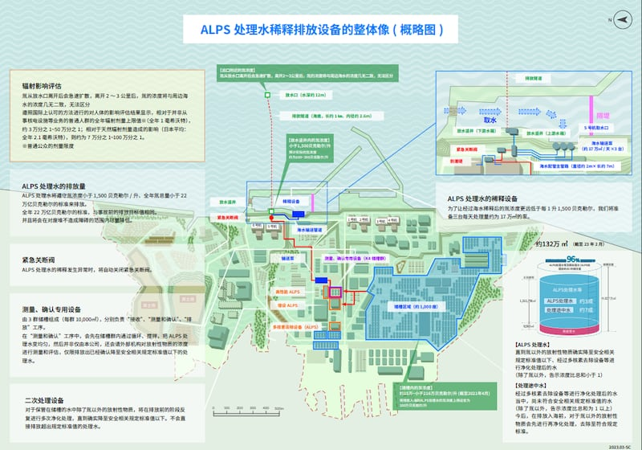

# 事實查覈｜日本"洗白"核污水？ "單方面決定"排海？

作者：鄭崇生，發自華盛頓

2023.06.23 16:09 EDT

## 標籤：錯誤、誤導

## 一分鐘完讀：

預計6月底，國際原子能機構（IAEA）將公佈福島核電站排海計劃最終版的完整評估報告，按照此前報告，IAEA大概率將支持日本的計劃，將經過處理的福島核電站事故廢水排入海中，針對福島事故廢水的處置，國際各方再起爭論。

6月5日,中國常駐國際原子能機構代表李松在IAEA月度理事會上 [指責](http://vienna.china-mission.gov.cn/dbthd/202306/t20230606_11090145.htm)日本的決定沒有足夠科學依據,使福島核事故污染風險轉移到鄰國和周邊環境。6月7日,中國外交部發言人汪文斌則在北京例行記者會上進一步 [指控](https://www.mfa.gov.cn/web/fyrbt_673021/202306/t20230607_11091218.shtml),日本政府一再"洗白"核污水,在"沒有充分論證其他處置方案"的情況下,"單方面決定"一排了之,是把海洋當自家下水道。受此官方輿論引導,中文社交媒體上開始大量出現福島廢水有"巨大危害"等信息。

然而，亞洲事實查覈實驗室發現，這些說法並沒有依據，日本計劃排放的處理水雖無法達到完美，但根據IAEA的標準和中國目前執行的標準，都已達到了安全水平。中國外交部對於日本“沒有充分論證”、“單方面決定”的指控也涉嫌誤導。福島事故以來，日本提出了多種廢水處置方式進行論證，IAEA也多次參與研究評估過程。

## 深度分析：

在日本波倉海岸（Hakura Beach）、上千個儲存超過130萬立方米福島核電站核廢水的儲水設備近日再成爲國際輿論焦點。東京電力公司計劃於今年夏天開始排放有約近40 萬立方米、完成ALPS淨化過程的處理水， 並指出其排放行爲可控、依據國際原子能機構（IAEA）的科學評估符合“安全排放”標準。

然而，福島處理水排海計劃一直受到環保組織和一些國家的質疑，尤其是中國。 中國外交部門最近連續表態，質疑日本排海污水“是否真的無害”，並稱此舉“沒有充分論證其他處置方案”、是“單方面決定”。

汪文斌指責日本“不負責任”的言論在中文媒體和社交媒體上大量流傳，並且被進一步引申解讀。社交媒體上開始出現關於核廢水將有“巨大危害”的言論。抖音、TikTok等平臺上流傳着“福島核廢水含60多種放射性元素”、“半衰期長達5000年”等說法。

中文社交媒體上有大量關於日本核廢水排海的評論視頻 （圖/社交媒體截圖）

## 日本排海廢水有"巨大危害"嗎？

日本計劃排放的“ALPS處理水”全名Advanced Liquid Processing System，先進液體處理系統，國際原子能機構指出，這是一個抽水和過濾系統，能將62种放射性核素從受污染水中有效去除——除了放射性物質氚（Tritium）之外。

氚是氫的同位素，化學式爲T或3H，中子數比氫多兩個，又稱爲超重氫。氚與氫類似，會氧結合，形成HTO類似水的化合物，在自然水體、人體和自然環境中微量存在，氚氣也因其發光性能廣泛應用於發光、照明等領域。

氚的放射性半衰期 爲12.32年。氚化水的生物半衰期爲7-14天，也就是說，如果喝了1公升水裏滿滿有1500貝克的氚，經過一週後留在體內約750貝克。

貝克(Becquerel)是放射性強度的 [國際通用單位](https://www.chinansc.cn/gzxc/bwbd/hyfsjczsxgwt/201705/t20170503_550625.html),放射性強度主要是評量每秒鐘有多少個原子核發生衰變。

含氚水排放至大海，是全世界、包括擁有55臺核電機組的中國也採用的最終處置方法。而在國際原子能機構的指導建議下，日本要排放入海前，還會將ALPS處理水再次稀釋。中國外交系統始終宣稱，經過ALPS淨化的“處理水”與核電站正常運行排水不能“相提並論”，但並沒有論證其區別。

新西蘭奧克蘭大學(University of Auckland)物理系副教授大衛·克羅夫切克(David Krofcheck)則明確表示,經過ALPS淨化處理的水,和正常運行核電站的廢水安全水平相同,日本即將排放的含氚處理水在排放前還將氚濃度稀釋到1500貝克/每公升,甚至是世界衛生組織 [建議飲用水](https://cdn.who.int/media/docs/default-source/wash-documents/water-safety-and-quality/dwq-guidelines-4/gdwq4-with-add1-chap9.pdf?sfvrsn=6fc78cae_3)中含氚標準10000貝克/每公升的約七分之一。在新西蘭、澳大利亞與臺灣的科技媒體中心(Science Media Centre)共同主辦的簡報會上,克羅夫切克回答亞洲事實查覈實驗室的提問時說,當地捕撈上來的魚,他會喫。

不過，他也提醒，除了關注氚之外，更值得注意的是還有碳-14等其他60多種放射性元素，日本福島排放的ALPS水能做到什麼樣的淨化程度，也應檢視。

根據日本經濟產業省官網公佈的 [資訊](https://www.meti.go.jp/english/earthquake/nuclear/decommissioning/atw.html),碳-14也無法通過ALPS淨化流程完全去除。但產經省指出,儲罐中水的碳-14含量已遠低於日本國家的管制標準。稀釋後,碳14含量將降至最多不超過日本國家標準的千分之一。

根據日本經濟產業省的說法，ALPS處理水排海前，除氚以外其他放射性物質經淨化及稀釋處理後，對環境的影響可以忽略不計。

官方發佈的廢水排海計劃及影響示意圖（圖/日本經濟產業省網站）

因此，中文社交媒體所傳日本核廢水“有巨大危害”一說，並沒有足以佐證的科學證據。

## 中國的核電廢水標準更高嗎？

2011年東日本大地震導致福島核電站發生事故以來，全速發展核電的中國也加強了核能安全上管理，提高了系列安全法規。 然而，日本計劃中的廢水排海，參照中國正在執行的標準，也是符合規定的。

2011年9月,中國實施了新的 [《核動力廠環境輻射防護規定》](http://english.mee.gov.cn/Resources/standards/Radioactivity/radiation/201111/W020110309343679722427.pdf)(GB6249-2011)和 [《核電廠放射性液態流出物排放技術要求》](https://www.mee.gov.cn/ywgz/fgbz/bz/bzwb/hxxhj/fsxhjbz/201103/W020191222415914838455.pdf)(GB14587-2011),提高了核電廠放射性物質排放的總量控制要求,並針對核電站所處位置的敏感性進行分級管理——濱海核電廠放射性流出物的排放規定除氚和碳-14以外,其他放射性核素的濃度不應超過每公升1000貝克;在濱湖、濱河與水庫的核電站則爲每升100貝克。2020年,中國根據IAEA《乏燃料管理安全和放射性廢物管理安全聯合公約》提交了最新履約 [報告](https://www.iaea.org/sites/default/files/china-7rm_chinese.pdf)。

但即便是提高了控制要求，中國上述國家標準也並沒有規定濱海核電廠排放氚和碳-14的濃度限值，只規定了系統排放口處除氚、碳-14外其他放射性核素的總排放濃度上限值爲1000貝克/升。

原國家環保總局於2007年還曾 [公告](https://www.mee.gov.cn/gkml/zj/haq/200910/t20091022_173026.htm),批准濱海核電站秦山第三核電站批排廢水的放射性濃度控制值由原來的每公升370貝克放寬爲每公升3700貝克,也批准廢水排放在線連續監測系統的放射性濃度報警值調整爲每公升10000貝克。

原中國國家環保總局批准秦山第三核電站放寬排放限值 （圖/中國生態環境部官網截圖）

也就是說，東電這次即將排海的福島ALPS處理水，氚濃度的限值是2007年調整後的中國秦山核電站被允許排放濃度限值的約1/2。

另外,在液態氚排出的總量控制上,2016年,原環境保護部國家核安全局 [批准](https://www.mee.gov.cn/gkml/sthjbgw/haq/201610/t20161012_365398.htm)秦山核電站基地的年總排放量限值是8.04E+14Bq,即800兆貝克。

而秦山核電站在2022年《核安全信息報告》中 [指出](https://www.cnnp.com.cn/cnnp/resource/cms/article/1086607/1309623/QS-5EM-RCEM-23032701%20%E7%A7%A6%E5%B1%B1%E6%A0%B8%E7%94%B5%E6%A0%B8%E5%AE%89%E5%85%A8%E4%BF%A1%E6%81%AF%E5%85%AC%E5%BC%80%E5%B9%B4%E5%BA%A6%E6%8A%A5%E5%91%8A%EF%BC%882022%E5%B9%B4%EF%BC%89.pdf),當年只用了約25%的總量,換算下來也就是2.01E+14Bq,即201兆貝克,也遠高出日本官方預估福島核電站處理水排海計劃每年約22兆貝克估值。

## 日本不溝通、資訊不科學、沒事實依據？

今年4月,中國駐日本大使吳江浩公開 [指責](http://jp.china-embassy.gov.cn/mtdhnew/202304/t20230429_11068816.htm),日方自始至終沒有同相關國家充分協商,"沒有得到國際原子能機構認可"、"沒有建立國際社會普遍參與的長期有效監督機制"、"沒有窮盡甚至沒有研究論證其他解決方案",這與後來李松、汪文斌等人的譴責口徑一致。

中方還指控，日本沒有提供足夠科學和事實依據，解決國際對排海方案正當性、淨化裝置有效性、核污染水數據可靠性及環境影響不確定性的關切。

然而，根據亞洲事實查覈實驗室的求證，這些指控均與事實不符。

2011年以來,日本定期向 [國際原子能機構](https://www.iaea.org/topics/response/fukushima-daiichi-nuclear-accident/fukushima-daiichi-alps-treated-water-discharge)遞交福島核電廠事故處理進度與監測報告,東京電力公司也架設專門日、英文 [網站](https://www.tepco.co.jp/en/hd/decommission/index-e.html),說明處理進展,甚至針對ALPS處理水增加設置 [中文與韓文專門頁面](https://www.tepco.co.jp/zh-cn/decommission/progress/watertreatment/index-cn.html),希望與讀中文和韓文的鄰國有更好溝通,且每月定期公佈福島核電站的 [相關監測數據](https://www.tepco.co.jp/en/hd/decommission/data/index-e.html)。

東電面向公衆的中文解釋圖 （圖/東京電力公司官網）

日本駐華大使館指出，日方每個月定期都在東京向包括中國在內的各國駐日使館、媒體簡報。

對於日本與國際社會在覈廢水處理、處置問題上的溝通表現，在前述科學媒介中心的簡報會上，澳洲阿德萊大學（University of Adelaide）物理、化學及地球科學院教授胡克（Tony Hooker）表示，日本在科學上、國際合作上、以及數據透明上，相較來說已經算是很開放且願意溝通的了。

日本於2016年提出5種處置ALPS處理水的方式,到2021年4月最後確定是排海後,積極尋求國際原子能機構參與並監督整個排海計劃。IAEA組成的 [特別工作組](https://www.iaea.org/newscenter/pressreleases/iaea-holds-first-meeting-of-international-task-force-set-up-to-review-safety-of-fukushima-treated-water-release)中,有包括中國在內、來自11國的科學家,這兩年走訪日本,召開數十次會議,發表6份相關 [報告](https://www.iaea.org/topics/response/fukushima-daiichi-nuclear-accident/fukushima-daiichi-alps-treated-water-discharge/reports),提出具體建議。

期間,特別工作組還與包括奧地利、瑞士、法國、韓國與美國等地的獨立第三方實驗室 [合作](https://www.iaea.org/sites/default/files/first_interlaboratory_comparison_on_the_determination_of_radionuclides_in_alps_treated_water.pdf),確認日本ALPS處理水能夠達到避免對環境與人體有害的國際標準。特別工作組今年5月底 [最後一次前往福島](https://www.iaea.org/newscenter/pressreleases/iaea-task-force-on-fukushima-daiichi-treated-water-release-conducts-final-mission-to-japan-prior-to-publication-of-its-safety-assessment),要確認即將推出的最終版報告可爲未來人類免於受放射物物質有害影響形成參考指標。

亞洲事實查覈實驗室致函IAEA，詢問特別工作組近日最後一次評估工作的結論， 截至發稿，尚未收到回覆。

核電站事故廢水的排放確實充滿爭議,中國也並不是唯一的反對者。包括 [日本本國的漁民](https://tchina.kyodonews.net/news/2023/06/b7d81935515c.html)、 [綠色和平組織](https://www.greenpeace.org/international/press-release/59193/science-environmental-protection-international-law-g7-japans-fukushima-water-discharge/)、海洋生態學界仍反對福島核電站的排海計劃,他們對廢水排海產生的後果充滿疑慮。在克羅夫切克看來,這與東電當年第一時間處理危機的緩慢速度也有關係,但作爲物理學者,他想提醒世人的是,福島核事故後的放射性危機處理,還有三、四十年的路要走,要避免下一次的地震引發可能更嚴重的核能相關危機。那1000多桶的處理水放在海邊不能不管,而在所有選項中,在他看來,排海已是"最不壞的選擇"。

## 結論：

根據上述查覈結果，中國批評、抵制對日本福島核廢水排海計劃，是核事故處理過程中國際爭議中的一部分。 然而，中國社交媒體上所傳處理水有“巨大危害”等言論，是錯誤信息，外交部對日本的處置方案“沒有充分論證”、“單方面決定”的指控，也與事實不符。

[ 2023/6/27 勘誤更新 ]

本文於6月23日刊出報道寫道：“……氚是氫的同位素，化學式爲T或3H，中子數比氫多一個，又稱爲重氫。”

但經讀者指出錯誤，正確信息應爲：……氚是氫的同位素，化學式爲T或3H，中子數比氫多『二個』，又稱爲超重氫。”

謹此發出勘誤啓示，向讀者致歉，並且將錯誤內文一併更新。

*亞洲事實查覈實驗室(* *Asia Fact Check Lab* *)是針對當今複雜媒體環境以及新興傳播生態而成立的新單位。我們本於新聞專業,提供正確的查覈報告及深度報道,期待讀者對公共議題獲得多元而全面的認識。讀者若對任何媒體及社交軟件傳播的信息有疑問,歡迎以電郵* *afcl@rfa.org* *寄給亞洲事實查覈實驗室,由我們爲您查證覈實。*

[Original Source](https://www.rfa.org/mandarin/shishi-hecha/hc-06232023160018.html)