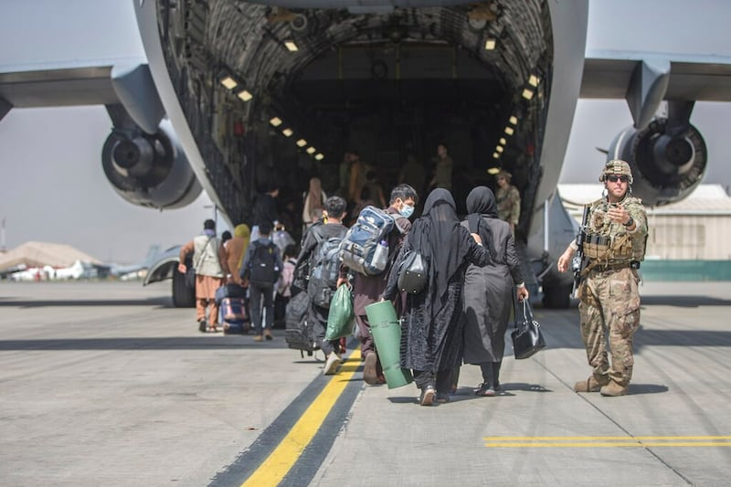

# 事實查覈｜美國"應急撤離計劃"是將臺灣當作"棋子"的陰謀？

作者：沈軻，發自華盛頓

2023.06.26 18:33 EDT

## 標籤：錯誤

## 一分鐘完讀

中國外交官員近日針對美國爲其在臺公民制定的"應急撤離計劃"表示，這正是美國打算一旦發生戰爭就拋棄臺灣的"證明"。

亞洲事實查覈實驗室（AFCL）採訪發現，許多國家都制定了撤僑計劃，以應對各種危機情境。制定或更新這些計劃既不表示戰爭即將爆發，也不能解讀爲"美國打算拋棄臺灣"。

## 深度分析

總部位於美國佛羅里達州的新聞機構《信使報》(The Messenger)在 [6月12日發表的一則報道](https://themessenger.com/news/the-u-s-is-preparing-evacuation-plans-for-american-citizens-in-taiwan-exclusive)中,引述一位未具名的美國高級情報官員的話稱,如果臺灣海峽爆發戰爭,美國政府將撤離在臺居住的美國人,拜登政府正在進行準備工作。

針對上述報道,國家安全會議戰略溝通協調員約翰·柯比(John Kirby)在當天稍後的新聞發佈會上回答關於"撤離計劃"的問題時, [既沒有確認也沒有否認其存在](https://www.whitehouse.gov/briefing-room/press-briefings/2023/06/12/press-briefing-by-press-secretary-karine-jean-pierre-and-nsc-coordinator-for-strategic-communications-john-kirby-15/),但他指出:從衝突區域撤離美國公民並不是美國例行的政策,也沒有跡象顯示目前臺灣的情況有必要重新考慮這個政策。

至於什麼情況下美國政府會協助撤離有美國公民身份的普通民衆,美國國務院在一份 [公告](https://travel.state.gov/content/travel/en/international-travel/emergencies/what-state-dept-can-cant-do-crisis.html)中說明,必須在商業交通完全中斷、條件允許等多個前提下,纔會爲民衆提供撤離服務。

中國外交部發言人汪文斌在6月13日的例行記者會上被問到相關議題時，雖表示自己對相關情況不瞭解，但又接着說：“美方嘴上說‘挺臺’，真正做的卻是把臺灣當作棋子，把臺灣民衆當作炮灰。爲服務美國‘以臺製華’戰略，美方甚至制定‘摧毀臺灣計劃’。相信廣大臺灣民衆會認清美‘害臺’‘毀臺’的本質。”

## 應急撤離計劃意味着什麼？

戰爭撤離計劃的目的是將某個國家的公民從危險中撤離,而且"沒有其他目的",俄亥俄州立大學政治學名譽教授 [約翰·穆勒](https://polisci.osu.edu/people/mueller.135)(John Mueller)告訴亞洲事實查覈實驗室。

"這樣的應急撤離計劃絕不是美國會拋棄臺灣的跡象,實際上可能使美國能夠更有效地支援臺灣武裝部隊抵禦入侵,"美國在臺協會前副處長 [葛天豪](https://sais.jhu.edu/users/dkeegan2)(David J. Keegan)告訴亞洲事實查覈實驗室:"這種撤離將使美國支援臺灣的軍方能夠集中精力保衛臺灣,打敗解放軍,而不必在衝突中照顧美國公民,避免分心。"

“中國試圖在臺灣和美國之間播下不信任種子，以削弱臺灣，使中國更容易使用脅迫手段迫使臺灣接受中國大陸的統治”，葛天豪指出。

美國 [《臺灣關係法》](https://www.congress.gov/bill/96th-congress/house-bill/2479)提出,以和平手段解決兩岸緊張局勢對美國至關重要。雖然該法案沒有公開承諾在中國入侵時提供美國的軍事支持,但它將這種可能性留給美國政府自行決定。

《臺灣關係法》保留了在與中國大陸爆發衝突時，美國可以以武裝部隊支援臺灣的可能性。（美聯社圖片）

## 撤離計劃表示戰爭即將到來？

奧斯陸和平研究所的高級研究員 [伊拉里亞·卡羅扎](https://www.prio.org/people/11404)(Ilaria Carrozza)告訴亞洲事實查覈實驗室,這樣的計劃"是一國政府在有駐外關係的地方常見的預案,特別是如果該國政治上不穩定或處於政治緊張的中心地帶"。

她表示：“爲許多在臺灣生活的美國公民制定撤離計劃是正常行政的一部分，並不一定意味着衝突即將爆發。”

穆勒也告訴亞洲事實查覈實驗室,當撤離過程中出現公衆關注的問題時,政府往往會開始爲各種危機情景制定應急計劃,無論這些危機目前發生的可能性有多大。他並列舉了最近美國從 [蘇丹](https://apnews.com/article/sudan-americans-biden-white-house-evacuation-993ef30bf43320023dc7d8d5ee202bcf)和 [阿富汗](https://apnews.com/article/afghanistan-immigration-travel-lifestyle-kim-kardashian-west-346e0959989079e5fba109247967573c)撤離時,華盛頓優先考慮並實施此類計劃的兩個案例。

2021年，在喀布爾登上美國飛機的家庭，在從阿富汗撤離中。（美聯社圖片）

## 只有美國做出應急計劃嗎？

《信使報》有關所謂應急計劃的原始文章明確提到, [印尼](https://www.taipeitimes.com/News/front/archives/2023/04/18/2003798142)、 [菲律賓](https://www.manilatimes.net/2023/04/19/news/national/contingency-plan-in-place-for-filipino-workers-in-taiwan/1887740)和 [日本](https://www.japantimes.co.jp/news/2022/09/01/national/japan-taiwan-evacuation-talks/)已經公開宣佈他們已經擁有或正在準備制定臺灣僑民的應急撤離計劃,但汪文斌在回應中沒有提到這些國家。

德國馬歇爾基金會印太計劃總監 [葛來儀](https://www.gmfus.org/find-experts/bonnie-s-glaser)(Bonnie Glaser)告訴亞洲事實查覈實驗室:"政府有責任保護海外公民的安全。當有重大自然災害或衝突的風險時,即使風險稍微增加,大使館會制定或者更新撤離其員工的計劃,如果風險的影響更大,則會更新必要時撤離公民的計劃。更新計劃是一種謹慎的預備措施,並不反映撤離公民的決定。"

美國在臺協會前副處長葛天豪說：“美國國務院與國防部定期制定和更新這些撤離計劃並不意味着他們希望立即或很快使用這些計劃。”

## 結論

亞洲事實查覈實驗室發現，中國官員聲稱美國的應急撤離計劃旨在傷害或摧毀臺灣的說法是不真實的。這樣的計劃並不意味着與中國的戰爭即將來臨，也與美國在這樣的衝突爆發時是否採取軍事行動無關。

*亞洲事實查覈實驗室(* *Asia Fact Check Lab* *)是針對當今複雜媒體環境以及新興傳播生態而成立的新單位。我們本於新聞專業,提供正確的查覈報告及深度報道,期待讀者對公共議題獲得多元而全面的認識。讀者若對任何媒體及社交軟件傳播的信息有疑問,歡迎以電郵* *afcl@rfa.org* *寄給亞洲事實查覈實驗室,由我們爲您查證覈實。*

[Original Source](https://www.rfa.org/mandarin/shishi-hecha/hc-06262023182508.html)