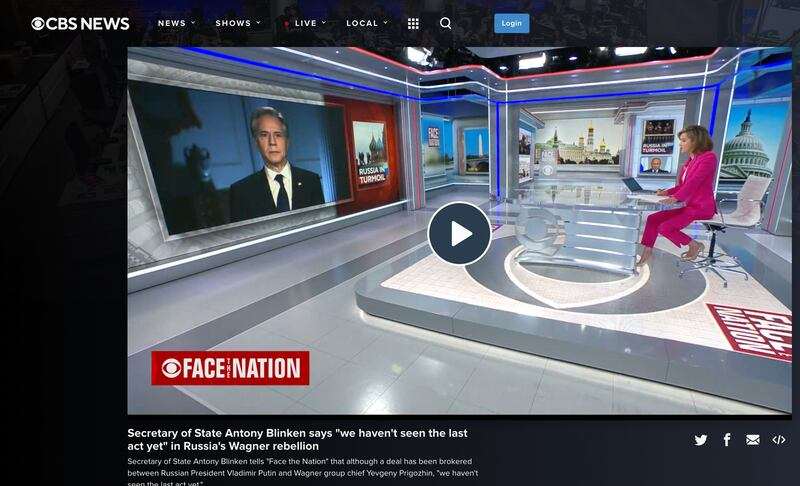

# 事實查覈｜揚言繼續"做中國不喜歡的事"，布林肯露出真面目？

作者：董喆

2023.06.27 15:38 EDT

## 標籤：斷章取義

## 一分鐘完讀：

近日，美國國務卿布林肯結束訪中行程後，多個推特、微博“大Ｖ”帳號轉發了一段布林肯談話影片。影片中布林肯說：“我訪華期間對中國說，我們將繼續做一些你們不喜歡的事情，說一些你們不喜歡的話”。中國搜狐、網易等平臺跟進報道稱，布林肯“回國後露出真面目”。

亞洲事實查覈實驗室查證後，確定這則影片的確是布林肯接受美國哥倫比亞廣播公司（CBS）採訪的畫面，且根據美國國務院發佈的採訪逐字稿，布林肯確實有說出影片中擷取的段落，但他的下句是“就像你們（中國）毫無疑問將繼續做和說我們不喜歡的事情一樣”。在當時的語境中，布林肯是在解釋拜登總統的言論，並描述兩國將長期存在一些分歧的事實，中國社羣平臺上流傳的片段和對布林肯“真面目有”的“揭露”屬斷章取義。

## 深度分析：

美國國務卿布林肯(Antony J. Blinken)於6月25日接受了美國CBS節目Face the Nation主持人瑪格麗特·布倫南(Margaret Brennan)專訪。26日上午,俄羅斯衛星通訊社引用布林肯在專訪中的部分發言,並以" [美國國務卿揚言要繼續做中國不喜歡的事情](https://big5.sputniknews.cn/20230626/1051352812.html)"作爲標題刊出報道。

26日下午開始，中國搜狐、網易平臺跟進報道，稱“訪華結束後，布林肯露出真面目”。內文更稱美國纔是導致中美關係下滑的挑釁者，“僅僅六天布林肯就露出真面目”，發出“不和諧的聲音”。

搜狐網上的原創文章指布林肯訪華結束後露出真面目，對外揚言繼續做中國不喜歡的事。圖取自搜狐

微博上多個“愛國大V”也同步開始轉貼相關影片，片中布林肯說：“訪華的主要目的是，給美中關係帶來更大的穩定性。但有一件事情，我訪華期間對中國說，我們將繼續做一些你們不喜歡的事情，說一些你們不喜歡的話”。

中國駐巴基斯坦外交官張和清也在推特分享該影片，不過也有網友留言質疑這段影片是否爲AI生成。

中國駐巴基斯坦外交官也轉貼相關影片，但有網民懷疑是AI生成。圖取自推特

亞洲事實查覈實驗室經查證後確定,中國社交媒體平臺上的影片確實爲布林肯本人的發言,畫面擷取自布林肯與CBS節目主持人瑪格麗特·布倫南的 [對談](https://www.cbsnews.com/video/secretary-of-state-antony-blinken-says-we-havent-seen-the-last-act-yet-in-russias-wagner-rebellion/),節目7分16秒至7分27秒間的畫面與中國社交媒體平臺上流傳的影片相符。

布林肯與CBS節目主持人的對談。圖取自CBS官網

但根據訪談影片以及美國國務院公佈的 [完整對談逐字稿](https://www.state.gov/secretary-antony-j-blinken-with-margaret-brennan-of-cbs-face-the-nation-4/),布林肯這一段話是有針對性地在回答主持人的問題。主持人問他,他剛結束訪中行程,拜登總統就公開稱習近平是"獨裁者","這(發言)對你工作的傷害有多大?"

面對問題，布林肯先表示自己訪問中國的目的，是爲了促進兩國關係更加穩固。但“我在此次旅行中對中國說的是，我們將繼續做和說你們不喜歡的事情，就像你們毫無疑問將繼續做和說我們不喜歡的事情一樣”。布林肯跟着還補上一句：“如果你看看中國外交部每天發佈的消息，你就會聽到這種(讓我們不喜歡)的說法。”

## 結論：

中國社交媒體平臺上流傳的影片爲真，並非AI生成，但僅引述布林肯原話的上半句，稱布林肯單方面揚言繼續說和做中國不喜歡的事，屬於斷章取義的資訊。根據上下文，布林肯的語義應該是中美立場總有分歧，但彼此都持續向對方表達。相互溝通，才能促進美中關係穩定。

*亞洲事實查覈實驗室（Asia Fact Check Lab）是針對當今複雜媒體環境以及新興傳播生態而成立的新單位。我們本於新聞專業，提供正確的查覈報告及深度報道，期待讀者對公共議題獲得多元而全面的認識。讀者若對任何媒體及社交軟件傳播的信息有疑問，歡迎以電郵afcl@rfa.org寄給亞洲事實查覈實驗室，由我們爲您查證覈實。*

[Original Source](https://www.rfa.org/mandarin/shishi-hecha/hc-06272023153202.html)